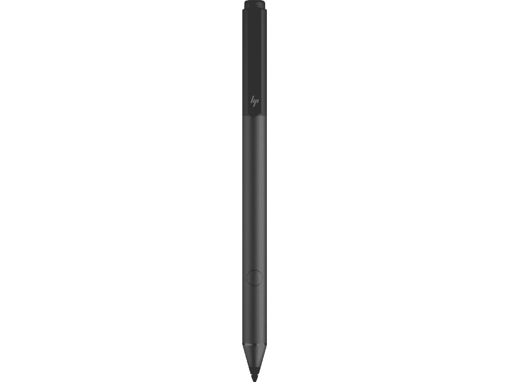

# 惠普 Envy x360 最佳钢笔(2022 年)

> 原文：<https://www.xda-developers.com/best-pens-for-the-hp-envy-x360-2022/>

# 惠普 Envy x360 最佳钢笔(2022 年)

使用 HP Envy x360 (2022)让您的体验更上一层楼，使用这六支笔在屏幕上画画或在课堂或工作中做笔记。

惠普 Envy x360 (2022) 的包装盒中附带一支笔。这是使这款不到 1000 美元的[设备](https://www.xda-developers.com/best-laptops-under-1000/)非常独特的原因之一，因为不是所有的[最好的带触摸屏的惠普笔记本电脑](https://www.xda-developers.com/best-laptops/)都给你一支笔作为价格的一部分。附带的笔使用微软笔协议(MPP) 2.0 技术，提供身临其境的绘图和墨迹书写体验。

但是你在寻找替代品吗？也许您丢失了设备附带的原装笔，需要更换？还是你更喜欢一支更舒适、更适合你手握的笔？下面我们为你收集了六个最好的。

*   ##### 惠普可充电 MPP 2.0 倾斜笔

    这是惠普 Envy x360 (2022。)它和盒子里的是同一个，所以如果你放错了原件，它是一个理想的替代品。虽然这是一支昂贵的笔，售价 70 美元，但它是可充电的，所以你不必担心电池。

    T13
*   ##### Adana MPP 手写笔

    如果您丢失了 HP Envy x360 (2022)附带的原装笔，这是一个很好的第三方替代品。它支持与原版相同的所有功能，看起来几乎一模一样。

*   ##### 惠普 MPP 1.51 笔

    惠普 HPP 1.51 笔是惠普比较老的 MPP 笔。这是一款有源手写笔，就像包装盒中包含的新款手写笔一样，因此它可以与您的 HP Envy x360 配合使用。它的形状也更像传统的钢笔，这可能是一些人更喜欢的。

    T33
*   <picture></picture>

    HP 倾斜笔

    ##### HP 倾斜笔

    这是 2020 HP Envy x360 的又一老笔。然而，它仍然可以很好地与新型号配合使用，因为两个系统都支持 MPP 技术，并且两种笔都是活动的触控笔。

*   ##### MSI 10 14 手写笔

    尽管这款笔是 MSI 制造的，但它仍然可以与 HP Envy x360 (2022)配合使用，因为两者都支持 MPP 笔协议。它的形状和设计相似。

    T34
*   ##### 拉扎米笔

    虽然你可能没听说过这个品牌名称，但这是惠普 Envy x360 (2022)的另一款第三方笔。)它采用主动笔技术，并像原装笔一样支持手掌拒绝和倾斜。但是，它需要电池。

在看这些笔的时候，我们真的建议你从惠普买一个官方的。惠普可充电 MPP 2.0 倾斜笔是最好的购买笔，因为它是惠普建议使用的笔。不过，旧的惠普 MPP 1.51 笔或惠普倾斜笔没有任何问题。如果你想要一个第三方替代品，可以试试微星手写笔，甚至是 Lazarite M 笔。每个人的需求都有一支笔！

如果您还没有 HP Envy x360 (2022)，也可以通过下面的链接购买一台。或者，查看我们的[最佳笔记本电脑指南](https://www.xda-developers.com/best-laptops/)。很多这样的笔也可以在那些系统上工作。

*   ##### HP Envy x360 13(2022)

    2022 HP Envy x360 是一款注重便携性的敞篷车，配有英特尔 9W 处理器和大电池，以及 16:10 显示屏，非常适合完成工作。几乎对任何人来说，这都是一款出色的笔记本电脑。

*   ##### 惠普 Envy x360 (2022) 15 英寸(英特尔)

    惠普 Envy x360 的 2022 版本之一尺寸为 15.6 英寸，可选择英特尔 P 系列和 U 系列处理器。还有一个选项是添加英伟达 RTX 20 系列移动 GPU。

*   ##### 惠普 Envy x360 (2022) 15 英寸(AMD)

    这个版本的 2022 惠普 Envy x360 带有 AMD 锐龙 5000 系列 CPU 的选项。这款 15.6 英寸的机型还有一种黄昏黑色。