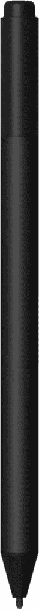
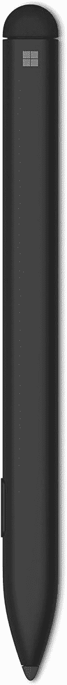
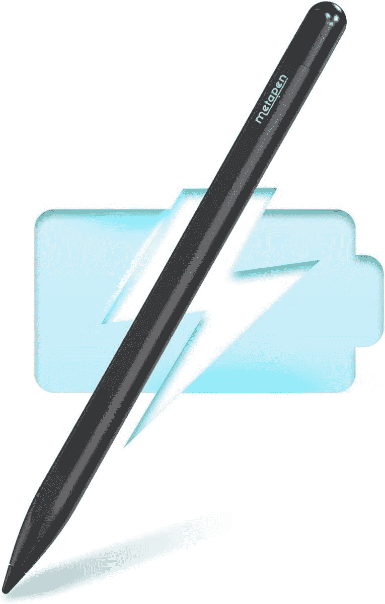
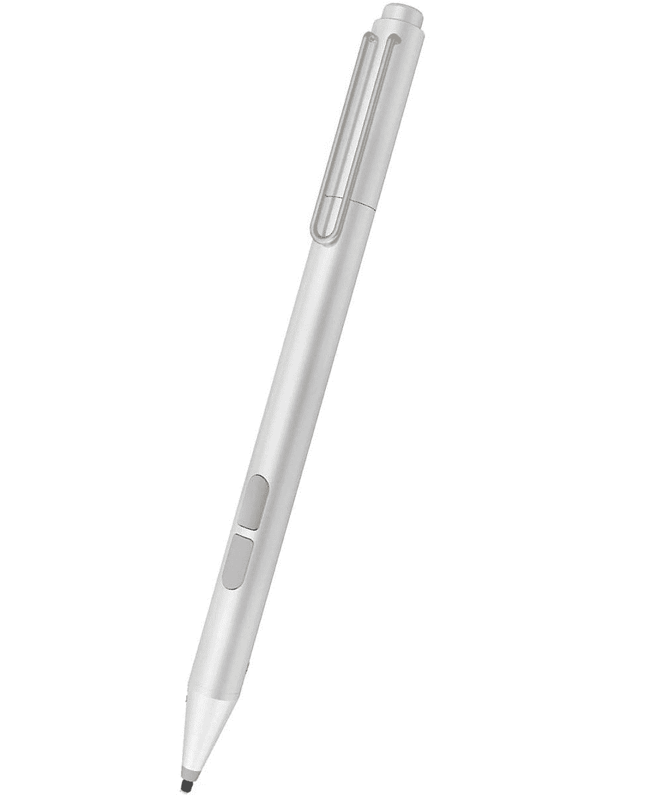
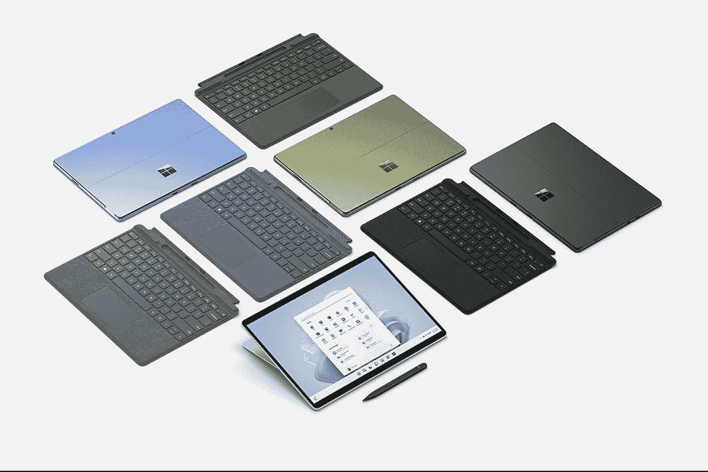
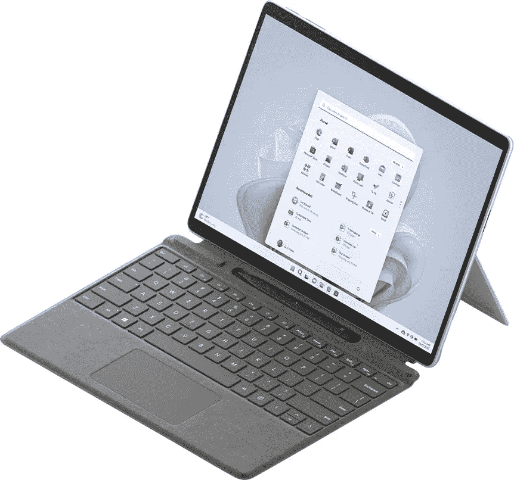

# 2023 年 Surface Pro 9 最佳钢笔

> 原文：<https://www.xda-developers.com/best-pens-surface-pro-9/>

# 2023 年 Surface Pro 9 最佳钢笔

想在 Surface Pro 9 的屏幕上画画吗？以下是 2022 年你可以买到的九种。

新的 Surface Pro 9 将成为 2022 年 T2 最好的 Windows 平板电脑之一。其中一个原因与触摸屏有很大关系。它支持使用微软 Surface Pen 进行墨迹书写。与其他[Surface PC](https://www.xda-developers.com/best-microsoft-surface-pcs/)一样，这意味着你可以在屏幕上画画，给文档添加注释，并在 Photoshop 或 Fresh Paint 等 Windows 应用程序中发挥你的内在创造力。

不过 [Surface Pro 9](https://www.xda-developers.com/surface-pro-9-5g-review/) 使用的是微软 Pen 协议。这意味着支持的笔的列表将会很小，因为你必须使用官方笔或一些第三方笔。话虽如此，Surface Pro 9 还是有很棒的笔的。这里有一些我们最喜欢的。

*   ##### 微软 Surface Slim Pen 2

    Surface Slim Pen 2 是 Surface Pro 9 的最佳用笔。由于笔内的触觉电机，它复制了笔到纸的感觉。它也是平的，可以放在 Type Cover 键盘内部充电。

*   <picture></picture>

    Surface Pen

    ##### 微软 Surface Pen

    原来的 Surface Pen 对于 Surface Pro 9 来说还是很棒的。它使用 AAAA 电池，有四种颜色。这款笔也比 Surface Slim Pen 2 更长，形状更像传统铅笔。

*   <picture></picture>

    Surface Slim Pen

    ##### Surface Slim Pen

    微软原装的 Surface Slim Pen 也可以配合 Surface Pro 9 使用。它缺少新版本的触觉，但具有相同的基本设计。如果你想省钱，这是一个很好的选择。

*   <picture></picture>

    meta pen 手写笔

    ##### meta pen 手写笔

    这是一款配合 Surface Pro 9 使用的第三方笔。你必须从外部给它充电，与你可以从微软买到的官方笔相比，它的压力敏感度更低，但它超级实惠，可充电，额定电池寿命为 300 小时。

*   <picture></picture>

    uo gic Pen for Microsoft Surface

    ##### uo gic Pen for Microsoft Surface

    这是一款便宜但很好看的 Surface Pen 替代品这是一个第三方笔，所以它没有微软原装笔那么多级别的压力敏感度，但它有可更换的笔尖。

*   ##### Tintunzo Pen

    这款第三方 Surface Pen 拥有防断点技术和防 offiset 技术。它看起来也像微软的原装笔，可以磁性附着在设备的侧面。

    T34
*   ##### Yeemie 手写笔

    我们喜欢这种 Surface Pen 的替代品，因为它有各种尺寸的可互换笔尖。注意这个也是通过 Micro-USB 对外充电的。

*   <picture></picture>

    特莎 Surface pen

    ##### 特莎 Surface pen

    这款笔售价 30 美元，所以很难不建议它为 Surface Pro 9。我们喜欢它的形状，以及它支持手掌拒绝技术的事实。请注意，它没有微软笔那么多的压力点。

    T34
*   ##### Raphael 520BT 笔

    这款 Surface Pen 替代品保留了原有的 4096 级灵敏度，并且由于采用铝制成，因此具有高级感。

这些是你现在可以为 Surface Pro 9 购买的最好的钢笔。我们忽略了许多不太适合平板电脑的廉价电容式触控笔。我们认为，当谈到在 Surface Pro 9 上绘图时，你可能想要最好的，所以我们建议使用 Surface Slim Pen 2。如果你买不起，那么在 2022 年，原装 Surface Pen 仍然是一个很好的选择，因为它是微软的官方产品，仍然受到支持。我们提到的其他第三方笔对于简单的笔记也很有用，但可能不是艺术家的最佳选择。

 <picture></picture> 

Surface Pro 9 (Wi-Fi Model)

##### Surface Pro 9 (Wi-Fi 机型)

Surface Pro 9 是一款采用英特尔或高通处理器的顶级 Windows 平板电脑，它首次拥有多种颜色。

 <picture></picture> 

Surface Pro 9 5G

##### Surface Pro 9 5G

5G 版 Surface Pro 9 由新的微软 SQ3 芯片组提供支持，并具有 120Hz 的显示屏。