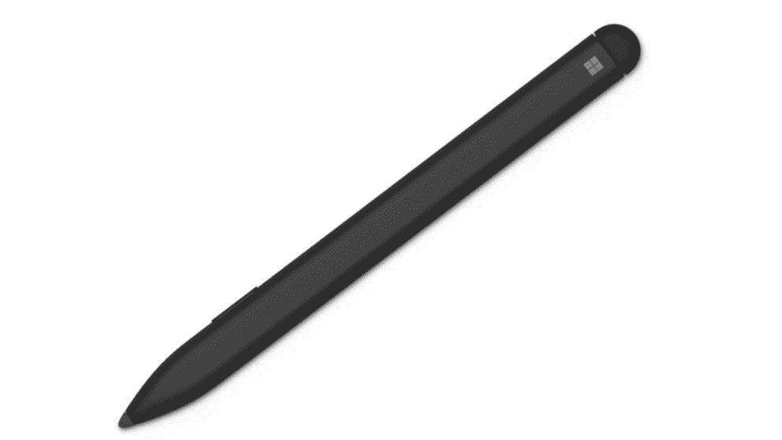

# 2023 年 Surface Studio 2 Plus 最佳钢笔

> 原文：<https://www.xda-developers.com/best-pens-surface-studio-2-plus/>

# 2023 年 Surface Studio 2 Plus 最佳钢笔

当然，有 Surface Pen，但如果你想在一体化电脑上使用它们，还有很多其他选项。

微软新款 [Surface Studio 2 Plus](https://www.xda-developers.com/surface-studio-2-plus/) 盒子里有一只 Surface Pen。使用附带的笔，您可以释放内心的创造力，在屏幕上用您最喜欢的应用程序(如 Photoshop 和 Fresh Paint)画画。由于电脑的独特外形，您可以将显示器朝自己的方向拿下来，这一点更加简单。但是，如果您不喜欢这支笔，这款一体机可以兼容第三方触控笔和笔。其中许多也适用于其他的 [Surface 电脑](https://www.xda-developers.com/best-microsoft-surface-pcs/)。下面我们为你收集了六个我们最喜欢的。

*   <picture></picture>

    超薄笔 2

    ##### 微软 Surface 超薄笔 2

    这是微软最新的 Surface Pen。它的压力敏感度与 Surface Studio 2 Plus 相同，但更纤薄，更符合人体工程学。你也可以用磁力把它固定在 Surface Studio 的侧面。不过，你需要用充电座单独给它充电。

*   ##### MetaPen 手写笔

    这是一款坚固的第三方笔，用于 Surface Studio 2 Plus。它使用 USB-C 充电，甚至还有可以定制的侧按钮，就像使用原装 Surface Pen 一样。

*   ##### Tintunzo Pen

    这是另一款第三方 Surface Studio 2 Plus pen，这款出自 Tintunzo。它的特点是确保伟大的油墨经验，如反断点，以及反偏移技术。

    T17
*   ##### 拉斐尔 520BT 笔

    拉斐尔 520BT 笔也和你的 Surface Studio 2 Plus 自带的那支差不多。与我们列表中的其他产品不同，它保持了 4096 级的压力敏感度，拿在手中感觉非常棒。

*   ##### Yeemie 手写笔

    yee mie 手写笔是另一种笔，与 Surface Studio 2 Plus 附带的原始 Surface 笔一样，具有 4，096 级压力灵敏度。它还可以通过微型 USB 充电。

    T37
*   <picture></picture>

    特莎 Surface pen

    ##### 特莎 Surface pen

    这款 Surface Pen 的替代品是亚马逊上最受欢迎的一款。它没有原来 Surface Pen 那么多的压力敏感度，但对于基本的笔记来说已经足够好了。我们建议艺术家远离。

* * *

这是我们能为 Surface Studio 2 Plus 找到的六支顶级钢笔。理想情况下，如果你是一名艺术家或内容创作者，最好购买微软的官方 Surface Pen，因此我们建议 Surface Slim Pen 2 作为替代产品。不过，价格可能对你来说太高了，所以像 Raphael 520BT 手写笔或 MetaPen 手写笔这样的其他笔都是很好的选择。这些也可以。不过，我们的一些其他选择甚至更便宜，非常适合快速简单的任务，如记笔记，并将与其他 Surface 设备配合使用，如 [Surface Pro 9。](https://www.xda-developers.com/surface-pro-9/)

Surface Studio 2 Plus 是一款一体化电脑，配备第 11 代英特尔酷睿 i7 处理器和 Nvidia GeForce RTX 显卡。它有一个分辨率非常高的 28 英寸 PixelSense 显示屏，支持触摸和笔输入。