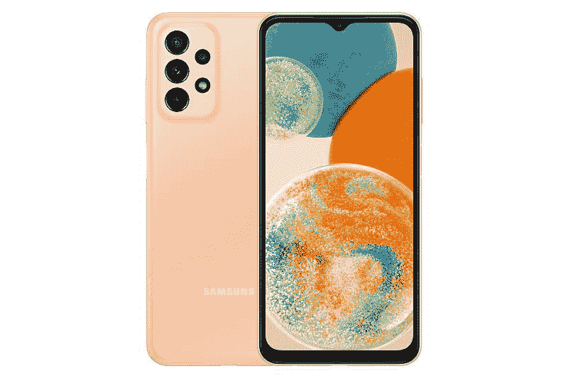
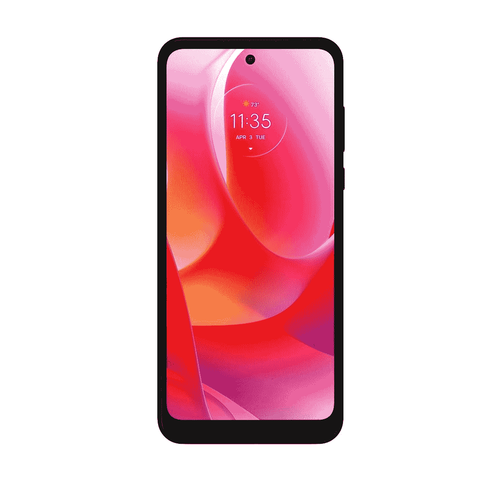
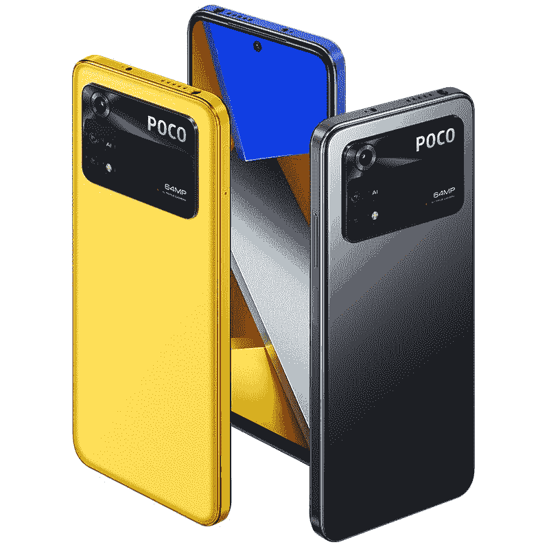

# 2023 年 300 美元或以下的最佳安卓手机

> 原文：<https://www.xda-developers.com/best-phones-under-300/>

这些年来，智能手机变得越来越好，谢天谢地，并不是所有的智能手机都会让你付出高昂的代价。如果你不介意放弃所有花哨的功能，坚持使用一两个对你来说最重要的功能，那么你也可以花 300 美元或更少的钱买到一些很棒的安卓手机。事实上，即使是廉价的 Android 手机市场也有大量的选择，这就是为什么我们决定为你列出一些 300 美元以下的最好的 Android 手机。这些手机可能不属于我们的最佳智能手机系列，但它们仍然足以处理大多数日常工作。

## 整体最佳低价手机:三星 Galaxy A23 5G

三星的 Galaxy A 系列提供了大量经济实惠的手机，从入门级的平价手机到重量级的中型流浪者。Galaxy A23 5G 是该系列中最适合该系列的最新产品之一。它提供了一套相当不错的内部组件和可靠的软件支持，售价 300 美元。它也可以从美国的各种运营商那里购买，使它更容易获得。

Galaxy A23 5G 首次亮相时是一款仅支持 LTE 的手机。该设备的 5G 版本直到最近才上市销售，所以它仍然刚刚下线。三星使用的是 6.6 英寸 FHD+ infinity-V 液晶显示器，分辨率为 1080 x 2408 像素。这款显示器最大的优点之一是支持高达 120Hz 的刷新率。这使得它成为该系列中唯一一款拥有 120Hz 显示屏的手机。只是为了客观地看待事情，即使是三星的旗舰设备，如 [Galaxy S22](https://www.xda-developers.com/samsung-galaxy-s22-review/) 也配备了 120Hz 的显示屏，所以这是这款手机的亮点。

Galaxy A23 5G 由骁龙 695 SoC 驱动，可以购买高达 6GB 的 RAM。不过，这款设备的基本版本只配有 64GB 的存储空间。这不是特别令人印象深刻，但谢天谢地，它支持通过 microSD 卡进行可扩展存储。你可以给这部手机增加 1TB 的存储空间，这很棒。

三星还在这款手机中装入了 5000 毫安时的电池，这意味着它应该能够在充电之间持续很长时间。与 Moto G Power (2022)不同，Galaxy A23 5G 支持 25W 的充电速度，可以快速充满电池。它没有 Nord N20 5G 的 33W 充电速度快，但 25W 仍然比这个价格段的大多数手机都快。值得注意的是，你还可以在这台机器上安装一个侧面安装的指纹扫描仪，这被认为是更可靠的。

至于光学系统，三星在 Galaxy A23 5G 上提供了一个四摄像头系统。该设置包括一个 50MP f/1.8 传感器，一个 5MP 超宽相机，以及两个用于深度和微距拍摄的 2MP 传感器。自拍由一个 800 万像素的传感器处理，这与大多数廉价设备上的传感器不相上下。最后，值得注意的是，Galaxy A23 5G 还具有 3.5 毫米耳机插孔，这对于这个价格区间的手机来说仍然非常重要。

总体而言，三星 Galaxy A23 5G 看起来像是一款稳健的预算手机。你可以获得很多令人印象深刻的功能，这些功能通常是这一领域的手机所不具备的。我们谈论的是 120Hz 显示屏、25W 充电速度的 5,000mAh 大电池、出色的软件支持等等。正如我们之前提到的，这款手机也将通过美国所有的主要运营商销售，让更多的用户可以使用它。因此，如果你在美国，你只有 300 美元可以花在智能手机上，那么我们认为你应该花在这一部上。

 <picture></picture> 

Samsung Galaxy A23 5G

##### 三星 Galaxy A23 5G

三星 Galaxy A23 5G 是三星最新的廉价设备，以不伤你钱包的价格提供 5G 和全面的体验。

## 备选最佳预算选择:谷歌 Pixel 6a

谷歌的 Pixel 6a 由于其 449 美元的价格标签而未能更早进入这一名单。但是假日折扣使它比以往任何时候都便宜，你现在只需花 299 美元就能买到。在黑色星期五和网络星期一期间也是这个价格，这是我们目前看到的最便宜的。它很容易成为这个名单上最好的手机之一，因为它提供了一个很好的整体体验与股票 Android 的经验。

Pixel 6a 最棒的一点是它由 Google Tensor 驱动，这是 Pixel 6 和 Pixel 6 Pro 内部运行的同一芯片。你还可以获得 6GB 的内存，128GB 的存储空间和 5G 支持，使它成为一款日常使用的全面手机。它还拥有华丽的 6.1 英寸 FHD+有机发光二极管显示屏，比这个价格范围内的许多其他手机都要好。它的最高频率为 60Hz，但这并不一定是一个大问题，尤其是如果你来自一个也使用 60Hz 面板的旧手机。

这款手机还凭借其出色的摄像头弥补了这一不足。尽管价格较低，谷歌的 A 系列手机并不吝啬该公司的计算摄影软件。尽管镜头和 Pixel 5 的一样(提醒一下，我们用的是 Pixel 7)，不管光线如何，你仍然可以拍出很棒的照片。

Pixel 6a 很容易在亚马逊上买到，你也可以现在就买一台，正好在圣诞节前收到。

Pixel 6a 是一款出色的中端智能手机，内置强大的摄像头和谷歌内部的张量芯片组。

## 续航最佳预算手机:Moto G Power (2022)

正如你可能已经知道的，Moto G 的电源系列在电池寿命方面是业界最好的。幸运的是，它们也很实惠，非常适合这一系列手机。我们决定将 Moto G Power (2022)添加到这个列表中，因为它在美国的价格不到 300 美元，承诺超长的电池寿命，而且它是产品线中的最新手机。

Moto G Power (2022)配备了 5000 毫安时的电池，比市面上大多数安卓手机的电池都要大。将大容量电池与 HD+显示屏和联发科 Helio G37 等耗电较少的部件相结合，您可以获得一部充电一次可持续使用三天的手机。当然，你的里程肯定会根据你的使用模式而有所不同，但它非常好。

Moto G Power (2022)也足以满足所有实际用途。联发科 Helio G37 可能不如 2021 Moto G 电源模型中的骁龙 662 SoC 强大，但它仍然表现良好，同时功耗更低。它前面有一个 6.5 英寸的面板，支持高达 90Hz 的刷新率。然而，你必须接受它在 720p 分辨率时达到峰值的事实。

Moto G Power (2022)最棒的一点是它配有一个 microSD 卡插槽，可以让你将存储容量扩展到 1TB。如今，许多智能手机都没有可扩展的存储空间，所以这绝对是一个受欢迎的新功能。

Moto G Power (2022)不那么令人印象深刻的是，它只支持 10W 充电，这意味着你可能需要等待长达两个小时才能充满其巨大的 5,000mAh 电池。这尤其令人失望，因为即将推出的 2021 款支持 15W 充电。我们并不完全确定为什么摩托罗拉决定放慢速度，但这在理论上肯定不太好。

Moto G Power (2022)背面有三个摄像头，但我们建议你在谈到摄像头性能时保持你的期望。至于光学系统，我们正在寻找一个 50MP 主传感器，与两个独立的 2MP 传感器相结合，用于深度和微距拍摄。自拍由一个 800 万像素的前置摄像头处理。

最后，值得注意的是，这款手机也不支持 5G，这意味着你只能使用 LTE 连接。这不一定是一个交易破坏者，特别是对于那些希望购买廉价手机的人来说，但在这个价格范围内还有一些其他支持 5G 的选择。综合考虑所有因素，如果你想买一部电池续航时间非常长的手机，我们认为 Moto G Power (2022)是一款很棒的手机。这是它擅长的一件事，它可能足以赢得你的心。

 <picture></picture> 

Moto G Power (2022)

##### 摩托罗拉摩托 G 动力(2022)

Moto G Power (2022)单次充电可提供长达 3 天的超长电池续航时间。最棒的是，它现在的售价仅为 150 美元。

## 最佳性价比手机:一加诺德 N20 5G

据报道，一加诺德 N10 在美国卖得很好，原因不难理解。它以不到 300 美元的价格提供了可靠的智能手机体验，这要归功于一些令人印象深刻的功能，包括 90Hz 1080p 显示屏、5G 支持、可靠的 64MP 摄像头等等。嗯，[一加诺德 N20 5G](https://www.xda-developers.com/oneplus-nord-n20-5g-hands-on/) 是一个很好的继任者，我们认为它值得在这个系列中占有一席之地，尽管有些选择有问题。

你会注意到这款手机的第一件事就是它有多么吸引人。XDA 的执行主编 Rich Woods 将其描述为设计最精美的一加手机之一，并希望[一加 10 Pro](https://www.xda-developers.com/oneplus-10-pro-review/) 看起来像这款一样好。对于一部售价不到 300 美元的手机来说，这是很高的赞誉，因此它应该会让你知道它有多好看。它还保留了耳机插孔，我们认为这在预算空间中仍然非常重要。

与该领域的许多其他手机相比，一加诺德 N20 5G 也提供了令人印象深刻的性能。它由骁龙 695 芯片组驱动，搭配 6GB LPDDR4X 内存和 128GB 存储。这只是对骁龙 690 驱动的 Nord N10 的一个适度的改进，但这就是你在这个价格范围内与其他手机竞争所需的一切，真的。我们还喜欢一加为可扩展存储保留 microSD 卡插槽的方式。

在电池方面，Nord N20 配备了一块 4500 毫安时的电池，可以在大约 70 分钟内充满电。这款手机支持 33W SuperVOOC 充电，当你与 Moto G Power (2022)等仅支持可怜的 10W 充电相比时，这令人印象深刻。这是该系列中充电速度最快的手机，所以如果你认为快速充电比智能手机上的任何东西都有价值，那么这款手机就是你要的。

毕竟这是一款经济型手机，所以 Nord N20 5G 做出了一些妥协，以保持低价。例如，相机需要一些工作。它配有一个 f/1.9 光圈的 64MP 主传感器，以及两个独立的 2MP 传感器，用于处理深度和微距拍摄。这些相机的性能不会给你留下深刻的印象，所以保持你的期望。偶尔在社交媒体上发帖，你或许能从中获得一些不错的照片，但仅此而已。

总的来说，我们认为一加诺德 N20 是一款预算充足的手机，在很多方面都做得很好。如果你学会忍受 60Hz 的显示器和一套普通的相机，就没有什么可抱怨的了。这还不算太坏，因为现在在美国你只需花 250 美元就能买到它。它还支持 5G，所以我们认为它是本系列中提到的许多其他非 5G 廉价手机的可靠替代品。一加诺德 N20 5G 检查了许多正确的盒子，它为您的钱提供了很大的价值。

 <picture></picture> 

OnePlus Nord N20

##### 一加北部 N20 5G

一加 Nord N20 5G 是 Nord N10 的良好继任者，无论是在纸面上还是在现实生活中都很棒。

## 手写笔爱好者的最佳手机:TCL 手写笔 5G

Moto G 手写笔作为配备手写笔的最佳廉价手机之一，享有首要地位。但现在已经由新的 TCL 手写笔 5G。摩托罗拉最新的 Moto G 手写笔也提供了一些令人印象深刻的功能，但它的价格几乎是两倍，这意味着它不再属于 300 美元以下的最佳安卓手机。另一方面，TCL 提供了良好的整体体验，在美国的售价仅略高于 250 美元。

TCL Stylus 5G 捆绑的手写笔是无源的，意味着它没有自己的电池，也不支持蓝牙。但正如我们在 [TCL 手写笔 5G 评测](https://www.xda-developers.com/tcl-stylus-5g-review/)中提到的，它仍然以最小的延迟工作。TCL 还捆绑了一系列与手写笔配合良好的应用。有一个 Nebo 应用程序，它本质上是一个手写识别工具，可以将你的笔记转录成可复制的文本。你还可以获得 MyScript Calculator 2 应用程序，该应用程序可以进行手写计算并给出结果。

你还会发现在这款手机的 6.81 英寸液晶面板上使用手写笔非常舒适。它可能不是市场上最亮的显示器，但它足够清晰，可以提供清晰的视觉效果，并且可以让你用手写笔在手机上导航。这就是这款手机的体验。在日常使用这款手机时，你不会注意到任何重大的性能问题，因为它由一个相当强大的 Dimensity 700 SoC 供电，并配有 4GB 内存。

这款手机的整体性能与这一领域的许多其他廉价手机不相上下，所以没有什么可抱怨的。这款手机的续航时间也可以这么说。它可能无法与这个领域的大公司如 Moto G Power (2022)相提并论，但它会让你度过没有任何重大问题的一天。在软件方面，它搭载了现成的 Android 12，并承诺在明年之前获得主要的操作系统更新。

至于光学系统，后面有四个摄像头，包括一个 50MP 主摄像头和一个 5MP 超宽摄像头，以及两个 2MP 深度和微距传感器。那个超广角摄像头是一个很好的补充，因为这个价格的大多数智能手机似乎只有一个主传感器和两个用于微距和深度的贴纸传感器。无论是白天还是晚上，你都可以用这部手机拍出像样的照片。

TCL Stylus 5G 有很多令人喜欢的地方，我们认为它以 258 美元的价格提供了一系列很好的功能。把手写笔和 300 美元以下的手机捆绑在一起不是特别容易，但 TCL 做到了。总的来说，这也是一款非常好的手机，所以一定要看看。

 <picture></picture> 

TCL Stylus 5G

##### TCL 手写笔 5G

TCL Stylus 5G 是一款带有 garaged stylus 的经济型智能手机。它也有一个漂亮的屏幕，伟大的软件，和一个像样的相机。正好是 258 美元的智能手机。

## 开放进口的最佳手机:POCO M4 专业版

众所周知，美国市场没有亚洲或欧洲市场那么多廉价手机。如果你对向美国进口智能手机的想法持开放态度，那么它会自动打开许多选项。POCO M4 Pro 就是这样一款设备，我们认为如果你不介意在美国做更多的工作，它是值得考虑的。

今年早些时候在欧洲首次亮相的 POCO M4 Pro 基本上是小米红米 Note 11S 的全球版本，略有改动，设计新颖。这是目前你在欧洲能买到的最便宜的手机之一，因为它以这个价格提供了一系列很好的功能。它前面有一个 6.43 英寸的 FHD+ 90Hz 显示屏，这意味着它比美国许多只有 60Hz 面板的廉价手机要好。

至于内部，你得到的是联发科 Helio G96 芯片组，内存高达 8GB。该设备有两种 RAM/存储配置，从 6GB RAM 和 128GB 存储开始，一直到 8GB RAM 和 256GB 存储。Helio G96 也是一款有能力的芯片，应该能够让手机在放弃之前至少运行几年。

这款手机最大的优点之一是它配有耳机插孔和 microSD 卡插槽，可扩展存储空间。正如我们前面提到的，这两个功能对于这个价格段的手机仍然至关重要，所以它们已经比美国的许多预算选项都好。在电池方面，您可以获得一个 5000 毫安时的电池，支持高达 33W 的快速充电。这款手机的电池容量和充电速度与 Nord N20 5G 相当，是该系列中性价比最高的手机之一。

POCO M4 Pro 还在背面设置了三摄像头，包括一个 6400 万像素的主摄像头，一个 800 万像素的超宽摄像头和一个 200 万像素的宏观传感器。POCO M4 Pro 的其他一些值得注意的功能包括 MIUI 12.5 软件、侧装指纹扫描仪、红外发射器等。购买这款手机的唯一缺点是它在美国没有正式上市。只要你对进口手机持开放态度，这不一定是一个交易破坏者，因为有很多进口商可以帮助你方便购买。

即使加价包括运费和附加税，你仍然要为这部手机支付不到 300 美元。或者，你也可以考虑购买 POCO X4 Pro，它现在在美国可以买到，价格略高于 300 美元。就价格而言，这两款手机都很棒，如果你不介意探索现有手机之外的手机，我们认为它们值得考虑。

 <picture></picture> 

POCO M4 Pro

##### 波科 M4 专业版

三星 Galaxy A23 5G 是三星最新的廉价设备，以不伤你钱包的价格提供 5G 和全面的体验。

* * *

这就把我们带到了列表的末尾。这里提到的许多手机现在都在假期打折，所以一定要探索它们，挑选一款你喜欢的。在这个价格范围内，你可能得不到最快或最漂亮的手机，但你仍然可以得到一部坚固的 Android 手机。

三星的 Galaxy A23 5G 和谷歌的 Pixel 6a 是目前价格低于 300 美元的绝佳选择。但如果你想要看起来更好一点的东西，那么我们认为你应该看看 Nord N20 5G。我们还增加了一些其他设备，包括 TCL Stylus 5G 和 Moto G Power (2022)，这两款设备都有自己的独特之处。我们将继续关注市场，并在有更多选择时添加到这个列表中。