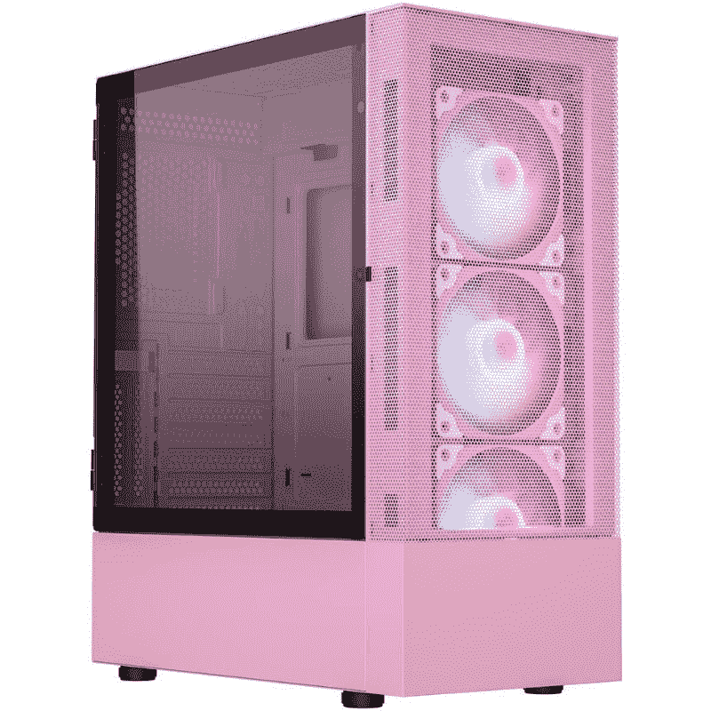
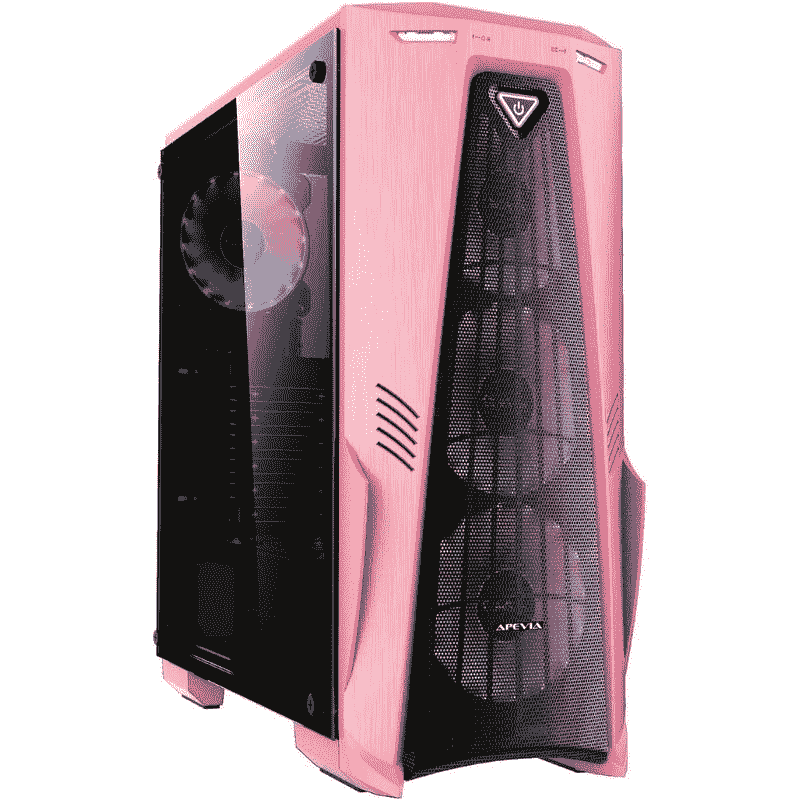
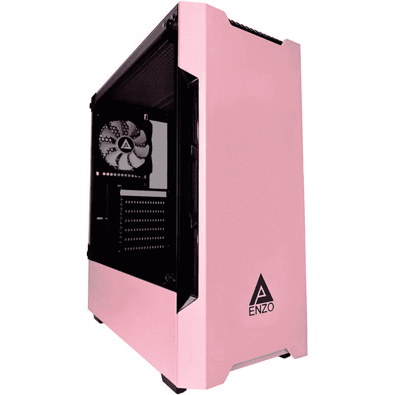
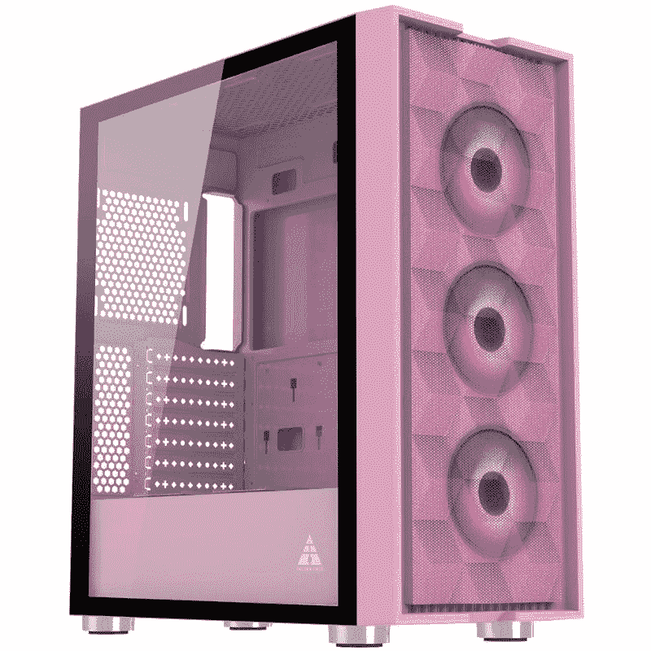
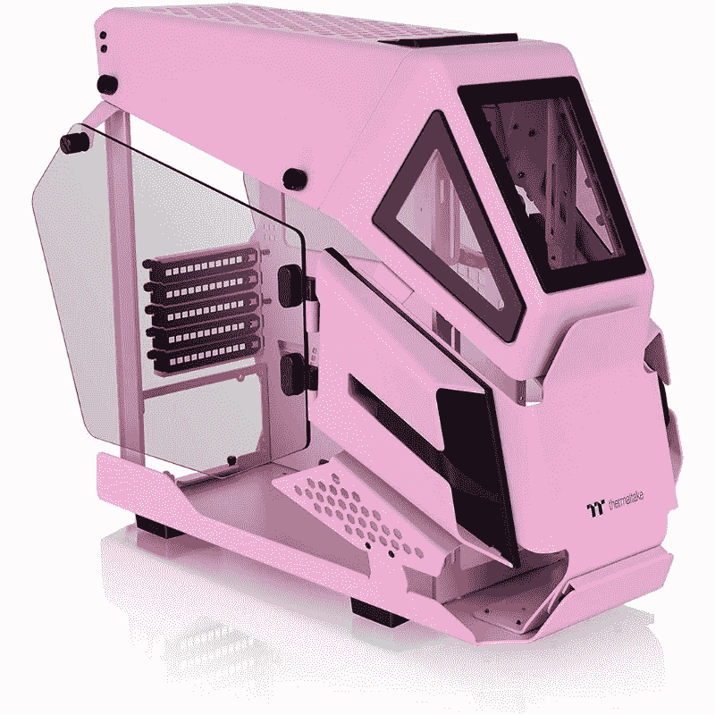
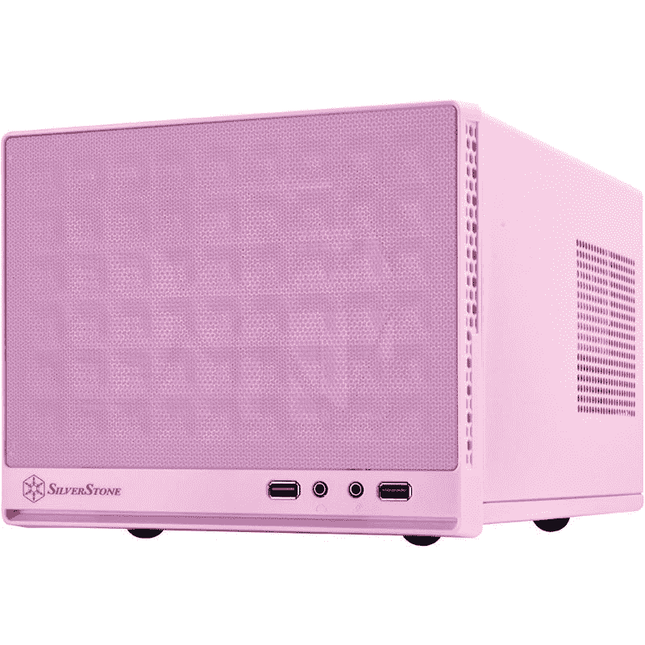
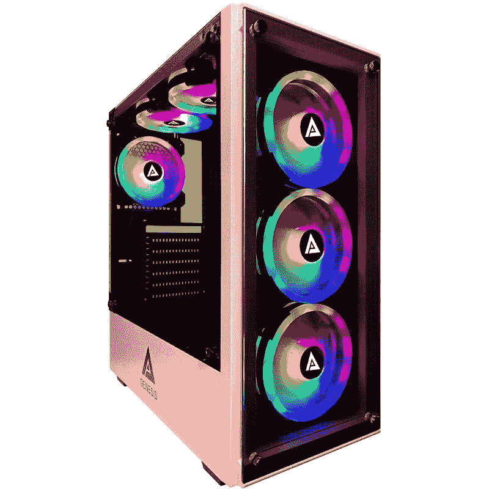

# 2023 年最佳粉色电脑包

> 原文：<https://www.xda-developers.com/best-pink-pc-cases/>

虽然今天你可以买到成百上千的电脑机箱，但要脱颖而出并不容易。许多这样的案例([甚至是最好中的最好](https://www.xda-developers.com/best-pc-cases/))看起来都非常相似。这就是为什么有些人选择更丰富多彩的电脑，去粉红色的电脑外壳。

说真的，一个粉红色的电脑外壳是独一无二的。市场上没有太多粉红色的 PC 外壳，这也是你不常见到它们的原因。我们设法在互联网上梳理了数百个页面，为这个系列找到了最好的粉色电脑包。你可能不会从你最喜欢的主流机箱制造商那里找到粉红色的 PC 机箱，如 [NZXT](https://www.xda-developers.com/best-nzxt-cases/) 或 [Corsair](https://www.xda-developers.com/best-corsair-cases/) ，但这些都是一些可靠的机箱，提供了很多功能，如宽敞的机箱，良好的散热器支撑，大量的扩展槽等等。

## 最佳整体粉色电脑包:Vetroo A03

Vetroo A03 是一款中塔式 ATX 游戏电脑机箱，有粉色、黑色和白色三种颜色可供选择。这款电脑机箱看起来与 Corsair 4000D Airflow 电脑机箱非常相似，但这款更便宜。Vetroo A03 表壳配有钢化玻璃侧板，让您可以看到内部结构。它使用一个普通的面板，其余的侧面带有通风孔。机箱前面有一个网状面板，以提供最大的气流，以及一个灰尘过滤器，以确保额外的气流不意味着更多的灰尘。前面有空间安装三个 120 毫米机箱风扇，有助于将热空气排出系统。

这款电脑机箱最棒的一点是，它预装了三个 120 毫米 ARGB/PWM 风扇，外加一个控制器来控制它们。除了三个预装的机箱风扇之外，还可以在顶部面板上添加两个 120 毫米或 140 毫米的风扇，在后面板上添加一个 120 毫米的风扇。你必须单独购买这些风扇，因为这个箱子只有三个。Vetroo A03 还提供了非常好的散热器安装选项:前部 360 毫米，顶部 280 毫米，后部 120 毫米。

A03 有七个水平扩展槽，如果你想垂直安装 GPU，还有两个垂直插槽。底部有一个单独的隔间来存放 PSU 和硬盘。由于主板后面有专用安装空间，您还可以安装更多驱动器。机箱内有足够的空间，甚至可以建造一台水冷电脑，并配有一个蓄水池。由于主板后面安装了两个线梳，电缆管理应该非常容易。

总的来说，Vetroo A03 是一个非常棒的 PC 外壳，它配备了所有的必需品，而价格仅为 90 美元左右。市场上许多具有类似功能的主流电脑外壳的价格要比这高得多。最重要的是，A03 不仅仅是为了成为一个粉红色的 PC 外壳而存在；这是一个很好的 PC 保护套，有粉红色可供选择，这是一个重要的区别。

 <picture></picture> 

Vetroo A03 pink PC case

##### Vetroo A03 粉色电脑包

Vetroo A03 是一款中塔式 ATX 电脑机箱，价格合理，功能齐全。它有粉色、黑色和白色可供选择。

## 第二好的整体粉红色电脑案件:Apevia 十字军-F-PK

如果你正在寻找一些看起来更前卫或游戏性的东西，那么我们建议看看 ATX 大小的 Apevia Crusader-F-PK。可能会立即吸引你眼球的是 A 形前面板，虽然这在技术上意味着更少的进气气流，但实际上它不会引起任何明显的温度问题。十字军也有一个玻璃侧面板和 RGB 风扇，以完成典型的粉红色扭曲的游戏桌面风格。

Apevia Crusader-F-PK 机箱有足够的空间来安装一堆机箱风扇:三个 120 毫米风扇在前面，两个 120 毫米风扇在顶部面板，一个 120 毫米风扇在后面。好的方面是，这款保护套配有四个预装的 120 毫米风扇——三个在前面，一个在后面——这对大多数用户来说绰绰有余。十字军可以容纳一个 360 毫米的散热器在前面，一个 240 毫米在顶部，一个 120 毫米在后面。如果你对空气冷却更感兴趣，那么十字军战士 165 毫米的高度限制应该会给你足够的空间。

Crusader 为您安装最大长度达 350 毫米的 GPU 提供了足够的空间。没有垂直扩展槽，但你有七个 PCIe 扩展槽，这足以安装不止一个 GPU 和其他设备。底部还有一个用于安装 PSU 的独立隔间，有更多空间来添加硬盘。Crusader 还配备了专用于固态硬盘和硬盘的驱动器支架。主板托盘上有用于将电缆布线到背面的切口，这将有助于您正确管理内部电缆，以构建一个外观整洁、电缆最少的电脑。

售价 75 美元，这是我们现在能在亚马逊上找到的最好的粉色电脑保护套之一。你也可以通过多花一点钱来升级到 Vetroo A03，但是它们都一样好。真正的区别在于你是喜欢极简主义还是经典的前卫游戏风格。

 <picture></picture> 

Apevia Crusader-F-PK PC case

##### Apevia 十字军-F-PK 电脑盒

Apevia Crusader-F-PK 中塔式电脑机箱是那些希望打造一台设计独特、引人注目的游戏电脑的人的绝佳选择。

## 最实惠的粉色电脑包:Apevia Enzo-PK

如果您倾向于购买经济型电脑，那么您可能会考虑购买 Apevia Enzo-PK 电脑保护套。这种特殊的装置售价约为 70 美元，是该系列中最实惠的电脑机箱之一。虽然 Enzo-PK 被定位为一款经济型替代车型，但它有很多令人喜欢的地方。

首先，它采用了高质量的金属结构和透明的钢化玻璃侧板。许多经济型电脑外壳往往缺乏透明的侧板，更不用说是玻璃而不是丙烯酸制成的了。前面板在侧面有通风孔，这对于散热来说不是最佳选择，但对于大多数用户来说应该足够了。顶部面板也有网状通风口，以改善气流。

Enzo-PK 提供了大量空间来添加机箱风扇和散热器。前面有空间安装三个 120 毫米风扇，顶部有两个 120 毫米风扇，后面板上有一个 120 毫米风扇。风扇有所有这些选项是很好的，但这个外壳只能获得一个预装风扇，其余的都要购买。这可能会增加建造的总成本，但我们建议至少多拿两个风扇以保持良好的气流。

如果你想使用 [AIO 液体 CPU 冷却器](https://www.xda-developers.com/best-liquid-coolers/)，你也可以在机箱内安装散热器。官方规定只能在前面装 240mm 的散热器，上面 240mm，后面 120mm。三个 120 毫米的风扇安装在前面意味着 360 毫米的散热器也将如此，但 Apevia 没有宣传这一点，这意味着 360 毫米可能有间隙问题。CPU 空冷器间隙 160mm，对于大部分高端机型来说已经足够。由于 Enzo-PK 提供了 350 毫米的间隙，GPU 兼容性很好，这对于绝大多数高端卡来说已经足够了。

Apevia Enzo-PK 提供了一个单独的隔间，用于在底部安装 PSU。您也可以在此处添加硬盘，或者将它们单独安装在专用的硬盘支架上。主主板托盘后面也有足够的空间用于电缆管理，尽管没有像钢丝梳这样的电缆管理功能。前端 I/O 包括一个不错的端口选择，但它们没有什么特别的。

总的来说，我们真的很喜欢 Apevia Enzo-PK，因为它性价比高，而且没有严重的缺点。这是 95%的十字军-F-PK 更简约的风格，而成本略低。然而，缺少预装风扇可能是一个障碍。

 <picture></picture> 

Apevia ENZO-PK PC case

##### Apevia ENZO-PK 电脑机箱

Apevia ENZO-PK 是一款经济实惠的中立式电脑机箱，适合入门级或中档电脑。

## 最佳气流粉红色电脑机箱:金域法师-P

Golden Field Mage-P 类似于我们之前在本系列中看到的 Vetroo A03，具有最大气流的网状前面板和钢化玻璃侧面板，让您可以看到建筑的内部。然而，Mage-P 有一些设计选择，使其特别适合需要大量气流的用户。

首先，前面板没有阻挡前面三个预装的 120mm 风扇的底部，这使得 Mage-P 比 A03 略占优势。PSU 裹尸布的顶部还有空间安装两个额外的 120 毫米风扇。如果您正在构建一台 CPU 和 GPU 都依赖于定制液体冷却的 PC，拥有两个额外的风扇来为主板提供一些气流(这通常是 CPU 或 GPU 空气冷却器的工作)会非常有帮助。

Mage-P 的间隙通常很好。前面有 360 毫米的散热器，顶部有 240 毫米的散热器，后面有 120 毫米的散热器。七个扩展槽和 320 毫米的间隙，甚至可以安装市场上最大的 GPU。CPU 冷却器的高度限制在 165 毫米，可以容纳几乎所有的高端型号。

总的来说，我们真的很喜欢金场法师-P 电脑案件感谢其最大化和优化的气流。它的价格约为 120 美元，比该系列中的许多其他机箱都要贵，但它对于那些想要构建一台带有消耗大量电力的组件并需要出色的冷却来实现良好散热的 PC 的用户来说非常突出。

 <picture></picture> 

Golden Field Mage-P PC case

##### 金场法师-P 电脑盒

金场法师-P 是一个伟大的气流情况下，有很多通风口和网状过滤器。它还配有三个预装的机箱风扇。

## 替代最佳气流电脑机箱:Thermaltake AH T200

Thermaltake AH T200 是一款开放式电脑机箱，外观更加独特和激进。虽然大多数情况下都是密封的盒子，但出于美观和实用的目的，T200 在结构上有几个缺口，主要是为了更容易建造和维护以及更好的气流。请记住，只有 mATX 和 ITX 主板将适合这个机箱。

您可以在顶部安装两个 120 毫米或 140 毫米的风扇，在前面安装两个 120 毫米或 140 毫米的风扇。电脑外壳本身没有预装风扇，所以你必须单独购买。至于散热器安装支架，你只能在前面安装一个 280mm 或者 240mm 的。与其他情况相比，GPU 的空间略有限制，五个扩展槽的高度(仍然足够)和 320 毫米的长度(对于非常长的卡来说可能是个问题)。CPU 空气冷却器的间隙也略小于其他情况下的 150 毫米。

开放式框架设计有点像一把双刃剑。一方面，所有这些额外的空间意味着在这种情况下建造和维护计算机是方便的，并且有大量容易获得的新鲜空气。但是所有的新鲜空气都会带来灰尘，这并不是说你可以在整个底盘上安装一个灰尘过滤器。此外，虽然大多数情况下 PSU 的风扇朝下，并允许 PSU 通过过滤器吸入空气，但 T200 会强制 PSU 安装时风扇朝上，以便吸入空气。出于显而易见的原因，你不想让你的 PSU 沾上灰尘。

你现在看到的是 Thermaltake 的 AH T200 的标价约为 170 美元，这相当贵。T200 有许多令人喜欢的地方，但开放式框架设计需要大量维护，以防止灰尘堆积。在你购买之前，你必须权衡 T200 的利弊。

 <picture></picture> 

Thermaltake AH T200 PC case

##### Thermaltake AH T200

Thermaltake AH T200 是一款采用开放式框架设计的出色气流箱。使用这款电脑机箱相当困难，但值得一试。

## 最佳迷你 ITX 电脑机箱:酷派大师

很难找到一个粉红色的电脑外壳，更不用说一个也是迷你 ITX 外形的了。在这个类别中真的没有太多的选择，但谢天谢地有几个值得购买，如 Cooler Master 的 MasterBox NR200P。NR200P 旨在用于高端电脑，价格约为 130 美元。

尽管是一个小型机箱，NR200P 可以容纳多达 7 个风扇(带穿孔侧板)或 5 个风扇(带钢化玻璃侧板)。理论上，NR200P 可以支持三个散热器，两个 2400 毫米的位于顶部和底部，一个 280 毫米的位于通风侧面板，但实际上很难使用两个，因为机箱的设计使得其他组件，如 GPU 或 CPU 空气冷却器，将占用安装所有三个散热器所需的空间。尽管如此，在安装液体冷却器的地方有多种选择还是不错的。还内置了对定制液体循环的支持。

无论您是水平还是垂直安装您的 GPU，NR200P 都可以支持长达 330 毫米的卡，尽管对于使用正常水平安装的较厚 GPU 来说有更多的间隙。请记住，无论你在哪里安装 GPU，你都是在放弃可以用于散热器的空间。假设你没有垂直安装 GPU，CPU 空气冷却器的间隙是 155 毫米，这对绝大多数型号来说都是好的。最后，此案例使用 ATX 尺寸的 PSU，而不是 ITX 案例中有时使用的较小的 SFX 外形。

虽然 NR200P 不是市场上最紧凑的 ITX 大小的机箱，但它仍然非常密集，并具有一系列良好的功能。由于有两种不同的侧面板可供选择，可以垂直或水平安装 GPU，并且有三个不同的位置来安装一两个散热器，因此您可以享受所有世界的精华。对于那些对高端组件感兴趣的人来说，NR200P 是一个很好的选择。

##### 冷却器 MasterBox NR200P

Master MasterBox NR200P 是一款迷你 ITX 电脑机箱，支持高端 GPU、CPU 空气冷却器和定制液体冷却回路。

## 备选最佳迷你 ITX 电脑机箱:银石 SG13P

如果你倾向于迷你 ITX PC 构建，尤其是如果你想要更典型的体验，SilverStone SG13P 是另一个值得考虑的好选择。与 NR200P 相比，SG13P 便宜得多，约 60 美元，但有一些权衡因素使这种机箱更适合预算构建，而不是你可以放在 NR200P 中的那种高端 PC。

SG13P 的前面板、侧面板和顶部面板都有通风孔，非常适合气流。由于前面板是网状而不是实心的，因此有助于从前方吸入气流。不幸的是，这一切都被有限的风扇和散热器支持所抵消；您只能在前端安装一个 120 毫米或 140 毫米的风扇，以及 120 毫米或 140 毫米的散热器用于液体冷却。其他通风口甚至没有风扇安装孔，尽管它们足够大，可以自由排出空气。

GPU 和 CPU 空气冷却器的间隙也非常有限。显卡只能是 270 毫米或更短，并且不能比两个插槽厚。CPU 空气冷却器支持实际上仅限于 61 毫米，这是实际使用 120 毫米或 140 毫米液体冷却器的强大动力。这都是因为 SG13P 支持标准的 ATX 大小的 PSU，这使得在这种机箱中构建 PC 的成本比其他 ITX 机箱更低。

Silverstone 的 SG13P 对于任何想用预算建造一台 ITX 电脑的人来说都是一个很好的选择。它不仅比 NR200P 便宜得多，更便宜的部件通常消耗更少的功率，产生更少的热量，使得 SG13P 缺乏冷却潜力不是问题。然而，升级围绕这种机箱设计的电脑可能具有挑战性。

 <picture></picture> 

SilverStone SG13P PC case

##### 银石 SG13P 电脑机箱

SilverStone SG13P 是一款价格实惠的迷你 ITX 电脑机箱，物超所值。您可以考虑将这种情况作为中档 PC 版本的入门产品。

## 最佳 RGB 粉色电脑机箱:Apevia Genesis Pro G-PRO-PK

如果你喜欢在你的电脑里有一个 RGB 灯光表演，那么你可能会考虑购买 Apevia Genesis G-PRO-PK。它的侧面和正面都配有 RGB 风扇和钢化玻璃面板，让您以不到 100 美元的价格欣赏大量的色彩。

虽然 Genesis 比这个系列中的其他一些箱子稍贵，但你会得到你所支付的，因为这个箱子带有六个预装的 RGB 风扇。很难找到包含这么多风扇的机箱，更不用说 RGB 功能了。但是你必须提供你自己的 RGB 控制器。

好在创世纪配备了所有这些风扇，因为气流并不完全是最佳的。前面板是 100%钢化玻璃，看起来不错，但是在外壳和面板之间只留了一点缝隙，用于进气气流。尽管你可以在前面安装一个 360 毫米的散热器，在顶部安装一个 240 毫米的散热器，但缺乏新鲜空气进入将是冷却的一个挑战。由于其七个扩展槽，Genesis 支持长达 350 毫米和任何厚度的显卡。CPU 空气冷却器的间隙为 160 毫米，这对于几乎任何型号都足够了。

Apevia Genesis Pro G-PRO-PK 最重要的是外观，甚至不惜牺牲实用性。它的价格不到 100 美元，实际上是一笔非常划算的交易，因为它的正面和侧面都预装了六个 RGB 风扇和玻璃面板。如果您选择高端器件来搭配这款机箱，散热性能可能是一个问题。

 <picture></picture> 

Apevia Genesis Pro-G-PK PC case

##### Apevia Genesis Pro-G-PK 电脑盒

Apevia Genesis Pro 是那些喜欢在电脑机箱中安装大量 RGB 灯的人的好选择。该设备配有六个预装的 RGB 机箱风扇。

## 购买最佳粉色电脑包:最终想法

虽然粉色并不是电脑机箱最受欢迎的颜色，但是有数量惊人的好机箱。Vetroo 的 A03 表壳由于其相对较低的价格和合理的设计而总体上是最好的，而 Thermaltake AH T200 和 Apevia Genesis Pro-G-PK 则是更非典型的设计，专注于不同的外观和功能。尽管在这个领域缺乏像 Corsair 和 NZXT 这样的大牌，但很难说你选择这些不太受欢迎的品牌之一的底盘是在质量上妥协。

我们很想在下面的评论中知道你对这个系列的想法，如果我们错过了你最喜欢的粉色电脑保护套，请告诉我们。如果你现在正在计划一个新的 PC 版本，那么你可能想看看我们收集的[最佳 CPU](https://www.xda-developers.com/best-cpus/)和[最佳主板](https://www.xda-developers.com/best-motherboard/)来开始一些好的选择。此外，别忘了看看我们的 [XDA 计算论坛](https://forum.xda-developers.com/c/xda-computing.12289/)，在这里你可以讨论你的构建，获得产品推荐，等等。