# 2021 年 1 月购买的最佳 Pixel 5 保护套:保护新手机的最佳保护套

> 原文：<https://www.xda-developers.com/best-pixel-5-cases/>

# 2021 年 1 月最佳 Pixel 5 案例:拿什么来保护你的新设备

用现有的一些最好的 Pixel 5 保护您新购买的产品！从 Spigen 到 DBrand 再到 Zagg，每个人都能找到自己想要的。

所以你在疯狂的黑色星期五销售期间订购了谷歌 Pixel 5，或者已经得到了一个作为节日礼物。现在，是时候用保护套保护你的新手机了！如果你的新 Pixel 5 被划伤，最糟糕的事情可能会发生，不管你多么小心，事故还是会发生。但是，不用担心！我们已经收集了最好的谷歌 Pixel 5 保护套，所以你可以在最坚固的保护套和适合你需求的超薄保护套之间挑选。

 <picture>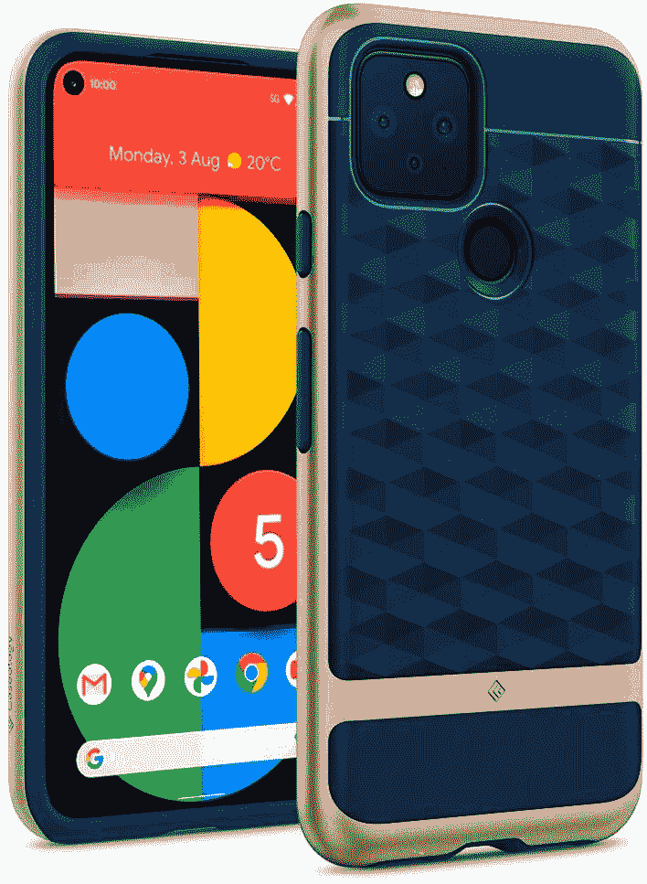</picture> 

Caseology Parallax Case

##### 案例学视差像素 4 例

案例学让双层案例看起来总是很棒。柔软层的 3D 纹理有助于抓握，纤细的坚硬层可抵御冲击和跌落。

 <picture>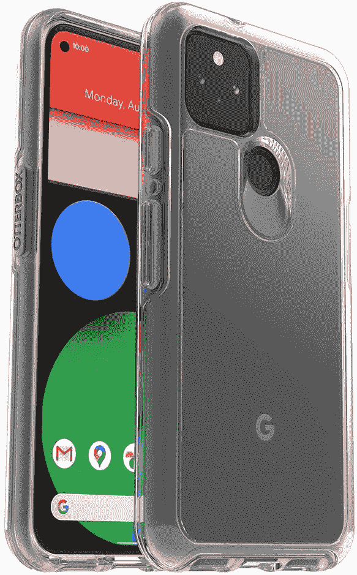</picture> 

Otterbox Symmetry Clear Case

##### OtterBox 对称像素 5a 外壳

获得经典的 Otterbox 保护，但无需隐藏手机背面！这个 Otterbox 保护套可以保护你的手机，但是它也是透明的。对于手比较大的也很棒！

 <picture>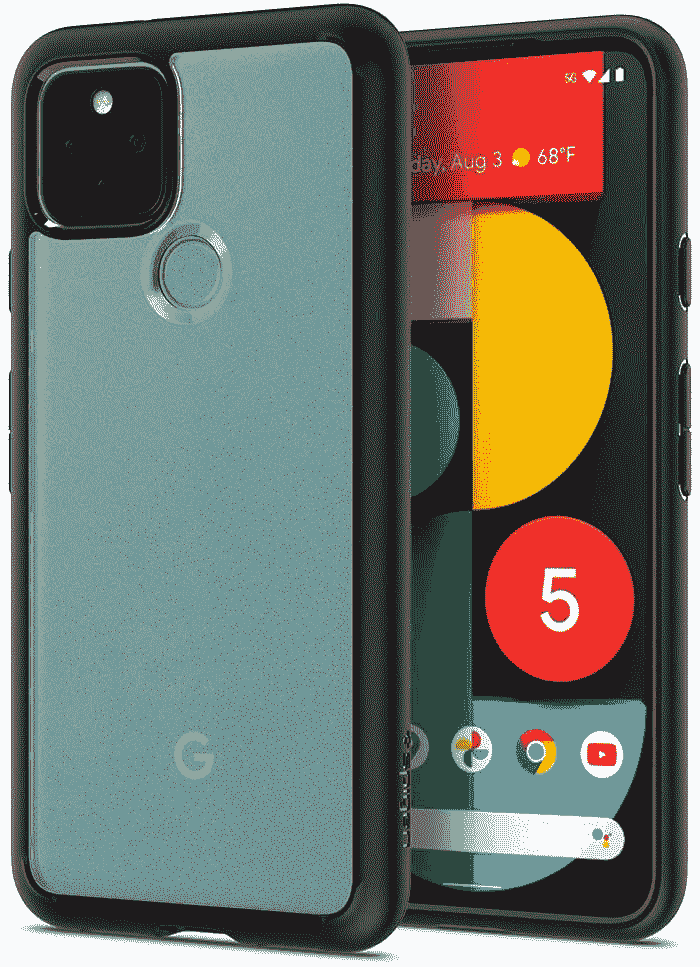</picture> 

Spigen Ultra Hybrid Case

##### Spigen 超混合像素 5 盒

如果你想要的是介于保护和时尚之间的东西，Spigen Ultra Hybrid 绝对不会错。这款保护套有黑色和透明背两种颜色，可以保护你的手机不被摔落，而且不会让它变得太大。

 <picture>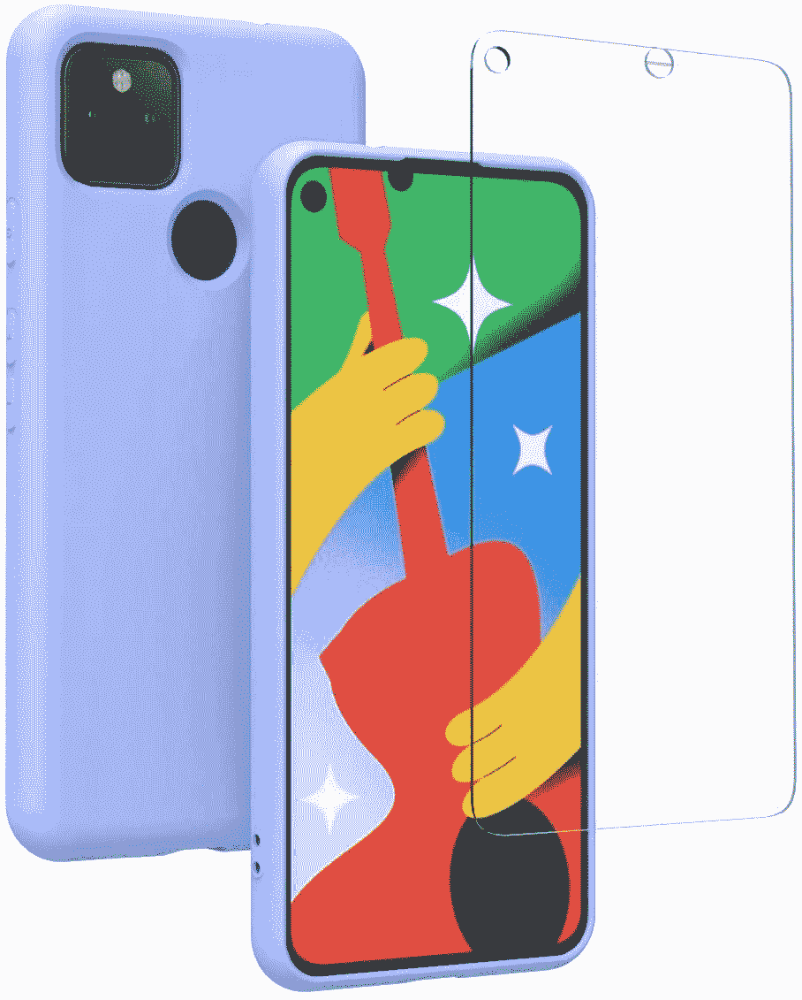</picture> 

Weycolor Google Pixel 5 Case

##### Wecolor Pixel 5 外壳

如果你对 Pixel 5 的颜色选择感到失望，那么就用一种独特的颜色来吹嘘吧！Weycolor 轻薄的彩色外壳将帮助您从 Pixel 5 人群中脱颖而出，并有三种颜色可供选择，因此每个人都有自己的选择！。

 <picture>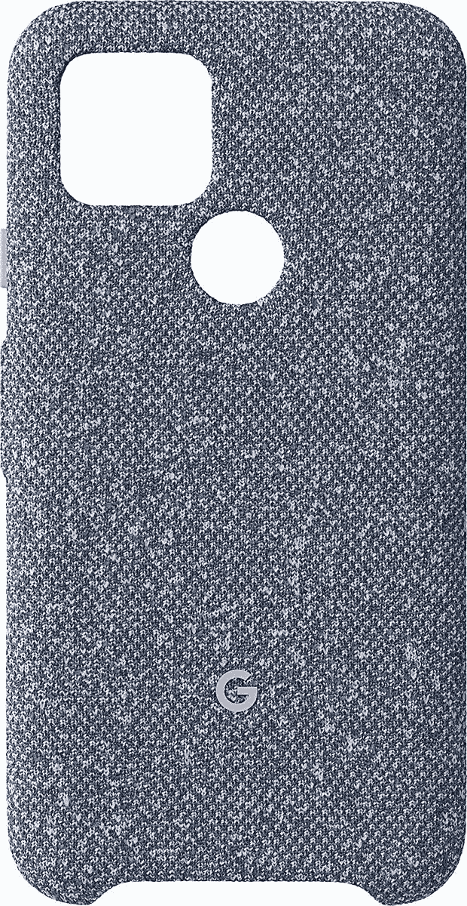</picture> 

Google Pixel 5 Case

##### 谷歌织物像素 5 案例

谷歌自己的 Pixel 5 外壳肯定是一个有趣的设计。这是一款由可机洗面料制成的环保保护套，它提供了一点抓握感，同时坚持了谷歌降低对环境影响的承诺。

 <picture>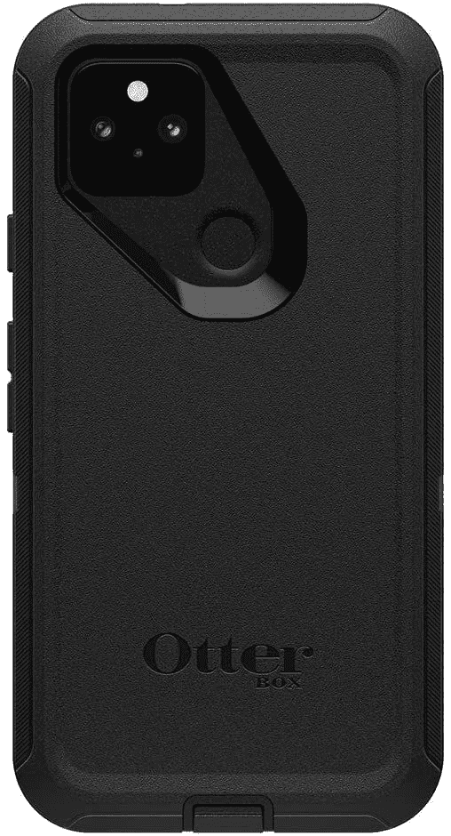</picture> 

OtterBox Defender Series Case

##### OtterBox Defender 像素 5 案例

如果你的 Pixel 5 真的要通过 ringer，你不能用 OtterBox 出错。厚厚的外壳将保护您的手机免受最严重的摔落和震动。请记住，它增加了一些良好的散装。

 <picture>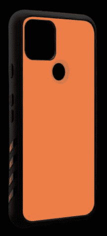</picture> 

DBrand Pixel 5 Grip Case

##### dbrand Grip 像素 5 案例

没有其他案件符合这种风格吗？定制 DBrand 的 Pixel 5 外壳，让它成为你自己的！为您的背壳选择多种肤色，让它真正成为您的专属。

 <picture>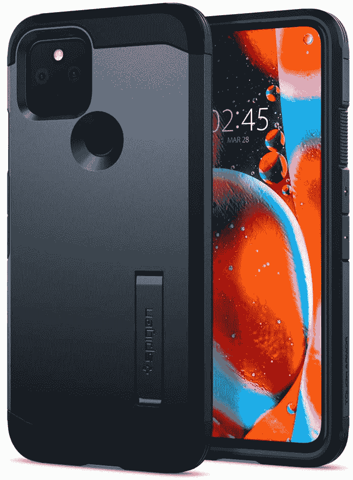</picture> 

Spigen Tough Armor

##### 斯皮根坚韧装甲像素 5 盒

Spigen 也有坚韧的盔甲系列。这些可以防止大多数跌落和震动，并且有一个有用的小支架来支撑你的手机。如果你想保护自己的手机，但又不想让它变得太大，这是你最好的选择。

 <picture></picture> 

Vena vCommute Wallet Case

##### Vena vCommute 钱包 Galaxy Pixel 5 超盒

对于谷歌 Pixel 5，Vena 有一个钱包保护套，肯定会让你满意。卡片不是放在翻盖上，而是放在后面的一个镂空区域。你还会有一个支架来支撑你的手机。你只是不需要担心卡划伤你的屏幕！

 <picture></picture> 

Caseology Legion

##### 案例学军团像素 5 案例

Caseology 是一个受欢迎的品牌，他们的军团系列是为生活中的颠簸而设计的。Caseology Legion 提供柔软的内层和坚硬的外层外壳，可以保护你的 Pixel 5，你仍然可以使用无线充电和屏幕保护器。

 <picture>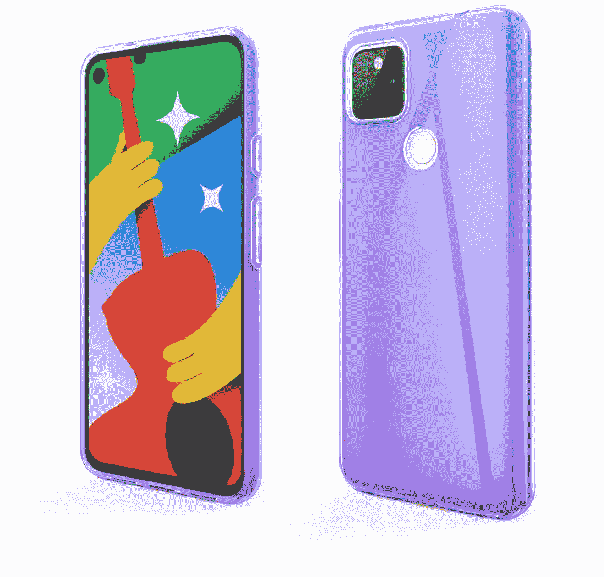</picture> 

Vinve Google Pixel 5 Case

##### Vinve 像素 5 外壳

Vinve 的谷歌 5 外壳是一种漂亮的渐变颜色，所以你可以让你的手机弹出，同时为它提供一点保护。

 <picture>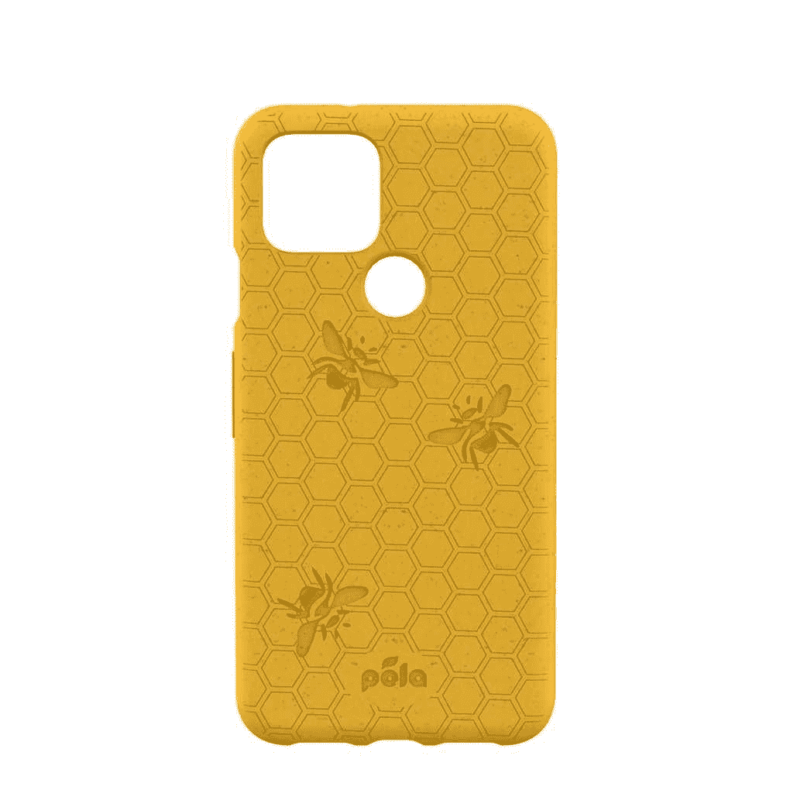</picture> 

Honey (Bee Edition) Google Pixel 5 Eco-Friendly Case

##### Pela 蜂蜜酒版像素 5 盒

想要一个既可爱又环保的箱子吗？Pela 的蜜蜂箱是黄色的，上面装饰着有用的小蜂蜜制造者，并且是生物可降解和环保的。你不能要求太多了！

 <picture>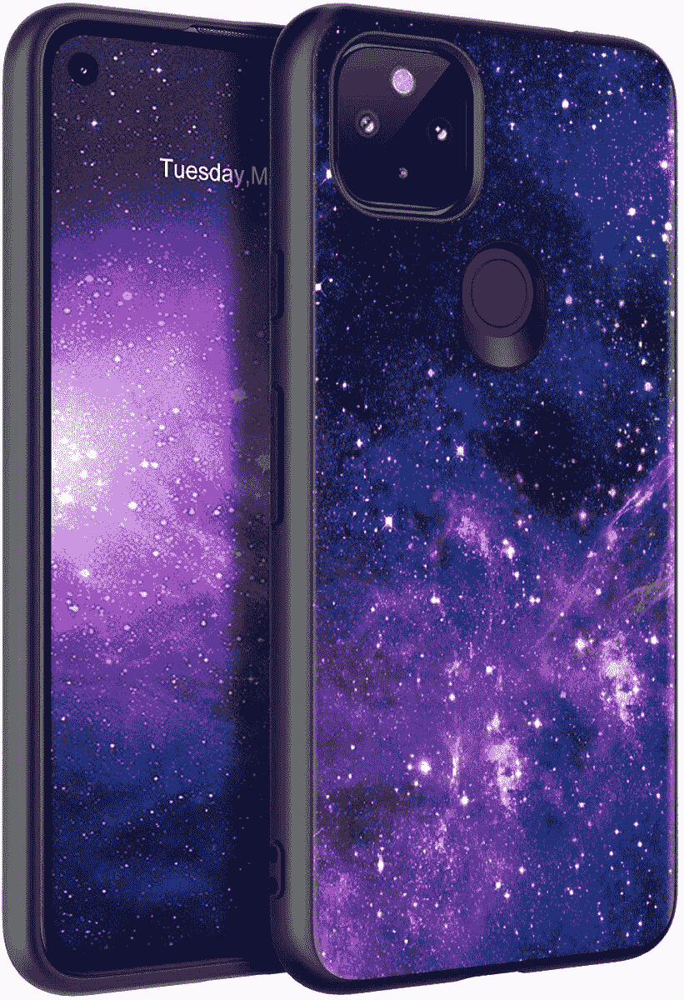</picture> 

Bentoben Pixel 5 Case

##### Bentoben Pixel 5 外壳

谁不爱一个好的空间主题呢？Bentoben 的 Pixel 5 外壳是一个漂亮的星空背景，可以给你的设备提供中等水平的保护。

 <picture>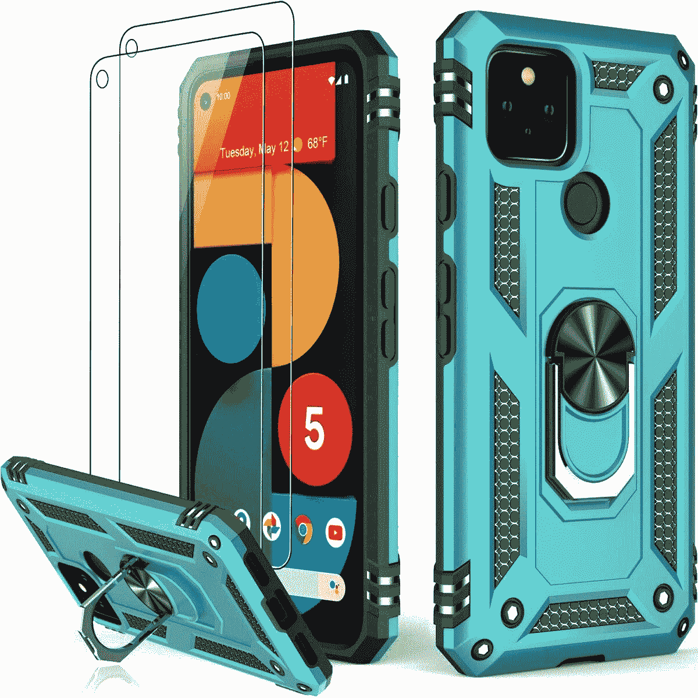</picture> 

Lumarke Military-Grade Case

##### Lumarke 重型像素 5 盒

护腕、戒指和相机保护。你还能要求什么？嗯，多达九种颜色可供选择，就是这样！

 <picture>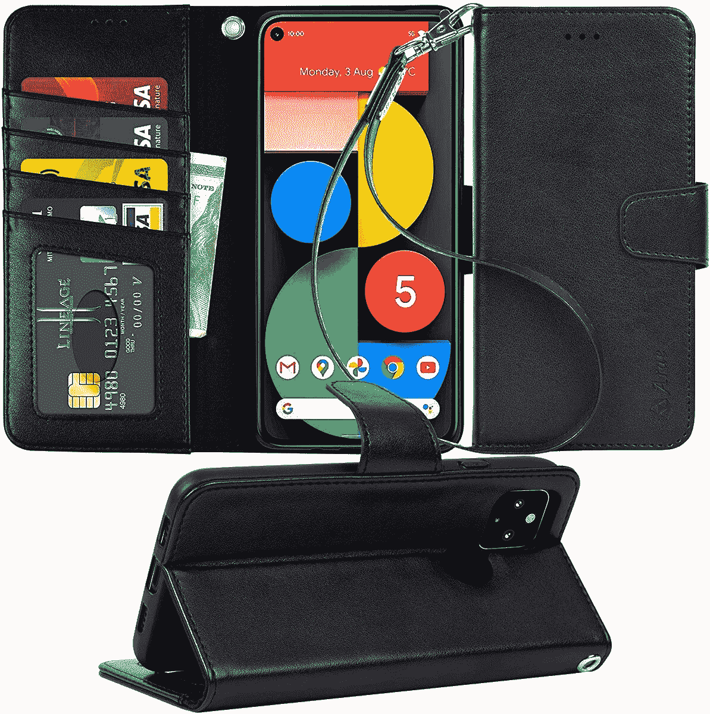</picture> 

Arae Wallet Case

##### Arae 钱包 Pixel 5 盒

Arae Case 为您的 Pixel 4 提供了另一个山谷选项。三瓣的情况下，将存储您的卡，保护您的屏幕，并作为一个道具。

你会抢哪个 Pixel 5 外壳？老实说，你真的不会对 Spigen 的产品系列感到失望(我们甚至让它获得了 2020 年 XDA 最佳技术奖！)，而[超混动](https://www.amazon.com/Spigen-Ultra-Hybrid-Designed-Pixel/dp/B08D61VH6X?tag=xda-j874k8m-20&ascsubtag=UUxdaUeUpU30036&asc_refurl=https%3A%2F%2Fwww.xda-developers.com%2Fbest-pixel-5-cases%2F&asc_campaign=Short-Term)是保护性和舒适性的最佳折中。在 Pixel 5 的生命周期中，外壳肯定会防止任何普通用户的跌落，但它也不会让手机变得太大，以至于实际使用时不舒服。我的手很小，所以像 OtterBox 这样的东西，虽然有保护作用，但对我的手来说太大了。但是，如果你有一份特别劳动密集型的工作，并且需要防止意外事故，那么 [OtterBox 的 Defender 系列](https://www.amazon.com/OtterBox-DEFENDER-Google-Pixel-VERSION/dp/B01MDLGP8C?tag=xda-j874k8m-20&ascsubtag=UUxdaUeUpU30036&asc_refurl=https%3A%2F%2Fwww.xda-developers.com%2Fbest-pixel-5-cases%2F&asc_campaign=Short-Term)绝对是抢手货，不管是不是散装的。

如果你不像我一样容易滑手指，像 [Weycolor 的 select](https://www.amazon.com/Weycolor-Tempered-Protector-Silicone-Protection/dp/B08HYTHYH2?tag=xda-j874k8m-20&ascsubtag=UUxdaUeUpU30036&asc_refurl=https%3A%2F%2Fwww.xda-developers.com%2Fbest-pixel-5-cases%2F&asc_campaign=Short-Term)Pixel 5 外壳这样薄而多彩的外壳是个好主意。他们可以轻松而廉价地让单调的黑色像素 5 变得生动起来！你可能会说没有外壳更好，但让我们面对现实吧——我们都有过手机不小心碰到包或钱包里尖锐的东西的经历。你想在你的新设备背面留下严重的划痕吗？这些情况可以防止您的设备发生类似事件。

你最喜欢哪个 Pixel 5 的外壳？请在评论中告诉我们！