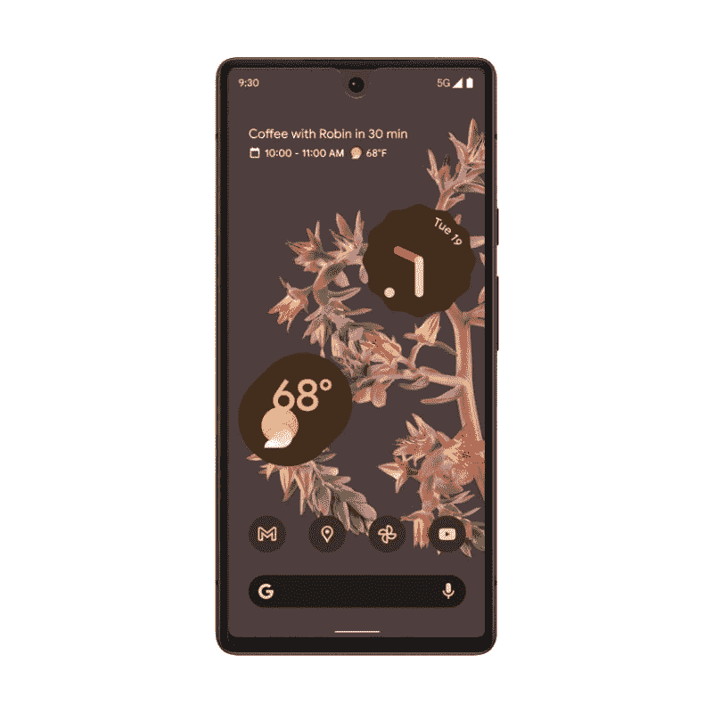
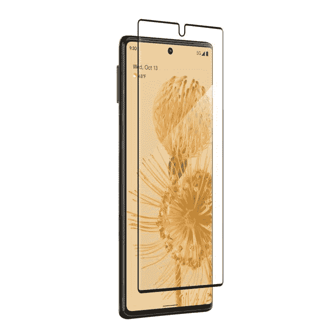
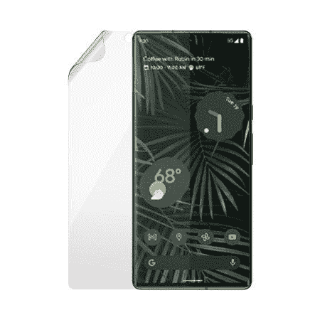

# 2023 年最佳 Pixel 6 和 6 Pro 屏幕保护器

> 原文：<https://www.xda-developers.com/best-pixel-6-pro-screen-protectors/>

在推出几年中端产品后，谷歌正通过其新的 Pixel 6 系列再次尝试高端智能手机市场。该公司的 [Pixel 6 和 Pixel 6 Pro](https://www.xda-developers.com/google-pixel-6/) 手机以其高端规格和极具竞争力的价格瞄准了 [iPhone 13](https://www.xda-developers.com/iphone-13/) 系列、[三星 Galaxy S21](https://www.xda-developers.com/samsung-galaxy-s21/) 系列和其他安卓旗舰产品。

Pixel 6 系列的亮点包括谷歌张量芯片、IP68 防水和防尘、 [Android 12](https://www.xda-developers.com/android-12/) ，以及支持 HDR 的高刷新率有机发光二极管显示器。尽管谷歌在两款 Pixel 手机上都包含了康宁大猩猩玻璃 Victus，以增加对屏幕的额外保护，但鉴于手机的滑溜特性，以屏幕保护器和外壳的形式包含一些自己的保护是理想的。我们已经推荐过[最佳 Pixel 6 系列保护套](https://www.xda-developers.com/best-google-pixel-6-pro-cases/)，现在，是时候给大家推荐一下最佳 Pixel 6 和 Pixel 6 Pro 屏幕保护套了。

市场上有几种屏幕保护器，但并不是所有的都与 Pixel 6 手机的屏幕内指纹保护器兼容。因此，谷歌建议使用“谷歌认证制造”制造商的屏幕保护器。幸运的是，有许多[“谷歌认证的”品牌](https://get.google.com/madefor/pixel/)，所以不会缺乏选择。此外，其他受欢迎但未经“为谷歌制造”认证的品牌也发布了与指纹传感器兼容的屏幕保护装置。

## 最佳谷歌 Pixel 6 屏幕保护器

 <picture></picture> 

ZAGG InvisibleShield Glass Elite+

##### ZAGG InvisibleShield 玻璃精英+ Pixel 6 Pro 屏幕保护器

ZAGG InvisibleShield Glass Elite+是 Pixel 6 的优秀屏幕保护器。顾名思义，就是钢化玻璃保护套。它还带有抗菌涂层，以抑制细菌的生长。此外，屏幕保护器将与手机的显示指纹传感器配合使用。

 <picture></picture> 

OtterBox Clearly Protected

##### OtterBox Pixel 6 Pro 屏幕保护器

OtterBox 显然受到了保护，它是 Pixel 6 的一个塑料屏幕保护器，经证实可以与手机的显示指纹传感器配合使用。它非常适合，甚至与案件，并附带终身保修。

 <picture></picture> 

PanzerGlass Tempered Glass

##### PanzerGlass 钢化玻璃像素 6 专业屏幕保护

PanzerGlass 钢化玻璃保护器的硬度为 9H，可以保护手机的有机发光二极管屏幕免受划痕和磨损。保护器的厚度也只有 0.4 毫米，因此不会增加任何不必要的体积。它还可以与指纹传感器配合使用，并具有疏油涂层。

## 最佳谷歌 Pixel 6 Pro 屏幕保护器

 <picture></picture> 

ZAGG InvisibleShield Glass Curve Elite

##### ZAGG invisible shield glass fusion+Pixel 6 Pro 屏幕保护器

ZAGG invisible shield Glass Curve Elite 屏幕保护器为 Pixel 6 Pro 提供顶级保护。它还带有抗菌和疏油涂层。此外，它与手机屏幕的弯曲边缘配合得很好。

 <picture></picture> 

PanzerGlass TPU Screen Protector

##### PanzerGlass TPU 像素 6 专业屏幕保护

PanzerGlass 是谷歌认证品牌之一，所以你可以放心，它的屏幕保护器将与手机的指纹传感器配合使用。此外，它耐刮擦，并带有疏油涂层，可防止指纹污迹。

 <picture></picture> 

ArmorSuit MilitaryShield

##### ArmorSuit MilitaryShield 像素 6 专业屏幕保护

ArmorSuit MilitaryShield 是一款位于 TPU 的 Pixel 6 Pro 屏幕保护器。它将保护手机免受划痕和磨损。此外，该保护器还具有自我修复特性，可以随着时间的推移修复轻微的划痕和其他凹痕。虽然它不是来自谷歌认证的品牌，但屏幕保护器与指纹传感器配合良好。

这些是你现在可以买到的 Pixel 6 和 Pixel 6 Pro 的最佳屏幕保护器。我们所有的建议都适用于内置指纹传感器。虽然 ZAGG 拥有出色的钢化玻璃保护装置，但如果你想要一个基于 TPU 的屏幕保护装置，你可以为 Pixel 6 选择 OtterBox Clear Protected，为 Pixel 6 Pro 选择 PanzerGlass protector。

 <picture></picture> 

Sorta Seaform

Pixel 6 配备了谷歌新的张量芯片、现代设计和旗舰相机。

 <picture></picture> 

Google Pixel 6 Pro

Pixel 6 Pro 配备了显示屏下指纹扫描仪、谷歌新的张量芯片、全新的设计和旗舰相机。

你打算买哪个屏幕保护？请在评论区告诉我们。如果你仍然不喜欢这款设备，你可以阅读我们的 [Pixel 6 Pro 评测](https://www.xda-developers.com/google-pixel-6-pro-review/)来评估这款设备对你来说是否值得。