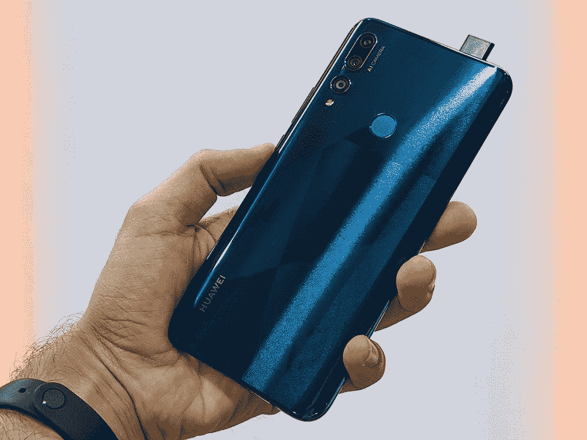

# 300 美元以下的最佳弹出式照相手机

> 原文：<https://www.xda-developers.com/best-pop-up-camera-phones-under-300/>

摄像头的放置一直是 2019 年手机最大的不同因素之一。我们已经看到了打孔凹口、滑动凹口、翻转相机和弹出式相机。Honor 9X 是最流行的配备弹出式自拍相机的手机之一，这为大型无凹口显示屏腾出了空间。由于这是消费者非常想要的功能，我们将 300 美元以下的三款弹出式相机手机放在一起。

* * *

## 荣誉 9X

### € 299.00

Honor 9X 是 X 系列中第一款配备弹出式摄像头的产品。这款弹出式相机采用全电动设计。当自拍模式被激活时，相机会迅速从手机顶部升起。为了真正增强手机的全屏无缺口效果，Honor fitter 在 6.59 英寸的手机中安装了一个更大的显示屏。最终结果是一个大的全屏手机，带有一个非常方便的电动弹出式摄像头。

 <picture></picture> 

Notch-Free Display on the Honor 9X

除了弹出式摄像头，Honor 9X 还拥有一些不到 300 美元的手机的出色规格和功能。使用下面的链接获得荣誉 9X。

**规格**

| 

荣誉 9X

 | 

规范

 |
| --- | --- |
| 显示 | 6.59 英寸 1080 x 2340p 像素(391 ppi) |
| 芯片集 | 海思麒麟 710F |
| 随机存取存储 | 6GB |
| 储存；储备 | 128GB |
| 主摄像机 | 48MP/8MP(超宽)/2MP(深度传感器) |
| 自拍相机 | 16MP 电动弹出式 |
| 电池 | 4000 毫安时 |
| 操作系统 | 安卓 9.1.0 [EMUI](https://www.xda-developers.com/tag/emui/) 9.1.0 |

[**购买荣誉 9X**](https://www.hihonor.com/global/products/smartphone/honor9x/)

* * *

## 华为 y9 Prime

### $242.50

华为 y9 Prime 是一款非常经济的手机，专为寻求大屏幕尺寸和体面规格的人设计。这款手机和上面提到的 Honor 9X 很像。6.59 英寸的大显示屏从手机的一边延伸到另一边，没有任何侵入性的凹槽或滑动机制。弹出式相机是机械的，当相机应用程序中的自拍模式被激活时，它会显示自己。

 <picture></picture> 

Huawei y9 Prime with Pop-Up Camera

华为 y9 Prime 的其余规格在这个价格下提供了出色的性能。这款手机还有一个非常好的高质量设计，在隐藏这是一款廉价手机的任何暗示方面做得很好。

**规格**

| 

华为 Y9 Prime

 | 

规范

 |
| --- | --- |
| 显示 | 6.59 英寸 1080 x 2340p 像素(391 ppi) |
| 芯片集 | 海思麒麟 710F |
| 随机存取存储 | 4GB |
| 储存；储备 | 64/128GB |
| 主摄像机 | 16MP/8MP(超宽)/2MP(深度传感器) |
| 自拍相机 | 16MP 电动弹出式 |
| 电池 | 4000 毫安时 |
| 操作系统 | 安卓 9.1.0 [EMUI](https://www.xda-developers.com/tag/emui/) 9.1.0 |

[**购买华为 y9 Prime**](https://www.amazon.com/Display-Cameras-4000mAh-Battery-Unlocked/dp/B07VYP6VLS?tag=xda-6aie5oi-20&ascsubtag=UUxdaUeUpU26580&asc_refurl=https%3A%2F%2Fwww.xda-developers.com%2Fbest-pop-up-camera-phones-under-300%2F&asc_campaign=Short-Term)

* * *

## 小米米 9T

### $290.98

如果你正在寻找一款具有更便于开发者使用的芯片组的手机，小米 9T 由骁龙 730 驱动，在 XDA 有一个庞大的开发社区。这款手机再次配备了电动弹出式摄像头，内置自拍传感器。这款手机专注于提供高端摄像头和超快的软件体验。不到 300 美元，这是任何人寻找弹出式相机的最佳选择之一。

**规格**

这款手机配有高端规格和大电池，使其在这个价格上极具竞争力。

| 

小米 Mi 9T

 | 

规范

 |
| --- | --- |
| 显示 | 6.39 英寸 1080 x 2340p 像素(403 ppi) |
| 芯片集 | 高通 SDM730 骁龙 730 |
| 随机存取存储 | 6GB |
| 储存；储备 | 64/128GB |
| 主摄像机 | 48MP/8MP(长焦)/13MP(超宽) |
| 自拍相机 | 20MP 电动弹出式 |
| 电池 | 4000 毫安时 |
| 操作系统 | 安卓 9.0 MIUI 10 |

[**买小米米 9T**](https://www.amazon.com/Xiaomi-AMOLED-Display-Factory-Unlocked/dp/B07TRPH8SD/ref=sr_1_2?keywords=Realme+X&qid=1574351882&sr=8-2&tag=xda-6aie5oi-20&ascsubtag=UUxdaUeUpU26580&asc_refurl=https%3A%2F%2Fwww.xda-developers.com%2Fbest-pop-up-camera-phones-under-300%2F&asc_campaign=Short-Term)

这是 300 美元以下弹出式照相手机的三个最佳选择。

###### 我们感谢 Honor 赞助了这篇文章。我们的赞助商帮助我们支付与运行 XDA 相关的许多费用，包括服务器成本、全职开发人员、新闻撰稿人等等。虽然您可能会在门户内容旁边看到赞助内容(这些内容将始终被标记为赞助内容),但门户团队对这些帖子不承担任何责任。赞助内容、广告和 XDA 仓库完全由一个独立的团队管理。XDA 绝不会通过接受金钱来赞扬一家公司，或以任何方式改变我们的观点或看法，从而损害其新闻诚信。我们的意见不能被收买。