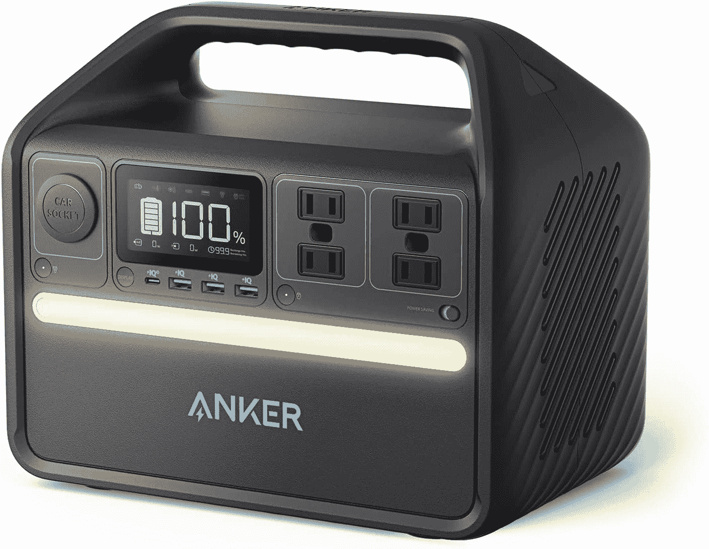

# 2023 年最佳便携式笔记本充电器

> 原文：<https://www.xda-developers.com/best-portable-laptop-chargers/>

# 2023 年最佳便携式笔记本充电器

想要随时随地为您的笔记本电脑充电吗？以下是你可以在旅途中携带的最好的便携式笔记本充电器。

如今，很容易找到适合您需求的笔记本电脑。有许多电脑采用轻薄设计，有些外观独特，笔记本电脑的性能也在不断提高。与此同时，电源效率也在不断提高。我们可以在笔记本电脑上做更多的事情，并让它们使用更长时间。但是，尽管电池续航时间越来越长，有时它还是不足以让你度过漫长的旅程。如果你发现自己需要额外的电力，这里有一些你能为你的笔记本电脑得到的最好的便携式充电器。

一个好的笔记本充电器很大程度上取决于你的需求。一些笔记本电脑比其他的需要更多的电力，一些有 [USB Type-C](https://www.xda-developers.com/best-usb-c-laptops/) 或 [Thunderbolt](https://www.xda-developers.com/best-thunderbolt-4-laptops/) ，而另一些仍在使用筒式充电器。你也可能在特定的情况下寻找某些东西。例如，如果你正在进行为期一周的野营旅行，普通的电源可能不够用。我们在下面讨论了一些用例。

*   ##### Omni charge Omni 20 Plus

    Omni 20+是最通用的便携式笔记本电脑充电器之一。它有 USB Type-A 和 Type-C 端口，Qi 无线充电，DC 输出，甚至还有一个标准的插座插头。这是一个 20，000mAh 的单元，但它可以为一台超极本充电一次。它还包括一个手电筒。

*   它甚至可以充电到 100W，所以它真的很快。
*   ##### Anker 737 电源组

    该套装包括一个便携式充电器-容量为 26，000mAh，功率为 60W 还包括一个壁式充电器，可以为您的笔记本电脑或电源组本身充电，功率为 65W。这是你需要的一切。

*   <picture></picture>

    MAXOAK 笔记本电脑电源组

    ##### MAXOAK 185 wh 笔记本电脑电池组

    我们中的一些人可能有笔记本电脑还没有使用 USB Type-C 进行充电，但随身携带原装电源适配器也不容易。MaxOak 笔记本电脑电源库有一个 50，000mAh 的大电池和 DC 输出，带有 14 个不同的连接器，可与各种旧笔记本电脑配合使用。它可以提供高达 130 瓦的功率。

*   <picture></picture>

    光环螺栓 58830

    ##### 光环螺栓 58830

    如果你在移动，也有一个很好的机会你在驾驶，光环螺栓 58830 已经覆盖了你的所有战线。它有一个巨大的电池，你可以使用交流插座插入你的常规笔记本电脑充电器。它甚至有跳线电缆，让你在紧要关头启动汽车电池。

*   <picture></picture>

    HALO Bolt 44000

    ##### HALO Bolt 44000

    这个其他 HALO Bolt 型号做了一个权衡，如果你也想给手机充电，可能是值得的。它有一个较小的 44，400 毫安时电池，但它包括一个用于手机的无线充电板。它仍然可以为你的笔记本电脑充电，也可以启动你的汽车。

*   <picture></picture>

    Einova 笔记本电脑电源组

    ##### Einova 笔记本电脑电源组

    如果你想要一个既好看又实用的东西，Einova 笔记本电脑电源组是最好的便携式笔记本电脑充电器之一。它的顶部有柔软的亚麻，让它看起来更现代，握起来也更舒适。它只能通过 USB Type-C 充电 45W，但也可以给你的手机充电。

*   <picture></picture>

    Kris donia 60000 mah 交流笔记本电脑电源组

    ##### Kris donia 60000 mah 交流笔记本电脑电源组

    Kris donia 交流笔记本电脑电源组拥有此列表中最大的电池之一，它包括一个交流插座、USB Type-C 和 Type-A。类型

*   <picture></picture>

    Anker 535 便携式电站

    ##### Anker 535 便携式电站

    Anker 535 便携式电站是一个大型设备，但它有一个巨大的 512 瓦时电池和大量的电力可供使用，有四个交流插座，USB-C、USB-A 型和你可以获得 500 瓦的总输出功率，此外它还有一个内置灯。

*   <picture></picture>

    FOVAL 150 w 车载电源逆变器

    ##### FOVAL 150 w 车载电源逆变器

    便携性对每个人来说都有不同的意义，但如果你只是想能够在车里给你的笔记本电脑充电，这将让你做到这一点。这是一种廉价的电源逆变器，可以将汽车的打火机变成交流电源插座，提供高达 110 伏的电源，因此您可以插入大多数类型的笔记本电脑。适用于公路旅行。

*   <picture></picture>

    提仕 HERY 120W 便携式太阳能电池板

    ##### 提仕 HERY 120W 便携式太阳能电池板

    如果你更喜欢使用清洁能源，这款便携式太阳能电池板可以随时随地为你供电。它包括一个适配器，通过 USB-C 为您的笔记本电脑输出 60W，通过 USB Type-A 为您的手机输出 60W。但是你也可以用 DC 的输出给 Anker PowerHouse 这样的电源充电，然后用它给你的设备充电。

*   <picture></picture>

    Voltaic Systems Arc with v 88 Power Bank

    ##### Voltaic Systems Arc 20 瓦便携式太阳能笔记本电脑充电器

    此套装包括一个可折叠的太阳能电池板，还有一个可以用来给笔记本电脑充电的电源组。太阳能电池板为电源组充电，电源组支持为您的笔记本电脑进行直通充电。然而，它只能输出 45W 的功率，因此只有超极本才能从中充电。

我们相信这些选项是你能得到的最好的便携式笔记本充电器。你只需要注意你的笔记本电脑需要多少功率，特别是如果它通过 USB Type-C 充电，因为不是每个充电器输出的功率都一样。如果你想安全起见，你总是可以得到一个类似于 [Omni 20+](https://www.amazon.com/USB-C-Portable-Battery-Laptops-Cameras/dp/B072JWN6LC?tag=xda-18s83k6-20&ascsubtag=UUxdaUeUpU5955&asc_refurl=https%3A%2F%2Fwww.xda-developers.com%2Fbest-portable-laptop-chargers%2F&asc_campaign=Commerce) 的带交流插座的充电器。

就我个人而言，我总是对巨大的 Anker 535 便携式电站着迷。它很贵，但事实上它可以在紧急情况下让你的笔记本电脑充电几天，这太棒了。你甚至可以用它来驱动其他东西。如果你喜欢长时间露营，这是最有用的，但如果你只是想为灾难做准备，这也是很好的。无论你在寻找什么，这份清单上可能有你想要的东西。