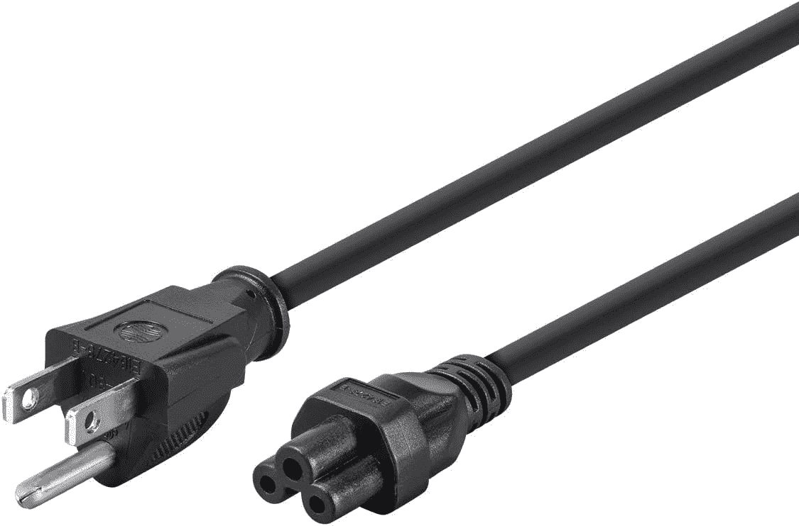
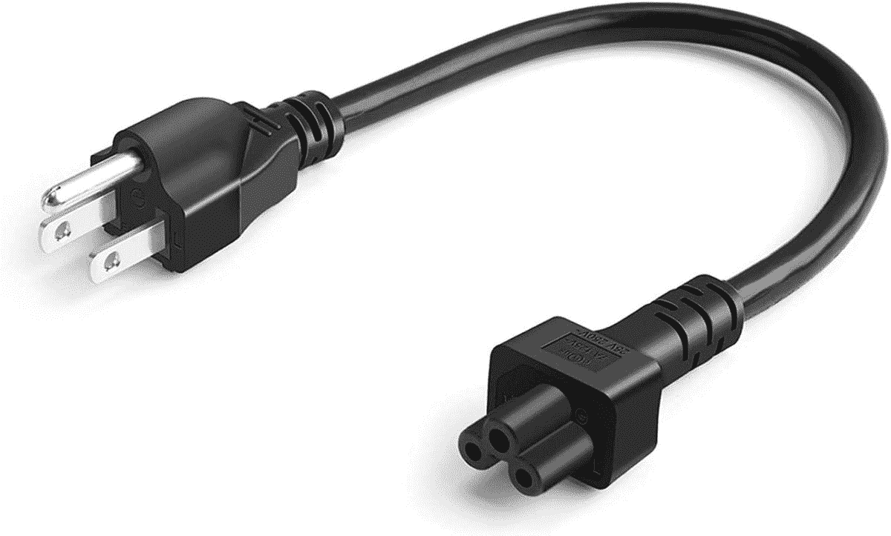
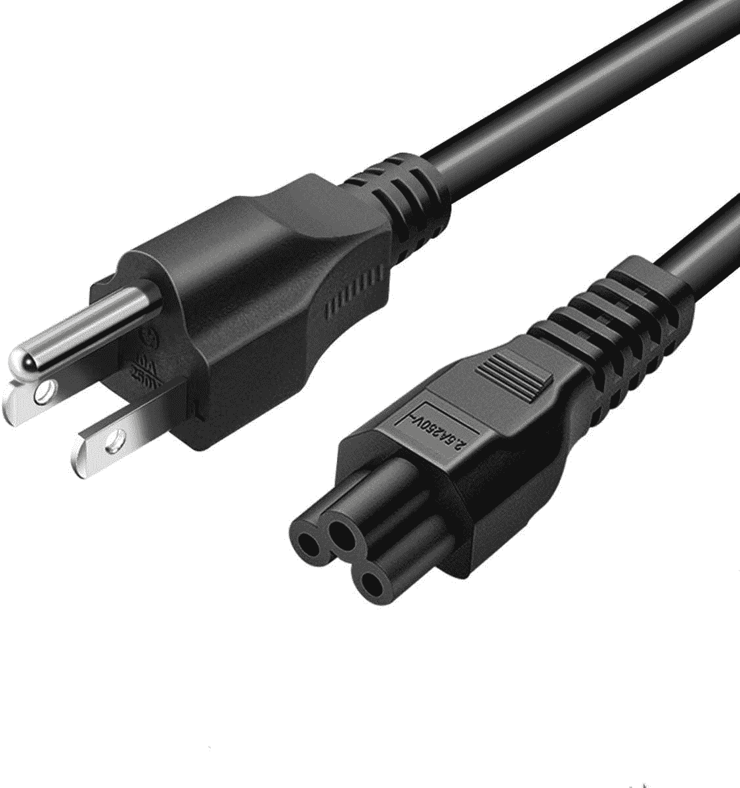
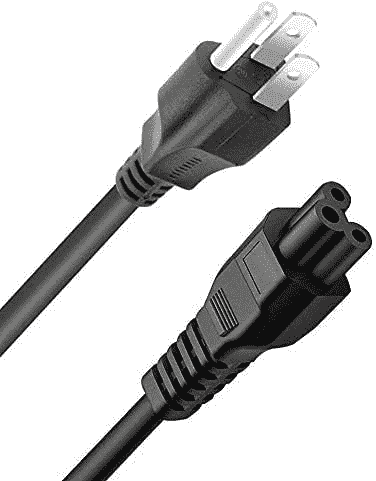
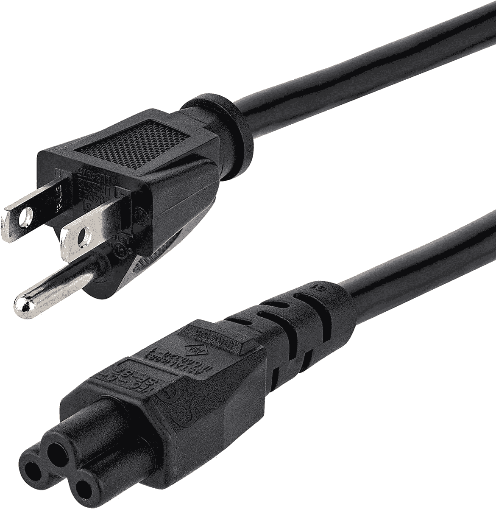

# Apple Mac Studio 的最佳替代电源线

> 原文：<https://www.xda-developers.com/best-power-cables-mac-studio/>

# Apple Mac Studio 的最佳替代电源线

苹果目前不销售 Mac Studio 电源线。以下是你可以在别处找到的最佳替代电源线。

苹果工作室是 T2 最好的苹果电脑之一。它装有 M1 Max 或 M1 Ultra 芯片，支持[MAC OS Ventura](https://www.xda-developers.com/macos-ventura)——使其成为最强大的消费电脑之一。说到 M1 处理器，你绝对应该看看我们的苹果硅 MAC 的[伟大应用列表。这些应用针对这一系列芯片组进行了优化，性能应该非常出色。现在，你可能已经注意到，苹果公司目前并不出售 Mac Studio 的替换电源线。因此，如果你损坏了附带的一个或需要一个备用单元，你将无法得到一个正式的。好消息是 Mac Studio 的电源线不是专有的。因此，虽然你不能从苹果公司买到，但你仍然可以很容易地从其他公司找到替代品。以下是适用于您的 Mac Studio 的最佳电源线列表。](https://www.xda-developers.com/best-apps-apple-silicon/)

## 最佳 Mac Studio 电源线

*   <picture></picture>

    单盘电源线

    ##### 单盘电源线

    这款替代电源线有 3 脚和 6 脚两种选择。它附带终身保修，让您安心。

*   <picture></picture>

    cable creation 电源线

    ##### cable creation 电源线

    这种电缆只有一英尺长。它非常适合那些将 Mac Studio 放在电源插座旁边并且不需要额外长度的人。

*   <picture></picture>

    一根电源线

    ##### 一根电源线

    这根替换电源线也有 6 英尺长。然而，它的价格合理，并有 30 天的保修期。

*   <picture></picture>

    DTK 电源线

    ##### DTK Mac Studio 电源线

    这款替代 Mac Studio 电源线有 10 英尺长。它非常适合那些办公桌上没有电源插座的人。

*   <picture></picture>

    StarTech 电源线

    ##### StarTech 电源线

    这款替换的 Mac Studio 电源线是关于长度的所有选项。你可以买 3 英尺、6 英尺或 10 英尺的版本。它由公司提供终身支持。

* * *

对于不熟悉的人来说，Mac Studio 看起来像两台堆叠的 Mac 迷你电脑。它当然不是针对普通用户的，因为它的性能对于基本的日常需求来说已经足够了。它迎合了那些需要低端 MAC 电脑无法提供的非凡处理能力的专业人士。正如你所料，这台 Mac 不包括屏幕或配件。苹果只在 Mac Studio 盒子中包含电源线。所以你必须自己购买鼠标、键盘、显示器等。幸运的是，Mac Studio 包括各种各样的端口。其中包括 USB Type-A、USB Type-C、SD 卡、以太网、HDMI 等等。因此，你很可能不需要依靠加密狗，码头和适配器来连接你最喜欢的配件。

 <picture></picture> 

Apple Mac Studio

##### 苹果 Mac 工作室

Mac Studio 要么装有苹果 M1 Max，要么装有全新的 M1 Ultra 芯片。它只有银色可选，起价 1999 美元。

*您会为 Apple Mac Studio 购买哪种电源线，为什么？请在下面的评论区告诉我们。*