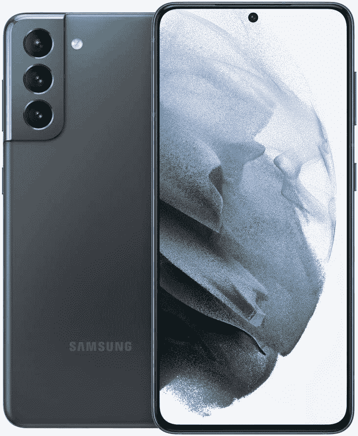
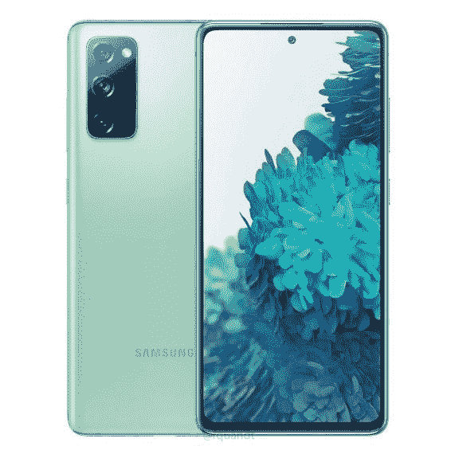

# Galaxy S21、Galaxy S20 FE 和 Galaxy 21 Ultra 的最佳黄金日优惠

> 原文：<https://www.xda-developers.com/best-prime-day-2021-deals-galaxy-21-galaxy-20-fe/>

2021 年亚马逊优惠日到了，惊人的优惠也来了。如果你持有一部旧旗舰，并在寻找替代品，那么[三星 Galaxy S21](https://www.xda-developers.com/samsung-galaxy-s21/) ，Galaxy S20 FE 和 Galaxy S21 Ultra 上的这些交易绝对值得一试。

## 银河 S21

Galaxy S21 可能没有 Galaxy S21 Plus 或 Galaxy S21 Ultra 那么花哨，但对于任何想要旗舰硬件和软件但不在乎曲面显示器或 100 倍变焦的人来说，它都是一款可靠的设备。Galaxy S21 的首发价格为 849 美元，但由于这项 Prime Day 交易，你只需 599 美元就可以买到它。此外，亚马逊奖励 Visa 卡持有者可以获得额外 50 美元的折扣，有效地将价格降至 550 美元。除此之外，你还可以以旧手机折价，进一步降低价格。

 <picture></picture> 

Samsung Galaxy S21 5G

vanilla Galaxy S21 提供了一个 6.2 英寸的 AMOLED 平板显示器，骁龙 888，6400 万像素的主摄像头，30 倍空间变焦，8K 视频录制支持，全天电池续航时间。

## 银河 S20 FE

Galaxy S20 FE 在去年问世时大受欢迎，赢得了网络上所有人对 T4 的好评。它拥有你对一款真正的旗舰产品所期望的一切:华丽的 120Hz AMOLED 显示屏，功能强大的摄像头，强大的骁龙 865 SoC，以及 4500 毫安时的大电池。唯一坚持的是它的塑料构造，考虑到它的价格，这不是一个大问题。这个黄金日，Galaxy S20 FE 降至 479 美元，比正常零售价 700 美元低 220 美元。

 <picture></picture> 

Samsung Galaxy S20 FE

##### 三星 Galaxy S20 FE

Galaxy S20 FE 以实惠的价格提供了让 Galaxy S20 如此出色的一切。

## 银河 S21 Ultra

Galaxy S21 Ultra 是三星目前提供的最强大和功能最丰富的手机，具有 6.8 英寸的超大曲面显示屏，108MP 的主摄像头和 100 倍的空间变焦，以及强大的骁龙 888 芯片。Galaxy S21 Ultra 碰巧也是 Galaxy S21 系列中最贵的，通常售价高达 1200 美元。如果天文数字般的高价格让你犹豫不决，你会很高兴地知道，在这个黄金日，你可以只花 899 美元买到这只野兽，比原价整整低了 300 美元。

 <picture></picture> 

Samsung Galaxy S21 Ultra

Galaxy S21 Ultra 专为终极超级用户打造。它结合了惊人的 LTPO 显示与同样惊人的 cameara 设置。