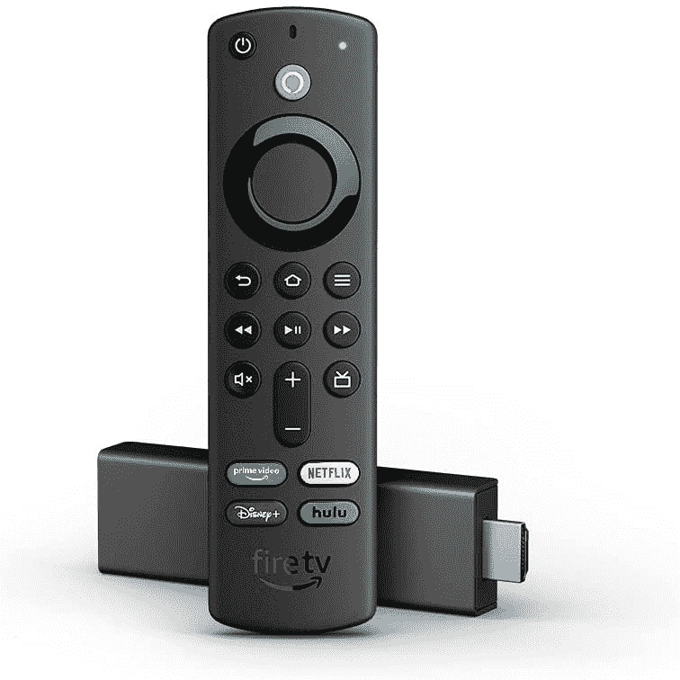
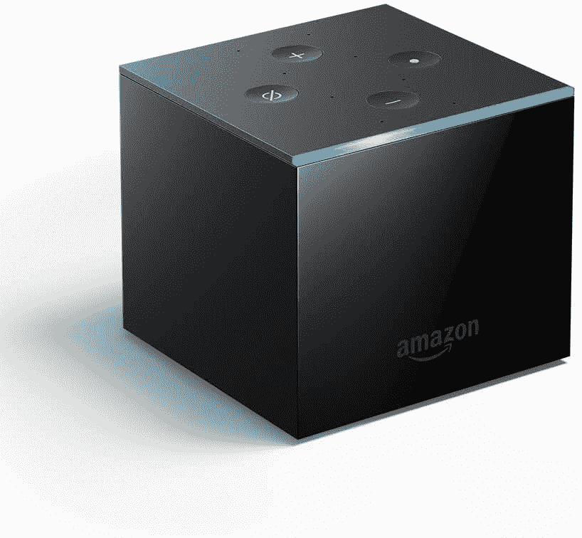

# 消防电视彩带和消防电视的最佳黄金日交易

> 原文：<https://www.xda-developers.com/best-prime-day-fire-tv-deals/>

[亚马逊 Prime Day](https://www.xda-developers.com/amazon-prime-day/) 是购买亚马逊产品的最佳时间。今年也没有什么不同，因为这家电子商务巨头正在为从 Kindle 电子阅读器和 Fire 平板电脑到 [Echo 设备](https://www.xda-developers.com/amazon-echo-prime-day-deals-roundup/)和 Fire 电视设备的所有产品提供大折扣。Echo 第四代目前打六折， [Kindle 电子阅读器降到了最低价格](https://www.xda-developers.com/kindle-paperwhite-11th-gen-paperwhite-signature-edition-prime-day-deal/)，而 [Echo Dot 的售价仅为 20 美元](https://www.xda-developers.com/echo-dot-prime-day-deal/)。亚马逊还大幅削减了 Fire TV streamers 和 4K Fire TV 的价格。以下是你不想错过的最佳消防电视交易。

## 消防电视棒的最佳交易

如果你想用流媒体智能提升你的电视或显示器，Fire 电视棒是你最好的选择。你可以以非常便宜的价格买到一个，因为所有的型号都便宜 50%以上。如果你有一台 4K 电视或显示器，Fire TV Stick 4K 和 Fire TV Stick 4K Max 是最佳选择。这两款流媒体加密狗都支持 4K HDR 以 60fps 的速度播放流媒体，并支持杜比视界和 HDR10。Fire TV Stick 4K Max 的 CPU 和 GPU 略快，RAM 更多，但除此之外，两者非常相似。

 <picture></picture> 

Fire TV Stick 4K

##### 亚马逊 Fire 电视棒 4K

支持杜比视界的 Fire 电视棒 4K 售价 24.99 美元

 <picture></picture> 

Fire TV Stick 4K

##### 亚马逊 Fire 电视棒 4K

Fire TV Cube 半价出售，只需 59.99 美元就可以成为你的了。

 <picture></picture> 

Fire TV Stick 4K

##### 亚马逊 Fire 电视棒 4K

带有 1080p 流媒体和杜比原子支持的 Fire 电视棒价格降至 16.99 美元。

那些想要不仅仅是流媒体的人可以考虑 Fire Fire 电视棒上的 Fire TV Cube。Cube 结合了 Fire 电视棒和 Echo 扬声器的功能，比所有四个流媒体加密狗都更强大，并有八个用于免提 Alexa 的远场麦克风。

## 4K 消防电视的最佳交易

 <picture></picture> 

Amazon Fire TV 43-inch 4-series 4K smart TV

##### 亚马逊 Fire TV 43 英寸 4 系列 4K 智能电视

亚马逊 Fire 电视 43 英寸目前打 46 折。只需 199.99 美元就能买到。