# 2023 年最佳 PlayStation 5 游戏

> 原文：<https://www.xda-developers.com/best-ps5-games/>

PlayStation 5 已经真正到来了，已经快一年了，有几款独家游戏。如果你已经足够幸运地得到了新的游戏机，那么这里有你应该玩的游戏。

像它的竞争对手 Xbox Series X/S 一样， [PlayStation 5](https://www.xda-developers.com/sony-playstation-5-first-impressions/) 是一款功能强大得令人难以置信的主机，你可以在上面玩一些有史以来最快、最漂亮、要求最高的游戏。PS5 拥有 SSD 存储以减少加载时间，一个错综复杂的冷却系统，以及一个新的控制器(DualSense ),具有有史以来最好的触觉反馈系统之一。它可能没有一些[最好的游戏笔记本电脑](https://www.xda-developers.com/best-gaming-laptops/)那么强大，但也差不多了。

PS5 还推出了一些独家游戏，自游戏机上市以来，又推出了几款游戏。 [Xbox Series X/S](https://www.xda-developers.com/xbox-series-s-review/) 游戏通常没有独占(虽然主机会有一些独占即将到来)，而任天堂 Switch 游戏几乎什么都没有，只有独占。这个列表是 PS5 独占游戏、PS4 游戏和在新主机上看起来很棒的游戏的混合。

## 阿童木的游戏室

任何 PS5 新主人拿到新主机后应该玩的第一个游戏是 *Astro 的游戏室*，该游戏随主机免费提供。它旨在为用户提供使用新的[双感控制器](https://www.xda-developers.com/sony-dualsense-wireless-controller-preview/)的完整体验。每一关都会给你机会来测试 DualSense 的触觉触发器和其他功能。

除了游戏的技术上的伟大，它也是一个真正有趣，丰富多彩，令人愉快的游戏。你探索的世界是 PS5 内部硬件的卡通版本，你收集的各种物品实际上都是索尼生产的硬件。这是一次可爱的怀旧之旅，尤其是如果你以前拥有过 PlayStation 游戏机的话。

## 恶魔的灵魂

PS3 经典游戏*恶魔之魂*的翻拍版将软件游戏的残酷难度带到了下一代。如果你以前从未玩过 From 游戏，这是一个很好的入门游戏——不是因为它容易，而是因为它不容易。除了游戏性，游戏在 PS5 上也很好看。游戏机上的大气环境看起来不错，并且没有长时间的等待使游戏不那么令人沮丧。如果你想玩发明了类灵魂类型的游戏，也想看看你的 PS5 有什么能力，这就是你想要的游戏。

 <picture>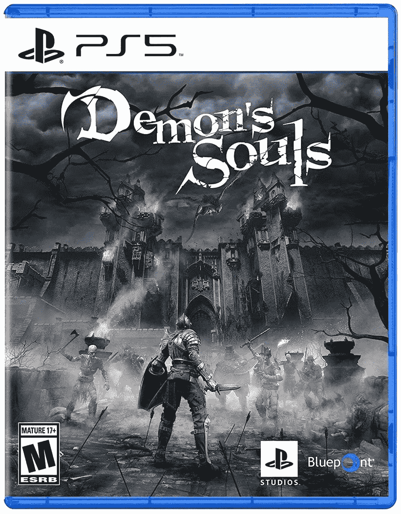</picture> 

Demon's Souls for PS5

##### 恶魔的灵魂

你将在 PlayStation 5 上玩的最艰难的游戏之一，恶魔的灵魂是软件游戏中的经典。

## 蜘蛛侠:迈尔斯·莫拉莱斯

漫威的蜘蛛侠是 PS4 上最好的游戏之一——在 PS5 上看起来仍然不错。但如果你想要完整的下一代体验，比如当你在纽约市闲逛时能够感受到网络摄影师，那么你需要出演这部准续集，由彼得的继任者迈尔斯·莫拉莱斯主演。迈尔斯有很多彼得在原游戏中没有的动作，这要归功于他的电动超能力。这个游戏比第一个要短一些，但它仍然是一个有趣的游戏，它有一个丰富多彩的角色阵容，迈尔斯可以与他们互动。

 <picture>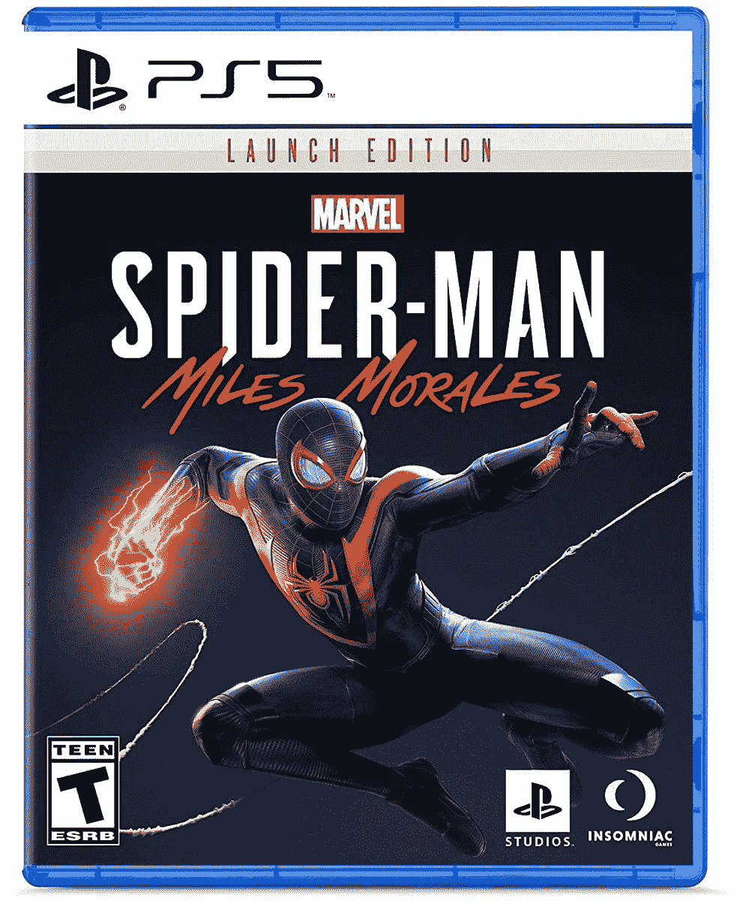</picture> 

Spider- Man: Miles Morales

##### 蜘蛛侠:迈尔斯·莫拉莱斯

与下一代蜘蛛侠迈尔斯·莫拉莱斯一起回到纽约，他试图阻止一系列恶棍破坏纽约。

## 棘轮和叮当:裂缝分开

索尼的长期专营权之一，棘轮和 Clank 从来没有比他们在最新的冒险中看起来更好。他们的老对手邪恶博士偷了一件打开其他维度裂缝的武器，这取决于棘轮，叮当和棘轮的另一个维度对应铆钉来阻止他。

*Rift Apart* 基本上是为了展示 PS5 的固态硬盘的威力，这意味着你可以在没有负载减慢你的速度的情况下跳过裂缝。这也是 PS5 上更适合孩子玩的游戏之一。

 <picture></picture> 

Ratchet & Clank: Rift Apart

##### 棘轮和叮当:裂缝分开

PlayStation 历史最长、适合儿童玩的系列游戏之一的最新游戏《裂缝分离》(Rift Apart)中，棘轮和叮当在多维空间中跳跃。

## 最终幻想 7 翻拍

《最终幻想 7》的翻拍版于 2020 年 4 月在 PlayStation 4 上推出，受到了系列粉丝的好评和欢呼。*最终幻想 7 翻拍版*将云与公司的故事进行了全新的演绎。2021 年，Square Enix 在 PlayStation 5 上推出了这款游戏，并增加了一些新内容——一个幕间休息章节，讲述了由尤菲·如月主演的游戏的事件。这个名为 Intergrade 的新版本也给了游戏一个下一代升级。

 <picture>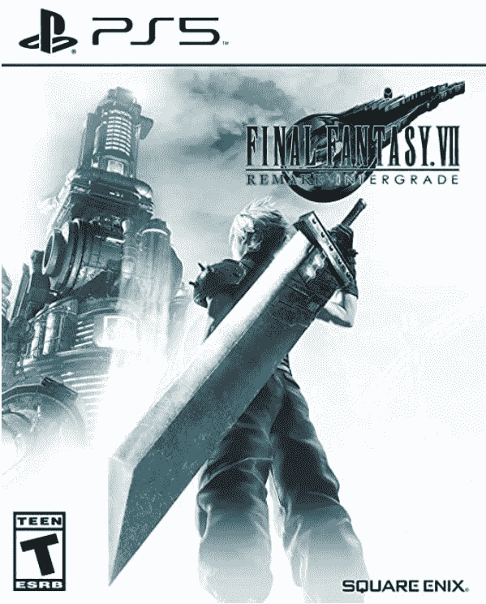</picture> 

Final Fantasy VII Remake Intergrade

##### 最终幻想 7:翻拍

经典《最终幻想》的下一代重拍版中有一章是尤菲的幕间休息。

## 刺客信条:瓦尔哈拉

《刺客信条》*系列已经有十多年的历史，旗下有十几款游戏，并且还在继续扩展和改进。最新的《瓦尔哈拉》( Valhalla )( T9)是一部维京冒险片，由战士艾沃(Eivor)主演，他在袭击英格兰时卷入了刺客和圣殿骑士之间的永恒冲突。PS5 的 GPU 让英国乡村看起来令人惊叹，游戏也像以往一样流畅。虽然这个游戏是一个典型的育碧冒险，但如果你以前从未玩过刺客信条游戏，它也是一个很好的切入点。*

 <picture>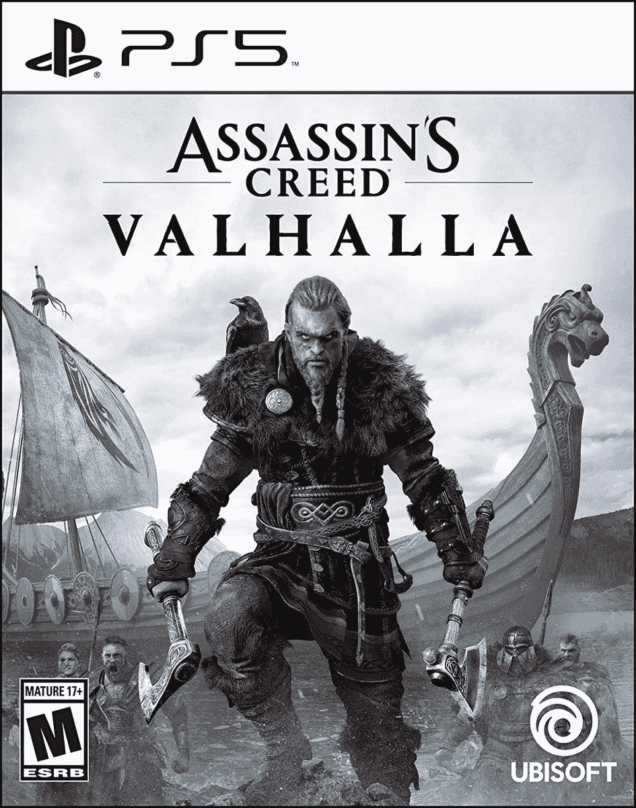</picture> 

Assassin's Creed Valhalla

##### 刺客信条瓦尔哈拉

与刺客信条瓦尔哈拉一起进行另一次历史之旅，这是一次维京冒险，它将带你走遍不列颠群岛。

## 战神

战神是成熟、忧郁的克瑞托斯的最新冒险，他以前是希腊战神，他和他的儿子阿特柔斯开始了漫长的旅程，让他们的妻子和母亲安息，这不知何故导致了一场史诗般的探索，让古代诗歌相形见绌。与所有游戏一样，它不仅在 PS5 上看起来更好，而且玩起来也更流畅。如果你还没有玩过它，它是 PS Plus 系列的一部分，一组提供给 PS5 用户的 PS4 经典也订阅了 PlayStation Plus。

 <picture>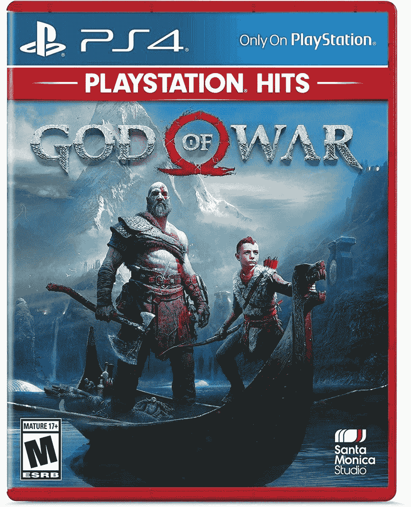</picture> 

God of War

##### 战神

臭名昭著的暴力系列发生了严重的转折，因为克瑞托斯加入了北欧万神殿，并和他的儿子一起去冒险。

## 退货

这款 PlayStation 独占有很多不同的流派名称——是一款类似 roguelike 的科幻第三人称射击游戏。你可能无法从预告片中发现的是 *Returnal* 也是一款恐怖游戏，而且相当有效。这是对 PS5 硬件的巨大考验，也不是一个容易掌握的游戏——缺乏保存功能对游戏玩家来说是一个如此大的问题，以至于他们恳求开发者添加一个。但是如果你想要一款对 PS5 来说稍微严肃一点的游戏，这就是你的游戏。

 <picture>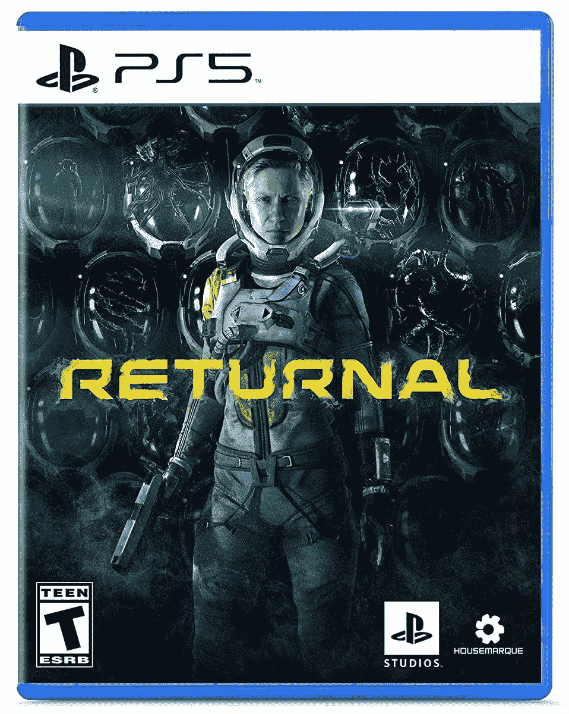</picture> 

Returnal

##### 退货

这个科幻的 roguelike 标题是你将在 PS5 上玩的最难的游戏之一，也是你必须尝试的低调恐怖体验。

## 对马导演剪的鬼

*对马岛幽灵*是一个关于金酒井的宏大故事，他是一名贵族武士，为了从入侵的蒙古人手中拯救他的家乡对马岛，他必须成为一名新生的忍者。如果你是第三人称动作冒险或日本历史的粉丝，这是一个有趣的游戏。这款游戏最初是在下一代产品发布前不久在 PS4 上发布的，但直到最近才升级到 PS5。这款名为《导演剪辑》的游戏改进了画面，并在附近的 Iki 岛上增加了新的资料片。

 <picture>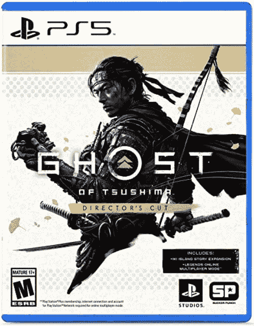</picture> 

Ghost of Tsushima's Director's Cut

##### 对马导演剪的鬼

这款游戏是一个历史冒险，讲述了一个武士变成忍者的故事，他的任务是驱逐入侵者。

## 我们最后的人第二部分

作为 PlayStation 最成功的游戏之一的续集，*我们最后的人第二部分*讲述了一个关于有缺陷的人试图在不可能的情况下生存的悲惨故事。明星埃莉是一个你既爱又不舒服的角色，她周围的角色也好不到哪里去。该游戏也是一款紧张、令人恐惧的恐怖动作游戏，不会让你过于放松，它在 PS5 上看起来比其他任何地方都好。

 <picture>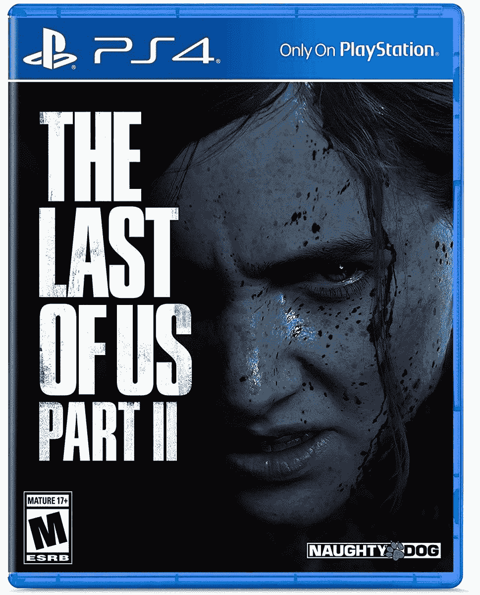</picture> 

The Last of Us Part 2

##### 我们最后的人第 2 部分

一个悲惨的恐怖游戏,《我们最后的人》续集讲述了艾莉在这个阴郁的后世界末日的世界里横冲直撞的故事。

## Bugsnax

这款好奇的小游戏让玩家扮演一名记者，生活在一个充满布偶一样的生物的世界里，这些生物被囚禁在一个岛上，岛上住满了看起来像食物的动物。当格鲁普斯人吃了有名无实的 Bugsnax 时，他们身体的一部分变得和他们刚吃的东西一样。

我刚才描述的听起来非常卡通和愚蠢，但不要让彩色的图形欺骗了你——这个游戏是一个冒险/恐怖的混合体，如果它稍微暗一点，就会完全适合一个爱情故事。它可能不会对 PS5 的硬件造成负担，但它是一个令人愉快的游戏，非常适合那些可能没有足够时间玩更长游戏的人。

 <picture>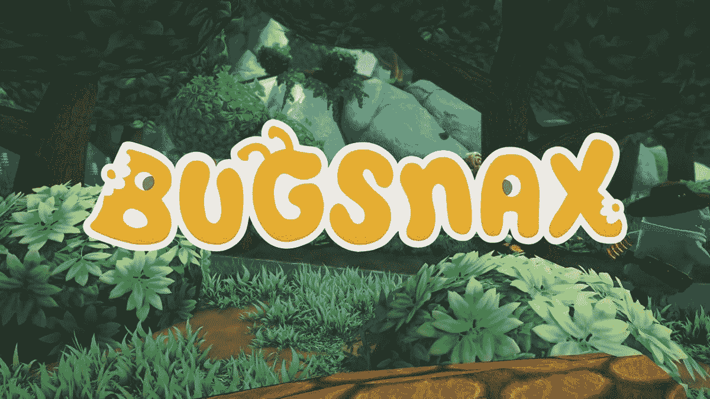</picture> 

Bugsnax

##### Bugsnax

Bugsnax 是一个可爱的冒险/恐怖混合体，非常适合那些不喜欢很长故事情节的人。

## 角色 5 皇家

人物角色角色有点古怪。你扮演高中生，他们用自己的角色，隐藏的个性来打架。在*角色 5* 中，你扮演幽灵小偷，可爱的流氓试图从他们周围的人心中偷走坏情绪——是的，这是一个描述起来很奇怪的游戏。但也很有吸收力，很过瘾，人物都很棒。

*Persona 5 Royal* 是一个更新的重新发布版本，为游戏添加了许多新内容，如果你喜欢 RPG，这是 PS5 的必玩游戏。

 <picture>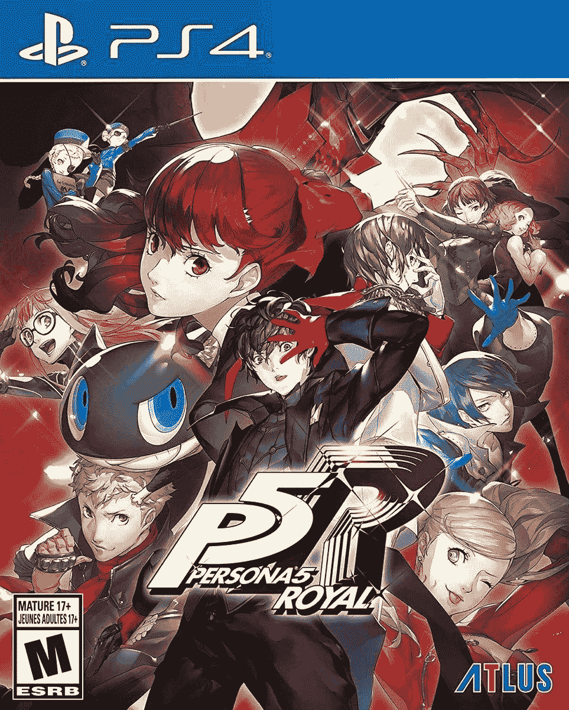</picture> 

Persona 5 Royal

##### 角色 5 皇家

在这款古怪的 RPG 游戏中跟随幻影盗贼的冒险，这是 PlayStation 游戏机的最佳选择之一。

## 神秘海域 4:小偷的末日

内森·德雷克的最后一次大冒险(至少目前如此)跟随他，他试图和他不再迷失的兄弟一起寻找一个失落的宝藏。所有*未知*游戏的设计都充分利用了 PlayStation 的图形，非常具有全景相机角度的电影冒险，这款游戏在 PS5 上比在 PS4 上看起来更好。这是一次激动人心的冒险，是 PS5 上的 PlayStation Plus 订户在 PS Plus Collection 上免费获得的一次冒险。

 <picture>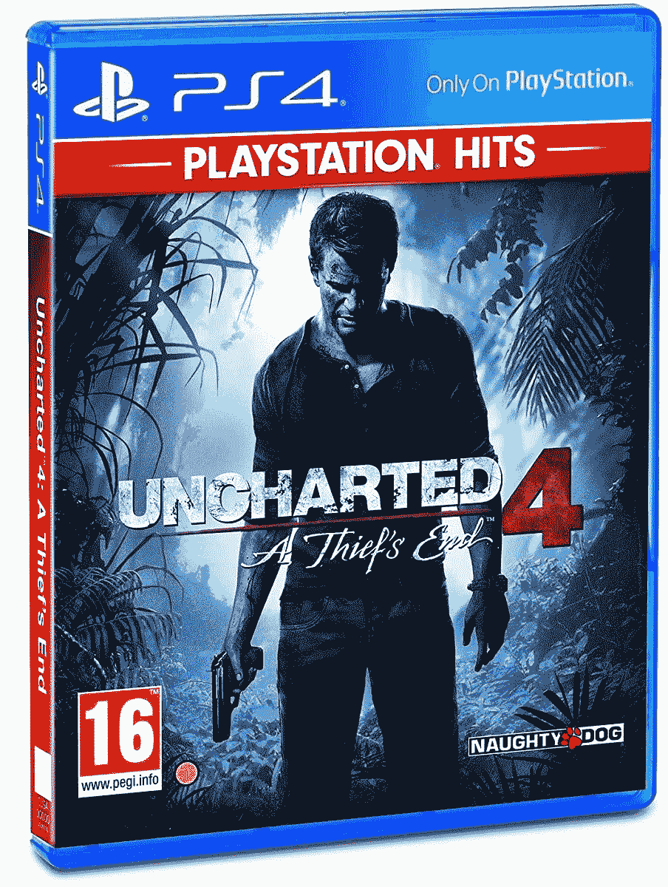</picture> 

Uncharted 4: A Thief's End

##### 神秘海域 4:小偷的末日

内森·德雷克总是擅长冒险，在《神秘海域 4》中，他正在寻找海盗宝藏。这是任何 PlayStation 游戏玩家的必玩游戏。

## 生化危机村

长篇*生化危机*系列的最新作品*村*讲述了该系列中可能最露骨、最有趣的故事。伊森·温特斯回来了，他在一个孤独、与世隔绝的欧洲村庄寻找他失踪的女儿。他发现的可能是迄今为止该系列中出现的最奇怪的感染人群。所以伊森必须击退像狼人和吸血鬼这样的怪物，这既是一个愉快又可怕的冒险，也是 PS5 必玩的恐怖游戏之一。

 <picture>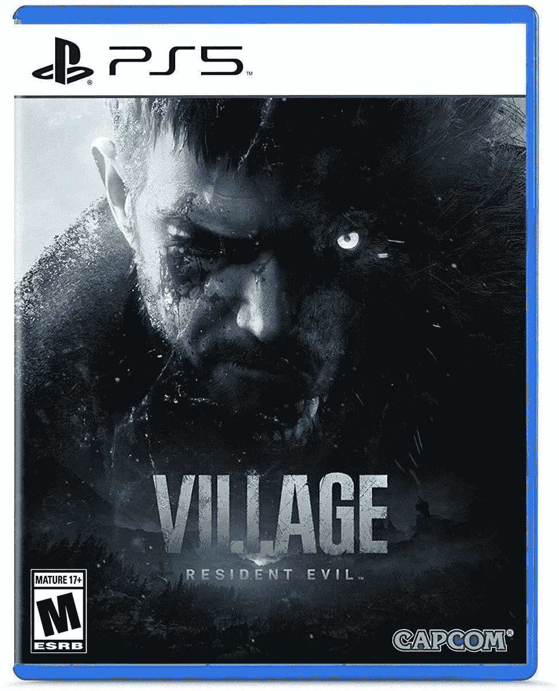</picture> 

Resident Evil Village

##### 生化危机村

最新的《生化危机》游戏是 PS5 上最好的恐怖游戏之一，讲述了一个关于狼人和吸血鬼的伟大的故事。

## 地平线零黎明

索尼最近宣布将在今年晚些时候将《地平线零黎明》的续集《T2》和《地平线禁忌西部》带到 PS5 上。所以现在是在 PS5 上玩美丽的冒险游戏来赶上这个系列的最佳时机。一款一开始就吸引了玩家的游戏， *HZD* 是一个后世界末日的故事，在这个故事中，人类作为主导物种被巨大的、类似动物的机器取代。这是 PS4 上的必玩游戏，也值得在 PS5 上再看一眼。

 <picture>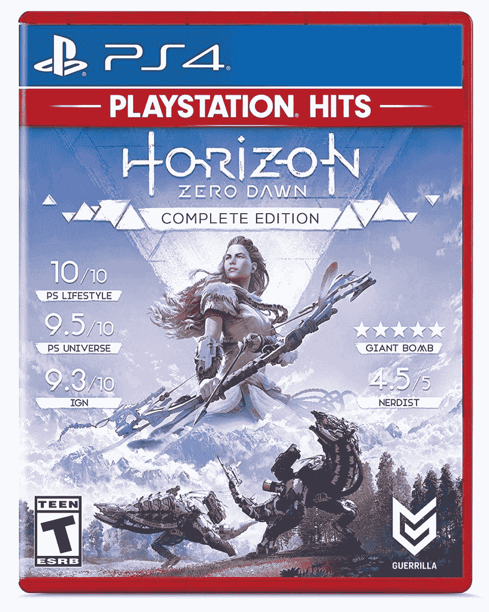</picture> 

Horizon Zero Dawn

##### 地平线零黎明

作为 PlayStation 的经典之作，《地平线零黎明》讲述了阿洛伊试图在一个充满巨型机器的世界中寻找答案的冒险故事。

## WRC 9

赛车游戏总是对新主机硬件的巨大考验——从设计上来说，它们需要高帧率、低到不存在的加载时间和高视觉保真度。 *WRC 9* 提供了所有这些，它很好地利用了 DualSense 的触觉反馈，比该平台上的任何其他赛车游戏都更好。

赛车游戏并不是每个人都喜欢的，但有几款适合该平台，而 *WRC 9* 是目前最受欢迎的一款，尽管当*gt 赛车 7* 发布时，这种情况可能会发生变化。

 <picture>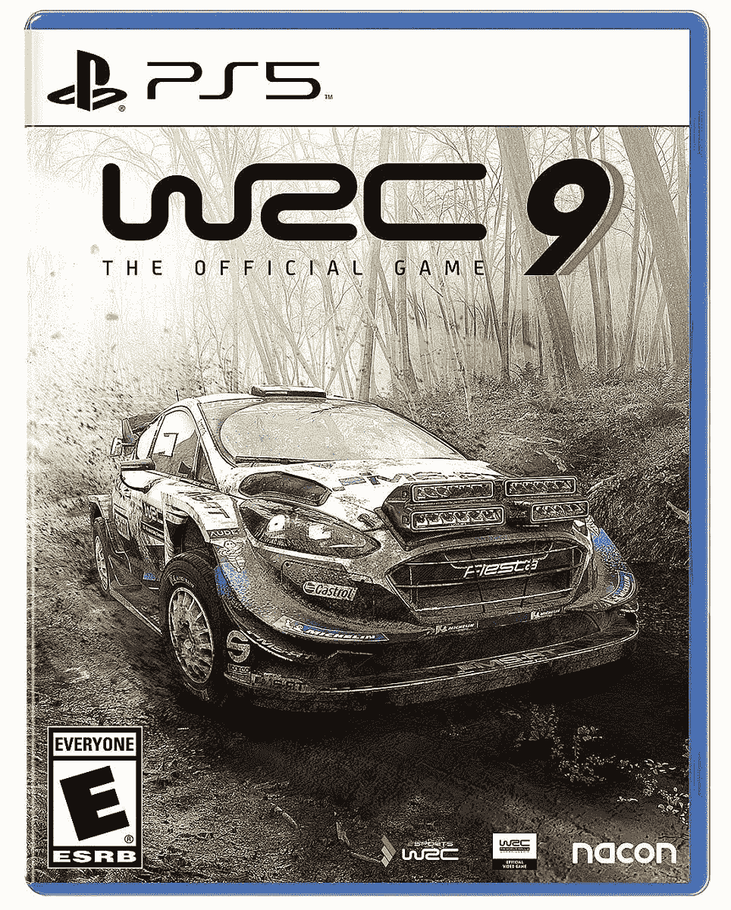</picture> 

WRC 9

##### WRC 9

PS5 的最好的赛车游戏之一，WRC 9 是最好的游戏之一，玩双重感控制器。

## 瘟疫故事:天真无邪

《瘟疫故事:天真无邪》是一部以 14 世纪的法国为背景的恐怖冒险片，由两个被围困的孤儿主演——其中的小儿子拥有控制鼠疫老鼠的神秘能力。与游戏机上的其他恐怖游戏不同，主角雨果和阿米西亚在常规战斗中不是对手的对手，所以他们必须使用雨果的神秘力量来通过他们的障碍。该游戏于 2021 年 7 月面向包括 PS5 在内的次世代主机推出。

 <picture>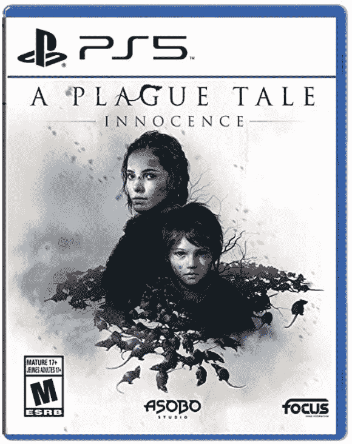</picture> 

A Plague Tale: Innocence

##### 瘟疫故事:天真无邪

这个恐怖片头以百年战争这个鲜为人知的时间段为背景，跟随两个运气最差的孩子。

## 地狱

很少有罗格里克斯能像哈迪斯那样吸引非粉丝。游戏以希腊的地下世界为背景，由有名无实的地狱之神的儿子扎格列欧斯主演，他在一些亲戚的帮助下试图逃跑。游戏性、角色设计和配音都非常出色，使游戏在同类游戏中脱颖而出。*哈迪斯*于 2021 年 8 月在次世代主机上推出。

 <picture>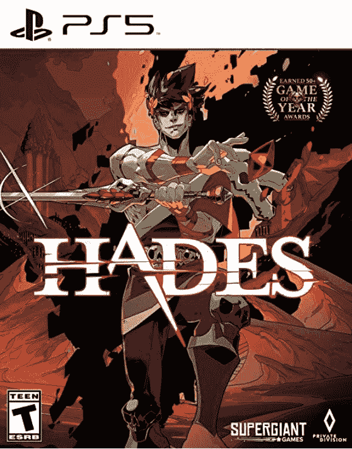</picture> 

Hades

##### 地狱

哈迪斯是一个发生在希腊神话世界的类似罗格的故事，由试图逃离冥界的神之子主演。

随着 PlayStation 5 在市场上越来越多，越来越多的人能够购买这款难以捉摸的游戏机，这个列表只会越来越长。有许多其他伟大的跨平台版本在 PS5 上玩起来很有趣——查看我们的[最佳 Xbox 系列 X/S 游戏](https://www.xda-developers.com/best-xbox-games/)列表，其中有几个游戏也可以在 PS5 上玩。如果你是一个手机游戏玩家，我们有[优秀安卓游戏](https://www.xda-developers.com/best-android-games/)和[最佳 Switch 游戏](https://www.xda-developers.com/best-nintendo-switch-games/)的列表。如果你更喜欢尝试 PC 游戏，有许多优秀的[廉价游戏笔记本电脑](https://www.xda-developers.com/best-cheap-gaming-laptops/)可供选择。