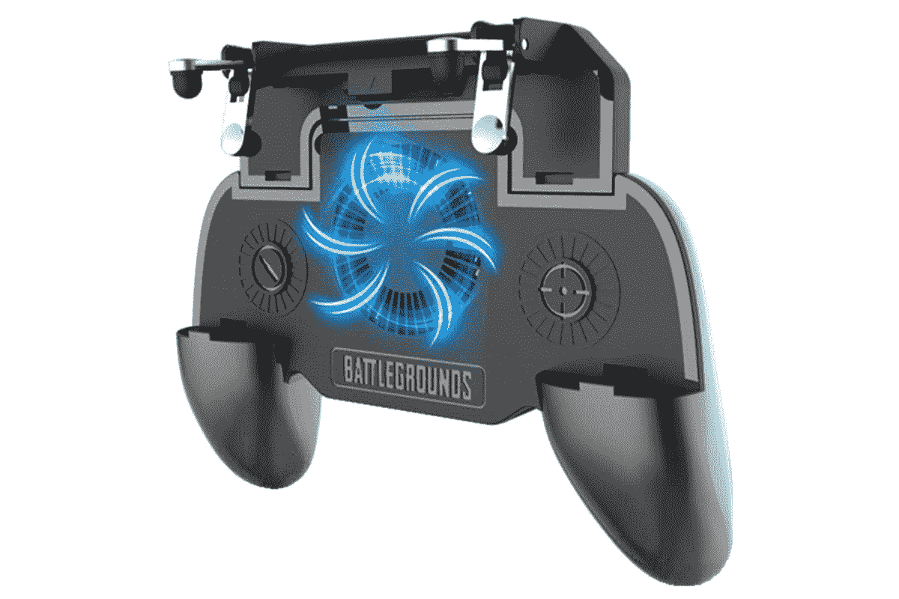
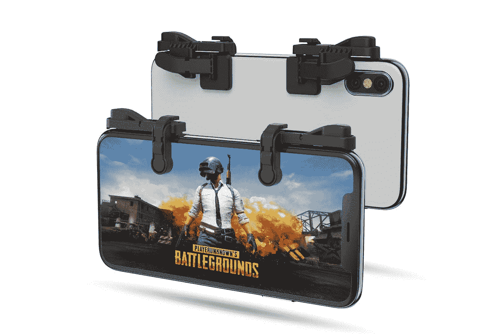
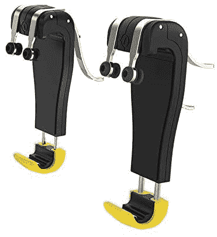
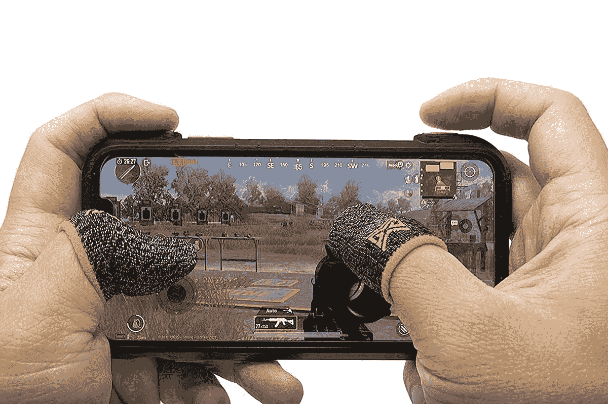
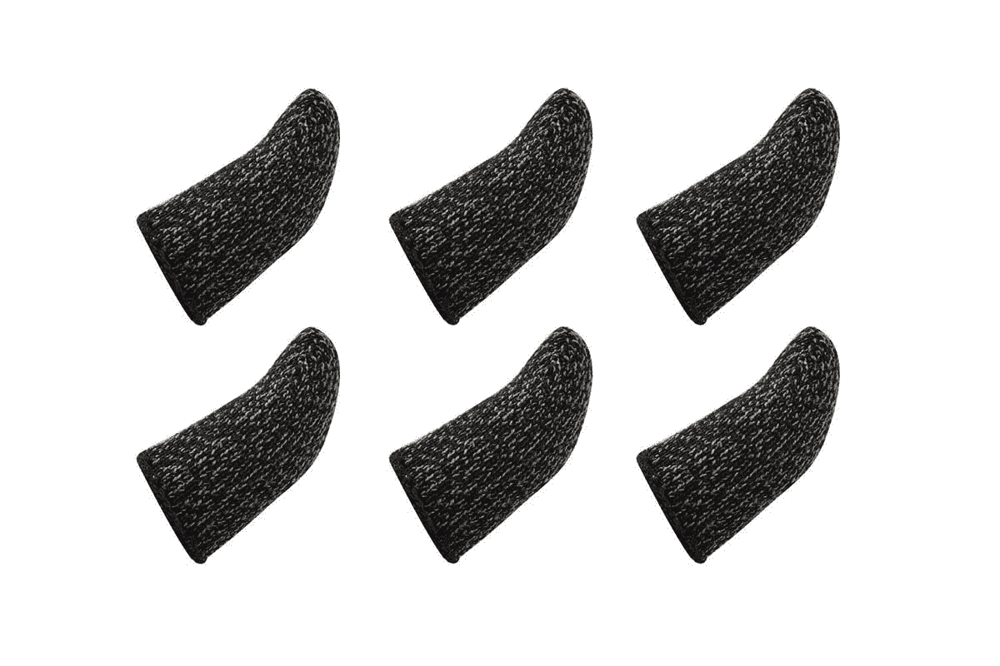
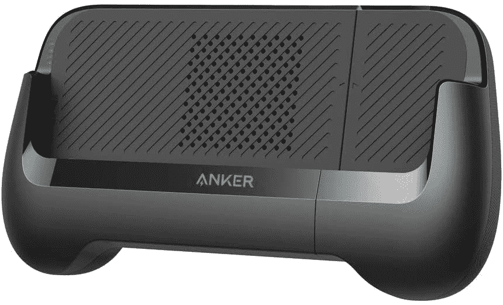
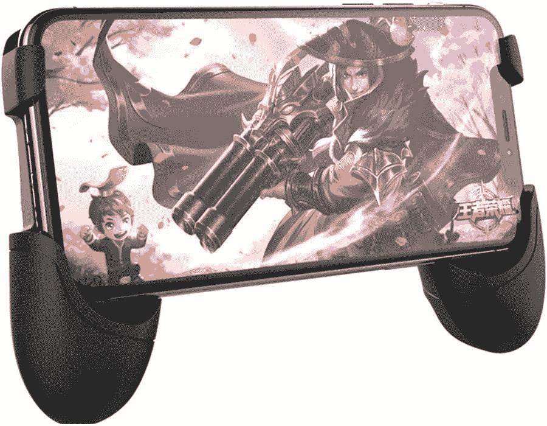

# 2023 年最佳 PUBG 手机配件选项

> 原文：<https://www.xda-developers.com/best-pubg-mobile-accessories/>

PUBG Mobile 仍然是全球顶级手机游戏之一。它有一个庞大的社区，有专业组织的比赛，这使它成为近年来最大的电子竞技冠军之一。虽然由于去年印度禁止某些中国应用程序，这款游戏失去了很大一部分用户群，但它仍然拥有来自世界各地的大量观众。PUBG 的最初创造者 Krafton 最近宣布，一款名为 [Battlegrounds Mobile India](https://www.xda-developers.com/battlegrounds-mobile-india-teaser/) 的特别印度版游戏正在开发中，这可能意味着这款受欢迎的手机游戏《皇室战争》在印度粉丝中的回归。

现在，如果你是一个狂热的玩家或游戏新手，并想测试你的技能，那么我们有一些强烈推荐的插件供你尝试。我们已经包括了一些控制器和触发器选项，以及一些指套，如果你喜欢使用爪抓。

### PUBG 移动控制器

在我们继续之前，请允许我们打破你的幻想。PUBG Mobile 并不正式支持 Android 或 iOS 上的任何蓝牙控制器。然而，你可以使用[螳螂游戏手柄应用，](https://www.xda-developers.com/mantis-gamepad-keymapper-app/)这是一款安卓键盘映射工具，声称可以保护你免受封禁，并承诺兼容几乎所有安卓游戏。最棒的是，你不需要启动你的设备就能让它工作，而且它在谷歌 Play 商店上是正式可用的。

此外，您还可以尝试在 PC 上使用模拟器。通过这样做，您可以使用模拟器本身轻松地映射所有控件。这种方法的唯一缺点是你只能和其他使用模拟器的玩家匹配，而不能和在触摸屏上玩的玩家匹配。说到这里，我们列出了一些[最好的模拟器](https://www.xda-developers.com/pubg-mobile-emulator/)，你可以用它们在你的 PC 上玩 PUBG Mobile。如果你打算走这条路，我们建议你使用 Xbox One 无线控制器。

 <picture></picture> 

Xbox One Controller

##### 微软 Xbox One 控制器

Xbox One 控制器是玩 PUBG Mobile 的最佳选择，但前提是你在 Windows PC 上使用模拟器

### PUBG 移动触发器

现在又有一种流行的智能手机配件可以帮助你提高游戏性。触发控制器和附件可以挂在你的手机上，提供多达 2-4 个功能的物理按钮。你所需要做的就是将触发器连接到你的手机上，然后将游戏设置中的控件对齐，以匹配每个触发器的位置。本质上，这些触发器只需点击手机的触摸屏，但添加了物理肩部按钮，以获得更直观的体验。这些相当便宜，并提供各种形状和大小。我们推荐 COOBILE 游戏手柄，它在游戏手柄式的底盘上提供了两个触发器。它包括一个内置风扇，可以让你的手机保持凉爽，甚至可以用内置的 4000 毫安时电池为你的手机充电。如果你不想给你的智能手机增加很多体积，那么你也可以尝试 IFYOO 或 Popman 的独立触发器。这些触发器可以简单地夹在你的智能手机的肩钮上。触发控制器确实有一个学习曲线，但如果你习惯了在一个有肩按钮的游戏手柄上玩，那么你应该很快适应。

 <picture></picture> 

COOBILE Gaming Grip

##### 酷比游戏手柄

这是一个控制器风格的设计，有两个触发器，一个内置风扇和一个给手机充电的电池。

 <picture></picture> 

IFYOO Z108 Mobile Gaming Controller

##### IFYOO Z108 手机游戏控制器

这些是简单的触发器，连接到你的手机上，在玩 PUBG Mobile 时提供肩式按钮。

 <picture></picture> 

Popman Mobile Game Controller

##### Popman 手机游戏手柄

这些移动肩部触发器可以简单地夹在您的智能手机上，并提供多达四个触摸点，允许您将多达多种功能映射到肩部按钮。

### 指套

汗手妨碍了你的表演？那么你需要一些指套。它们可能看起来和听起来都很可笑，但是它们非常有效。这对使用三指和四指爪抓的球员来说非常好，因为它们提高了灵敏度和性能。我们推荐的是移动游戏军团 ClawSocks。这些产品共有六个袖子，采用 100%银线，具有最高的导电性。他们还声称有助于克服潮湿，汗水，污垢和石油。如果你想要一个更实惠的选择，那就去买 Newseego 手机游戏手柄手指套吧。这些也有类似的六个袖子，表面稍差。

 <picture></picture> 

Mobile Gaming Corp Clawsocks

##### 移动游戏公司克劳索克斯

这些是最好的和高度评价的手指套，在玩 PUBG Mobile 时提供更高的精确度和灵敏度。

 <picture></picture> 

Newseego Mobile Game Controllers Finger Sleeve

##### Newseego 手机游戏控制器手指套

如果您正在为手机游戏寻找价格实惠的竞争性手指套，请选择这些手指套。

### 手机支架

 <picture></picture> 

Anker PowerCore Play 6K

有时候你只是需要一个手柄或支架来让你的智能手机在玩 PUBG 时获得更好的控制，特别是如果你习惯用控制器或游戏手柄玩的话。有 Sunchi 通用手机游戏操纵杆，支持 13 厘米至 16 厘米的智能手机，并具有适当的间隙，用于连接充电器或耳机。手柄后面还有一个支架，这样你就可以在观看内容时将其支撑在桌子上。另一个有趣的产品是 Anker PowerCore Play 6K，这也是一个底部有把手的标准智能手机支架。它还可以作为一个电源银行，因为它内置了一个 6700 毫安时的电池来为你的手机充电。它还配有一个风扇，可以在长时间的游戏过程中保持智能手机凉爽。根据产品清单，您可以使用 5.7 英寸至 6.45 英寸显示屏的智能手机。

 <picture></picture> 

SUNCHI Universal Mobile Game Joystick

##### SUNCHI 通用手机游戏操纵杆

这是一个简单的控制器式手柄，可以为用户提供更好的控制，背面的支架在观看视频或电影时也很有用。

 <picture></picture> 

Anker PowerCore Play 6K

##### Anker PowerCore Play 6K

Anker PowerCore Play 6K 移动游戏控制器配有内置电池，可为您的手机充电，还有一个冷却风扇，有助于控制热量。

### 触摸屏游戏手柄

最后，我们有触摸屏游戏手柄，你可能喜欢也可能不喜欢，但你绝对应该试试。基本上，它们连接到智能手机的触摸屏上，顶部的塑料小块会旋转，就像控制器上的操纵杆一样。唯一的缺点是你不能让它们一直开着，因为它们会遮住你的一部分显示屏。所以每次想玩 PUBG 都需要附上这些。其中一些确实带有可重复使用的材料，例如，Vakili 手机游戏操纵杆。据该公司称，它可以固定在任何手机或平板电脑上，具有出色的粘贴能力，不会划伤触摸屏。另外，你需要注意这个操纵杆只对方向控制有帮助，所以你要确保你激活了冲刺按钮。

 <picture></picture> 

Vakili Mobile Phone Game Joystick

##### Vakili 手机游戏操纵杆

这些粘贴式操纵杆可以连接到手机显示屏上，让您可以在屏幕上添加一个物理操纵杆。

这些配件大多是为了提高你的游戏性。然而，其中一些可能有一个学习曲线，所以在购买任何推荐的产品之前，请确保您了解自己的需求。至于 PUBG Mobile，由于其中国所有权，该游戏在印度被政府禁止后完全无法访问。但是随着最近《战地移动印度》的发布，这款游戏仍有希望以新的虚拟形象正式回归。