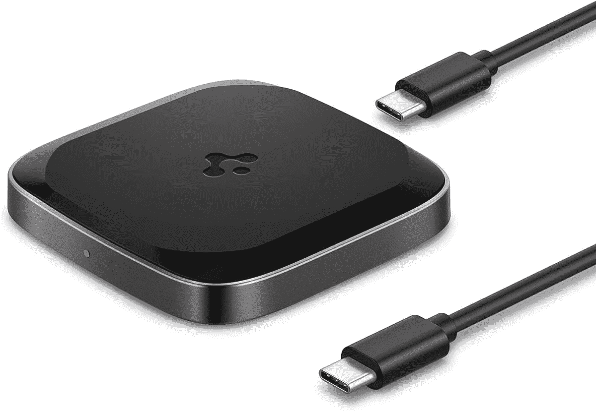
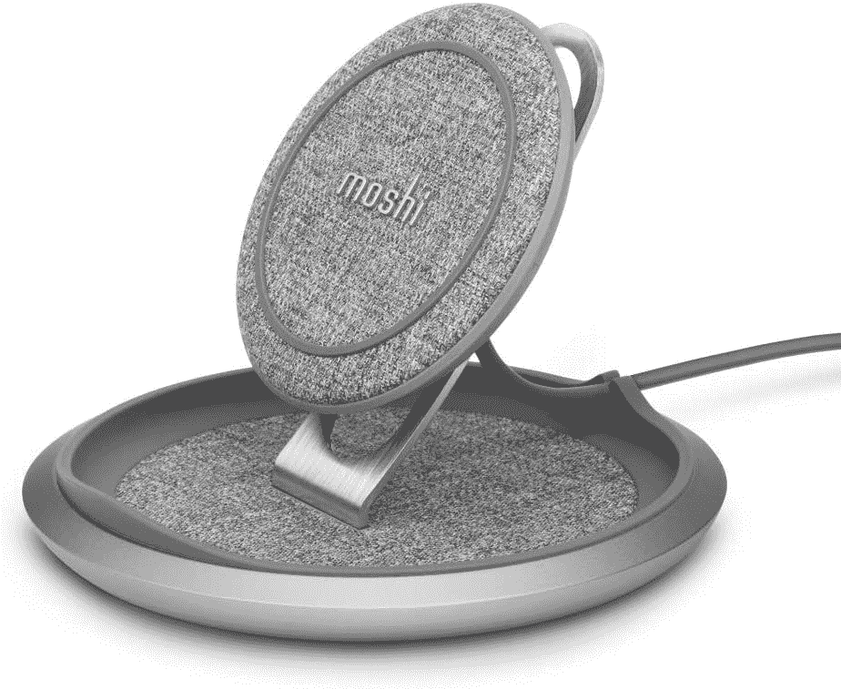
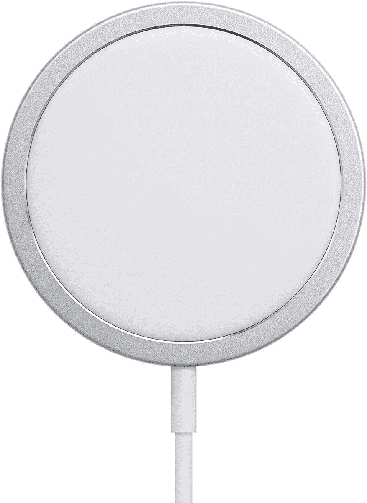
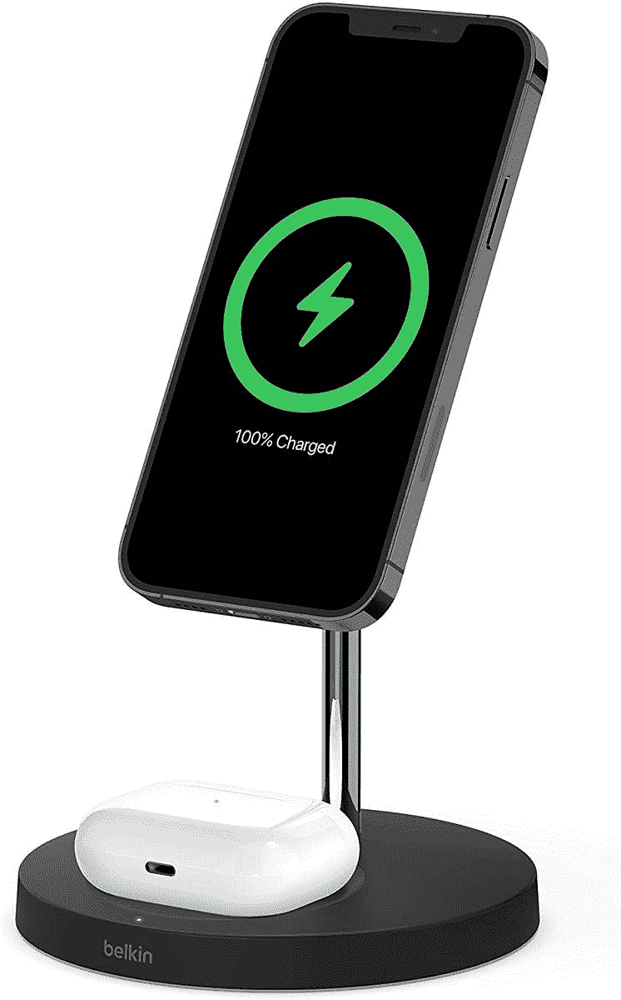
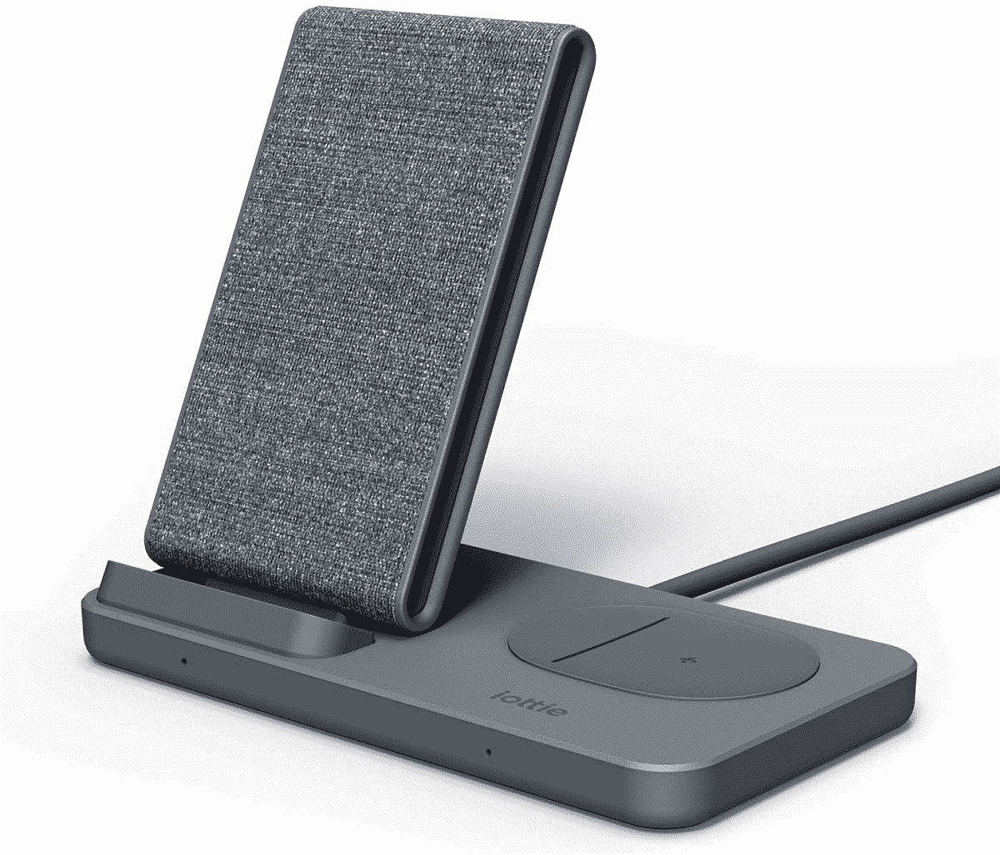
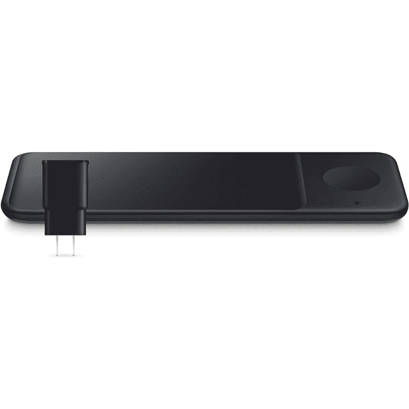
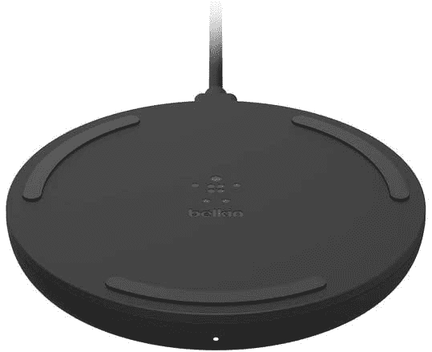

# 2023 年最佳 Qi 无线充电器

> 原文：<https://www.xda-developers.com/best-qi-wireless-charger/>

# 2023 年最佳 Qi 无线充电器

市场上有许多 Qi 无线充电器可供选择。如果您正在寻找优质的无线充电器，我们可以提供帮助。

无线充电器非常方便为手机充电，无需摆弄线缆。它们不是最快的充电方式，也不是最高效的，但它们完成了工作。随着智能手机和配件市场在很大程度上采用 Qi 无线充电标准，购买无线充电器变得更加容易，而不必担心不同的充电标准、规格或兼容性。只要你的手机和充电器都是 Qi 兼容的，并且没有被某个专有标准锁定，你就可以使用了。

随着支持无线充电器功能的[手机](https://www.xda-developers.com/best-phones/)的增多，无线充电器的选择也成倍增加。如果你去网上寻找无线充电器，你会发现有数百种选择。你不必花几个小时在网上搜索最好的无线充电器，所以我们收集了一些最好的选择。虽然所有这些充电器都适用于 Qi 兼容的智能手机，但有些充电器可能会对特定品牌的手机充电更快。

*   <picture></picture>

    Anker PowerWave II Pad

    ##### Anker PowerWave II 15W 无线充电垫

    Anker PowerWave II Pad 自带 5W、7.5W、15W 三种无线充电模式。如果你的手机支持更快的无线充电，这款 Anker 充电器将能够提供。它还配有一个电源适配器。

*   <picture></picture>

    Spigen 无线充电器

    ##### Spigen 可转换 15W 无线充电器

    在某些日子更喜欢立式模式，而在其他日子更喜欢平板模式？Spigen 无线充电器可以为您做到这两点。它还支持高达 15W 的快速无线充电。此外，它上面还有一个防滑垫，防止你的手机在充电时打滑。

*   <picture></picture>

    15W 无线充电器 duo

    ##### 三星无线充电器 Duo

    新版三星无线充电器 Duo 提供更快的充电速度，最高可达 15W。它可以让你同时给两个设备充电，但其中一个插槽是 Galaxy Watch 专用的。充电器还有一个内置的冷却风扇，以防止过热。你可以选择黑色或白色的颜色。

*   <picture></picture>

    谷歌像素支架(第二代)

    ##### 谷歌像素支架(第二代)

    谷歌像素支架第二代是你的 Pixel 6 和 Pixel 6 Pro 的绝配。虽然第一代 Pixel 支架可以很好地配合 Pixel 6，但它不会提供最快的充电速度，最高只有 10W。这款新机型提供高达 23W 的功率，内置静音风扇，可以在充电时保持手机凉爽。

*   <picture></picture>

    Belkin 三合一无线充电器

    ##### Belkin 三合一无线充电器

    当单双充电器都不够用的时候，可以得到这款 Belkin 三合一充电器。它可以同时为您的 Qi 兼容手机、耳塞和智能手表充电。该充电器支持为手机充电 7.5W，为其他设备充电 5W。

*   <picture></picture>

    Spigen ArcField

    ##### Spigen 15W 无线充电板

    Spigen ArcField 无线充电板可提供高达 15W 的功率，实现快速无线充电体验。它采用防滑设计，有利于睡眠的 LED 指示灯，并配有 6.6 英尺长的 USB-C 到 USB-C 电缆。

*   <picture></picture>

    Moshi Lounge Q

    ##### Moshi Lounge Q

    与大多数无线充电器不同，Moshi Lounge Q 采用高级纹理表面，外观优雅。与 Anker PowerWave II 一样，Lounge Q 也支持最高 15W 的充电。然而，它没有配备电源适配器。

*   <picture></picture>

    三星 15W 无线充电垫

    ##### 三星 15W 无线充电垫

    三星更新的 15W 无线充电器采用了圆滑的设计，并自带风扇散热系统，可以带走过多的热量，避免充电速度节流。

*   <picture></picture>

    苹果 MagSafe 充电器

    ##### 苹果 MagSafe 充电器

    苹果 MagSafe 充电器可以以高达 15W 的功率为你的 iPhone 充电，这是除了苹果认证的充电器之外，你在其他任何无线充电器上都找不到的。遗憾的是，您需要单独购买 20W USB Type-C 适配器。

*   <picture></picture>

    Belkin mag safe 二合一无线充电器

    ##### Belkin mag safe 二合一无线充电器

    这款 Belkin 的“made for MagSafe”充电器可以同时为您的 iPhone 12 系列和 AirPods 充电。由于手机由充电器上的磁铁固定，任何非 MagSafe iPhones 都不会被粘住。Belkin 还捆绑了一个电源适配器。

*   <picture></picture>

    iOttie iON Wireless Duo

    ##### iOttie iON Wireless Duo

    如果您拥有一个支持无线充电的配件，如无线耳塞，您可以在此 iOttie 充电器上同时为手机和配件充电。它为手机提供高达 15W 的充电功率，为配件提供高达 5W 的充电功率。

*   <picture></picture>

    三星无线充电器三重奏

    ##### 三星无线充电器三重奏

    使用三星无线充电器三重奏，您可以同时为手机、智能手表和耳塞充电。该充电器采用极简设计，提供高达 9W 的功率输出。该充电器有黑色和白色两种颜色，并配有 25W 电源适配器。

*   <picture></picture>

    Belkin BoostCharge 无线充电座

    ##### Belkin boost charge 15W 无线充电座

    如果你只是想给一台设备充电，这款 Belkin boost charge 充电座是个绝佳的选择。它支持高达 10W 的充电，并有防滑垫来保持手机在适当的位置。此外，充电器还附带两年保修。

*   <picture></picture>

    Anker 313 无线充电座

    ##### Anker 313 无线充电座

    如果你正在寻找一个没有任何花哨功能的简单无线充电板，这款 Anker 313 充电板是一个很好的选择。它提供高达 10W 的功率，可以为任何 Qi 兼容的手机或配件充电。还可以开着外壳给手机充电(假设不是太厚)。

*   <picture></picture>

    劲量终极便携充电器

    ##### 劲量终极便携充电器

    当你找不到任何空的电源插座时，劲量的这个电源库和无线充电器组合会非常有用。它装有 10，000mAh 容量的电池，支持高达 10W 的快速充电。你不会得到一个这样的电源适配器。

* * *

这些是市场上最好的充电器。如果你正在寻找一个好的通用快速无线充电器，Anker PowerWave II Pad，Spigen ArcField 和 Moshi Lounge Q 是很好的选择。iPhone 12 系列购买者可以考虑苹果官方 Magsafe 充电器或 Belkin Magsafe 二合一充电器(更多推荐，请查看我们的[最佳 iPhone 充电器](https://www.xda-developers.com/best-apple-iphone-14-chargers/)综述)。如果你想要一个高级的外观，对于 iPhone 用户来说，Native Union Drop Marquetry 是另一个不错的选择。对于非 iPhone 用户来说，Anker PowerWave 支架仍然是一个很好的预算选择。

你打算买哪个齐充电器？请在评论区告诉我们。与此同时，如果你想了解更多关于有线快速充电的知识，有线快速充电永远比无线充电快，我们有一个[伟大的讲解者](https://www.xda-developers.com/how-does-fast-charging-work/)。最后，看看我们关于市场上的[最佳便携式充电器](https://www.xda-developers.com/best-portable-chargers/)的指南，以防你正在寻找某种能让你摆脱电池焦虑的东西，无论你的手机和用途如何。