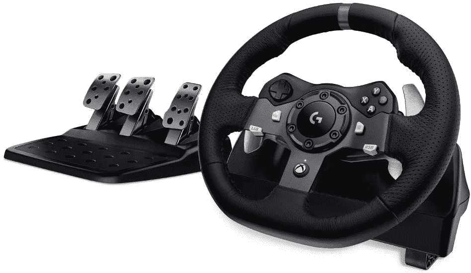
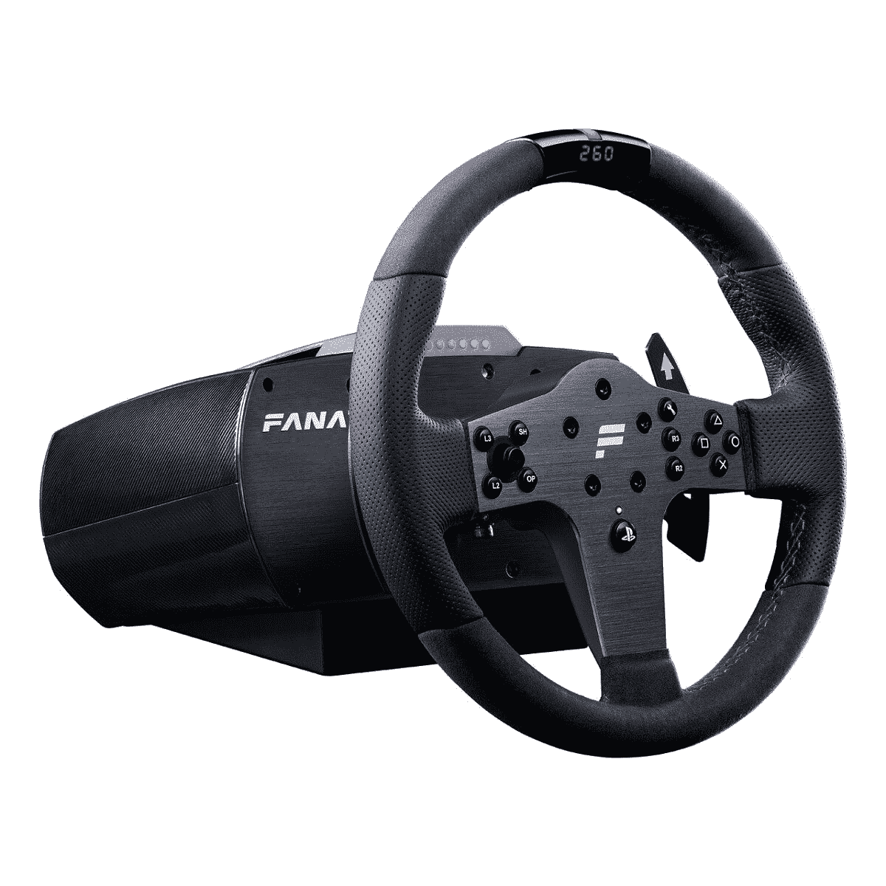
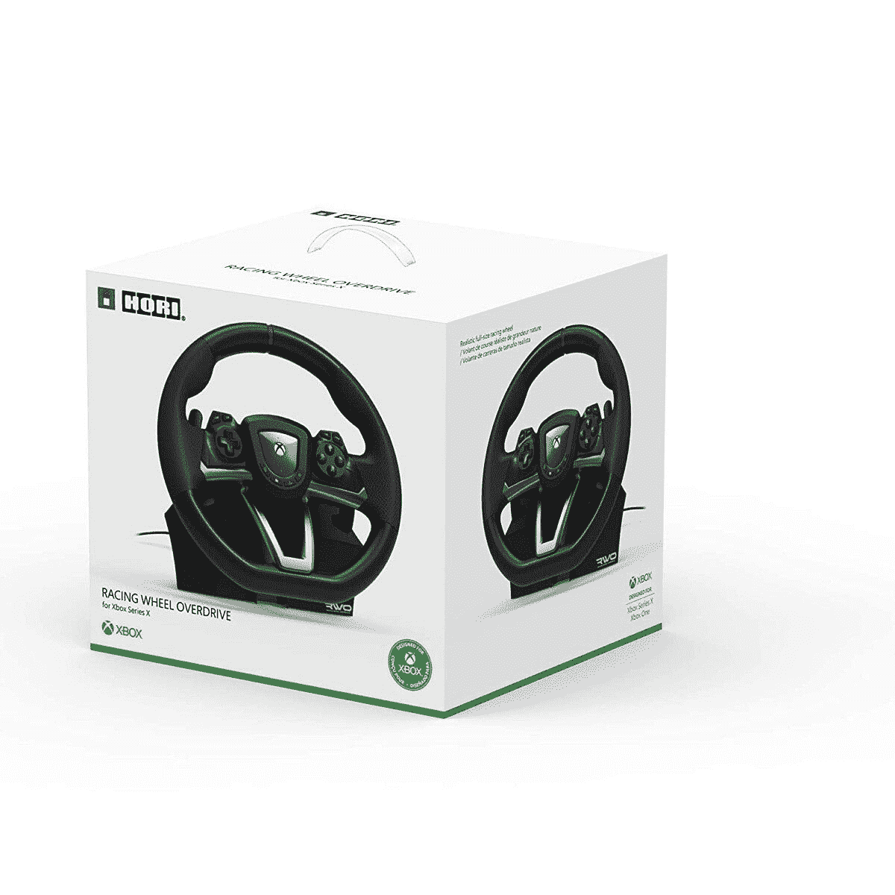
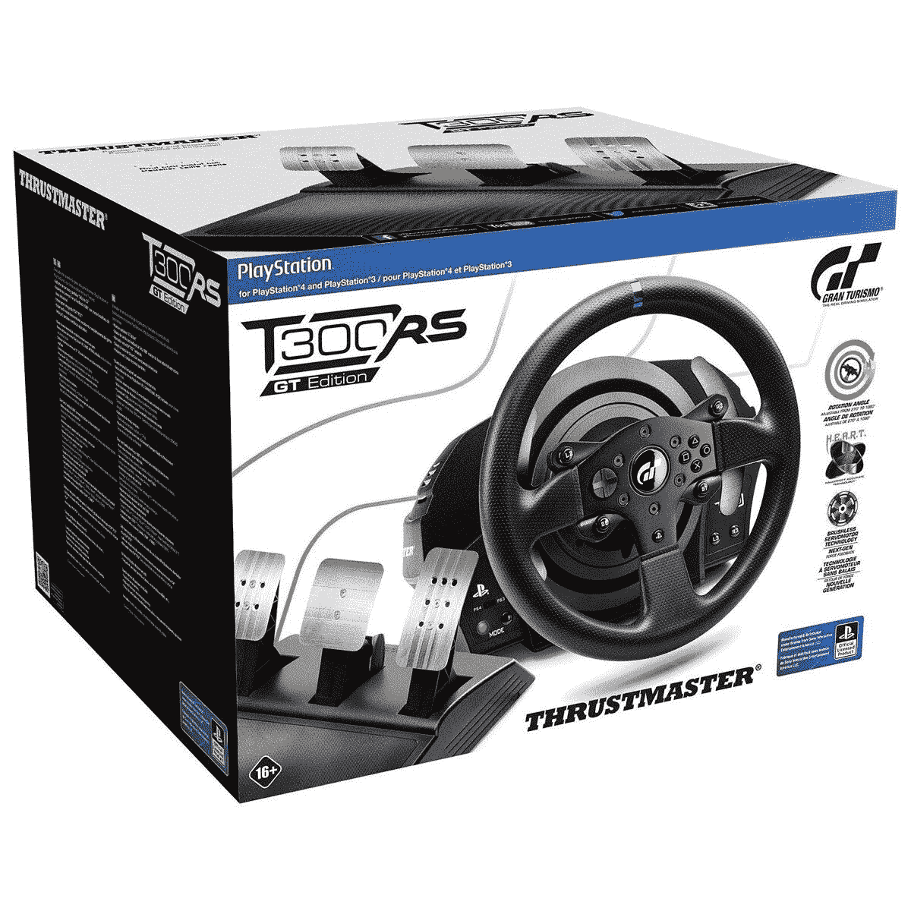
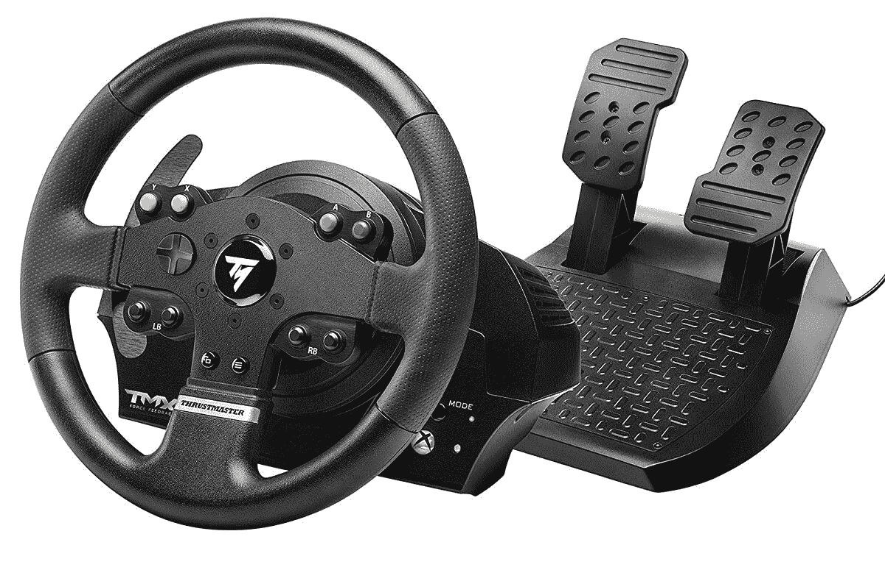

# 2023 年最佳游戏赛车车轮

> 原文：<https://www.xda-developers.com/best-racing-wheels/>

有时候，当你在玩游戏时，你会想要最真实的体验。虽然虚拟现实游戏让你做到了这一点，但它也很适合传统游戏。对于赛车类型来说尤其如此，F1 2021、gt 赛车和 Forza Motorsport 等系列提供了复制汽车实际驾驶方式的力学和物理学。你可以用一个伟大的赛车车轮让体验更好！虽然有很多需要注意的地方，所以我们在下面为你的游戏主机收集了最好的赛车轮子。

你是电脑游戏玩家吗？你很幸运，因为所有这些轮子都可以和电脑一起使用！从列表中选择你最喜欢的，你就可以开始了。

**目录:**

## 我需要什么样的赛车轮子？

当你买一个赛车车轮时，你会想要一个感觉尽可能接近真实汽车方向盘的东西。因此，对于每一个选择，我们都包含了对您的体验非常重要的五个规格。

**重量** -在挑选车轮时，重量可能比你想象的更重要。太轻的轮子会让人感觉很便宜，而且如果你频繁或突然转动轮子，将轮子放在桌子上会有点困难。较重的车轮会感觉更有学习力！

**尺寸** -一个小轮子的尺寸会让你感觉像在玩玩具。车轮尺寸越接近实际汽车的车轮，感觉越好。

**滚轮旋转** -在锁定之前，您可以在每个方向上将滚轮旋转多远？这对您的游戏体验非常重要！

**力反馈** -力反馈将复制驾驶汽车的感觉，就像车轮本身一样。一些最好的赛车车轮会有力反馈！

**内置换挡杆** -大多数时候，换挡杆是单独出售的。除非你打算买一个，确保你的轮子有某种你可以使用的变速装置！

## 整体最佳:罗技 G920

| 

重量

 | 

规模

 | 

车轮旋转

 | 

力反馈？

 | 

内置移位器？

 |
| --- | --- | --- | --- | --- |
| 4.96 磅 | 10.24 x 10.94 x 10.63 英寸 | 1080 度 | 是 | 是 |

当谈到最好的赛车车轮时，诚实地说，很难在许多其他产品中平衡什么是最好的。绝对最好的赛车车轮品牌 Fanatec 对普通买家来说价格过高。如果你拿起一个，它肯定会感觉你在一辆赛车中，但除非你玩的都是真实的赛车，否则很难证明 1000 美元以上的价格是合理的。但是，即使是对消费者更友好的选择，你仍然想要一个好的感觉体验。最擅长走钢丝的轮子是罗技 G920。

罗技 G930 有 Xbox/PC 和 PlayStation/PC 两种选择，是你不用花大价钱就能买到的最好的赛车轮子。该轮具有力反馈功能，这大大有助于使体验感觉真实。尺寸也非常坚固，你还可以选择脚踏板和捆绑一个单独的换档器。总而言之，这是一个非常可靠的体验，也是这个列表中价格较低的轮子之一！

 <picture></picture> 

Logitech G920 Force Feedback Racing Wheel

##### 罗技 G920 力反馈赛车车轮

罗技 G920 是市场上少数几个在功能和价格之间走钢丝的赛车车轮之一。获得力反馈，而不用把钱包里的钱都掏出来。

## 最佳高级选项:Fanatec CSL 精英

| 

轮上配重

 | 

车轮尺寸

 | 

车轮旋转

 | 

力反馈？

 | 

内置移位器？

 |
| --- | --- | --- | --- | --- |
| 2.14 磅 | 11.81 英寸 | 1080 度 | 是 | 是 |

钱不是问题吗？你想要金钱可以买到的最好的赛车游戏体验吗？那你想和 Fanatec 一起去。Fanatec 无疑拥有市场上最好的车轮，但你将不得不为它们支付一大笔钱。根据你拿的东西和你捆绑在一起的东西，价格很容易超过 1000 美元！然而，对于这个列表，我们推荐 CSL 精英初学者工具包，然后你可以从那里开始。

CSL 精英赛车车轮和踏板是这个列表中唯一一套可以与所有三个主要控制台(PC，PS5 和 XSX -抱歉开关)一起工作的套件。特殊的 Clubsport 技术将 Fanatec 的力反馈提升到了另一个层次，车轮尺寸和重量是榜单上最真实的。方向盘上甚至有一个 LED 显示屏，显示兼容游戏的重要比赛数据！真的很酷。它通常零售价为 600 美元，但不包括一个单独的换档器，这个轮子肯定属于优质领域。

 <picture></picture> 

Fanatec CSL Elite Starter Kit

##### Fanatec CSL 精英入门套件

不满足于最好的结果。然后，你会想前往 Fanatec 的网站，并挑选出你的赛车车轮捆绑！它会让你花费很多，但你也会得到绝对最好的体验。

## 最佳预算选择:HORI Overdrive

| 

重量

 | 

规模

 | 

车轮旋转

 | 

力反馈？

 | 

内置移位器？

 |
| --- | --- | --- | --- | --- |
| 7 磅 | 12.6 x 11.42 x 11.61 英寸 | 270 度 | 不 | 是 |

只是想试一试赛车车轮，价格有点让人不知所措？HORI 为您提供 HORI 车轮超速传动。这是一款 [Xbox 系列 S](https://www.xda-developers.com/xbox-series-s-review/) /X 和 PC 兼容的控制器，可以完成工作。它没有力反馈，轮子也不能转 1080 度，但构建质量仍然很坚固，如果玩轮子适合你，你会有很好的感觉。还有与 [HORI Racing Wheel Apex](https://www.amazon.com/PlayStation-Wireless-Racing-Wheel-Apex-4/dp/B01LZ3AEFP?tag=xda-60ctj4t-20&ascsubtag=UUxdaUeUpU3755&asc_refurl=https%3A%2F%2Fwww.xda-developers.com%2Fbest-racing-wheels%2F&asc_campaign=Short-Term) 相当的 PlayStation——它实际上是同一个轮子，只是与 PlayStation 兼容！

 <picture></picture> 

HORI Racing Wheel Overdrive

##### Hori 赛车车轮超速传动

如果你正在寻找一个预算赛车车轮的经验，霍里赛车车轮超速是你最好的选择。你不会得到所有的铃铛和哨子的其他车轮在这个名单上，但它是一个很好的介绍专业控制器。

## PlayStation 5 最佳赛车车轮:Thrustmaster T300RS GT 赛车车轮

| 

重量

 | 

车轮尺寸

 | 

车轮旋转

 | 

力反馈？

 | 

内置移位器？

 |
| --- | --- | --- | --- | --- |
| 22.4 磅 | 11 英寸 | 1080 度 | 是 | 是 |

如果你是一个赛车游戏迷，你可能知道 Thrustmaster 这个品牌。他们是一个伟大的中档品牌-通常比罗技和 HORI 好，但不太有超高级费内泰克品牌。所以，如果你想在你的 PlayStation 5 上比赛，你会想要一个推力主轮！在这种情况下，您将会看到 Thrustmaster T300RS GT 车轮。虽然最初是为 PlayStation 4 设计的，但它与 PS5 游戏配合得很好！

T300RS GT 车轮具有力反馈和 1080°车轮旋转功能，Gran Turismo 品牌不会影响您玩其他游戏！车轮甚至可以拆卸！我不知道为什么它是可拆卸的，我假设它是为了在需要时方便维护。但重要的是，这套轮子和踏板感觉很棒。

 <picture></picture> 

Thrustmaster T300RS GT Racing Wheel

##### Thrustmaster T300RS GT 赛车车轮

寻找一个好质量的赛车车轮，将与 PlayStation 5 一起工作？你会想要 Thrustmaster T300RS GT 赛车车轮！这看起来和感觉上都比预算选项好，但不会让你倾家荡产。

## Xbox 系列 X|S 最佳赛车车轮:推力大师 TMX 力反馈赛车车轮

| 

轮上配重

 | 

车轮尺寸

 | 

车轮旋转

 | 

力反馈？

 | 

内置移位器？

 |
| --- | --- | --- | --- | --- |
| 11.25 磅 | 11 英寸 | 1080 度 | 是 | 是 |

就像上面的 PlayStation 5 一样，如果你想在 Xbox 系列主机上玩游戏，你会想选择 Thrustmaster。推力大师 TMX 力反馈赛车车轮实际上非常类似于上面的 T300RS GT，只是与微软的控制台兼容。这意味着你将获得力反馈和 1080 度的车轮旋转，但也是一个介于预算和优质选择之间的中档价位。这是一个非常好的选择！

 <picture></picture> 

Thrustmaster TMX Force Feedback Racing Wheel

##### TMX 力反馈赛车车轮

如果你主要在游戏机上玩，那就用 Thrustmaster。TMX 力反馈车轮以中等价位提供您想要的赛车车轮。

## 任天堂 Switch 最佳赛车车轮:HORI 马里奥赛车车轮专业版

| 

重量

 | 

规模

 | 

车轮旋转

 | 

力反馈？

 | 

内置移位器？

 |
| --- | --- | --- | --- | --- |
| 7 磅 | 11.57 x 13.19 x 11.81 英寸 | 270 度 | 不 | 是 |

老实说，如果你正在寻找一个赛车轮子，你的选择就有点有限了。虽然有大量的[赛车车轮模具](https://www.amazon.com/Orzly-Nintendo-Mariokart-Controller-Attachments/dp/B076TMH7JT?tag=xda-60ctj4t-20&ascsubtag=UUxdaUeUpU3755&asc_refurl=https%3A%2F%2Fwww.xda-developers.com%2Fbest-racing-wheels%2F&asc_campaign=Short-Term)可以将你的一个 Joy-Con 放入其中，但 Joy-Con 陀螺绝不是复制车轮的感觉。谢天谢地，有 HORI 马里奥赛车车轮亲。

如果你认为这看起来像我们名单上的另一个车轮，你不会差太远-它只是 HORI 赛车车轮 Overdrive 和 HORI 赛车车轮 Apex 的不同皮肤版本。这很好，因为价格点更合理，但你也将获得更多的总体预算体验。但是，好吧，Switch 毕竟不是因为它的现实赛车而出名的，不是吗？

 <picture></picture> 

HORI Mario Kart Racing Wheel Pro

##### Hori 马里奥赛车车轮专业版

对于任天堂 Switch 赛车车轮，你没有太多的选择，但你可以购买 HORI Mario Kart 赛车车轮 Pro，获得与我们的预算选择类似的体验。

除了上面的六种赛车车轮，市场上还有很多其他的赛车车轮可以试用！然而，如果你正在寻找一个经过试验和测试的选项，并提供完全物有所值的选择，那么[罗技 G920](https://www.amazon.com/Logitech-Dual-Motor-Feedback-Driving-Responsive/dp/B00Z0UWV98?tag=xda-60ctj4t-20&ascsubtag=UUxdaUeUpU3755&asc_refurl=https%3A%2F%2Fwww.xda-developers.com%2Fbest-racing-wheels%2F&asc_campaign=Short-Term) 绝对不会错。如果预算不是问题，而你想要最好的体验，那么 [Fanatec CSL 精英](https://fanatec.com/us-en/racing-wheels-wheel-bases/racing-wheels/csl-elite-racing-wheel-wrc-for-playstation)就是你要去的地方。你最喜欢什么？请在评论中告诉我们！