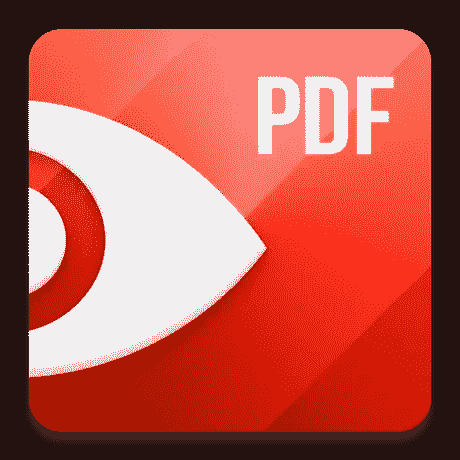
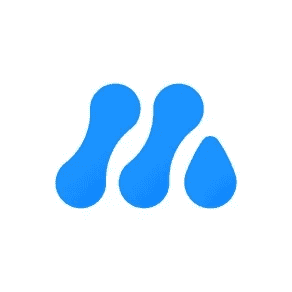
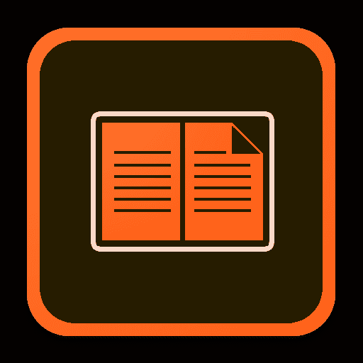

# 2023 年最佳 Mac 阅读应用

> 原文：<https://www.xda-developers.com/best-reading-apps-mac/>

苹果销售一些[优秀的 MAC 电脑](http://www.xda-developers.com/best-macs/)，比如[的 MacBook Air (2022)](https://www.xda-developers.com/macbook-air-m2-2022-review/) 和[的 MacBook Pro (2023)](https://www.xda-developers.com/apple-macbook-pro-16-2023-m2-max-review/) 。这些计算机的共同之处是卓越的能效和功率。由 macOS Ventura 驱动，这些机器非常适合处理你的学习、工作、媒体消费和阅读会话。如果你一直在为你的 Mac 寻找一些优秀的阅读应用，那么你来对地方了！下面你会发现 macOS 上最好的阅读应用列表。

## 我们最喜欢的苹果阅读应用

##### 苹果书籍

最佳综合

Apple Books 预装在 Mac 电脑上，支持 pdf、EPUBs 和其他电子书格式。您可以标记、高亮显示和浏览正在阅读的书籍的章节。

**Pros**

*   在所有 iCloud 设备之间无缝同步
*   有专门的在线商店

**Cons**

*   不支持内容编辑

Apple Books 是我最喜欢的 Mac 阅读应用。该应用程序以前称为 iBooks，支持导入 pdf、EPUBs 和其他电子书格式。因此，即使你不是从应用程序本身购买书籍，你仍然可以使用它来查看和互动你从其他来源下载的书籍。

iCloud sync 是我非常喜欢这款应用的原因之一。当我在地铁上阅读时，我的进度总是被上传到云端并反映在我的 Mac 上。当我回家后，我可以在 macOS 上继续阅读，就在我停止在 iOS 上阅读的地方。同步的数据仅占用几千字节，因此不会填满您的 iCloud 储存空间配额。此外，该应用程序总是根据新 macOS 版本中引入的最新设计变化进行更新，因此它看起来不会过时。

除了阅读，图书应用程序还允许读者高亮显示段落，添加注释，书签页面等等。所有这些功能都是免费使用的，所以你既不必购买应用程序，也不必订阅每月服务。Apple Books 提供了大量的免费和付费图书，既有著名作家也有不太知名的作家，您可以根据流派、价格标签等进行浏览。

Apple Books 应用默认在所有 MAC 上都有，不用自己下载。可以通过 Launcher 或者 Spotlight 搜索找到。

 <picture></picture> 

Amazon Kindle

##### 亚马逊 kindle

最适合亚马逊客户

你的 Kindle 图书馆来到了 Mac

亚马逊 Kindle 是你购买所有亚马逊数字图书的地方。它还允许你定制应用程序的某些部分，以便你在阅读时总是感到舒适。

**Pros**

*   跨设备同步
*   支持本地内容

如果你倾向于从亚马逊购买你的电子书，这个应用程序是为你准备的。Kindle 应用程序允许你在一个地方阅读你在亚马逊购买的所有电子书。它还支持访问您的本地电子书图书馆，因此您可以在一个地方阅读其他来源的数字图书。

Kindle 允许在字体类型和大小、行距、文本对齐等方面进行一些定制。您还可以突出显示、做笔记、使用拆分视图和利用文本到语音转换。这是一个功能丰富的应用程序，既免费又简单易用。多亏了 Whispersync，你可以在任何安装了 Kindle 应用程序的设备上暂停阅读时继续阅读。

 <picture></picture> 

Readdle PDF Expert

##### Readdle PDF 专家

最适合编辑

Readdle PDF Expert 是一款优秀的 PDF 阅读器和编辑器。它提供了强大的工具，允许您轻松方便地编辑 PDF 文档。

**Pros**

*   支持编辑 PDF 文档

**Cons**

*   不支持 EPUB
*   相对昂贵

PDF Expert 是 Mac 上最好的 PDF 阅读器应用程序之一。它非常特别，因为它允许您轻松编辑 PDF 文本、图像、链接和轮廓。你可以在几秒钟内修改一个错别字，更改合同中的标识，或者更新你的简历。

除了阅读 pdf，这款阅读器还允许你合并文档、批注、高亮、签名等等。由于 Readdle 传输功能，您可以在文档中间无缝切换设备。它可以在 macOS、iPadOS 和 iOS 上工作，所以你可以在 Mac 上工作，例如，当你想签署一份文件时，可以使用 iPad 或 iPhone 来利用触摸控制。

这款应用在美国售价 140 美元，并且只支持 PDF 格式。所以无法读取 EPUB 文件或其他文件格式。

 <picture></picture> 

Sun Min MarginNote

##### 孙敏·马金诺特

最适合学生

MarginNote 是一款针对学生的强大阅读软件。它包括帮助用户记忆内容和联系他们的想法的功能。它可以免费下载，但包括应用内购买。

**Pros**

*   免费使用
*   高级和独特的功能

**Cons**

*   对某些用户来说太复杂

MarginNote 是一款面向学生的功能强大的 PDF 和 EPUB 阅读器，它的实用程序可以让学习和记忆电子书内容变得更加容易。除了通常的高亮显示、笔记和书签功能，该应用程序还具有文本识别和视频编辑引擎，允许您在一个地方处理笔记和视频。它还有一个研究浏览器，让你不用离开你正在研究的文档就可以查找某个关键词。你可以创建思维导图、镜像卡片、笔记链接等等来连接你的想法，更好地记住内容。

MarginNote 还支持抽认卡和智能提醒，根据你犯错误的频率帮助你从错误中学习。一种算法可以计算出你需要多长时间来记住一些东西，并为不同的难度等级建议不同的时间。

这款阅读应用可以从 Mac App Store 免费下载，但它包括应用内购买，以解锁所有功能并利用其功能。

 <picture></picture> 

Adobe Digital Editions

##### Adobe 数字版

最适合活跃读者

你所有的阅读资料都在一个地方

Adobe Digital Editions 免费提供大量功能。它允许用户高亮显示、做笔记、添加书签、编辑文本等等。

**Pros**

*   公共图书馆支持
*   跨平台同步

**Cons**

*   不再积极发展

Adobe 广受欢迎的电子阅读器提供了很多东西。Adobe Digital Editions (ADE)支持安装了该软件的设备之间的同步。因此，如果你在 Mac 电脑上添加或删除了一本书，预计这将反映在你的其他设备上。

这个强大的工具允许用户对某个文本的章节进行关键字搜索，所以大海捞针不再是什么大事。你有公共借书证吗？如果是，ADE 支持某些在线公共图书馆，所以一旦你提供了所要求的信息，你就可以开始借阅数字图书了。你甚至可以打印你存储在 ADE 上的电子书，除非出版商屏蔽了这个功能。

就像 Apple Books 一样，Adobe Digital Editions 除了 VoiceOver 辅助功能控制之外，还支持高亮显示、添加书签、添加笔记和书架。它支持多种文件格式，如 EPUB、EPUB3 和 PDF。您甚至可以修改某些格式的文本和文档大小。

## 最佳苹果阅读应用:底线

##### 苹果书籍

最佳综合

Apple Books 预装在 Mac 电脑上，支持 pdf、EPUBs 和其他电子书格式。您可以标记、高亮显示和浏览正在阅读的书籍的章节。

就我个人而言，我更喜欢使用 Apple Books 来阅读电子书。这款应用程序免费，默认情况下可以在我所有的苹果设备上使用，并提供适量的功能。它还包括一个阅读目标功能，鼓励我每天阅读一定的时间。最终，人们的需求和口味不同，所以你可能会发现自己更喜欢另一个应用程序。