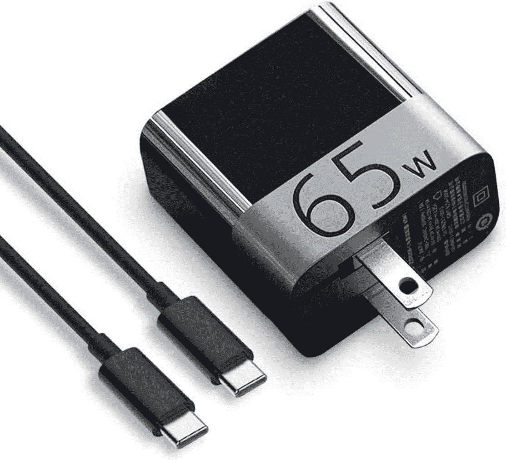

# Surface Laptop 5 的最佳替代充电器

> 原文：<https://www.xda-developers.com/best-replacement-chargers-surface-laptop-5/>

# Surface Laptop 5 的最佳替代充电器

丢失了 Surface Laptop 5 充电器还是需要一个新的？这里收集了一些你可以在 2023 年买到的充电器。

关于 Surface Laptop 5 的一个很酷的事情是它有两种充电方式。您可以使用 USB-C 或专有的 Surface Connect 端口为笔记本电脑充电。微软在包装盒中为你提供了一个 Surface Connect 充电器，但如果你碰巧丢失了它，或者只是想要一个新的，那你就找对地方了。

我们收集了一些 Surface Laptop 5 的最佳替代充电器。我们的选择包括官方的、第三方的等等。下面就来看看吧！

*   <picture></picture>

    Surface Dock 2

    ##### 微软 Surface Dock 2

    Surface Dock 2 相当昂贵，但它是 Surface 笔记本电脑 5 在办公桌上使用的最佳充电器之一。它可能不是最便携的，但它可以为你的 Surface 增加大量额外的端口，并为它充电。

*   <picture></picture>

    Kabcon Surface Book 3 充电器

    ##### Kabcon Surface Book 3 充电器

    这是一款适用于 Surface Laptop 5 的高瓦数充电器，可以比原装更快地为你的笔记本充电。它有一个 USB-A 端口，就像原来的一样，而且比官方的便宜得多。

*   <picture></picture>

    汤森 65W Surface 充电器

    ##### 汤森 65W PD 充电器

    这是一款第三方 USB-C 充电器，用于 Surface 笔记本电脑 5。它有 3 个端口，所以你可以同时给你的 Surface 笔记本电脑和其他两个设备充电。

*   <picture></picture>

    bat Power ProE 2 电源组和充电器

    ##### bat Power ProE 2 ES7B

    想在旅途中为 Surface 笔记本电脑 5 充电？这款充电器包括一根 Surface Connect 电缆，当您需要充电但不在电源插座附近时，可以使用它来释放设备上的 USB-C 端口。

*   <picture></picture>

    ZMI ZPower Turbo

    ##### ZMI ZPower Turbo

    这是我们在亚马逊上能找到的最小巧的 USB-C 充电器之一你可以把尖头折叠起来，放在口袋或包里。

*   ##### Monoprice 通用 USB-C 笔记本充电器

    顾名思义，这是一款 Surface Laptop 5 的通用充电器。它有一根很长的 USB-C 线，几乎可以适应任何设置。

    T34
*   ##### Anker 537 电源组(PowerCore 26K)

    这款 Anker 电池组拥有 26,880 MaH 的巨大容量。它可以通过 USB-C 端口为您的 Surface 笔记本电脑 5 go on the go 充电。

*   ##### Anker Nano II

    这是一个来自 Anker 的流行收费。它的充电功率高达 100 瓦，并有额外的 USB-A 和 USB-C 端口，用于为其他设备充电。然而，它没有附带电缆。

    T17
*   <picture></picture>

    Anker 543 充电器

    ##### Anker power port Atom III 65W 超薄充电器

    这是一款来自 Anker 的 65W 充电器，附带一根超长线缆。它还有 USB-A 端口，可以用来给你的 Android 或 iOS 设备充电。

这是我们目前可以为 Surface Laptop 5 找到的六种最佳替代充电器。Surface Dock 2 是你能买到的最好的，但它可能超出了大多数人的预算。如果是这样的话，那么我们提到的一些 Anker 充电器，或第三方 Surface Connect 充电器将会很好地解决这个问题！我们希望其中一款能满足您的需求！这些充电器将与任何 Surface PCs 配合使用，USB-C 充电器也可以为其他 Windows 笔记本电脑充电。

 <picture></picture> 

Microsoft Surface Laptop 5

##### Surface 笔记本电脑 5

Surface Laptop 5 是微软最新的旗舰笔记本电脑，采用第 12 代英特尔 CPU，并有新的颜色选择。