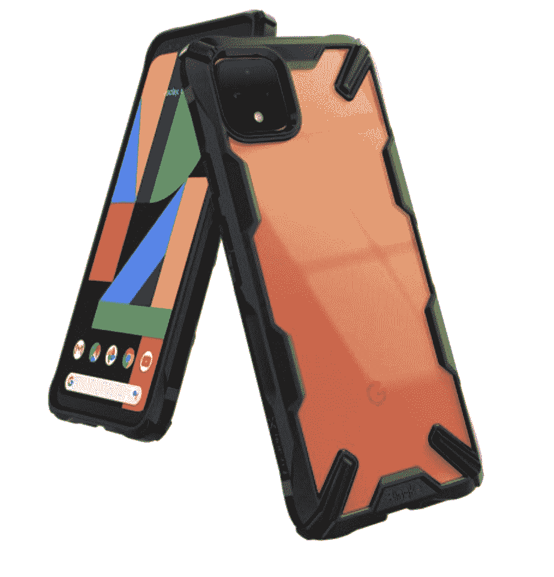
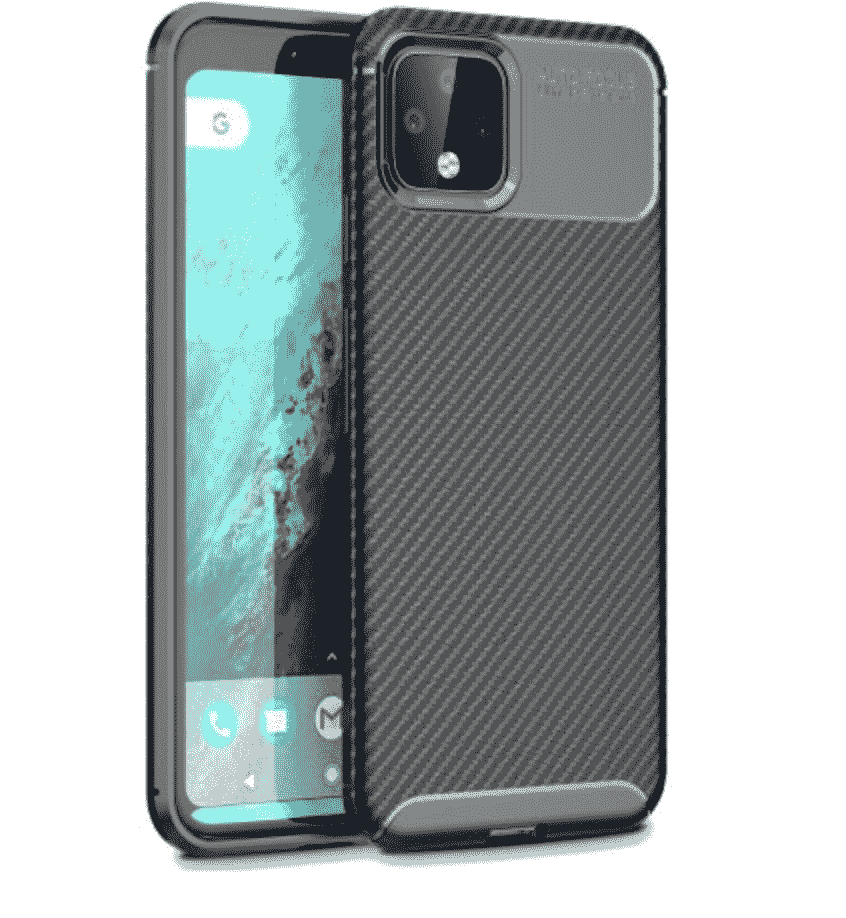
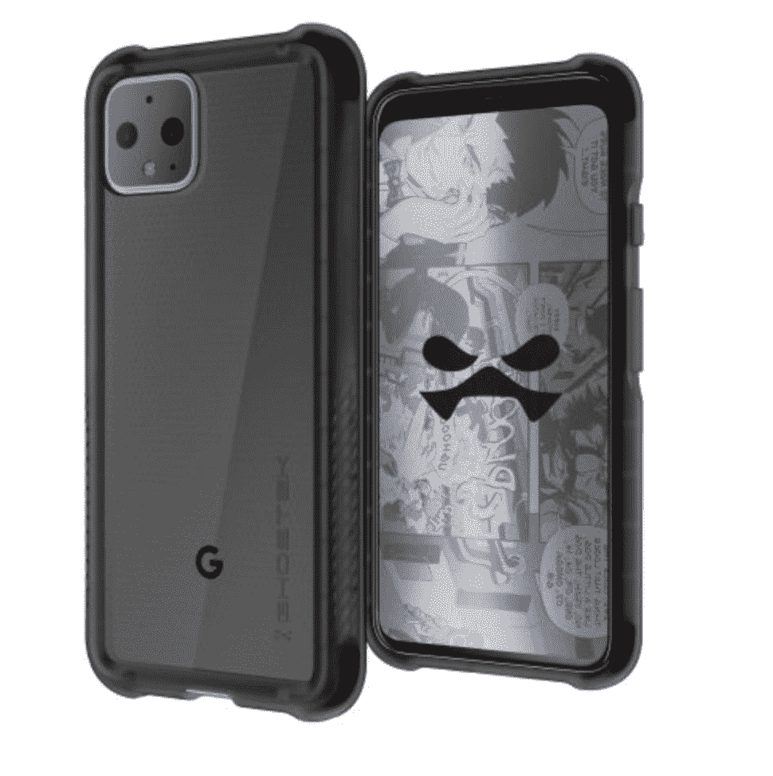

# 这些是最好的加固像素 4 案件:Zizo，Ringke，Olixar，等等！

> 原文：<https://www.xda-developers.com/best-rugged-pixel-4-cases/>

尽管谷歌 Pixel 4 是在 2019 年宣布的，但它仍然是一款伟大的安卓智能手机，特别是如果你能在打折或打折时买到它。它提供了分辨率为 1080 x 2280 像素的 5.7 英寸显示屏，骁龙 855 处理器，1220 万像素的摄像头，2800 毫安时的电池，无线充电，时尚的设计等等。如果你拥有一台谷歌 Pixel 4 或者正在考虑购买一台，你不会想刮擦、碰撞、跌落甚至摔坏它。但不幸的现实是，事故时有发生，手机很容易损坏。

保护你的谷歌 Pixel 4 的最好方法是一直把它放在一个盒子里。幸运的是，你会发现市场上有很多很棒的 Pixel 4 保护套，其中许多都非常坚固，并提供全方位的保护。但是你应该选择哪一个呢？为了帮助您挑选一款，我们列出了最佳加固型 Pixel 4 外壳。

 <picture></picture> 

Zizo Bolt Series

##### Zizo Bolt 像素 4 外壳

Zizo Bolt 是一个坚固的外壳，为谷歌 Pixel 4 提供全方位的保护。它具有军用级别的保护，钢化玻璃屏幕保护器，支架，360 度旋转皮带夹和 40 厘米的挂绳。你可以买到黑色或红色的。

 <picture></picture> 

Ringke Fusion X Tough Case

##### Ringke Fusion-X 像素 4 案例

Ringke Fusion X 提供了时尚的混合设计、军用级保护、透明背面、精确的切口、触觉按钮、保护屏幕和摄像头的凸起边缘以及安全的手柄。

 <picture></picture> 

Olixar Protective Case

##### Olixar 保护像素 4 外壳

这款来自 Olixar 的保护套采用了轻巧纤薄的设计，可提供抗冲击和抗震性能，具有纹理的背面可确保安全抓握，具有触感的按钮、精确的端口切口和凸起的边缘可保护显示屏免受损坏。

 <picture></picture> 

Ghostek Covert 3

##### Ghostek Covert 3 像素 4 外壳

Ghostek Covert 3 不像其他一些坚固的外壳那样笨重，但仍然为谷歌 Pixel 4 提供了最大的保护。它具有坚硬的保险杠角、防滑涂层、保护屏幕和摄像头的凸起边缘以及精确的切口。

 <picture></picture> 

OtterBox Defender Series

##### OtterBox Defender Pixel 4a 案例

OtterBox 以制造一些最坚固的智能手机外壳而闻名，Defender 系列就是一个很好的例子。它适用于谷歌 Pixel 4，提供了多层设计，可以防止各种损坏，一个可以用作支架的皮带夹皮套，以及防止灰尘和污垢进入手机的端口盖。

 <picture></picture> 

OtterBox Symmetry Series

##### OtterBox 对称像素 4a 外壳

对称系列是 OtterBox 的一个更轻更薄的选项，可以防止划痕、跌落和其他类型的损坏。更重要的是，它提供了一体式设计、保护显示屏的凸起边缘、触觉按钮、精确的切口和一系列不同的颜色。

谷歌 Pixel 4 是一款出色的 Android 智能手机，如果你拥有或打算购买一部，你最不想做的事情就是损坏它。因此，为 Pixel 4 投资一个坚固耐用的外壳是有意义的。

如你所见，这款手机有很多坚固耐用的外壳。但是你可能想知道该买哪一个。我们最喜欢的坚固耐用的 Pixel 4 外壳是 OtterBox Defender 系列，因为它提供了全方位的保护和许多其他令人惊叹的功能。当然，不是每个人都想给自己闪亮的新手机增加这么大的体积。如果你想要一个更薄的 Pixel 4 外壳，但仍能提供足够的保护，我们推荐 OtterBox Symmetry 系列。它不仅纤薄坚固，而且有一系列不同的颜色。Spigen 的选项也不错。

你是否拥有一台谷歌 Pixel 4，你是否为它找到了一个坚固耐用的外壳？如果答案是肯定的，我们希望在下面的评论区听到你的建议。另外，我们还总结了谷歌 Pixel 4a 的[最佳案例。](https://www.xda-developers.com/best-google-pixel-4a-cases/)