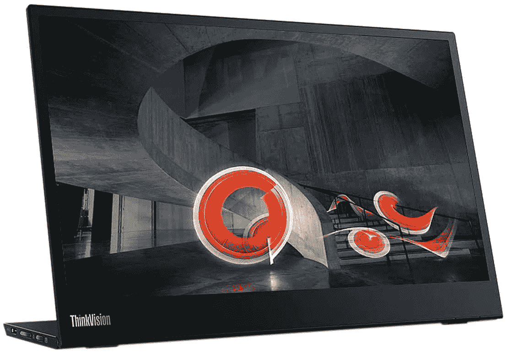
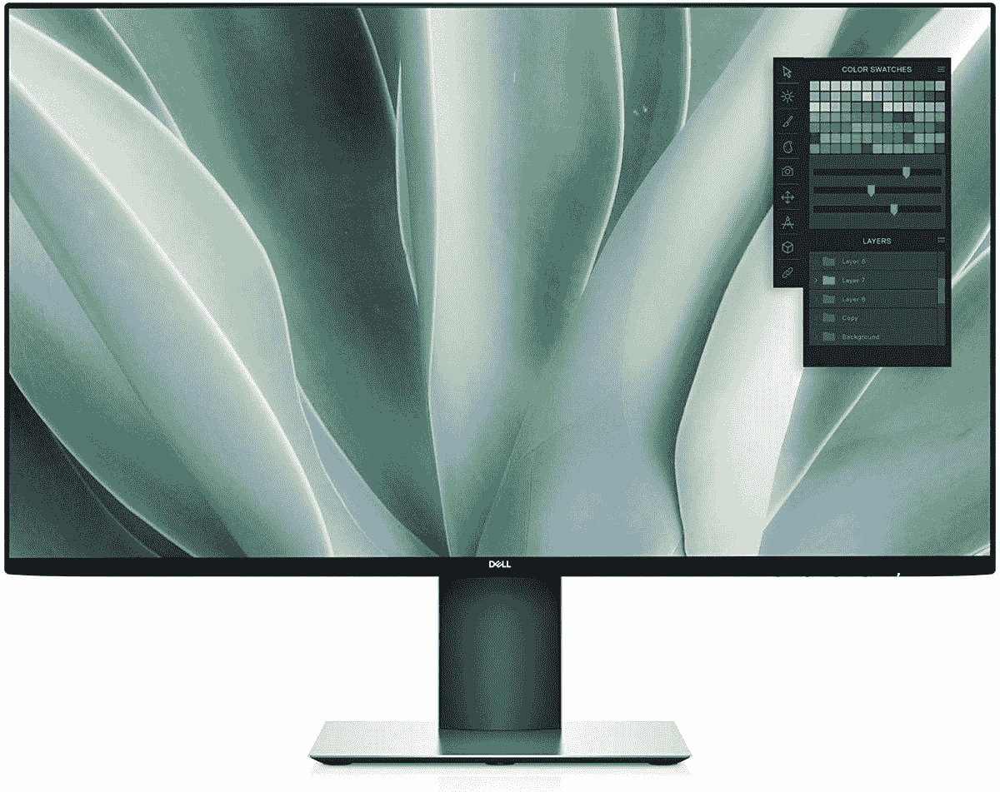
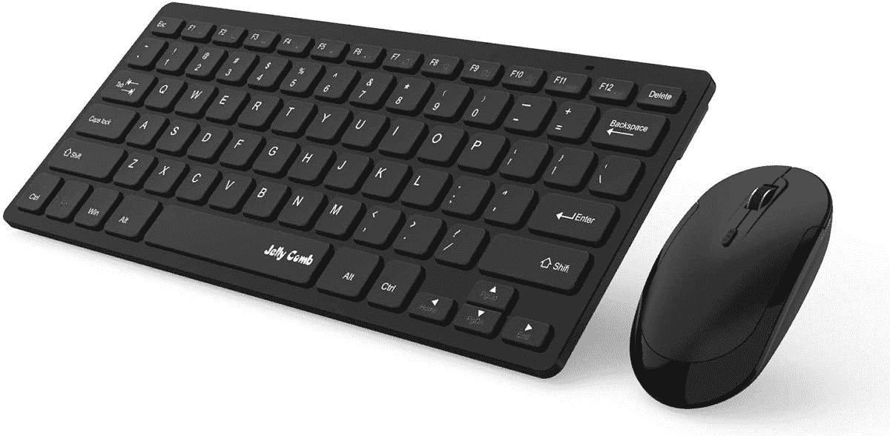

# 2023 年最佳三星 Chromebook 4 配件

> 原文：<https://www.xda-developers.com/best-samsung-chromebook-4-accessories/>

三星 Chromebook 4 是最受欢迎的经济型 Chromebook 之一。如果你最近买了一部三星 Chromebook 4，你会想要添加一些可爱的配件来增强你的体验。有一个盒子或袖子来随身携带 Chromebook 总是很好的。那些希望将三星 Chromebook 4 用作生产力机器的人也希望获得一个坞站。当然，还有许多其他配件可以考虑——触控笔、网络摄像头等等。

在本指南中，我们将了解三星 Chromebook 4 目前可用的基本配件。

**浏览本文:**

## 三星 Chromebook 4 的最佳坞站

如果你想将 Chromebook 与外部显示器配合使用，你可能需要添加一个扩展坞来增加可用端口的数量。有了一个好的坞站解决方案，你可以大大扩展你的 Chromebook 的多功能性。您可以使用它来连接鼠标、机械键盘、外部存储设备、多台显示器或同时连接所有设备。

最重要的是，有了一些扩展坞，你甚至可以让你的 Chromebook 充电，只要它有一个兼容的 USB Type-C 端口或 [Thunderbolt 端口](https://www.xda-developers.com/best-thunderbolt-docks/)。坞站非常适合学生以及在办公室对接机器的商业用户。

 <picture></picture> 

Targus USB-C Dual Video Docking Station

##### Tiergrade USB-C 扩展坞

Tiergrade USB C Chromebook 扩展坞非常适合高级用户。它提供了最广泛的端口选择，包括两个 USB 3.0 Type-A 端口、两个 USB 2.0 Type-A 端口、两个 USB 3.0 Type-C 端口、两个 HDMI 端口、一个 DisplayPort 端口、一个 RJ45 千兆以太网端口、3.5 毫米耳机和麦克风插孔、一个 S/PDIF 音频端口和一个 60W 功率输出的 USB 3.0 Type-C 端口。除此之外，该坞站还包括一个全尺寸的 SD 读卡器和一个 microSD 读卡器。

 <picture></picture> 

Baseus 17-in-1 USB-C Docking Station

##### Baseus 16 合 1 扩展坞

Baseus 16 合 1 Chromebook 坞站是 Tiergrade 坞站的廉价替代产品，端口选择略有不同。它包括三个 USB 3.0 Type-A 端口、两个 USB 2.0 Type-A 端口、两个 USB 3.0 Type-C 端口、一个支持直通充电的 USB type-C 端口、一个 RJ45 千兆以太网端口、一个 3.5 毫米耳机/麦克风组合插孔、一个 microSD 卡插槽和一个 SD 卡插槽。对于显示器连接，它具有一个 VGA 端口和一个 HDMI 端口。但是，它只支持双外部显示器的屏幕镜像。

 <picture></picture> 

NOVOO 8-in-1 USB-C Dock

##### NOVOO 8 合 1 USB-C 坞站

NOVOO 8 合 1 USB C dock 是该列表中最小的 Chromebook 坞站，为其赢得了最便携的称号。尽管它很小，但它包含 3 个 USB 3.0 Type-A 端口，一个以太网端口，一个 USB Type-C 端口，最高可提供 100W 直通充电，一个 HDMI 端口和一个 SD 读卡器。这么小的东西有这么多端口。让我想知道为什么一些水果原始设备制造商不能在他们的笔记本电脑上提供两个以上的 USB Type- C 端口。

 <picture></picture> 

Anker PowerExpand+

##### Anker PowerExpand+ 7 合 1 USB-C 集线器

如果你不愿意花 40 美元买一个小小的 USB C hub，那么 Anker PowerExpand+应该是一个更好的选择。它比 NOVOO USB C dock 稍大，但端口数量相同。这包括两个 USB 3.0 Type-A 端口、一个用于数据的 USB Type-C 端口、一个支持高达 100W 的直通充电的 USB Type-C 端口、一个 HDMI 端口和一个 SD 读卡器。如果你有基本的需求，它应该能完成工作。

 <picture></picture> 

SABRENT Universal Laptop Docking Station with Stand for Tablets and Notebooks

##### Sabrent 通用笔记本电脑扩展坞

Sabrent Chromebook 扩展坞是配有可拆卸键盘的 Chromebook 的不错选择，因为它配有一个支架，当您不使用附带的键盘时，可以用来支撑 Chromebook。在端口方面，它提供了两个 USB 3.0 Type-A 端口，两个 USB 2.0 Type-A 端口，两个 USB Type-A 2.4A 快速充电端口，一个 HDMI 端口，一个 DVI 端口，一个 USB 3.0 输入，3.5mm 耳机和麦克风插孔，以及一个 RJ45 千兆以太网端口。

 <picture></picture> 

Targus USB-C Dual Video Docking Station

##### Targus USB-C 通用扩展坞

Targus Chromebook 坞站是一个不错的二合一选择，不仅提供了一个体面的端口选择，还可以兼作符合人体工程学的支架。它包括 4 个 USB 3.0 Type-A 端口、2 个 DisplayPort 端口、2 个 HDMI 2.0 端口、1 个支持 60W 直通充电的 USB Type-C 端口、1 个耳机/麦克风组合插孔和 1 个 RJ45 千兆以太网端口。

## 三星 Chromebook 4 的最佳外接显示器

显示器有各种尺寸，价格范围从相当便宜到极其昂贵。在为 Chromebook 选择外部显示器时，你应该仔细考虑你的使用情况和预算。在这里，我们收集了 4K 性能的最佳显示器，创意专业人士，以及那些希望获得最佳整体效果的人。

 <picture></picture> 

HP 24mh

##### 惠普 24MH FHD 显示器

惠普 24mh 是一款 24 英寸的预算显示器，以要价提供了一系列良好的功能。它使用 IPS 面板，这意味着更好的色彩和视角，并且它还提供了很大的 sRGB 覆盖范围。该显示器还具有三个输入端口(HDMI、DisplayPort、VGA)，一个具有高度、枢轴和倾斜调节功能的功能支架，以及内置扬声器。

 <picture></picture> 

Lenovo ThinkVision M14

##### 联想 ThinkVision M14

寻找一台可以随身携带的外接显示器？联想为其客户提供 ThinkVision M14，它具有 14 英寸全高清面板和两个 USB-C 端口，可提供无缝连接体验。

 <picture></picture> 

Dell Ultrasharp U2719DX

##### 戴尔 Ultrasharp U2719DX

这款显示器具有 1，440 像素的分辨率，可提供出色的色彩准确度和清晰的视觉效果。它还采用了出色的工业设计，具有超薄的挡板和良好的 I/O 连接。

 <picture></picture> 

HP U28 4K

##### 惠普 U28 4K HDR 显示器

惠普的 U28 配备了工厂校准的 4K HDR IPS 面板，非常适合工作室工作，它还配备了一系列 I/O 端口。

 <picture></picture> 

LG 29WP60G-B

##### LG 29WP60G-B

LG 29 英寸超宽显示器应该非常适合寻求大量屏幕空间的用户。它配备了 29 英寸宽的 IPS 面板，提供全高清(2560 x 1080)分辨率、21:9 宽高比、99%的 sRGB 色域覆盖率、HDR10 和 AMD FreeSync。

##### 华硕 ProArt PA279CV 27 英寸 4K UHD 显示器

华硕 ProArt PA279CV 适合寻求外部显示器以进行照片或视频编辑的客户。它采用 27 英寸 4K 分辨率 IPS 面板，提供 100%的 sRGB 覆盖率，工厂校准用于 Delta E **附属链接**

Amazon

[View at Amazon](https://www.amazon.com/ASUS-ProArt-Display-Monitor-PA279CV/dp/B08K2GFDKM/?tag=xda-6hjd8vm-20&ascsubtag=UUxdaUeUpU4456&asc_refurl=https%3A%2F%2Fwww.xda-developers.com%2Fbest-samsung-chromebook-4-accessories%2F&asc_campaign=Short-Term)

## 三星 Chromebook 4 的最佳鼠标

当购买新鼠标来搭配你的[最爱的 Chromebook](https://www.xda-developers.com/best-chromebooks/) 时，舒适才是王道。在此列表中，我们将把每个鼠标的舒适操作置于其他高级功能之上。在考虑日常使用后，我们将关注电池寿命、价格点，当然还有与 Chrome OS 的集成。鼠标有各种形状和大小，所以在做出最终决定之前，查看大量选项是值得的。

 <picture></picture> 

Seenda 2.4G wireless mouse

##### Seenda 2.4G 无线鼠标

如果你需要一个预算有限的无线鼠标，Seenda 可以满足你的需求。这款鼠标没有一些花哨的功能，但价格不到 6 美元，设计舒适。这款设备的电池续航时间非常出色。对于那些只是偶尔使用鼠标的人来说，这是一个不错的选择。

##### 罗技 M355

有些鼠标要求你选择你是左撇子还是右撇子，但罗技 M355 不是。这款鼠标采用超薄扁平设计，非常适合双手灵巧的用户。此外，超薄的外形和超静音的点击使这款鼠标非常适合在工作中使用。

 <picture></picture> 

Jelly Comb mouse and keyboard combo

##### 果冻梳鼠标和键盘组合

就价值而言，捆绑包从来都不是坏事。Jelly Comb 打包了一个出色的无线键盘和鼠标组合，价格不到 25 美元。两款设备都具有出色的电池续航时间，以及不使用时的自动睡眠模式。

 <picture></picture> 

Logitech MX Master 3S

##### 罗技 MX Master 3

罗技 MX Master 系列是鼠标的行业标准。超快 mag 速度滚动，人体工程学设计和应用程序特定的定制使这一超优质的选择。凭借 USB-C 快速充电和在玻璃表面工作的能力，这是一款可以在任何地方使用的鼠标。

 <picture></picture> 

Logitech M510

##### 罗技 M510

谈到鼠标，罗技显然有几种选择。M510 之所以脱颖而出，是因为它一直被评为电池续航时间冠军。用户报告一次充电平均使用一年或更长时间。凭借舒适的设计和低于 25 美元的价格，这是一个很好的选择。

 <picture></picture> 

ICLEVER ERGONOMIC MOUSE

##### iClever 人体工程学鼠标

如果你觉得 Anker 垂直鼠标有点太高或太死板，iClever 还有另一个令人兴奋的选择。这款垂直鼠标具有更引人注目的曲线，以更浅的角度贴合手部轮廓。这款鼠标售价不到 25 美元，带有静音键，非常适合家庭或工作使用。

## 三星 Chromebook 的最佳保护套

Chromebooks 被设计成便携式的。为了在外出时保护你的投资，你可以以相当低的价格买一个袖子或包。如果你有一台支持 LTE 的 Chromebook 并经常旅行，这一点就更加重要了。这些选项中的大多数经常打折，使得交易更加甜蜜。有如此多的选项可供选择，您可以找到符合您个人风格的产品，并为日常工作和娱乐提供功能。

##### 亚马逊基础管理笔记本电脑套

如果你只是想要一个简单的没有装饰的袖子，亚马逊可以满足你。这款保护套的尺寸从 11.6 英寸到 15.6 英寸不等，具体取决于你的 Chromebook 的尺寸。有三种颜色可供选择，价格低廉，如果您只是需要偶尔将 Chromebook 带到户外，请选择它。

 <picture></picture> 

Case Logic Carrying Case

##### 携带案例 13/14 的案例逻辑

如果您需要在随身携带 Spectre x360 时为其提供额外保护，这款保护套的硬壳可以满足您的需求。同时，内部柔软，可以吸收笔记本电脑移动时产生的任何冲击。

 <picture></picture> 

Nacuwa Hard Sleeve

##### 纳库瓦硬套

如果你想要顶级的保护，从 Nacuwa 买这个硬套吧。这款保护套有多种尺寸可供选择，适用于任何 Chromebook。您还可以获得防泼溅保护，以及几个整理线缆和笔记本充电器的内袋。

 <picture></picture> 

Unika Leather Sleeve

##### 尤尼卡真皮笔记本电脑套

对于那些想要优雅袖子的人来说，UNIKA 有很好的颜色选择。这款保护套采用超薄设计，可容纳 13-15 英寸的 Chromebooks。

 <picture></picture> 

Lymmax Shockproof Sleeve

##### Lymmax 防震笔记本电脑套

有时候我们都会有一两天不顺心。有了 Lymmax 防震套，即使您的笔记本电脑掉落，也能得到保护。这种套管有多种颜色可供选择，但仅限于 13-15 英寸的尺寸兼容性。

 <picture></picture> 

Nillikin Laptop Sleeve with Stand

##### Nillkin 笔记本电脑包，带支架

你想要一个兼作支架的笔记本电脑套吗？Nillkin 提供的价格不到 30 美元。有四种颜色可供选择，你应该能找到一种符合你个人风格的。

这就是我们对三星 Chromebook 4 的最佳配件的总结，这是[最好的三星 Chromebook 之一](https://www.xda-developers.com/best-samsung-chromebooks)。请记住，亚马逊经常对这些产品打折，所以经常留意是明智的。您还可以设置一个页面监视器，以便在价格大幅下降时得到通知。三星 Chromebook 4 也可以从三星以批量教育价格购买，非常适合需要几台设备的教师或学校。

让我们知道你在 Chromebook 旅行中使用了哪些配件。如果你尝试了我们的一些选择，也请在评论中告诉我们它们是如何为你工作的。