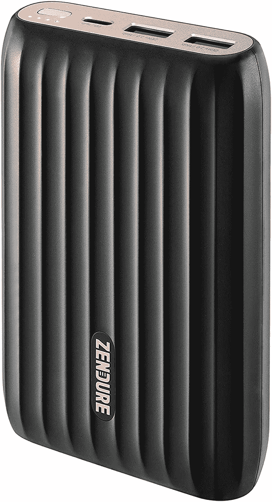
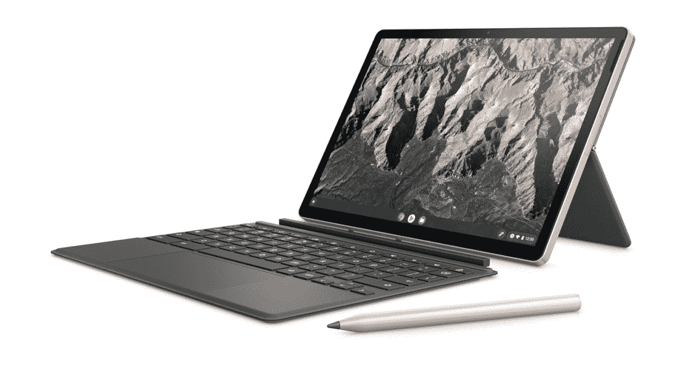

# 2023 年最佳三星 Chromebook 4 充电器

> 原文：<https://www.xda-developers.com/best-samsung-chromebook-4-chargers/>

# 2023 年最佳三星 Chromebook 4 充电器

在这本购买指南中，我们来看看三星 Chromebook 4 充电器的最佳替代选择。我们也关注电力银行。

三星 Chromebook 4 是百思买最受欢迎的经济型 Chromebook 之一。如果你正在寻找一台可以在学校使用的 Chromebook，这是你不想错过的。除了价格低廉，三星 Chromebook 4 还具有耐用的构造。的确，这是[最好的三星 chrome book](https://www.xda-developers.com/best-samsung-chromebooks)之一。鉴于这款设备的极端便携性，你可能想知道三星 Chromebook 4 充电器的最佳替代品。

三星 Chromebook 4 非常适合课堂使用，而且比许多其他替代品便宜很多。对于 Pixel Slate 或其他 Chrome OS 平板电脑，你将花费额外的现金来享受设备上的键盘和笔支持。如果你需要给你的孩子买一个 Chrome OS 设备，这是现在最大的考虑。当然，使用所有这些出色的功能也需要较长的电池续航时间。出于这个原因，你应该考虑为三星 Chromebook 4 挑选一个替换或备用充电器。

##### Anker PowerPort Atom III 60W 充电器

这款充电器可同时为您的笔记本电脑(45 瓦)和移动设备(15 瓦)充电，是您下次度假或出差时唯一需要的充电器。同时给你的 Chromebook 和手机充电！

 <picture></picture> 

Anker 45W slim charger

##### Anker 45W 超薄充电器

PowerPort Atom III 45W Slim 的厚度不到 0.8 英寸，采用折叠插头设计，为这款强大的壁式充电器提供了前所未有的便携性和便利性。

##### Baseus 100W GaN II USB-C 充电器

GaN II x 高通快充 5.0，比以往快 4 倍，体积小 40%，散热高达 50 华氏度，效率比以往高 70%。对于 Chromebook 来说，这可能有点过了，但它也适用于你所有的其他设备。

 <picture></picture> 

Nekteck 45W USB C Wall Charger

##### Nekteck 45W USB-C 壁式充电器

这是一个相当标准的 45W PD 充电器，但它带有内置的充电电缆。如果你像我一样容易丢失电缆，这是正确的方法。另外。它经常以低于 20 美元的价格出售。

 <picture></picture> 

Anker 543 Charger

##### Anker PowerPort Atom III 65W 超薄充电器

同时给四台设备充电。PowerIQ 3 0 支持的 USB-C 端口可提供最大 45W 的输出，以最高速度为几乎任何 USB-C 设备充电，而三个 USB 端口共用 20W 的总功率，为移动设备提供优化的充电。

 <picture></picture> 

Zendure X5 1500MAH Portable Charger

##### Zendure x5 15000mAh 便携式充电器

对于那些需要移动电源的人，Zendure 的 15，000 mAh 便携式充电器可以完成任务。你可以连接多个设备，并在 30 分钟内将 Chromebook 充电至 40%。

这些是我们为您的三星 Chromebook 4 挑选的最佳充电器。请记住，您的三星 Chromebook 4 也非常适合在旅行时观看网飞。这意味着你可能也想为你的三星 Chromebook 4 配备一个电源。如果你想变得有趣，Baseus 100W 充电器拥有最新的充电技术，应该在相当长的一段时间内不会过时。那些需要内置电缆的基本解决方案的人应该选择 [Nekteck 45W 充电器](https://www.amazon.com/Nekteck-Charger-Delivery-Charging-Adapter/dp/B0834VR6VJ/?tag=xda-37gc4ik-20&ascsubtag=UUxdaUeUpU4716&asc_refurl=https%3A%2F%2Fwww.xda-developers.com%2Fbest-samsung-chromebook-4-chargers%2F&asc_campaign=Short-Term)。这些充电器和电力银行经常在亚马逊上打折，所以请留意以抓住最划算的交易。

随着新充电器的出现和价格的变化，我们会经常更新此页面。让我们知道你在 Chromebook 上使用了哪种充电器[。如果您有我们遗漏的建议，也请告诉我们。](https://www.xda-developers.com/best-chromebooks/)

 <picture></picture> 

HP Chromebook x2 11

##### 惠普 Chromebook x2 11

惠普 Chromebook x2 11 结合了 Chrome OS 的强大功能和传统平板电脑的便携性。借助可选的 4G LTE 功能，您可以在任何地方工作。这是全新的顶级 Chrome OS 平板电脑体验。