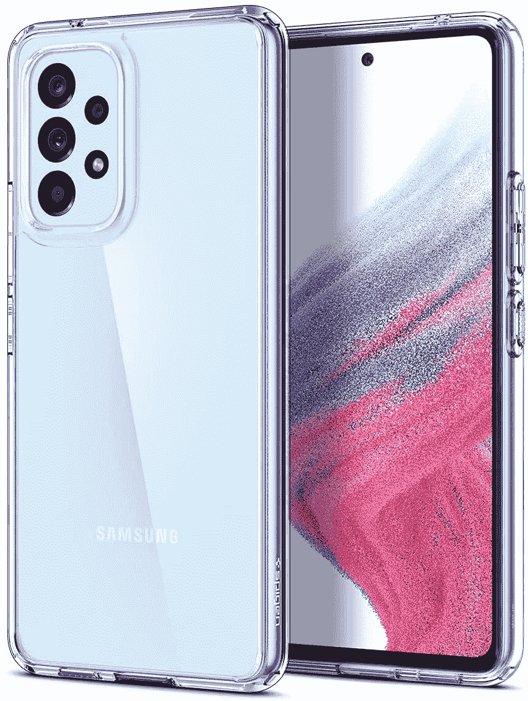

# 2023 年最佳三星 Galaxy A53 保护套

> 原文：<https://www.xda-developers.com/best-samsung-galaxy-a53-cases/>

# 2023 年最佳三星 Galaxy A53 保护套

三星 Galaxy A53 5G 是该公司的中端产品，有望在全球范围内流行。下面是一些案例推荐！

三星 Galaxy A53 5G 是三星 2022 年非旗舰 A 系列阵容的一部分。这是一个实用的设备，它选择提供一系列全面的功能，而不是只利用一种规格而忽略其他的。其结果是一款非常适合普通消费者的设备。由于三星通常对 A 系列进行营销推广，以及它在全球主要市场拥有广泛的零售分销渠道，Galaxy A53 5G 将成为 500 美元以下最容易推荐和购买的手机之一。

如果你已经通过一笔划算的交易拿到了其中的一个，我们建议你选择一个保护套和一个屏幕保护器。Galaxy A53 5G 的背面和侧面都是聚碳酸酯材质——有些人可能喜欢这种抓握感，而有些人可能不太喜欢。无论哪种方式，摔手机都有很大的概率损坏它。这款手机有长达 4 年的软件更新承诺，所以你的硬件也要保持良好状态才能持续这么长时间。因此，下面是我们对各种类别的最佳三星 Galaxy A53 5G 保护套的建议！

*   <picture></picture>

    Supcase 独角甲虫 Pro

    ##### sup case 独角甲虫 Pro

    如果你想要无与伦比的保护，那么 sup case 独角甲虫 Pro 就是为你服务的。你不仅得到了一个坚固的外壳，还得到了一个屏幕保护，一个集成支架和一个皮带夹皮套。这是确保你的手机不会发生任何事情的终极案例。

*   <picture></picture>

    Spigen Ultra Hybrid

    ##### Spigen Ultra Hybrid Galaxy A53 case

    Spigen Ultra Hybrid 是我个人对我拥有的每一部手机的首选之一。这种情况下阵容有加强双方和良好的质量保护。如果你想炫耀 Galaxy A53 5G 带来的有趣颜色，这就是你得到的情况。

*   <picture></picture>

    Otterbox 通勤简装

    ##### Otterbox 通勤简装

    用于 Galaxy A53 5G 的 Otterbox 通勤简装是坚固外壳的另一种选择，它适合那些希望专注于保护但又希望更简单的设计而不引人注目的人。这种情况下有一个两部分的设计，让你既灵活的 TPU 内壳和较硬的外壳。

*   <picture></picture>

    伊布莱森 Cosmo

    ##### 伊布莱森 Cosmo Galaxy A53 表壳

    伊布莱森 Cosmo 系列拥有自己独特的绘画，得益于跨越玫瑰金、大理石白和灰色口音的金色交织的复杂图案。这种情况下也有一个集成的屏幕保护。当你想吸引别人的注意，同时又想保护你的手机时，你就会遇到这种情况。

*   <picture></picture>

    S-View 钱夹套

    ##### 三星 S-View 钱夹 Galaxy A53 外壳

    三星 S-View 钱夹套有一个翻盖，可以保护您的显示器免受灰尘和随机划痕，同时还可以让您偷看通知和时钟。里面也有插槽，让你储存一些卡和现金。在这种情况下，您可以在显示器上获得信息，同时保持保护，并且您可以从内部的卡中携带信息。

目前，这些是我们在设备上推荐的案例。与 Galaxy S 系列不同，Galaxy A 系列没有广泛的外壳阵容，尽管 Galaxy A53 5G 已经上市几个月了。有很多普通的案例，但是一旦你考虑到品牌商誉、产品评论、保护、设计和成本，这些选项就变少了。本文中的选项是我们为任何希望为 Galaxy A53 5G 购买出色外壳的人推荐的。如果你正在寻找更多的东西，这里是我们对 Galaxy A53 5G 的最佳充电器和其他配件的建议。

 <picture></picture> 

Samsung Galaxy A53 5G

##### 三星 Galaxy A53 5G

三星 Galaxy A53 5G 是一款中端产品，在世界大部分地区都有销售。Galaxy A53 5G 结合了出色的显示屏、出色的摄像头、体面的日常性能和出色的电池续航时间，拥有轻松满足您日常需求的所有关键要素。