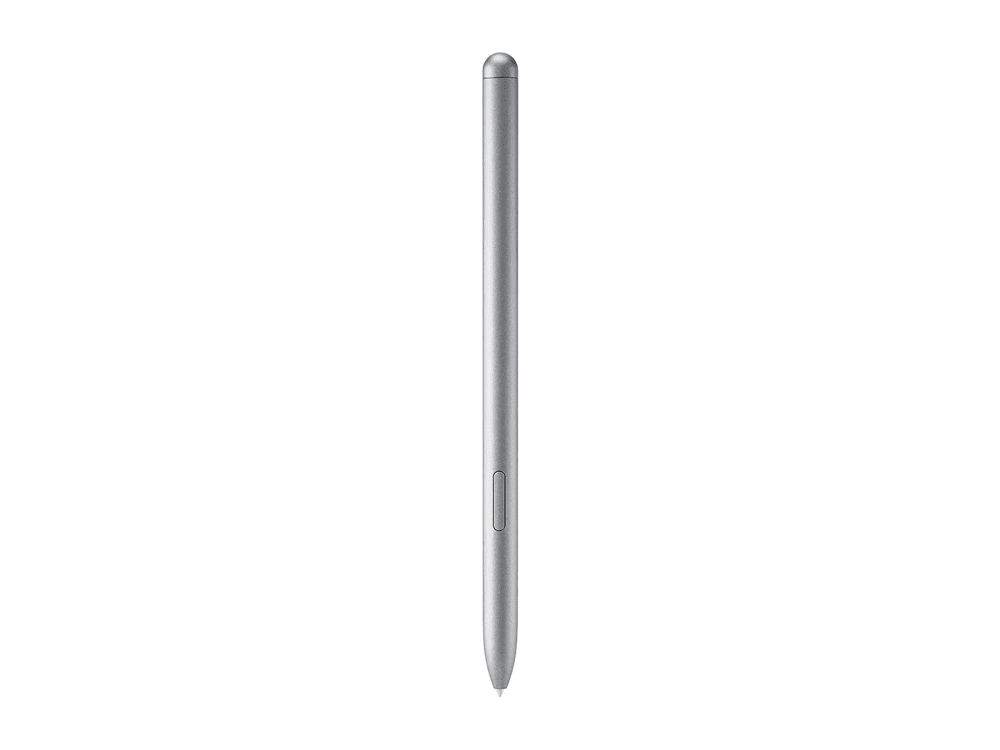
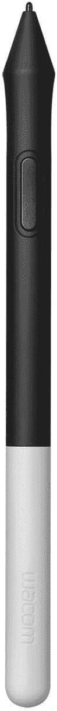
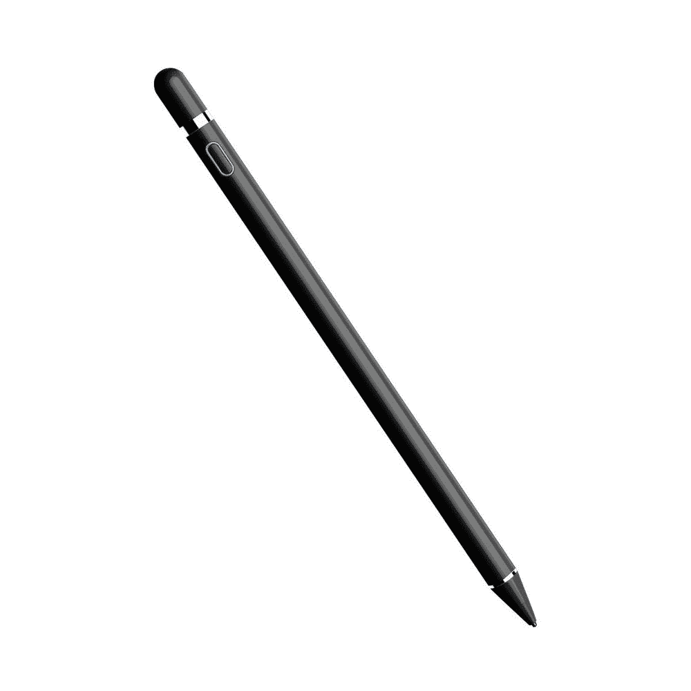
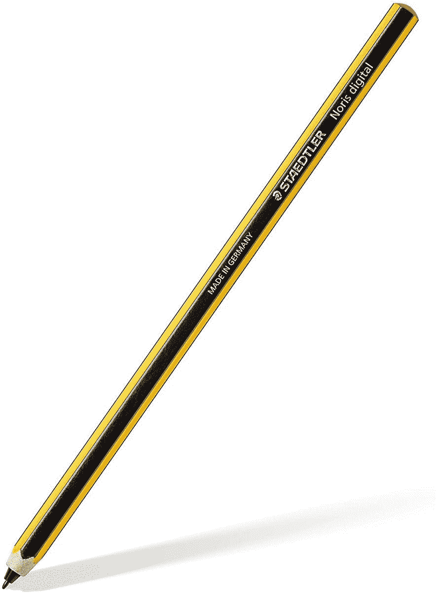
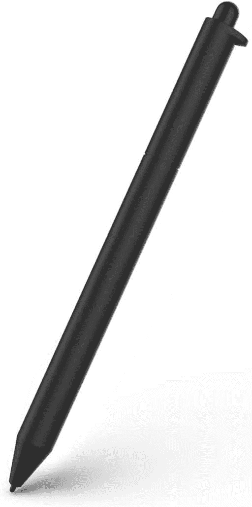
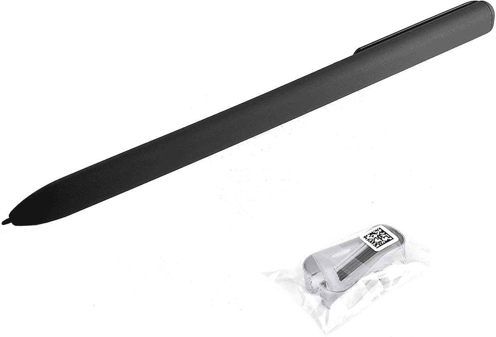
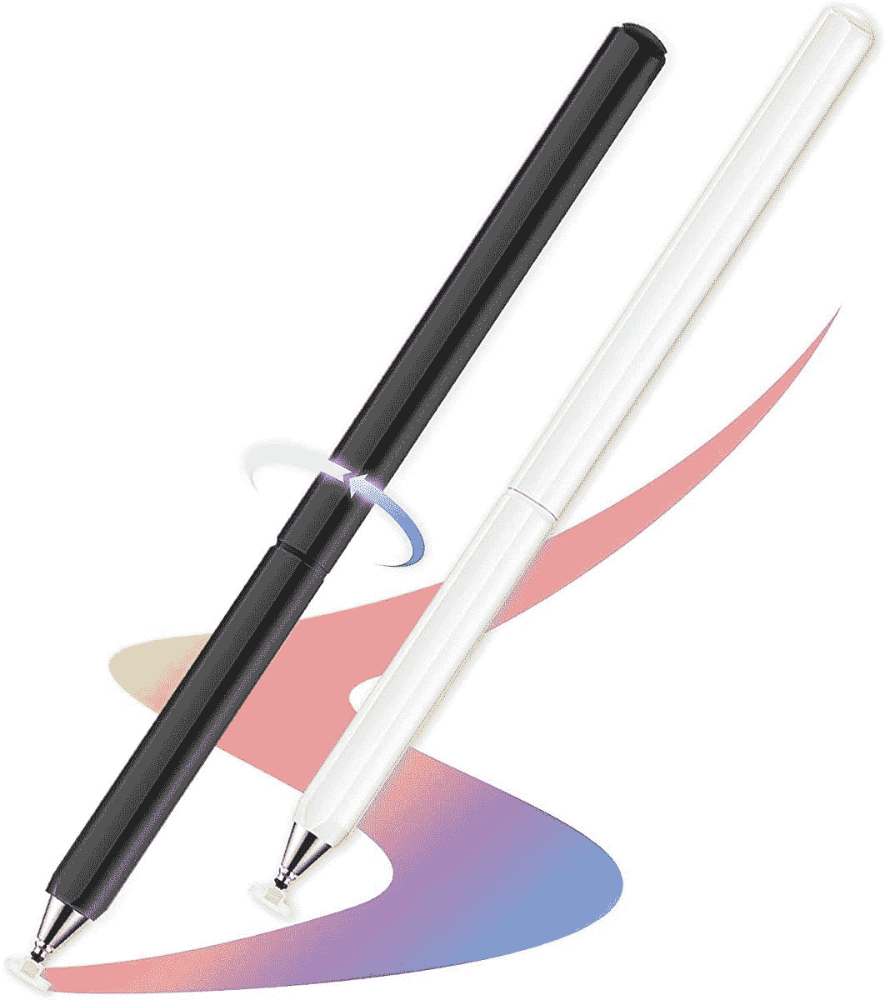

# 2023 年三星 Galaxy Book 2 Pro 360 的最佳替代笔

> 原文：<https://www.xda-developers.com/best-samsung-galaxy-book-2-pro-360-pens/>

# 2023 年三星 Galaxy Book 2 Pro 360 的最佳替代笔

如果您放错了三星 Galaxy Book 2 Pro 360 附带的 S Pen，我们为您收集了一些替换选项。

三星 Galaxy Book 2 Pro 360 是一款[梦幻的可转换笔记本电脑](https://www.xda-developers.com/best-convertible-laptops/)，在令人难以置信的轻薄设计中融入了高端性能。作为敞篷车也意味着它非常多才多艺。你可以像笔记本电脑一样舒适地使用它，但你也可以旋转屏幕，将其用作平板电脑。为此，三星 Galaxy Book 2 Pro 360 配备了 S Pen 这样书写和绘图更直观。

但是如果你碰巧弄丢了呢？没有简单的方法将 S Pen 连接到 Galaxy Book 2 Pro 360 上，因此很容易忘记它或将其丢在某个地方。这时你需要寻找替代方案，而我们就是来帮助你的。如果你碰巧需要一只新的 Galaxy Book 2 Pro 360 笔，我们总结了几个选项——尽管它们也应该适用于原始的 Galaxy Book Pro 360，以及非专业的 Galaxy Book 2 360。

 <picture></picture> 

Samsung S Pen

##### 三星 S Pen

三星官方的 S Pen 是三星 Galaxy Book 2 Pro 360 的最佳替代选择。这是为 Galaxy Tab S7 设计的，但它也可以很好地用于笔记本电脑。

 <picture></picture> 

Wacom One Pen

##### Wacom One Pen

Wacom One pen 是为 Wacom 自己的平板电脑设计的，但由于支持 EMR 技术，它也可以与 Galaxy Book 2 Pro 360 和其他三星设备配合使用。

 <picture></picture> 

SaharaBasics Stylus

##### 撒哈拉手写笔

SaharaBasics 手写笔适用于各种设备，包括三星手机和平板电脑、iPads 以及各种笔记本电脑品牌，此外它还具有时尚的设计。

 <picture></picture> 

Staedtler Noris Digital Classic

##### Staedtler Noris 数字经典

你希望数字笔感觉像真的铅笔吗？这是给你的笔，形状完全像一支六边形铅笔，但支持 Wacom EMR，适用于三星的笔记本电脑和其他设备。

 <picture></picture> 

S Pen Pro

##### 三星 S Pen Pro

如果你想要一支可以在几乎所有三星设备上使用的笔，这是最好的选择。它可以与任何东西兼容，包括 Galaxy Z Fold 3。

 <picture></picture> 

BOOX Stylus Triangle Pen

##### Boox 手写笔三角笔

如果你想为你的笔记本电脑买支新笔，BOOX 手写笔三角笔是个不错的选择。它是为 BOOX 电子阅读器设计的，但也适用于三星设备。

 <picture></picture> 

Eaglewireless S Pen Replacement

##### Eaglewireless 笔的替代品

想要一支便宜的替换笔吗？这支笔可以与三星 tbalets 和 Galaxy Book 2 Pro 360 等笔记本电脑配合使用，而且超级实惠。

 <picture></picture> 

BOOX Magnetic Pen2 Pro

##### BOOX 磁性笔 2 专业版

BOOX Magnetic Pen2 Pro 是一款为 BOOX 电子阅读器设计的 syilish 笔，但由于它使用 Wacom EMR 技术，因此它可以与三星设备配合使用。此外，它有一个圆滑和时尚的外观。

 <picture></picture> 

OASO Stylus Pens

##### Oaso 手写笔

想要最便宜的解决方案吗？这些手写笔不是活动的，这意味着它们就像你的手指一样。它们的功能没那么强，但仍然可以用来画画或做笔记。

这些是我们为三星 Galaxy Book 2 Pro 360 和其他支持笔输入的三星笔记本电脑推荐的一些笔。这些都是可靠的选择，但是如果我要买一支并且想要安全起见，我会选择官方的钢笔，这样我就可以完全肯定它会像宣传的那样有效。如果你想要一个真正便宜的选择，Eaglewireless S 笔的替代品可能也能做到这一点。

如果你对笔记本电脑本身感兴趣，你可以在下面购买三星 Galaxy Book 2 Pro 360。这是市面上最好的轻型笔记本电脑之一，它配备了英特尔第 12 代 P 系列处理器和令人惊叹的 AMOLED 显示屏，所有这些都包裹在令人惊讶的轻便设计中。它有两种尺寸:13.3 英寸和 15.6 英寸。否则，你可以看看[最好的笔记本电脑](https://www.xda-developers.com/best-laptops/)，看看你是否能找到其他选择。

 <picture></picture> 

Samsung Galaxy Book 2 Pro 360

##### 三星 Galaxy Book 2 Pro 360

Ssamsung Galaxy Book 2 Pro 360 是一款轻便的笔记本电脑，具有高端性能和漂亮的 AMOLED 显示屏。