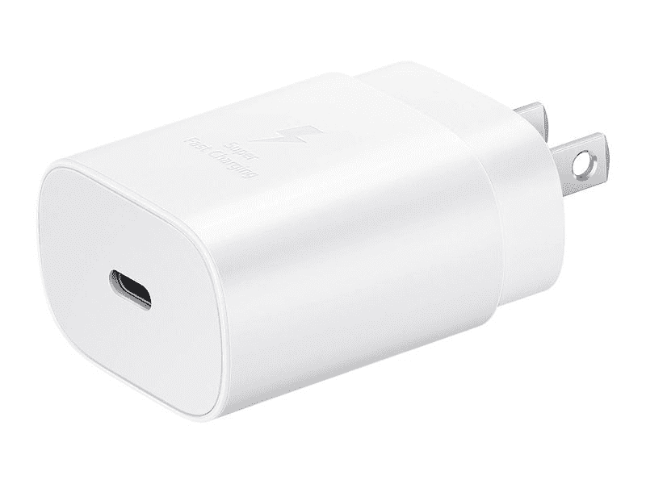
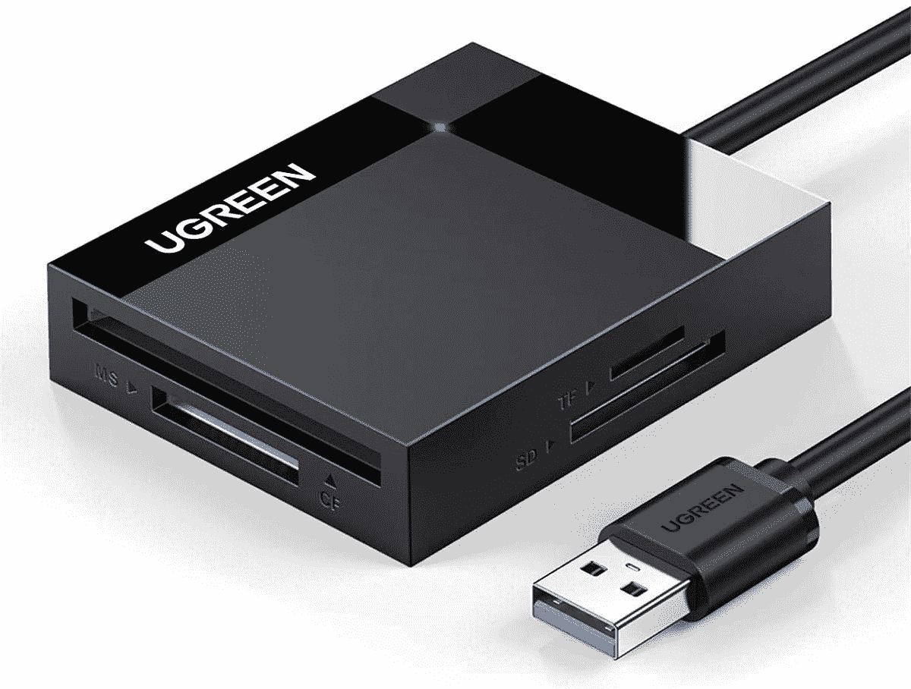
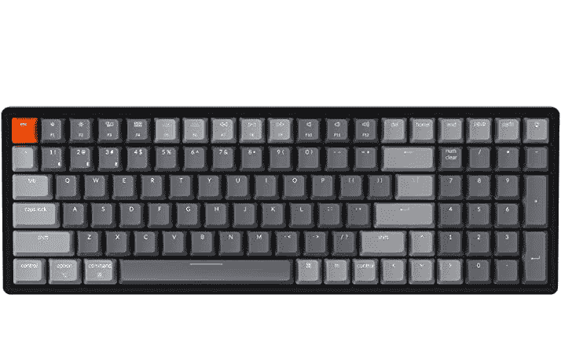
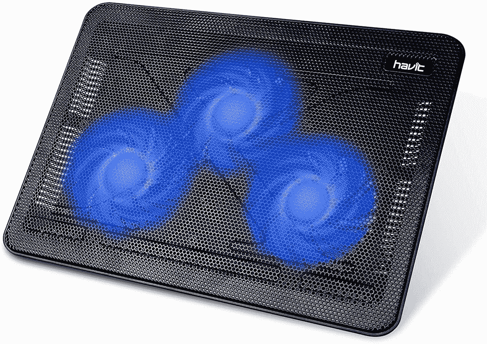
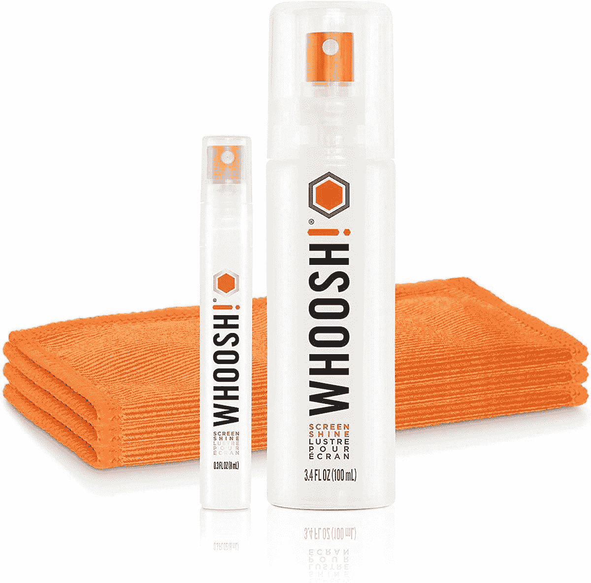
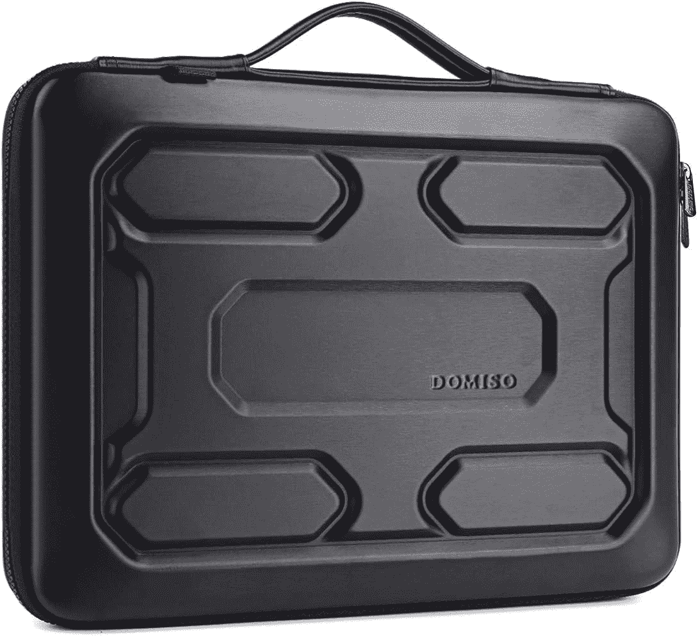
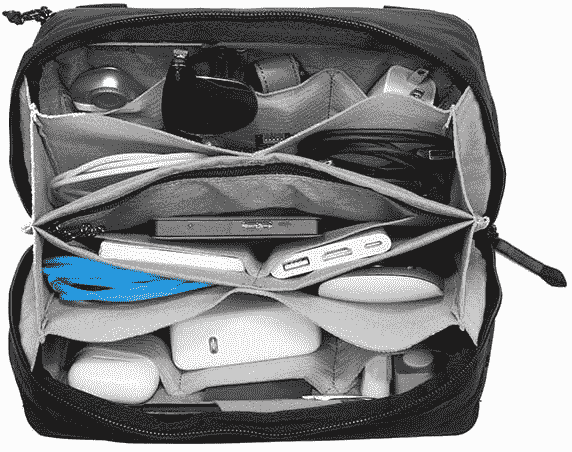
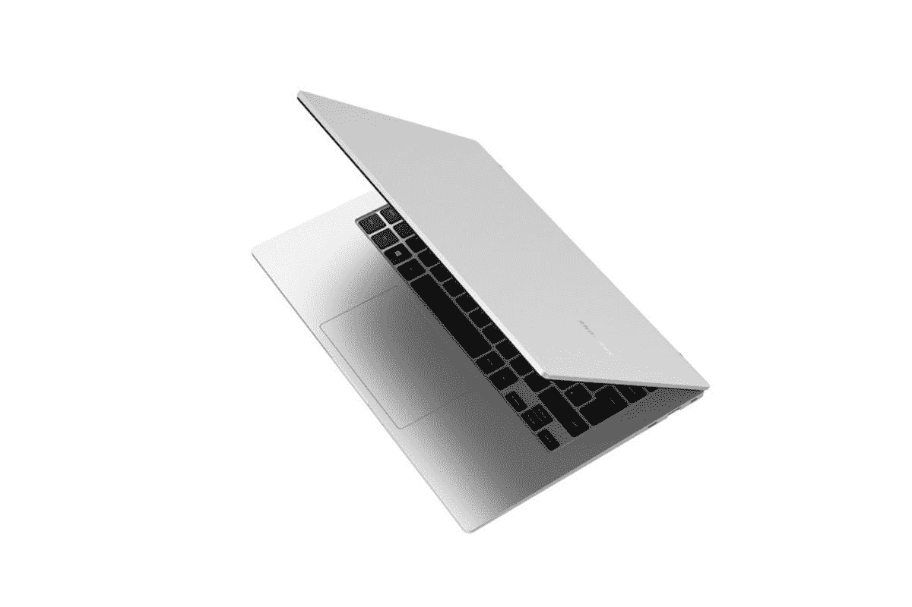

# 最佳三星 Galaxy Book Go 配件

> 原文：<https://www.xda-developers.com/best-samsung-galaxy-book-go-accessories/>

尽管在这一点上已经超过一年，三星 Galaxy Book Go 是三星笔记本电脑阵容中更有趣的设备之一。它配备了高通的骁龙 7c Gen 2 芯片组，对于这样一款价格实惠的设备来说，这是一款非常好的处理器，它能够以低于您预期的价格实现入门级的性能和电池续航时间。它甚至有一个像样的屏幕，它的建造也相当不错。还有一种 5G 型号，具有更强大的骁龙 8cx 第二代处理器，这一款也仍然非常超值。

由于这是一款基于 Arm 的笔记本电脑，所以有些应用程序不能很好地运行，但对于基本使用和使用 Microsoft Edge 浏览网页来说已经足够好了。有了更强大的处理器，5G 模型甚至可以处理一些更强大的任务，尽管你仍然不应该指望使用 Photoshop 或类似的东西。这款笔记本电脑的主要功能包括 14 英寸全高清液晶显示屏、高达 8GB 的 LPDDR4x 内存和高达 128GB 的 eMMC 存储。

每台笔记本电脑都可以通过一些配件变得更好，三星 Galaxy Book Go 也不例外。因此，如果你想提升你的体验，这里有一些你可以买的最好的配件。

## 家庭或办公室的最佳配件

如果你在家里使用三星 Galaxy Book Go，有一些配件可以派上用场，如外部显示器、USB 集线器、充电器(如果你丢失了你的)等等。这里有一些你可能会觉得有用的附件。

*   <picture></picture>

    三星 25W 超快壁式充电器

    ##### 三星 25W USB-C 充电器

    Galaxy Book Go 可以通过标准的 25W USB-C 充电器充电，最好选择三星制造的充电器，以获得最佳兼容性。

*   ##### Anker 341 7 合 1 USB-C Hub

    这个坞站比以前的更紧凑，更庞大，但它只会给你最基本的东西。它包括 HDMI、SD 卡、USB Type-C 和 Type-A 端口等。如果您需要更多端口，但又不想花很多钱，这是一个不错的选择。

    T34
*   <picture></picture>

    u 绿色 SD 读卡器

    ##### u 绿色 SD 读卡器

    是摄影师和摄像师的必需品，拥有多卡读卡器可确保您可以快速将照片和视频复制或移动到您的笔记本电脑上进行编辑。UGREEN 读卡器带有 USB 3.0 接口，支持大量不同的存储卡格式和标准。

*   <picture></picture>

    键盘龙 K4 V2

    ##### 键盘龙 K4 V2

    如果你想要更舒适的打字体验，你不可能比机械键盘做得更好了，而键盘龙 K4 是一个绝佳的选择，拥有专业的设计和各种开关选项可供选择。

*   ##### 罗技 MX Master 3S

    罗技 MX Master 3S 是市场上最好的鼠标之一，拥有高级设计和制造，两个滚轮(一个用于水平滚动)，以及一个 8K 传感器，可以在任何地方工作，甚至在玻璃上。

    T34
*   ##### 三星 S65UA Ultra WQHD 显示器

    三星 S65UA 是一款具有四倍高清分辨率的超宽显示器，非常适合在办公环境中进行多任务处理。它很大，很锋利，所以你可以更容易地并排使用多个应用程序。

*   ##### 明基 TH575

    如果你想在更大的屏幕上欣赏内容，明基 TH575 是一款非常棒且相对实惠的 1080p 投影仪，可以在家里或其他室内空间使用。它可以投射最大 100 英寸的图像。

    

*   ##### 罗技 C920S Pro 高清网络摄像头

    就其价格范围而言，罗技 C920S 是一款出色的网络摄像头。提供 1080p 视频支持、自动对焦和光线校正，几乎适用于任何环境。也相对实惠。

*   ##### 【Razer Barracuda X(2022)

    Razer Barracuda X 是一款有趣的耳机，它使用 USB-C 加密狗进行无线连接，这意味着你可以在几乎任何设备上使用它，它比蓝牙更可靠。不过，如果你不喜欢加密狗，它也支持蓝牙。

*   <picture></picture>

    Havit HV-f 2056

    ##### Havit HV-f 2056 笔记本电脑散热垫

    为您的笔记本电脑配备散热垫可以确保它在重负载下保持凉爽，从而保持稳定的性能。Havit 的这款特殊型号配有三个风扇、可调支脚和两个额外的 USB 端口，可以为外部设备供电。

*   <picture></picture>

    cloud valley 网络摄像头盖

    ##### cloud valley 网络摄像头盖

    担心隐私？为您的 Galaxy Book Go 购买这款简单易用的网络摄像头滑盖，它可以使用 3M 强力胶贴在挡板上。

*   <picture></picture>

    嗖！屏幕清洁剂套装

    ##### 嗖！屏幕清洁剂套装

    嗖！是一款屏幕清洁剂，可以帮助您保持 Galaxy Book 上的显示屏绝对一尘不染。这种液体试剂对包括笔记本电脑、智能手机和平板电脑在内的所有屏幕都是无味和安全的。该套件还配有三块抗菌超细纤维布，这样你就不会刮伤或留下任何纤维。

## 外出时使用的最佳配件

如果你带着三星 Galaxy Book Go 旅行，有许多其他配件你可能会有兴趣与三星 Galaxy Book Go 一起使用，以使体验更好。

*   三星最新的旗舰耳塞是市场上最好的耳塞之一，它们可以很好地配合笔记本电脑和手机使用。这是少数几个带有专用 Windows 应用程序的耳塞之一，看起来总是很好。

*   ##### Anker 733 gan prime Power core 65W 电源组

    Anker 733 充电器既是壁式充电器，也是 10，000mAh 电源组，因此它可能是您的三星 Galaxy Book Go 所需的唯一充电器。它提供了 65W 的功率，对于这台笔记本电脑来说绰绰有余，它甚至可以为更强大的型号充电。

*   ##### 罗技 Pebble M350

    罗技 Pebble 鼠标是一款小巧时尚的鼠标，您可以将它带到任何地方，非常适合移动使用。它可以让你比使用触摸板更有效率，但它仍然非常便携。

*   ##### 三星 EVO Plus microSD

    您可以轻松扩展 Galaxy Book Go 上的存储空间，因为它带有 microSD 卡插槽。三星 EVO Plus 具有出色的可靠性和高达 130 MB/秒的快速读取速度。

*   ##### 三星 T7 Touch 便携式固态硬盘

    三星提供了一些最好的最快存储解决方案，T7 Touch 便携式固态硬盘应该是 Galaxy Book Go 的绝佳伴侣，特别是如果你想从内部存储中卸载数据的话。这种特殊的版本还带有内置指纹扫描仪，以增强安全性。

*   <picture></picture>

    联想 ThinkVision M14t

    ##### 联想 ThinkVision M14t

    如果你想随身携带你的双屏设置，投资一台便携式显示器是非常有意义的。联想 ThinkVision M14t 提供了一个 14 英寸的全高清面板，可以通过 USB-C 轻松连接。如果你想要更直观的东西，它甚至支持触摸输入。

*   <picture></picture>

    多米索笔记本电脑套

    ##### 多米索防震笔记本电脑套

    为您的 Galaxy Book Go 提供额外保护的硬壳保护套，采用加厚的防震 PU 和 EVA 材料。它可以容纳笔记本电脑以及一些额外的附件，包括电源插头、电缆等。

*   <picture></picture>

    Peak Designs Tech pocket

    ##### Peak Design Tech pocket

    要记住你所有的充电器、线缆、软件狗、USB 驱动器等可能很难，尤其是如果你有把它们扔进包里的习惯的话。Peak Designs tech 小袋是一种很好的整理方式。

*   ##### Moft Z 不可视笔记本电脑支架

    有时，很难将笔记本电脑放在合适的位置上工作，但 Moft Z 笔记本电脑支架是一个简单的选择，可以让事情变得更好。这是一个灵活的支架，你可以用它来增加笔记本电脑的高度，因此你可以在任何地方舒适地使用它。

这些是你应该考虑的三星 Galaxy Book Go 的一些最佳配件。有很多选项可以让你的体验更好，包括三星自己的许多选项，所以你一定会在这里找到你喜欢的东西。

三星 Galaxy Book Go 此时已经快两年了，所以不是最容易推荐的，不过有兴趣可以在下面找一下。如果你想看看其他一些不错的选择，你可能想看看今天能买到的最好的三星 Galaxy 笔记本电脑。或者，你可以将搜索范围扩大到一般意义上的[最佳笔记本电脑](https://www.xda-developers.com/best-laptops/)，因为其他品牌也有一些很棒的设备。

*   <picture></picture>

    三星 Galaxy Book Go

    ##### 三星 Galaxy Book Go

    三星新推出的 Galaxy Book Go 是一款价格实惠的基于 ARM 的 Windows 笔记本电脑，搭载了高通骁龙 7c Gen 2 SoC。

*   ##### 三星 Galaxy Book Go 5G

    三星 Galaxy Book Go 的 5G 型号拥有更强大的处理器，当然还有蜂窝网络支持。

    T34