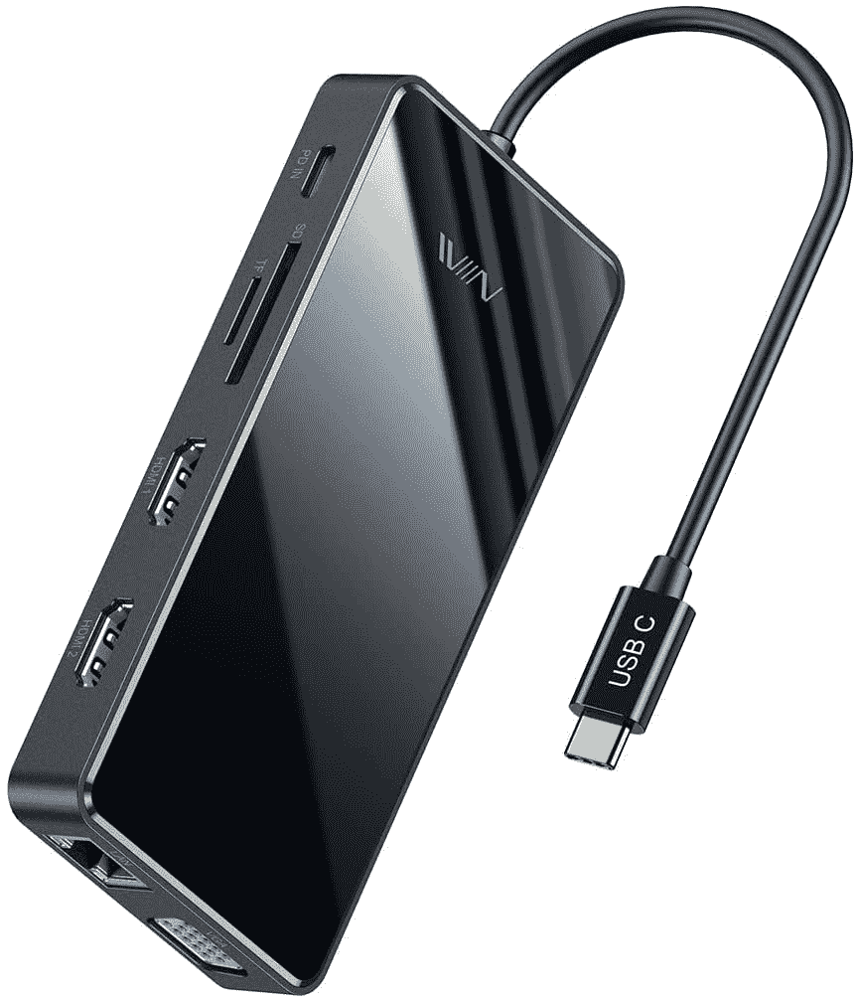
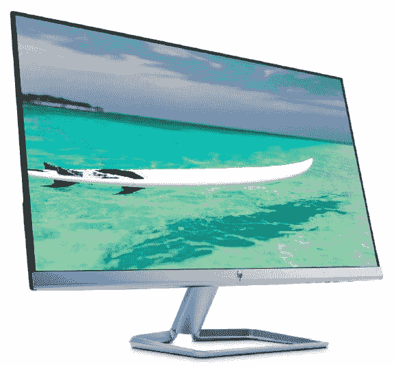
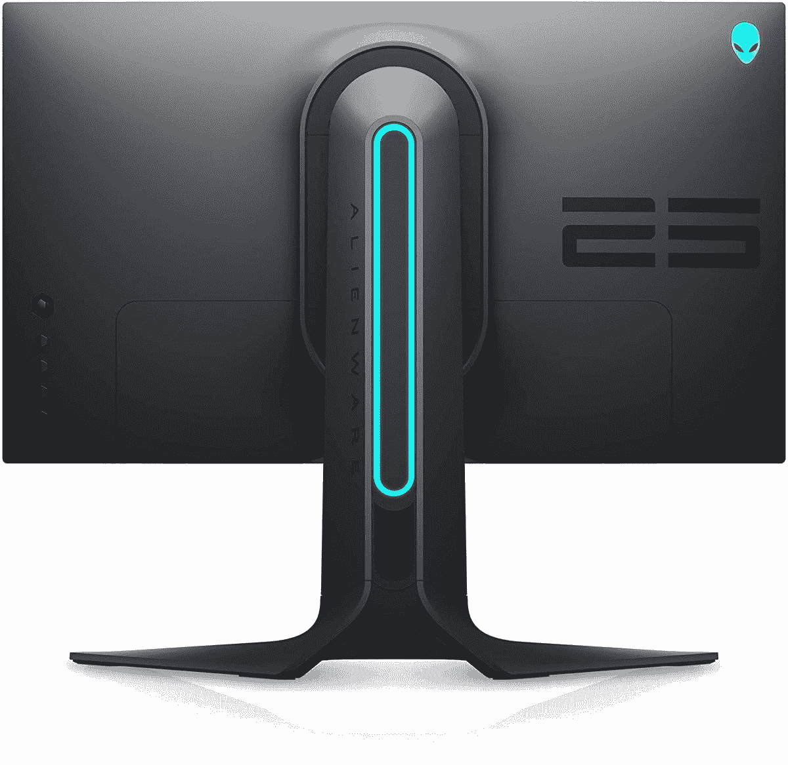
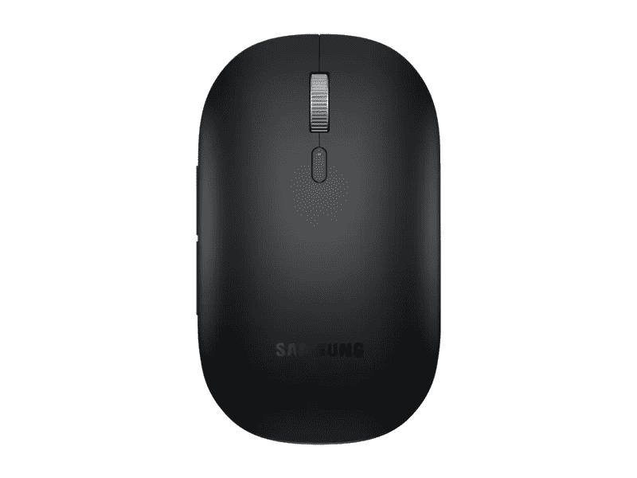
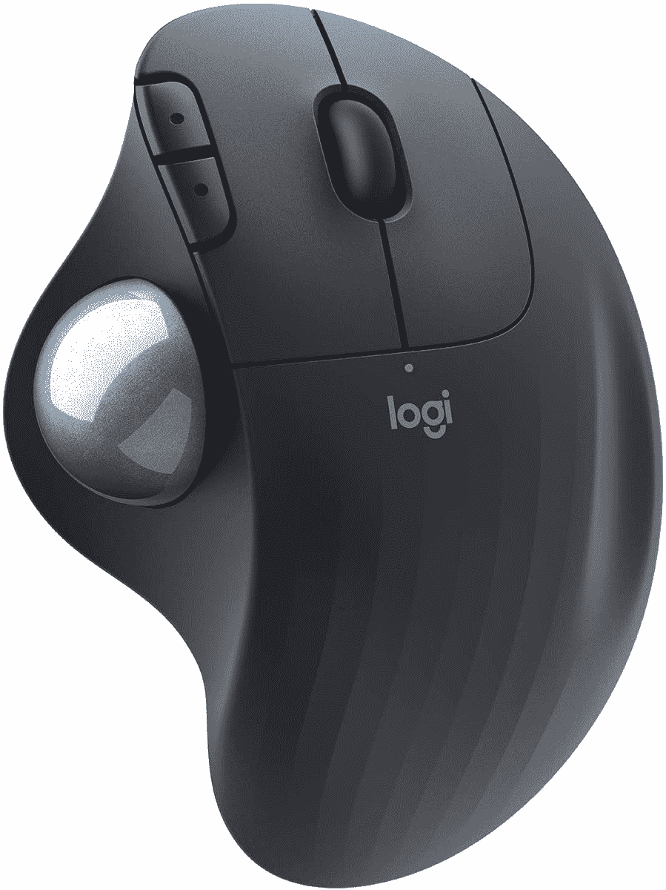
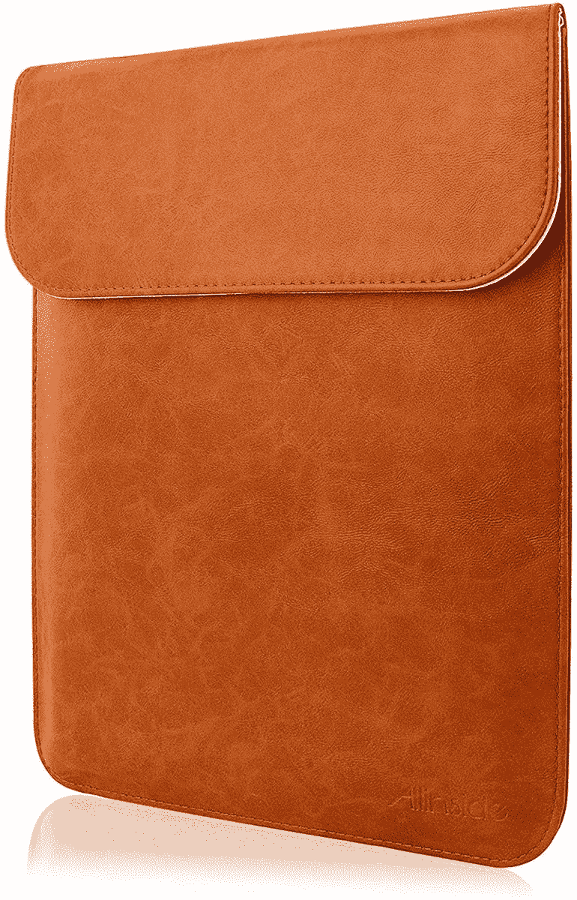

# 2023 年最佳三星 Galaxy Chromebook 2 配件

> 原文：<https://www.xda-developers.com/best-samsung-galaxy-chromebook-2-accessories/>

三星是最大的消费电子产品制造商之一，其中包括一系列令人印象深刻的运行 Chrome OS 的设备。如果你喜欢高端设计，三星绝对是值得考虑的顶级 Chromebook 制造商之一。事实上，[三星 Galaxy Chromebook 2](https://www.xda-developers.com/samsung-galaxy-chromebook-2-review/) 是你能买到的[最好的 Chromebook](https://www.xda-developers.com/best-chromebooks/)之一，chrome book 上有史以来第一个 QLED 显示屏。

在这份名单中，我们将看看最好的三星 Galaxy Chromebook 2 配件。从鼠标到触控笔，我们为您提供全方位服务。如果你在工作或学校使用 Galaxy Chromebook 2，你可以使用一个[坞站](https://www.xda-developers.com/best-docking-stations-chromebooks/)和外部显示器。外接显示器可以提供更多的屏幕空间，扩展坞可以提供额外的多任务端口。当然，当你带着 Galaxy Chromebook 2 上路时，你还需要一个出色的鼠标。拥有一个漂亮的袖子来日常携带 Chromebook 也很有用，即使你使用背包。

## 三星 Galaxy Chromebook 2 的最佳坞站

您是否希望将 Galaxy Chromebook 2 用作日常办公笔记本电脑？您需要添加一个扩展坞来增加可用端口。有了一个好的坞站解决方案，你可以大大扩展你的 Chromebook 的多功能性。您可以使用它来连接鼠标、机械键盘、外部存储设备、多台显示器或同时连接所有设备。

*   <picture></picture>

    Anker power expand 13 合 1 USB 扩展坞

    ##### Anker power expand 13 合 1 USB 扩展坞

    这是我们为你的 Galaxy Chromebook 2 推荐的顶级扩展坞。它将为你提供 13 个额外的端口，包括三个 USB Type-C 端口，它甚至可以为你的 Chromebook 充电高达 85W 的功率。

*   <picture></picture>

    肯辛顿 SD 1610 p

    ##### 肯辛顿 SD1610P USB-C 迷你坞

    这是一款专为 Surface 设备设计的坞，但它也可以与 Galaxy Chromebook 2 配合使用。它将在一个紧凑的封装中为您提供 VGA 端口、USB-A 端口、HDMI 和以太网。

*   <picture></picture>

    Baseus 17 合 1 USB-C 坞站

    ##### Baseus 17 合 1 USB-C 坞站

    这款 Baseus 坞站为您的 Galaxy Chromebook 2 提供了最可能的端口。您将获得多达 18 个端口，包括三个 HDMI、五个 USB-A 和三个 USB-C 端口

*   <picture></picture>

    宏碁 USB-C Dock

    ##### 宏碁 USB-C Dock

    这可能是一款为宏碁 Chromebook 设计的产品，但既然是 USB-C Dock，它就可以与你的 Galaxy Chromebook 2 配合使用。它可以很好地放在任何桌子上，并提供两个 HDMI 端口、两个 display 端口、USB 端口等。

*   <picture></picture>

    NOVOO 8 合 1 USB-C 坞

    ##### NOVOO 8 合 1 USB-C 坞

    这是 Galaxy Chromebook 2 最紧凑的 USB-C 坞之一。它有一个 USB-C 端，可以折叠起来，方便旅行时存放。它还有三个 USB-A 端口、一个 HDMI 端口和一个 SD 读卡器。

*   <picture></picture>

    IVI in 坞站

    ##### IVI in 坞站

    这是又一款具有丰富端口选项的 USB-C 坞站。你将获得 HDMI 端口，用于将显示器以菊花链形式连接到 Chromebook，以及 USB-A 和常用的 SD 卡读卡器。

## 三星 Galaxy Chromebook 2 的最佳外接显示器

显示器有各种尺寸，价格范围从相当便宜到极其昂贵。在为 Galaxy Chromebook 2 选择外部显示器时，您应该仔细考虑您的使用情况和预算。请记住，您还必须考虑可用的 I/O 端口。如果您需要扩展您的端口选择，前面提到的扩展坞和加密狗是一个不错的选择。

*   ##### 三星智能显示器 m7b

    为什么不给你的 Galaxy Chromebook 2 配一个三星的显示器？这款 32 英寸 USB-C 显示器包含多种智能功能，无需电脑即可访问网飞、Disney+和 Microsoft Office，提升您的多媒体体验。

    

*   ##### 华硕 ProArt PA329C 32 英寸 4K 显示器

    Galaxy chrome book 2 上的 QLED 显示屏拥有无与伦比的色彩准确度和细节，但这款外置显示器只会在 4K 分辨率和 VESA DisplayHDR 600 的情况下提升这一点。

*   <picture></picture>

    HP 27f 1080 p 27 寸显示器

    ##### HP 27f 1080 p 27 寸显示器

    如果不想花大钱，这是 Galaxy Chromebook 2 的基本款 27 寸显示器。它拥有超薄的 1080p 面板，支持 AMD FreeSync 等。

*   <picture></picture>

    外星人 24.5 英寸 240hz IPS 1080 p

    ##### 戴尔外星人 24.5 英寸 240Hz IPS FHD 游戏显示器

    我们不认为你会在 Galaxy Chromebook 2 上玩游戏，但如果你有辅助设备，这是一个很棒的 22 它拥有超快的 240Hz 刷新率，并兼容 AMD FreeSync Premium 和 NVIDIA G-SYNC。

*   ##### 戴尔 S3221QA 32 英寸曲面显示器

    如果你需要大量的屏幕空间，这是戴尔的一款基本型 4K 曲面显示器。如果你想在 Galaxy Chromebook 2 的 FHD 显示屏之外提高工作效率，这是一个很好的选择。

*   ##### 超完美 4K 便携式显示器

    随身携带 Galaxy Chromebook 2，还是桌面空间有限？这是一款便携式显示器，具有 UHD 分辨率、内置扬声器和 400 尼特的亮度。

    T17

## 三星 Galaxy Chromebook 2 最佳鼠标

购买鼠标来搭配您的新 Galaxy Chromebook 2 时，舒适才是王道。鼠标有各种形状和大小，因此在做出最终决定之前，值得查看许多选项。在此列表中，我们将把每个鼠标的舒适操作置于其他高级功能之上。

*   ##### 罗技 MX Master 3S

    罗技 MX Master 3S 是 Chromebook 所能买到的最好的鼠标。它握在手中很舒服，有一个侧滚轮，USB-C 快速充电，可以同时连接多达三个不同的设备。

*   <picture></picture>

    三星蓝牙鼠标纤薄

    ##### 三星蓝牙鼠标纤薄

    如果你有一台三星 Galaxy Chromebook 2，为什么不弄一台配套的三星鼠标呢？它超级低调，足够薄，可以随身携带。它有黑色和银色两种颜色。

*   <picture></picture>

    罗技 M575 无线轨迹球鼠标

    ##### 罗技 M575 无线轨迹球

    这款无线鼠标是为那些可能整天在 Chromebook 上滚动的人准备的。它的侧面有一个舒适的轨迹球，可以用来浏览网站等。

*   <picture></picture>

    亚马逊基础鼠标

    ##### 亚马逊基础鼠标

    如果你想要最基本的选择，这款亚马逊基础鼠标不到 15 美元，是我们能找到的最便宜的鼠标之一。它有一个舒适的低姿态，是无线的。

*   <picture></picture>

    微软蓝牙人体工学鼠标

    ##### 微软蓝牙人体工学鼠标

    这可能是一款微软品牌的鼠标，但却是我们榜单上看起来最豪华的鼠标之一它的设计也符合人体工程学，如果你想整天使用你的 Galaxy Chromebook 2，这是完美的。

*   <picture></picture>

    微软 Sculpt 人体工学鼠标

    ##### 微软 Sculpt 人体工学鼠标

    这款鼠标是微软 Sculpt 人体工学外设阵容的一部分。它给那些看起来时髦，但非常舒适的符合人体工程学的鼠标带来了微软的旋转。

## 三星 Galaxy Chromebook 2 的最佳保护套

您的 Galaxy Chromebook 2 是一款功能强大的便携式工作站。为了在外出时保护你的投资，你可以以相当低的价格买一个袖子或包。这些选项中的大多数经常打折，使得交易更加甜蜜。有如此多的选项可供选择，您可以找到符合您个人风格的产品，并为日常工作和娱乐提供功能。

*   ##### UAG 大号笔记本电脑套

    UAG 是手机壳领域的顶级品牌，这一点也延伸到了笔记本电脑的保护套。这是一个坚硬的防水外壳，有带子可以固定你的 Chromebook。另外，Galaxy Chromebook 2 上还有一个与嘉年华红色相匹配的选项。

*   ##### Inateck 笔记本电脑保护套

    这款保护套适合您的 Galaxy Chromebook 2，是一款适合在旅途中使用的保护套。它有一个携带手柄，由防水织物制成，并有一个额外的模具口袋。

    T17
*   ##### 联想 Urban 笔记本电脑套

    这款 Chromebook 套可能看起来很小，但它有额外的袋子来放你最喜欢的配件，还有 Galaxy Chromebook 2 的加密狗。

*   ##### Arvok 防水氯丁橡胶笔记本电脑保护套

    需要为您的 Chromebook 设计一个时尚的保护套吗？这款有多种颜色和多种款式，有 17 种可供选择！

    T37
*   <picture></picture>

    Allinside 笔记本电脑套

    ##### allin side 笔记本电脑套

    这款 allin side 笔记本电脑套可能是为 MacBooks 设计的，但它很适合你的 Galaxy Chromebook 2。它还由类似皮革的材料制成，感觉优质而安全。

*   ##### Megoo 皮套壳

    虽然是为 Surface 产品设计的，但我们也喜欢 Chromebooks 的这种套。它采用信封式设计，带有一个很酷的磁性翻盖。它还由防水皮革制成，提供额外保护。

    T34

## 三星 Galaxy Chromebook 2 最佳手写笔

与最初的 Galaxy Chromebook 不同，新的 Galaxy Chromebook 2 没有捆绑内置的 S Pen。三星取消了这项高级功能，以使 Galaxy Chromebook 2 成为一款更实惠的设备。不幸的是，Galaxy Chromebook 2 甚至不兼容你可能有的其他三星笔。相反，如果你想在屏幕上书写或绘画，你需要使用第三方手写笔。

好消息是 Galaxy Chromebook 2 支持通用手写笔倡议(Universal Stylus Initiative，USI)协议，该协议定义了主动手写笔和触摸设备(如手机、平板电脑和其他计算平台)之间互操作通信的行业标准。市场上有不少实心 USI 笔，但它们比老派的电容式触控笔要贵一些。尽管如此，我们还是在下面列出了一个预算选项。

*   ##### 联想 USI 笔

    这可能是为联想 Chromebook 设计的，但它也适用于 Galaxy Chromebook 2。它使用 AAAA 电池，一次充电可以持续几个月，所以你永远不用担心充电。你可以用笔夹把它别在你的背包上。
*   <picture></picture>

    伊卢梅 USI 手写笔

    ##### 伊卢梅 USI 手写笔

    这是亚马逊上最便宜的 USI 手写笔之一。它具有低延迟，并通过了谷歌的所有 AVL 测试，获得了与 Chromebooks 兼容的认证。

*   ##### Penoval USI 手写笔

    这款 Penoval USI 手写笔是市场上最高端的选择之一。它由金属制成，手感极佳。它需要一个 AAAA 电池来运行。

    T34

这就是我们为您的 Galaxy Chromebook 2 总结的最佳配件。作为市场上第一款 QLED Chromebook，它确实是最好的[三星笔记本电脑](https://www.xda-developers.com/best-samsung-galaxy-laptops/)之一。希望您现在已经拥有了在家或外出时舒适使用新三星 Chromebook 所需的一切。