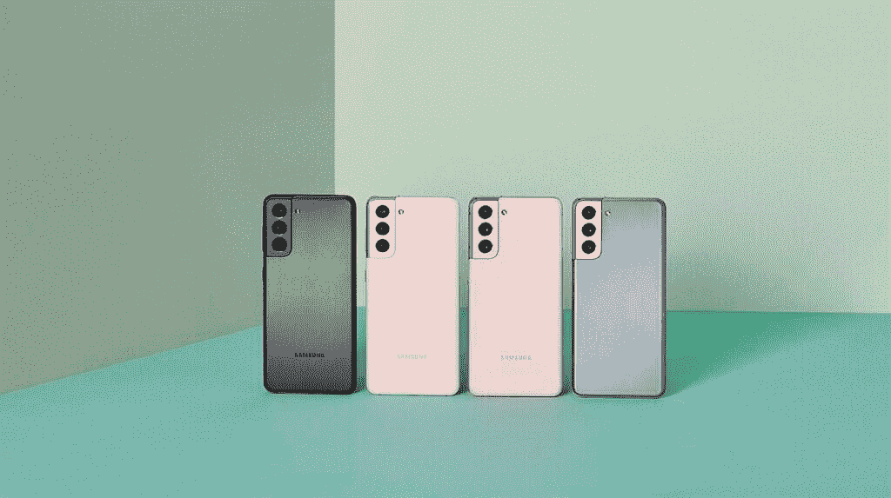
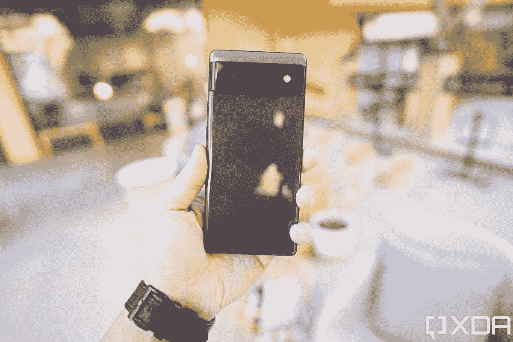
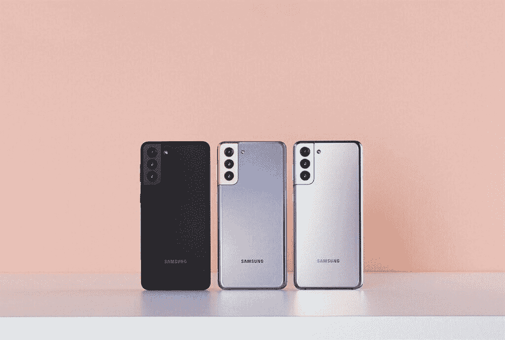
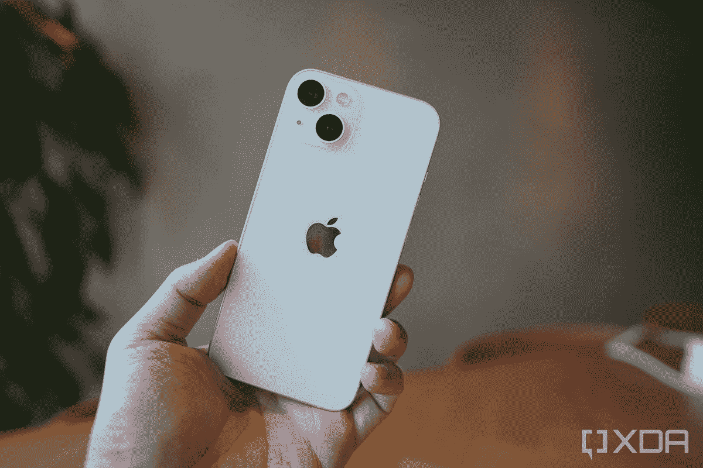
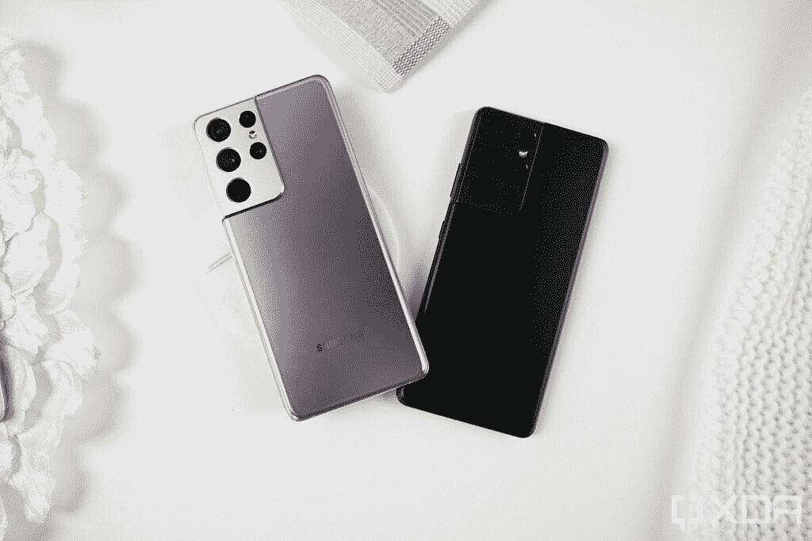
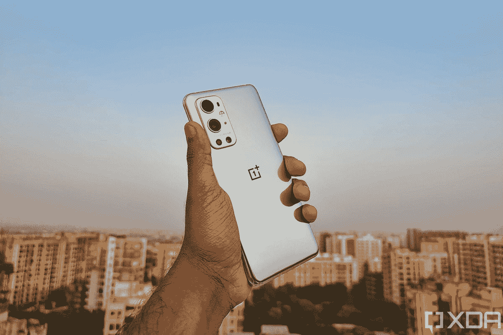

# 2023 年最佳 Galaxy S21 替代品

> 原文：<https://www.xda-developers.com/best-samsung-galaxy-s21-alternatives/>

随着旗舰产品 [Galaxy S21](https://www.xda-developers.com/samsung-galaxy-s21/) 系列的发布，三星拉开了 2021 年的序幕。Galaxy S21 系列中的三款设备都是当时市场上最好的 Android 设备，但其他制造商在过去几个月里已经赶上了三星。因此，如果你目前正在市场上购买旗舰智能手机，今天你可以购买几款出色的 Galaxy S21 替代品。

在这篇文章中，我们将看看你可以购买的一些最好的智能手机，而不是 Galaxy S21，Galaxy S21 Plus 和 Galaxy S21 Ultra。我们还将讨论为什么您应该选择以下设备之一来代替三星的产品，并强调所有价位的机型之间的主要差异。

**[应该买哪个 Galaxy S21？普通的，高级的，还是超高级的？](https://www.xda-developers.com/which-galaxy-s21-should-you-buy/)**

## 

## 三星 Galaxy S21 替代品

三星 Galaxy S21 是三星旗舰系列中最便宜的手机。它配备了一个 6.2 英寸的平板 FHD+ AMOLED 显示屏，刷新频率为 120Hz，要么是 Exynos 2100，要么是骁龙 888 芯片，8GB 内存和高达 256GB 的存储空间。该设备还提供了一个不错的三摄像头设置，包括一个 12MP f/1.8 主摄像头，一个 12MP f/2.2 超宽摄像头，一个 64MP f/2.0 长焦摄像头和一个 10MP f/2.2 自拍相机。

Galaxy S21 由一个像样的 4,000mAh 电池供电，支持 25W 快速充电，15 无线充电支持，4.5W 反向无线充电支持。此外，这款手机还配备了由 AKG 调谐的立体声扬声器，支持 Wi-Fi 6，5G 功能，以及 IP68 防尘防水性能。

 <picture></picture> 

Samsung Galaxy S21

三星 Galaxy S21 是 2021 年新旗舰系列的起点，包装在一个旗舰 SoC 中，以及一个体面的显示器和相机设置。

**[三星 Galaxy S21 交易](https://www.xda-developers.com/best-galaxy-s21-deals/) || [Galaxy S21 最佳案例综述](https://www.xda-developers.com/best-galaxy-s21-cases/)**

Galaxy S21 的起价为 799 美元，对于那些想要以相对实惠的价格提供高端设计和良好整体性能的小型旗舰产品的人来说，这是一个很好的选择。但是，这里有几个其他选项，您可能需要考虑:

 <picture></picture> 

Google Pixel 6

谷歌今年真的用 Pixel 6 增强了他们的智能手机游戏。这是你能在 700 美元左右买到的最好的智能手机之一。它有一个漂亮的显示屏，一套很棒的摄像头，以及由新的张量芯片支持的谷歌软件 magic。

 <picture></picture> 

Apple iPhone 13 mini

##### 苹果 iPhone 13 Mini

如果你正在寻找一款能够提供旗舰级性能的紧凑型手机，苹果 iPhone 13 Mini 是一款不错的 Galaxy S21 替代品。尽管尺寸很大，但这款手机几乎在所有方面都胜过普通的 Galaxy S21。它有一套可靠的摄像头和更长的电池寿命。

 <picture></picture> 

OnePlus 9

##### 一加 9

对于那些对 Galaxy S21 缓慢的 25W 快速充电能力不感兴趣的人来说，一加 9 是一个很好的选择。它提供 65W 有线快速充电支持，可以在 30 分钟内从 0 到 100%，它甚至包括一个更好的相机系统。

### 为什么选择谷歌 Pixel 6？

如果你想要纯粹的谷歌 Android 体验，Pixel 6 就是你要找的手机。今年，这些手机不仅是首批运行最新版本安卓系统的手机之一，而且恰逢多年来最大的安卓视觉改革之一。今年新的 Android 12 的主题，至少在像素上，是“材料的你”。本质上，Pixel 6 手机会查看你的主屏幕壁纸，并创建一个调色板来为系统界面着色。在整个用户界面中，都有异想天开的谷歌风格，比如不同大小和形状的按钮。

除了优秀的软件，Pixel 6 还能让你拥有一部优秀的手机。你得到了一个 6.4 英寸，1080 x 2400 有机发光二极管屏幕，刷新频率为 90 赫兹，还有可以说是最好的傻瓜相机，一个 5000 万像素的传感器，由谷歌史诗般的照片处理算法支持。你还可以得到一个 4，612 mAh 的大电池和足够的内存，以确保手机能够快速移动。加上独特的双色调饰面和极具吸引力的价格，很难在这个地方找到其他任何东西。这无疑是比 Galaxy S21 更好的选择。

### 为什么是苹果 iPhone 13 Mini？

对于现有的 iOS 用户来说，苹果 iPhone 13 mini 无疑是最好的 Galaxy S21 替代品。它的价格大致相同，提供顶级的性能，配备成熟的相机系统，并帮助您留在 iOS 生态系统中。对于那些好奇想看看对方能提供什么的 Android 用户来说，这也是一个不错的选择。iPhone 13 mini 在 12 mini 的电池续航时间上也有很大改善，现在可以提供全天体验。然而，它缓慢的充电速度和 60Hz 的刷新率可能对高级用户没有吸引力。

### 为什么是一加 9 号？

一加 9 在这些方面大放异彩，它将被证明是比 iPhone 12 mini 好得多的选择。这款手机配备了更大的 4,500mAh 电池，支持 65 瓦快速有线充电和 15 瓦快速无线充电(仅限北美/欧洲)，并配有 120Hz 显示屏。一加 2021 年的旗舰产品在其他几个方面也超过了 Galaxy S21。这款手机提供了更大的 6.55 英寸 FHD+ AMOLED 显示屏，高达 12GB 的内存，以及更好的 50MP f/2.2 广角摄像头，采用自由曲面镜头。与 Galaxy S21 不同，它还提供了更优质的玻璃背面。此外，这款手机在所有地区都配有骁龙 888，因此北美以外的用户不必忍受三星的 Exynos 2100 芯片。此外，一加 9 运行的是基于 Android 11 的 OxygenOS 11，有些用户可能更喜欢这种 UI 3.1。

### 更多选择

除了这三款设备，你还可以考虑购买小米 Mi 11 或索尼 Xperia 5 III，而不是 Galaxy S21。然而，你将不得不对这些手机做出某些妥协。例如，与 Galaxy S21 不同，Mi 11 只在某些市场有售。

* * *

## 

## 三星 Galaxy S21 Plus 替代产品

三星 Galaxy S21 Plus 是普通 Galaxy S21 的一个小进步。它本质上是相同的手机，但在一个更大，稍微更高级的包装。你得到的是玻璃背而不是塑料背，6.7 英寸 FHD+ AMOLED 显示屏，更高容量的 4800 毫安时电池，以及超宽带支持。除此之外，这款手机的硬件规格也没什么不同。它由三星 Exynos 2100 芯片或骁龙 888 SoC 驱动，拥有 8GB 内存和高达 256GB 的存储空间，并提供相同的快速充电功能。

 <picture></picture> 

Samsung Galaxy S21 Plus

##### 三星 Galaxy S21 Plus

三星 Galaxy S21 Plus 是 2021 年新旗舰系列中的老二，集旗舰 SoC 和高级构建于一身，配有体面的显示屏和摄像头设置。

**[三星 Galaxy S21 Plus 优惠](https://www.xda-developers.com/best-galaxy-s21-deals/) || [Galaxy S21 Plus 最佳案例综述](https://www.xda-developers.com/best-galaxy-s21-plus-cases/)**

Galaxy S21 Plus 也采用了与其更便宜的兄弟相同的相机设置。总的来说，Galaxy S21 Plus 正如其名称所言——普通 Galaxy S21 的加大版。因此，它也有一个大尺寸的价格标签。这款手机的 8GB + 128GB 版本起价为 999.99 美元，在这个价格点上，有几个其他的好选择可以考虑。

 <picture></picture> 

Apple iPhone 13

##### 苹果 iPhone 13

苹果 iPhone 13 是现有 iOS 用户的最佳 Galaxy S21 Plus 替代品。它以大致相同的价格提供了旗舰级的性能、更好的相机功能和无可挑剔的软件支持。在不利方面，它具有 60Hz 的显示屏。

 <picture></picture> 

Xiaomi Mi 11 Pro

##### 小米 Mi 11 Pro

小米 Mi 11 Pro 就像非 Pro 版本一样，比 Galaxy S21 Plus 更物有所值。与三星的产品相比，它的显示屏更好，摄像头设置更强，充电速度更快。不过，目前这款手机在几个市场都没有销售。

 <picture></picture> 

ASUS ROG Phone 5

##### 华硕 ROG 手机 5

ROG 手机 5 是另一个伟大的 Galaxy S21 Plus 替代品，它提供了更好的电池寿命，更快的充电能力和一系列附加的游戏功能。它还配备了令人印象深刻的 144Hz AMOLED 显示屏，使 Galaxy S21 Plus 的 120Hz 面板望尘莫及。

### 为什么是苹果 iPhone 13？

与普通 Galaxy S21 一样，苹果 iPhone 13 是现有 iOS 用户 Galaxy S21 Plus 的最佳替代产品。与 iPhone 13 Mini 非常相似，vanilla iPhone 13 提供了旗舰级的性能、出色的相机系统和无可挑剔的软件支持。最重要的是，它提供了比 mini 更好的电池备份，并支持更快的无线充电。可悲的是，它也有 60Hz 的显示屏，这可能会拒绝一些买家。

### 为什么是小米 Mi 11 Pro？

然而，与 Galaxy S21 Plus 相比，小米 Mi 11 Pro 没有这些缺点。这款手机配备了与非专业版相同的 6.81 英寸 QHD+四曲面 AMOLED 显示屏，刷新频率为 120 赫兹，峰值亮度为 1700 尼特。它配备了高通的旗舰骁龙 888 芯片，高达 12GB 的 LPDDR5 内存，高达 256GB 的 UFS 3.1 存储和 5000 毫安时的大电池。它还包括 67W 有线和无线快速充电支持，以及 10W 反向无线充电支持。

在摄像头方面，Mi 11 Pro 也比 Galaxy S21 Plus 更好，提供了一个 50MP f/1.95 ISOCELL GN2 主摄像头，一个 13MP f/2.4 广角摄像头，一个 8MP f/3.4 telemacro 摄像头和一个 20MP f/2.2 自拍相机。此外，它还具有由 Harman Kardon 调谐的双扬声器设置、Wi-Fi 6E 支持、蓝牙 5.2 和 IR blaster。缺点是，它运行小米 MIUI 12 Android 皮肤，可能对一些买家没有吸引力，而且它在北美不可用。

### 为什么选择华硕 ROG 手机 5？

谢天谢地，华硕为北美买家提供了一个很好的 Galaxy S21 Plus 替代品——ROG 手机 5。ROG Phone 5 是华硕最新、最棒的游戏智能手机，配备 6.78 英寸 FHD+ AMOLED 显示屏，刷新频率为令人眼花缭乱的 144Hz。它内置高通的旗舰产品骁龙 888 芯片，高达 16B 的 LPDDR5 内存，以及高达 256GB 的存储空间。它包含一个绝对巨大的 6,000mAh 电池，支持 65W 有线快速充电和两个 USB Type-C 端口，可以帮助您在纵向和横向方向为手机充电。该设备还具有双前置扬声器、带内置 DAC 的 3.5 毫米耳机插孔、Wi-Fi 6E 支持和蓝牙 5.2。

除此之外，ROG Phone 5 还在背面设置了一个不错的三摄像头，包括一个 64MP f/1.8 主摄像头，一个 13MP f/2.4 广角摄像头和一个 5MP 微距摄像头。在正面，它有一个 24MP f/2.4 自拍相机。对于游戏玩家来说，ROG 手机 5 提供了更多的功能，比如超声波触发器和一系列游戏配件。在我看来，如果你能忽略 ROG Phone 5 的游戏美学，这款手机在各方面都比 Galaxy S21 Plus 更值得购买。

* * *

## 

## 三星 Galaxy S21 Ultra 替代产品

三星的顶级 Galaxy S21 Ultra 无疑是当今市场上最好的 Android 智能手机之一。它在几乎所有方面都比普通的 Galaxy S21 和 Galaxy S21 Plus 有了很大的进步，包括显示屏、相机硬件、电池容量等。这款手机采用了明亮的 6.8 英寸 QHD+ AMOLED 显示屏( [display review](https://www.xda-developers.com/galaxy-s21-ultra-display-review/) )，提供了 120Hz 的峰值刷新率和可变刷新率支持。该显示器的峰值亮度为 1500 尼特，而其他两种型号的峰值亮度为 1300 尼特。

虽然 Galaxy S21 Ultra 封装了与其兄弟产品相同的 SOC，但它可提供高达 16GB 的 LPDDR5 RAM 和高达 512GB 的存储。这款手机配备了更大的 5000 毫安时电池和更令人印象深刻的相机系统。这款手机配备了 108MP f/1.8 主摄像头、12MP f/2.2 超广角摄像头、10MP f/2.4 3 倍长焦摄像头和 10MP f/4.9 10 倍长焦摄像头。在正面，它有一个 40MP f/2.2 自拍相机。Galaxy S21 Ultra 也是三星旗舰产品阵容中唯一一款提供 Wi-Fi 6E 和 S Pen 支持的设备。

 <picture></picture> 

Galaxy S21 Ultra

三星 Galaxy S21 Ultra 是 2021 年新旗舰系列中的终极杀手锏，集旗舰 SoC、高级构建、出色的显示屏和令人惊叹的相机设置于一身，以及高级旗舰上预期的所有额外功能。

**[银河 S21 超交易](https://www.xda-developers.com/best-galaxy-s21-ultra-deals/)|[S21 超最佳案例综述](https://www.xda-developers.com/best-galaxy-s21-ultra-cases/)**

尽管它仍然是当今市场上最好的 Android 智能手机之一，但如果你愿意花 1100 美元买一部手机，你可以考虑很多替代产品。

 <picture></picture> 

Google Pixel 6 Pro

谷歌今年真的用 Pixel 6 增强了他们的智能手机游戏。这是你能在 700 美元左右买到的最好的智能手机之一。它有一个漂亮的显示屏，一套很棒的相机，可以点击一些最好的图片，还有新的张量芯片支持的谷歌软件 magic。这是一个完整的旗舰设备。

 <picture></picture> 

Apple iPhone 13 Pro

##### 苹果 iPhone 13 Pro

苹果 iPhone 13 Pro 是一个伟大的 Galaxy S21 Ultra 替代品，对于现有的 iOS 用户来说是一个很好的选择。这款手机提供了令人印象深刻的摄像头、旗舰级性能、激光雷达传感器和一流的软件支持。新的 120Hz 显示屏是一个额外的奖励，相机设置是最好的之一。

 <picture></picture> 

Apple iPhone 13 Pro Max

##### 苹果 iPhone 13 Pro Max

苹果 iPhone 13 Pro Max 在一个更大的包装中提供了 iPhone 13 Pro 的所有功能。因此，它配备了更大的显示屏和更高容量的电池。这使得这款手机成为 iOS 用户的绝佳 Galaxy S21 Ultra 替代品。新的 120Hz 显示屏也像 S21 Ultra 上的显示屏一样流畅。

 <picture></picture> 

Xiaomi Mi 11 Ultra

##### 小米 Mi 11 Ultra

小米 11 Ultra 是小米 2021 年的顶级旗舰产品，因此，它包含了金钱可以买到的最好的硬件。它有一个很棒的相机系统，更快的充电支持，和一个辅助显示器。尽管如此，这款手机的价格比 Galaxy S21 Ultra 便宜，这使得它成为 Android 用户的一个很好的选择。

 <picture></picture> 

OnePlus 9 Pro

##### 一加 9 专业版

一加 9 Pro 是一加 2021 年的旗舰产品，也是该公司迄今为止最高端的手机。它配备了令人印象深刻的显示屏、高通的骁龙 888 SoC、疯狂的快速充电功能等等。

 <picture></picture> 

ASUS ROG Phone 5 Ultimate

##### 华硕 ROG 手机 5 旗舰版

华硕 ROG 手机 5 旗舰版提供了你想要的游戏智能手机的一切——144 赫兹的显示屏，6，000 毫安时的大电池，顶级的性能和一系列游戏功能。它甚至装有令人垂涎的 18GB 内存，使其成为 Galaxy S21 Ultra 的可行替代品。

### 为什么选择谷歌 Pixel 6 Pro？

如果你想要纯粹的谷歌 Android 体验，Pixel 6 Pro 是一款值得购买的手机。今年，这些手机不仅是首批运行最新版本安卓系统的手机之一，而且恰逢多年来最大的安卓视觉改革之一。今年新的 Android 12 的主题，至少在像素上，是“材料的你”。本质上，Pixel 6 Pro 会查看你的主屏幕壁纸，并创建一个调色板来为系统界面着色。在整个用户界面中，都有异想天开的谷歌风格，比如不同大小和形状的按钮。

除了优秀的软件，Pixel 6 还能让你拥有一部优秀的手机。你会得到一个 6.7 英寸的 QHD+有机发光二极管 LTPO 屏幕，刷新频率为 1200 赫兹，还有可以说是最好的傻瓜相机，一个由谷歌史诗般的照片处理算法支持的 5000 万像素传感器。Pixel 6 Pro 还有一个额外的长焦摄像头，这是标准 Pixel 6 所缺少的。你还可以获得一个 5000 毫安的大电池和足够的内存，以确保手机能够快速移动。加上独特的双色调饰面和极具吸引力的价格，很难在这个地方找到其他任何东西。

### 为什么是苹果 iPhone 13 Pro 和 13 Pro Max？

iPhone 13 Pro 和 iPhone 13 Pro Max 再次成为 iOS 用户的绝佳 Galaxy S21 Ultra 替代品。这两款手机与上面提到的其他两款 iPhones 基本相同，但它们的电池更大，显示屏更大，另外还有一个 12MP f/2.2 3X 长焦摄像头。这些手机还装有 ToF 3D 激光雷达传感器，这是廉价机型所没有的。今年的 iPhone 13 Pro 和 iPhone 13 Pro Max 最大的优势之一是新的 120Hz 宣传显示屏，提供了流畅的体验。

### 为什么是小米 Mi 11 Ultra？

小米 Mi 11 Ultra 本质上是一款类固醇的 Mi 11 Pro，这使它成为 Galaxy S21 Ultra 的完美替代产品。它具有相同的显示器、SoC、电池容量等。作为 Pro-variant，但它配备了更好的相机系统和背面的辅助显示器。它配备了一个 50MP 三星 ISOCELL GN2 主摄像头，可以[捕捉 DSLR 式散景](https://www.xda-developers.com/xiaomi-mi-11-ultra-hands-on-preview/)，并提供比 Galaxy S21 Ultra 更好的弱光功能。主摄像头还可以捕捉照片和视频中出色的动态范围。

Mi 11 Ultra 配备了一个 48MP 超宽相机，具有 128 FoV。它提供的照片质量比以前的小米手机更接近主摄像头。这款手机还包括一个 48MP 5x 倍潜望镜变焦相机，最大可以达到 120 倍数码变焦。虽然在理论上，这款变焦镜头没有达到 Galaxy S21 Ultra 所提供的水平，但实际效果几乎一样好。相机模块中的第二个屏幕是另一个很好的补充，它让你可以使用主 50MP 相机轻松捕捉高分辨率自拍。

### 为什么选择一加 9 Pro？

遗憾的是，Mi 11 Ultra 没有在美国上市。因此，如果你正在寻找运行安卓系统的 Galaxy S21 Ultra 替代品，你必须要么选择一加 9 Pro，要么选择华硕 ROG 手机 Pro/Ultimate。对于那些想要注重性能的设备的人来说，一加 9 Pro 是一个不错的选择。它配备了一个明亮的 120Hz QHD+显示屏，即使不比 Galaxy S21 Ultra 上的显示屏更好，也一样好。它提供了比三星更好的有线/无线快速充电支持，并装有高通的骁龙 888 芯片。

遗憾的是，一加 9 Pro 的主摄像头性能并不比 Galaxy S21 Ultra 好。虽然这款手机确实包括一个更好的广角镜头，但它的变焦能力没有那么好，而且它的主摄像头几乎与 Galaxy S21 Ultra 的 108MP 主传感器不相上下。这款手机还装有一个更小的 4500 毫安时电池，但这对大多数买家来说不应该是一个障碍，因为一加提供更快的 65W 有线快速充电支持和 50W 无线快速充电支持。

### 为什么选择华硕 ROG 手机 5 旗舰版？

对于美国人来说，华硕 ROG Phone 5 Ultimate 也是可行的 Galaxy S21 Ultra 替代产品。这款手机或多或少与普通的 ROG 手机 5 相同，但它提供了一些额外的功能。ROG 手机 5 旗舰版配备了令人垂涎的 18GB lpddr 5 内存、512 GB UFS 3.1 存储空间，以及背面的单色辅助显示屏。这款手机还在背板上增加了两个触摸传感器。

ROG 手机 5 旗舰版是手机游戏玩家的绝佳选择，因为它提供了一系列游戏专用功能和配件。但如果你不喜欢手机游戏，你可以选择这款电池续航时间长、充电速度快的设备。不利的一面是，ROG Phone 5 设备无法提供与 Galaxy S21 Ultra 相同的拍照功能，华硕的软件支持也不如三星最新旗舰产品强大。

* * *

## 绝对最好的 Galaxy S21 替代品是什么？

您打算购买上面提到的 Galaxy S21 替代品中的哪一个？在我看来，iPhone 13 Pro 是所有三款 Galaxy S21 设备的绝佳替代产品，前提是你有预算。如果没有，香草 iPhone 13 也是一个很好的选择。如果你想坚持使用安卓手机，我建议你买小米 11 Ultra。

遗憾的是，小米手机在北美没有，如果你在该地区，你必须选择一加 9 系列手机或 ROG Phone 5 系列手机。在这两者之间，我个人更喜欢华硕的产品，但一加 9 Pro 也是一个不错的选择。如果你觉得这些 Galaxy S21 替代品不够吸引人，你可能应该坚持使用三星的产品，因为它们本身也是非常好的手机。