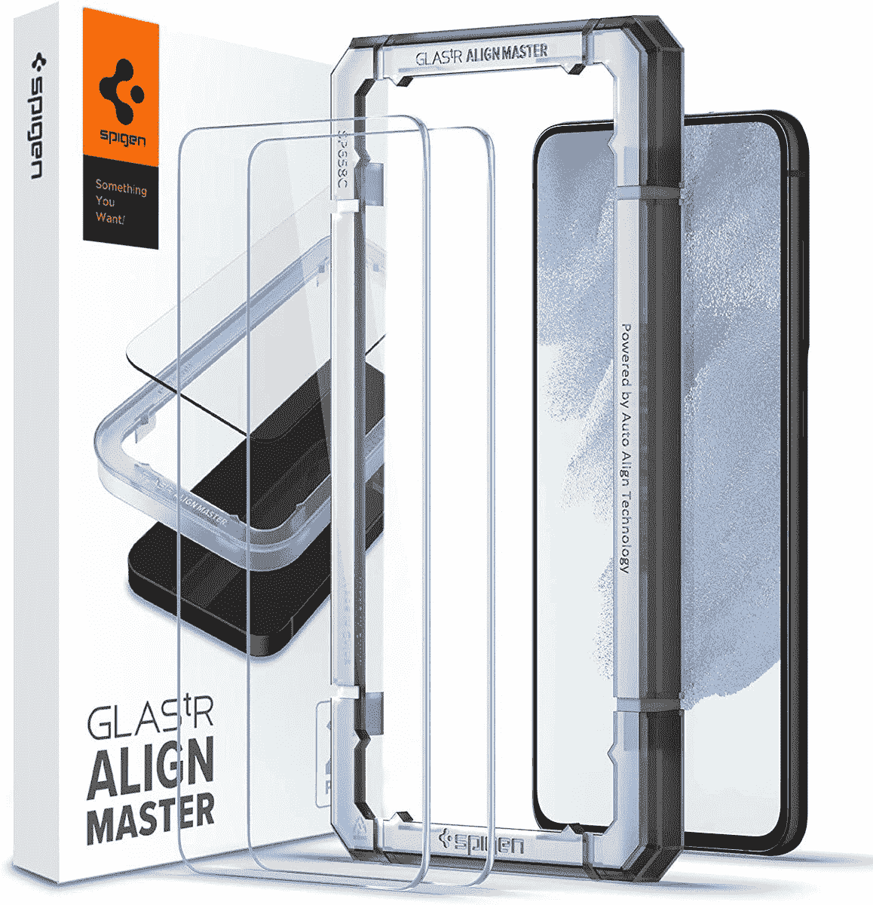
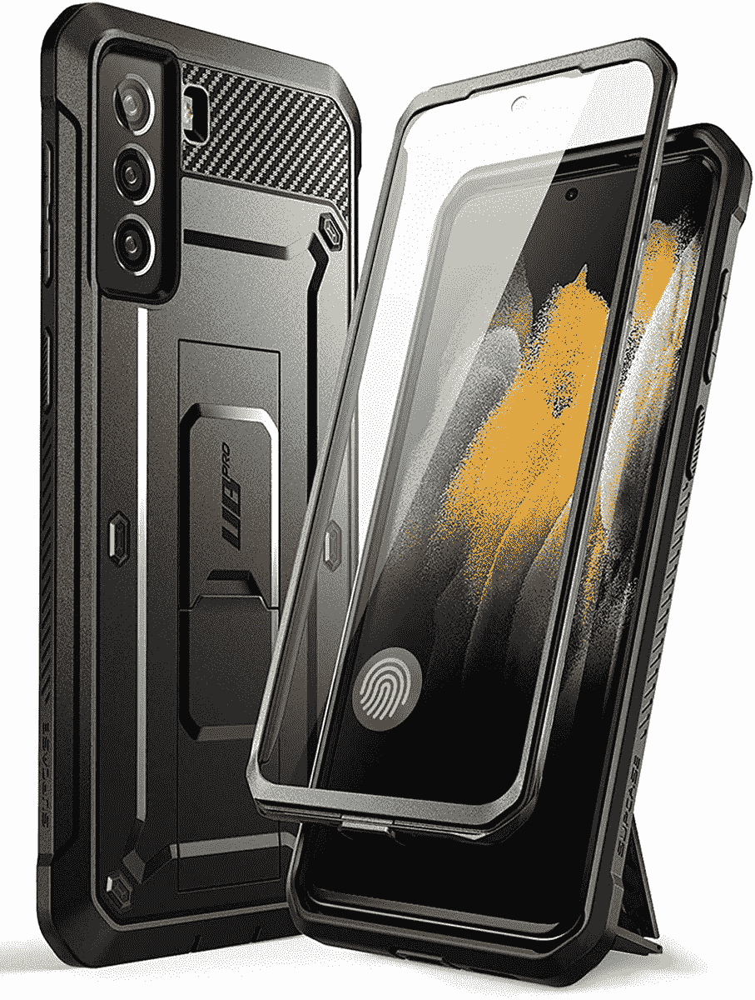
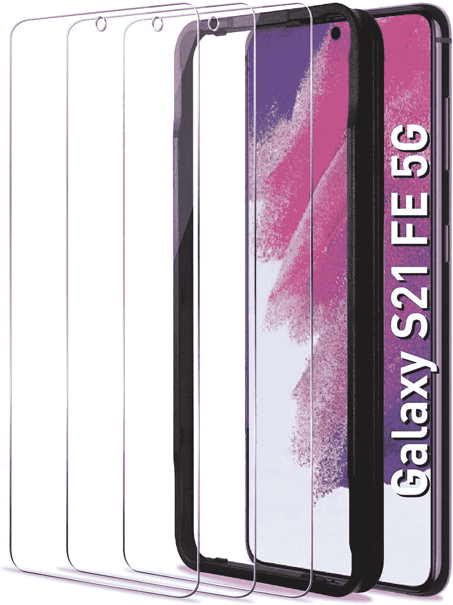
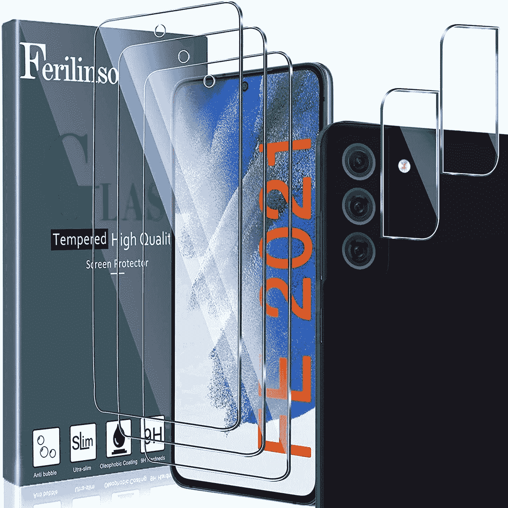
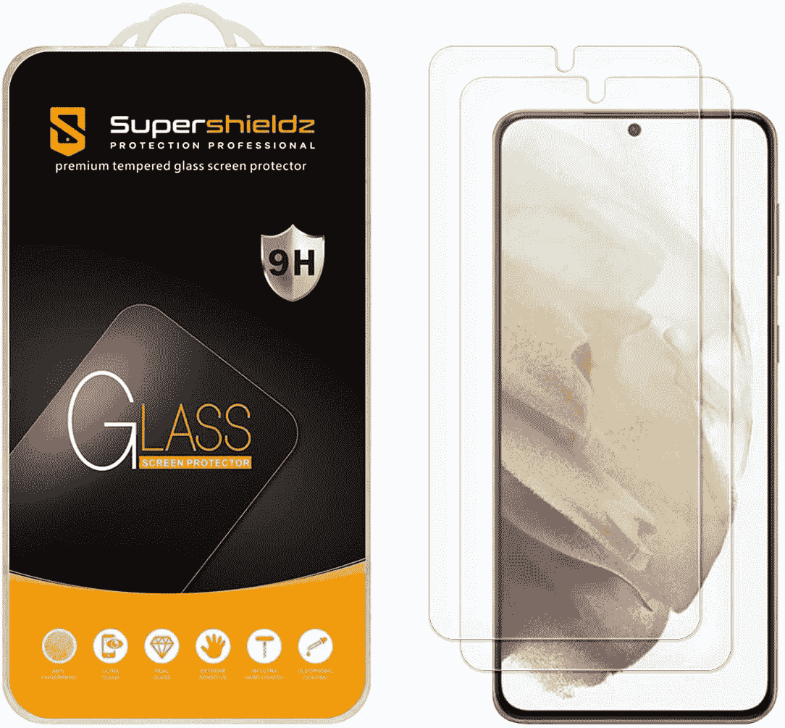
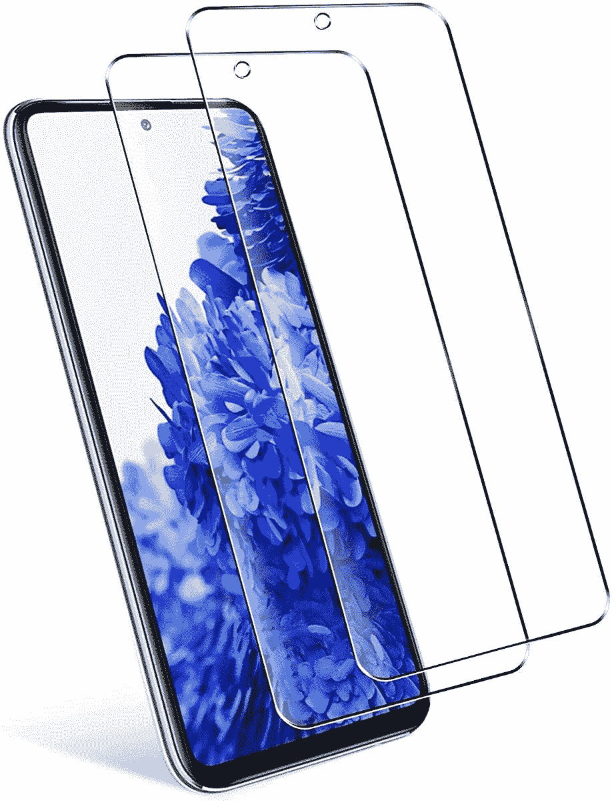
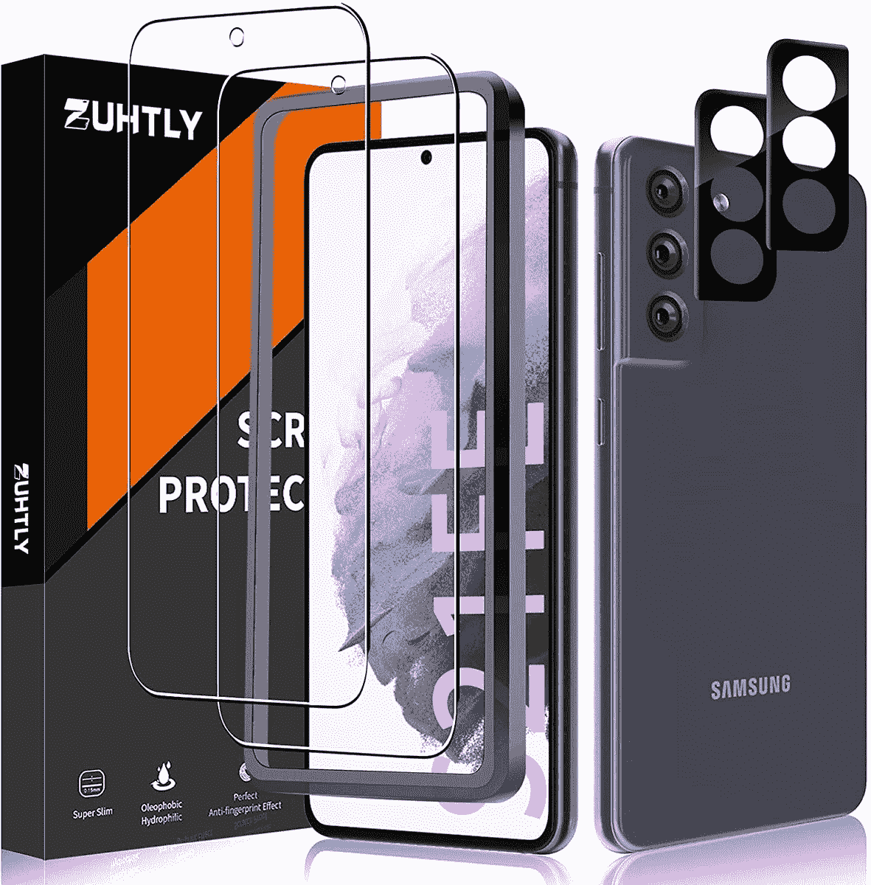
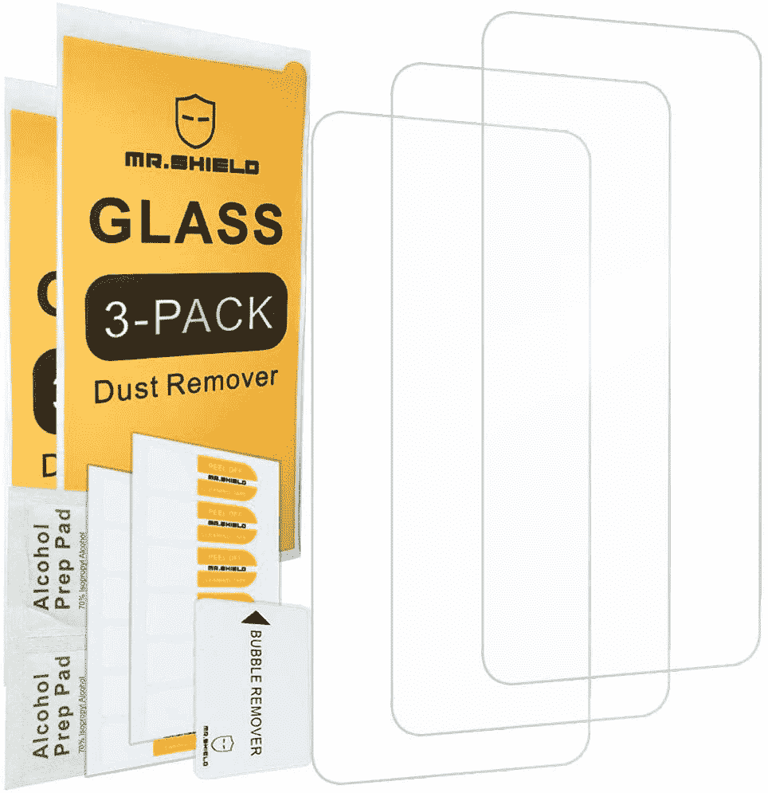

# 2023 年最佳三星 Galaxy S21 FE 屏幕保护器

> 原文：<https://www.xda-developers.com/best-samsung-galaxy-s21-fe-screen-protectors/>

# 2023 年最佳三星 Galaxy S21 FE 屏幕保护器

这里有一些最好的三星 Galaxy S21 FE 屏幕保护器，你可以购买来保护你的全新智能手机的显示屏！

经过无数次的泄露、渲染、猜测和延迟之后，[三星 Galaxy S21 FE](https://www.xda-developers.com/samsung-galaxy-s21-fe/) 终于正式发布。Galaxy S20 FE 是一款非常受欢迎的设备，物超所值。如果你想要一部旗舰规格的手机，而又不会倾家荡产，Galaxy S20 FE 5G 是最佳推荐之一。Galaxy S21 FE 也遵循同样的道路，为用户提供可靠的规格，而没有太多的妥协。如果你想拿起手机，你可以看看我们对[最佳三星 Galaxy S21 FE 交易](https://www.xda-developers.com/samsung-galaxy-s21-fe-deals/)的推荐。和每一部手机一样，保护你的投资很重要，这样它才能使用很长时间。

Galaxy S21 FE 有一个塑料背面，很容易被划伤，所以使用外壳来保护它是明智的。手机的显示屏由玻璃制成，如果掉落在坚硬的表面上，很容易破碎。无论设备上有什么样的显示器保护，玻璃都是易碎的，可能会破裂。为了防止这种情况，建议使用一个[好盒子](https://www.xda-developers.com/best-samsung-galaxy-s21-fe-cases/)和 Galaxy S21 FE 的屏幕保护器。我们收集了一些最好的 Galaxy S21 FE 屏幕保护器，您可以将其与外壳一起使用，以随时保护您的设备。

 <picture></picture> 

Spigen Align Master

##### Spigen Align Master Galaxy S21 FE 屏幕保护器

Spigen Align 主屏幕保护器配有一个框架，用于对齐安装，从而实现完美贴合。玻璃的质量也很好。

 <picture></picture> 

Supcase Unicron Beetle Pro

##### SUPCASE UB Pro Galaxy S21 FE 外壳

当你在寻找一个屏幕保护装置时，你也可以考虑买一个内置屏幕保护装置的保护套。

 <picture></picture> 

AACL Tempered Glass

##### AACL 钢化玻璃银河 S21 FE 屏幕保护器

如果你是第一次使用屏幕保护，并认为你会搞砸，这里有一包 3 个，非常便宜，这样你就可以多次尝试。

 <picture></picture> 

Ferilinso Screen Protector

##### Ferilinso Galaxy S21 FE 屏幕保护器

除了显示器上的 3 个屏幕保护装置外，这个套装还为你的相机镜头提供了 2 个保护装置。它也很便宜，质量似乎相当不错。

 <picture></picture> 

Supershieldz anti-scratch

##### SuperShieldz 钢化玻璃 Galaxy S21 FE 屏幕保护器

这种钢化玻璃屏幕保护器的制造商声称它既防刮擦又无气泡。如果你是应用屏幕保护器的新手，你可以考虑这个。

 <picture></picture> 

Cookoe Glass Protector

##### Cookoe 玻璃银河 S21 铁屏幕保护

如果你不想在屏幕保护上花太多钱，但仍然想要一些基本的保护，你只需要花 5 美元就可以得到两个保护。当然是便宜货。

 <picture></picture> 

Zuthly Screen and Camera protector

##### Zuthly Gaaxy S21 FE 屏幕保护器

这是另一个包装，为显示器提供 2 个屏幕保护器，并为后面的摄像机镜头提供 2 个玻璃保护器。

 <picture></picture> 

Screen and Camera Protector

##### 维斯马特钢化玻璃银河 S2 铁屏幕保护器

这款钢化玻璃屏幕保护器配有 2.5D 弧形边缘，使其在边缘滑动时感觉更平滑。它还配有 2 个摄像头保护器和一个校准托盘。

 <picture></picture> 

Mr. Shield screen protector

##### Mr. Shield 钢化玻璃 Galaxy S21 FE 屏幕保护器

这是一个负担得起的屏幕保护器包，带有终身免费更换保修。你只需花 5 美元就可以得到 3 个屏幕保护器，所以即使你搞砸了，你还有两次机会。

这些是一些最好的三星 Galaxy S21 FE 屏幕保护器，你可以购买来保护你的新智能手机的显示屏。如果你想同时购买屏幕保护和外壳，我们建议考虑 Supcase Unicorn Beetle Pro，因为除了支架的额外效用外，你还可以通过该组合获得终极保护。如果你已经有一个保护套，并且只是在寻找一个屏幕保护套，那么强烈推荐 Spigen 的产品，因为该品牌是智能手机配件领域最知名的品牌之一。如果你是一个初学者，没有安装屏幕保护器的经验，你可以考虑买一个多片的，这样如果你第一次搞砸了，你还可以再尝试一次。

 <picture></picture> 

Samsung Galaxy S21 FE

##### 三星 Galaxy S21 FE

Galaxy S21 FE 是三星最新推出的面向大众的平价旗舰手机。它以较低的价格提供了旗舰体验。