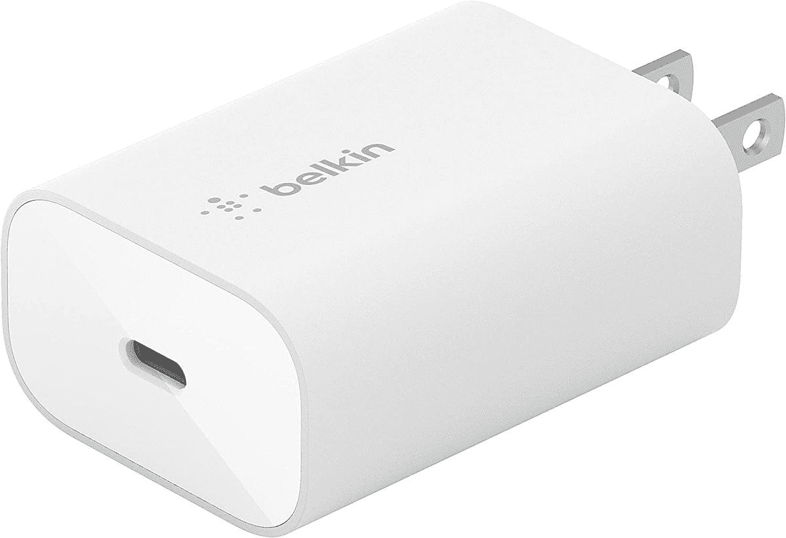
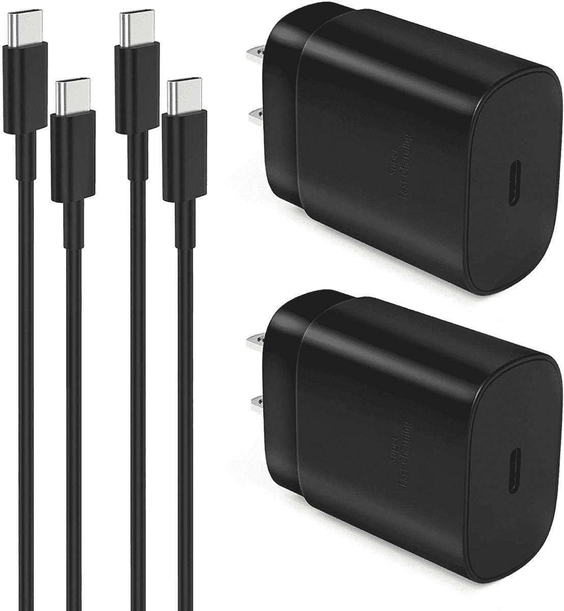

# 2023 年三星 Galaxy S22 系列最佳有线充电器

> 原文：<https://www.xda-developers.com/best-samsung-galaxy-s22-chargers/>

购买一个新的手机充电器曾经是我们大多数人都没有想到要做的事情，因为我们在购买手机时，盒子里都有一个充电器。现在，高端手机开始不带充电砖，这对我们许多人来说更是一种必需品。三星 Galaxy S22 的情况也是如此，但我们在这里提供帮助。我们收集了你能为 Galaxy S22 系列购买的最好的有线充电器。如果你想无线充电，我们还在另一篇文章中收集了 Galaxy S22 系列的[最佳无线充电器。](https://www.xda-developers.com/best-samsung-galaxy-s22-wireless-chargers/)

在购买充电器之前，你应该知道你的手机支持的最大功率输入。标配三星 Galaxy S22 最高支持 25W 快充，Galaxy S22 Plus 和 Galaxy S22 Ultra 最高支持 45W 快充。从表面上看，45W 充电似乎在逻辑上比 25W 充电更快。但是我们在 [Galaxy S22 Plus 评测](https://www.xda-developers.com/samsung-galaxy-s22-plus-review/)和 [Galaxy S22 Ultra 评测](https://www.xda-developers.com/samsung-galaxy-s22-ultra-review/)中注意到一些奇怪的地方，其中 45W 快速充电不仅不能提供更快的充电，而且实际上比 25W 充电器更慢。因此，至少在 Galaxy S22 Plus 和 Galaxy S22 Ultra 上，选择 45W 充电器不会有任何实际好处。然而，让自己的其他设备适应未来可能是非常值得的。购买一个比你的手机需要的更强大的充电器不是问题，它实际上可以帮助你为将来再次换手机做好准备。但你可以用低功率充电器节省一些钱，所以这取决于你的需求。

## 三星 Galaxy S22 最佳 25W 充电器

从标准的 Galaxy S22 开始，我们有少量支持 25W 充电的充电器。根据我们的测试，Galaxy S22 Plus 和 Galaxy S22 Ultra 的 25W 充电功率也优于 45W。以下是我们的建议:

*   <picture></picture>

    Anker power port III 25W

    ##### Anker power port III 25W 充电器

    这款 Anker 充电器支持 PD 和 PPS 充电，加上 Anker 的 PowerIQ 技术，叉子还可以折叠，以便旅行时更加紧凑。

*   <picture></picture>

    Belkin 25W USB-C 充电器

    ##### Belkin 25W USB-C 充电器

    Belkin 25W USB-C 充电器是一款相当标准的充电砖，功率输出为 25W，支持 Galaxy S22 的 PPS。它有一个干净的外观，而且比三星的充电器便宜。

*   <picture></picture>

    Spigen arc station 超级迷你

    ##### Spigen 27W arc station 超级迷你

    非常适合旅行，这款小巧的 Spigen 充电器支持高达 25W 充电，支持三星的 Galaxy S22 系列的 PPS。它非常小，所以你可以很容易地把它放在任何地方。

*   <picture></picture>

    Anker Nano II 30W

    ##### Anker 711 Nano II 30W 充电器

    如果一款小巧的充电器是你的重中之重，那么 Anker Nano II 30W 就是另一个绝佳的选择。它甚至比 Spigen ArcStation 还要小，但它可以为您的 Galaxy S22 提供同样多的电力。

*   <picture></picture>

    迪欣 25W USB-C PD 充电器

    ##### 迪欣 25W USB-C PD 充电器

    如果你需要一对充电器，这一套两个可能就够用了。充电器为 Galaxy S22 提供 25W 的功率，只要有合适的电缆，它们应该可以与任何智能手机配合使用。

## Galaxy S22 Plus 和 Galaxy S22 Ultra 的最佳 45W 充电器

如果你买了更贵的三星 Galaxy S22 型号，不管是 Galaxy S22 Plus 还是 Galaxy S22 Ultra，你可能会想要一个 45W 的充电器。然而，请记住，你可能不会得到任何有形的好处，但如果你正在购买，你也可以为你的其他设备提供未来的保障。

*   <picture></picture>

    Spigen arc station Pro

    ##### Spigen 45W arc station Pro GaN 充电器

    Spigen 制造了一些很棒的手机充电器，ArcStation Pro icomes 以相对紧凑的设计提供 45W 的功率。此外，还包括一根电缆，以防您没有自己的电缆。

*   <picture></picture>

    Anker power port III Pod Lite

    ##### Anker power port III 65W Pod Lite

    在一个紧凑的封装中包装了大量的功率，这款 Anker 充电器可以为您的 Galaxy S22 Plus 或 S22 Ultra 提供 45W 的功率，但对于笔记本电脑等设备则可以高达 65W。尽管如此，它非常紧凑。

*   <picture></picture>

    Nekteck 45W USB C 壁式充电器

    ##### Nekteck 45W USB-C 壁式充电器

    这款时尚的 Nekteck 充电器可以为 Galaxy S22 Plus 和 S22 Ultra 提供高达 45W 的功率，并且还附带 PPS 支持。电缆是内置的，所以不会轻易丢失。

*   <picture></picture>

    Hyphen-X 100 w 4 口 USB 充电器

    ##### Hyphen-X 100 w 4 口 PD GaN 充电器

    有多个设备可以充电？这款 Hyphen-X 充电器有四个端口，功率高达 100W。它支持 PPS，因此可以通过 USB-C 端口向 Galaxy S22 Plus 和 S22 Ultra 提供 45W 的功率。叉子也是可折叠的。

*   <picture></picture>

    Baseus 车载充电器

    ##### Baseus 65W USB-C 车载充电器

    如果您需要在旅途中保持手机供电，Baseus 充电器可以为 Galaxy S22 Plus 和 S22 Ultra 提供高达 45W 的功率，或为支持的设备提供高达 65W 的功率。它甚至有两个充电端口。

* * *

这些都是三星 Galaxy S22 系列的最佳充电器，包括普通型号，Galaxy S22 Plus 和 Galaxy S22 Ultra。如果你正在为你闪亮的新智能手机寻找其他配件，我们也有 Galaxy S22 家族的[最佳外壳列表，以及](https://www.xda-developers.com/best-samsung-galaxy-s22-cases/)[最佳屏幕保护器](https://www.xda-developers.com/best-samsung-galaxy-s22-screen-protectors/)。

如果你还没有决定买哪部手机，如果你想要顶级型号，请查看我们的[Galaxy S22 Ultra hand-on](https://www.xda-developers.com/samsung-galaxy-s22-ultra-hands-on/)。如果你准备购买一台，你可以使用下面的链接或查看我们关于 Galaxy S22 系列的[最佳交易的综述。](https://www.xda-developers.com/best-samsung-galaxy-s22-deals/)

 <picture></picture> 

Samsung Galaxy S22

三星的 Galaxy S22 采用高端规格供电，3,700mAh 电池支持 25W 有线充电。

 <picture></picture> 

Samsung Galaxy S22 Plus

##### 三星 Galaxy S22 Plus

Galaxy S22 Plus 拥有更大的 4,5000mAh 电池，45W 可以更快地充电。

 <picture></picture> 

Samsung Galaxy S22  Ultra

Galaxy S22 Ultra 拥有更大的 5000 毫安时电池，充电功率高达 45 瓦。