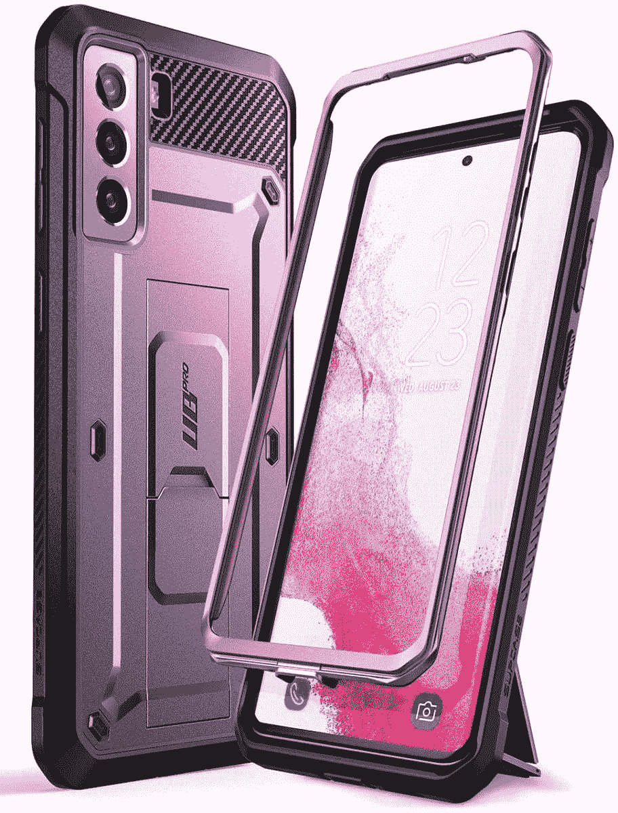
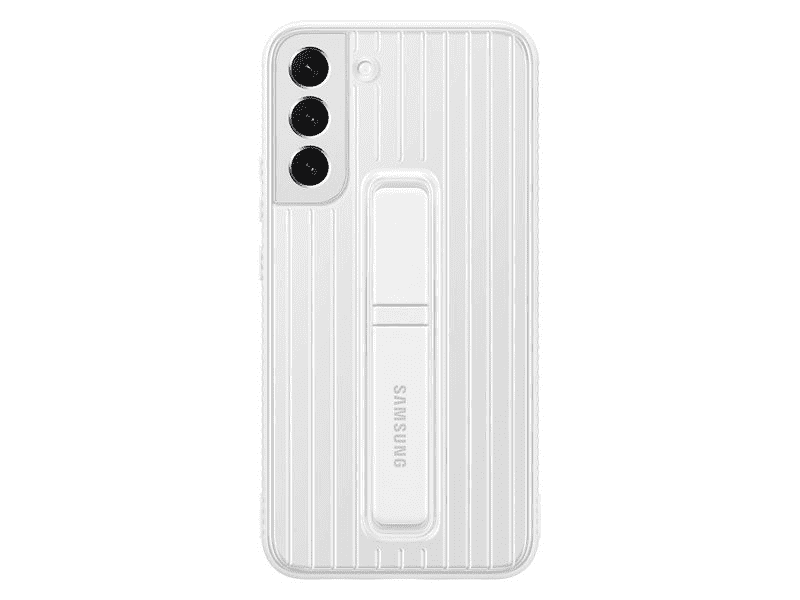
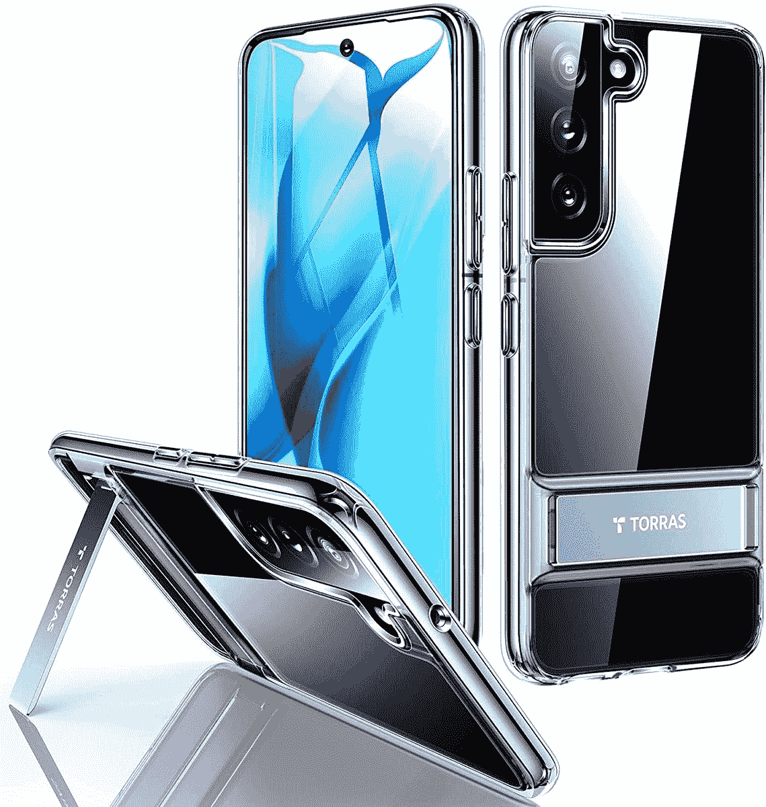

# 2023 年最佳三星 Galaxy S22 支架保护套

> 原文：<https://www.xda-developers.com/best-samsung-galaxy-s22-kickstand-cases/>

# 2023 年最佳三星 Galaxy S22 支架保护套

如果你在市场上寻找一些三星 Galaxy S22 支架盒，那么只需看看我们的文章就知道了。

三星 Galaxy S22 系列即将上市，如果你正在购买一款新设备，你可能也会想要一个闪亮的新外壳来保护它。有大量的保护套可供选择，从超薄小巧的透明保护套到更加坚固耐用的保护套。如果你想要两者的完美结合，那么支架盒可能就是你要找的。这些是目前你能得到的三星 Galaxy S22 的一些最好的支架案例。

 <picture></picture> 

ESR Metal Kickstand

##### ESR 金属支架 Galaxy S22 外壳

ESR 是一个知名品牌，生产一些很棒的外壳，ESR 金属支架外壳让您可以展示您闪亮的新手机，同时也让它更容易在旅途中使用。它还可以垂直支撑你的手机。

 <picture></picture> 

SUPCASE Unicorn Beetle Pro

##### SUPCASE UB Pro Galaxy S22 外壳

SUPCASE 独角兽甲虫专业版拥有你想要的一切。这是一个全身保护套，配有支架，甚至还有一个皮带夹。

 <picture></picture> 

Clear Case

##### 三星 Clear Galaxy S22 外壳

这是来自三星的官方透明外壳，它提供了很好的保护，同时显示了设备背面闪亮的新颜色。支架可用于垂直或水平放置手机。

 <picture></picture> 

Galaxy S22 protective

##### 三星 Galaxy S22 保护壳

这是三星的官方保护壳，比透明保护壳提供更多保护，同时提供两个视角来使用手机。支架可用于垂直或水平放置手机。

 <picture></picture> 

TORRAS

##### 托拉斯月球攀登者银河 S22 盒

TORRAS MarsClimber 是一个带有内置支架的超薄外壳，非常适合保持低调。该支架还可以垂直放置您的手机。

 <picture></picture> 

Spigen Tough Armor

##### Spigen 坚韧装甲银河 S22 盒

如果你想要一个坚固耐用的保护套，背面还有一个支架，这肯定是你的选择。它的支架可以横向或纵向使用。

支架保护套有各种各样，它们还有一个额外的好处，就是在你使用手机的时候可以支撑住它。想不用一直拿着手机看网飞或 YouTube 吗？那么支架可能是最好的选择。确保将其与最好的三星 Galaxy S22 屏幕保护器配对，以获得最大保护。手机套不仅可以保护您的手机免受外部损坏，如划痕和凹痕，还可以改变您的智能手机的外观和感觉。这当然可以大大保护你的手机，尤其是如果你认为自己是一个笨拙的人。

有几个不错的 Galaxy S22 支架可供选择，可能值得一看。如果你想要更具保护性的东西，那么[三星的官方保护支架外壳](https://www.amazon.com/Samsung-Protective-Protection-Detachable-Kickstands/dp/B09NB6G49Y?tag=xda-7t80fqq-20&ascsubtag=UUxdaUeUpU165&asc_refurl=https%3A%2F%2Fwww.xda-developers.com%2Fbest-samsung-galaxy-s22-kickstand-cases%2F&asc_campaign=Short-Term)可能值得一看。如果你想要更低调和更便宜的东西， [ESR 的金属支架盒](https://www.amazon.co.uk/dp/B09LCPHKZT?tag=xdadevelopers-21)可能是个好主意。你可以根据自己的风格或材料选择最适合自己的箱子。如果你想买一部三星 Galaxy S22，但不确定它是否物有所值，那么一定要去[亲自体验一下我们的 Galaxy S22](https://www.xda-developers.com/samsung-galaxy-s22-hands-on/)，看看我们对它的感觉如何。

 <picture></picture> 

Samsung Galaxy S22

三星 Galaxy S22 是 2022 年的入门级旗舰产品，以适合许多口袋和预算的形式带来了顶级的性能和相机功能。