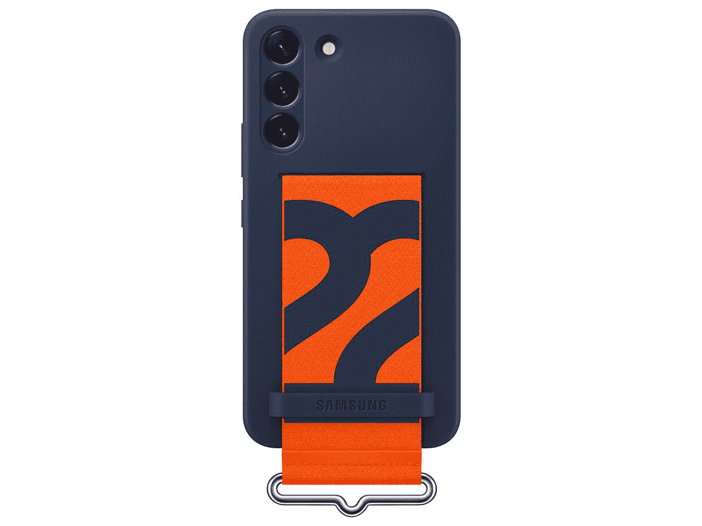
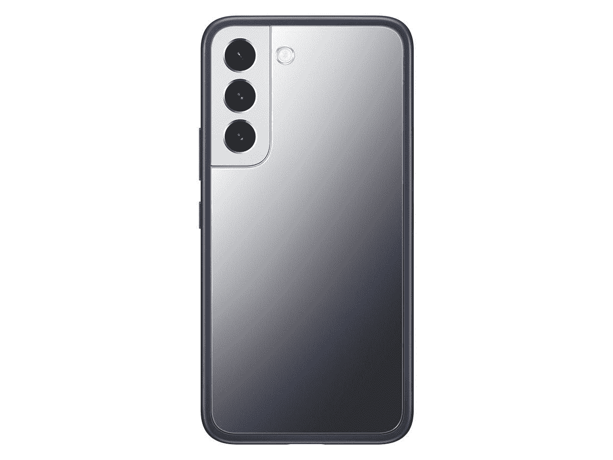
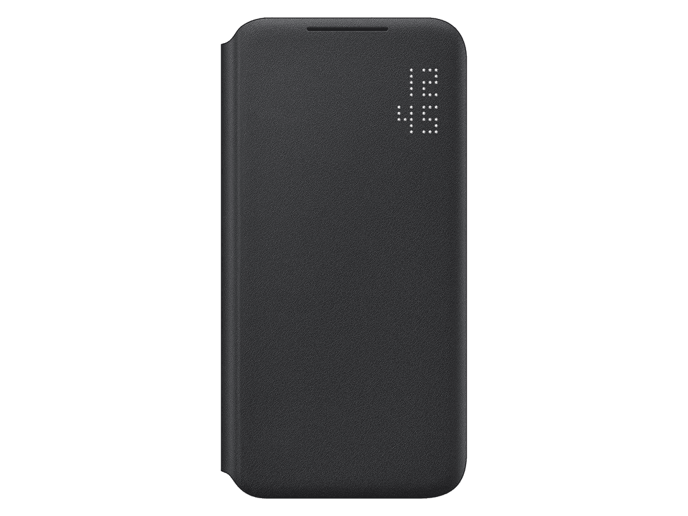
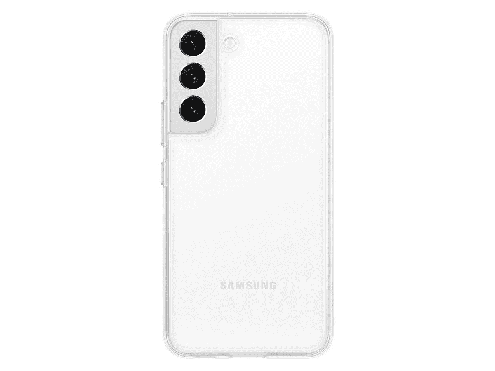
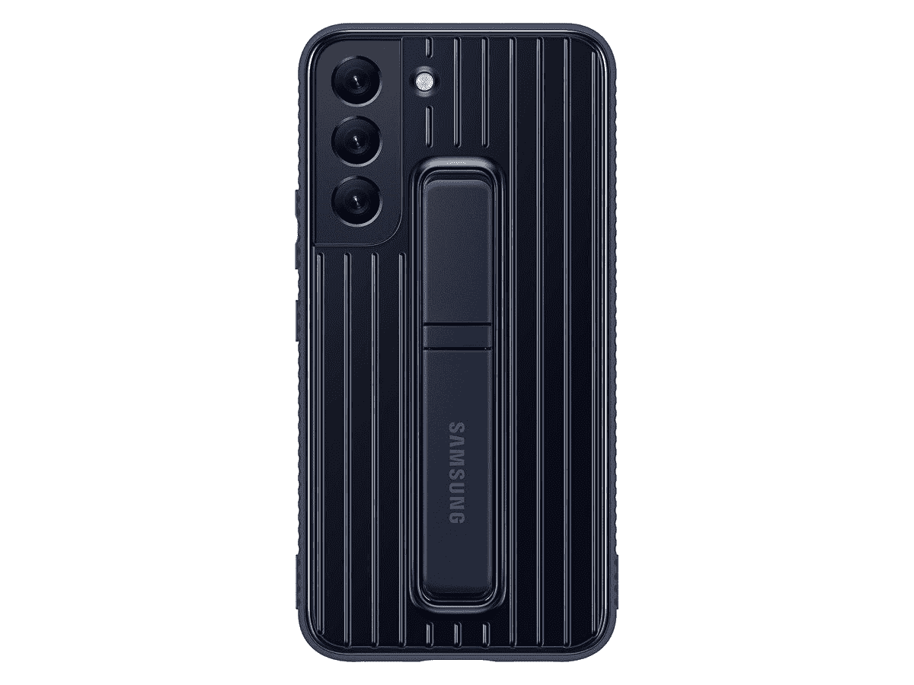
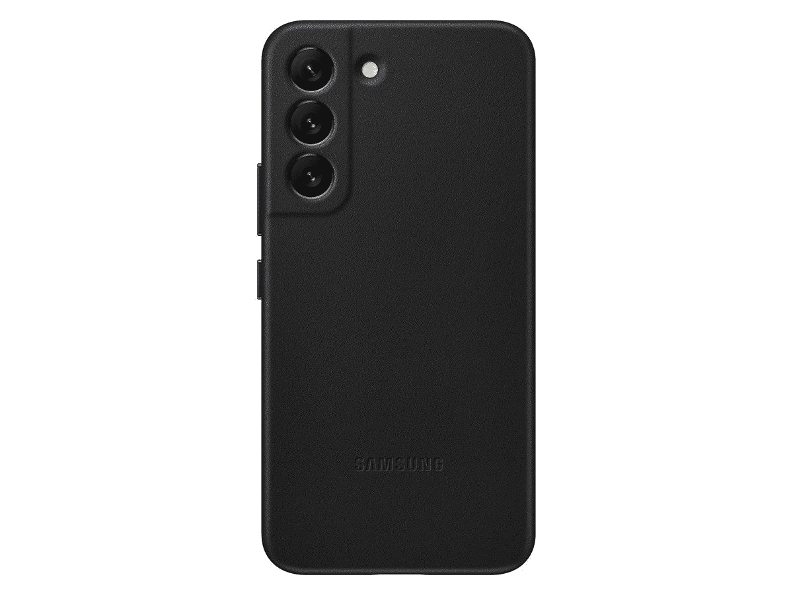
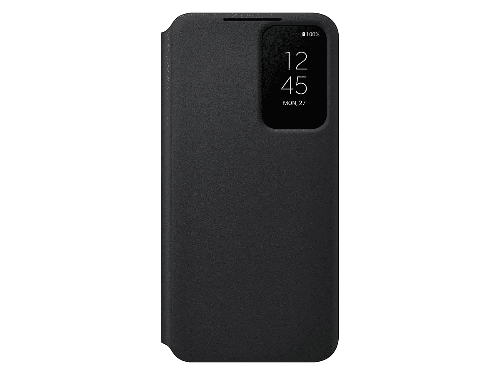

# 来自三星的所有 Galaxy S22 官方案例

> 原文：<https://www.xda-developers.com/best-samsung-galaxy-s22-official-cases/>

Galaxy S22 系列终于来了，经历了几个月的传言、泄露、猜测和更多的泄露。就像去年一样，有三种型号可供选择:最小的 Galaxy S22，更大的 Galaxy S22 Plus，以及配备触控笔的 Galaxy S22 Ultra。我们已经对 Galaxy S22 和 Galaxy S22 Plus 进行了[实践，所以请查看一下，了解我们对新旗舰的想法。](https://www.xda-developers.com/samsung-galaxy-s22-hands-on/)

如果你已经购买了基本型号的手机，也许是从我们的[最佳 Galaxy S22 交易](https://www.xda-developers.com/best-samsung-galaxy-s22-deals/)综述中购买的，你可能也会对防止你昂贵的新手机破碎感兴趣。挑选一些[最好的 Galaxy S22 屏幕保护器](https://www.xda-developers.com/best-samsung-galaxy-s22-screen-protectors/)是个好主意，但在这篇综述中，我们将涵盖三星自己正在销售的所有 Galaxy S22 保护套。

三星总是在所有旗舰手机旁边发布一些保护套，Galaxy S22 也不例外。尽管可能会有来自其他公司的数百(如果不是数千)种替代产品(我们在我们的[最佳 Galaxy S22 案例](https://www.xda-developers.com/best-samsung-galaxy-s22-cases/)列表中涵盖了这些产品)，但看看三星自己提供了什么是个好主意。您可以在下面找到所有可用的选项。

 <picture></picture> 

Samsung belt case

##### 三星硅胶表带 Galaxy S22 保护套

这种情况下，有一个海军色的哑光完成，和一个明亮的橙色表带，你可以滑动你的手指，以改善握持。它有白色和海军蓝两种颜色。

 <picture></picture> 

Clear Case

##### 三星透明 Galaxy S22 立盖

这是一个非常普通的透明硅胶包，但是增加了一个可调节的支架，便于免提观看。

 <picture></picture> 

Galaxy S22 Frame Cover (Navy)

##### 三星框架 Galaxy S22 外壳

这款两件式保护套的两侧有一个海军色的保护框，两个背板(一个透明，一个镜面)可以互换。三星表示，透明背面非常适合贴纸，但遗憾的是，没有包括任何贴纸。

 <picture></picture> 

LED View Cover (Black)

##### 三星 LED View Galaxy S22 外壳

这是 Galaxy S22 的环绕式外壳，右上角有一个小型 LED 时钟，还有一个用于放置一张卡的插槽。

 <picture></picture> 

Silicone Cover (Five Colors)

##### 三星硅胶 Galaxy S22 保护套

这款触感柔软的硅胶保护套有五种颜色可供选择:黑色、森林绿、发光红、北极蓝和黄油黄。红色可能是我最喜欢的颜色。

 <picture></picture> 

Clear Cover

##### 三星 Clear Galaxy S22 外壳

这是你基本的透明塑料手机壳，不要太疯狂。它没有增加多少体积，并展示了你的 Galaxy S22 的实际颜色。

 <picture></picture> 

Protective Standing Cover (Three Colors)

##### 三星立式 Galaxy S22 外壳

这款保护套的设计更加耐用，侧面触感柔软，支架可调。它有藏青色、白色和淡紫色可供选择。

 <picture></picture> 

Leather Cover (Three Colors)

##### 三星皮革 Galaxy S22 保护套

这个箱子是用真皮制成的。它有三种颜色:黑色、浅灰色(非常接近白色)和森林绿色。

 <picture></picture> 

S-View Flip Cover (Three Colors)

##### 三星 S View 翻盖 Galaxy S22 外壳

这款手机套的正面有一个小窗口，可用于永不关机的时钟、来电通知或其他功能。

这些外壳中的大多数都是三星去年为 Galaxy S21 系列提供的设计的简单更新，如硅胶外壳、LED 视图外壳等。S-View 翻盖现在在前显示屏的右上角有一个小的方形切口，而去年的 Galaxy S21 S-View 翻盖有一个长得多的切口，一直延伸到显示屏的底部。与 Galaxy S21 的相同外壳相比，硅胶外壳也有不同的颜色。

唯一全新的是硅胶表带，有藏青色(橙色表带)和白色(绿色表带)可选。这种设计以前只在 Galaxy Z Flip 3 的[外壳中可用，这有助于抓住较小的手机，但现在它也可用于 Galaxy S22 系列。](https://shop-links.co/1765689847407532713?u1=d28da00c-33ff-4708-b037-326281da82b6)

 <picture></picture> 

Samsung Galaxy S22

三星 Galaxy S22 是 2022 年的入门级旗舰产品，以适合许多口袋和预算的形式带来了顶级的性能和相机功能。