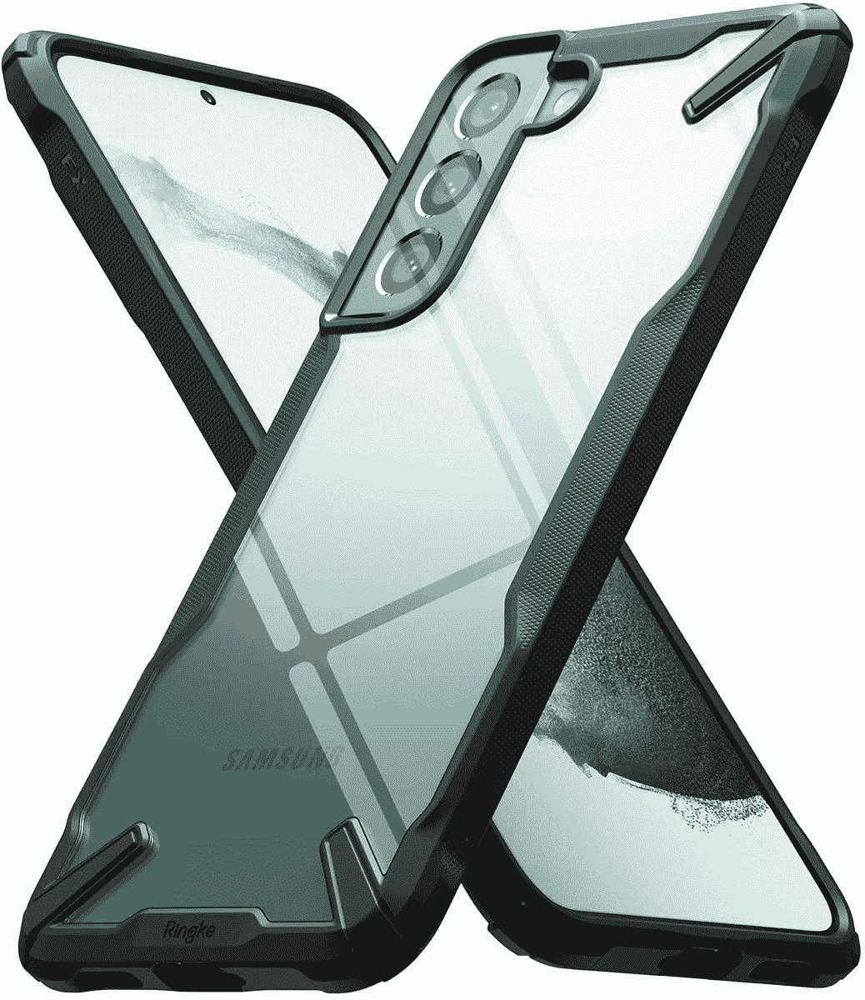
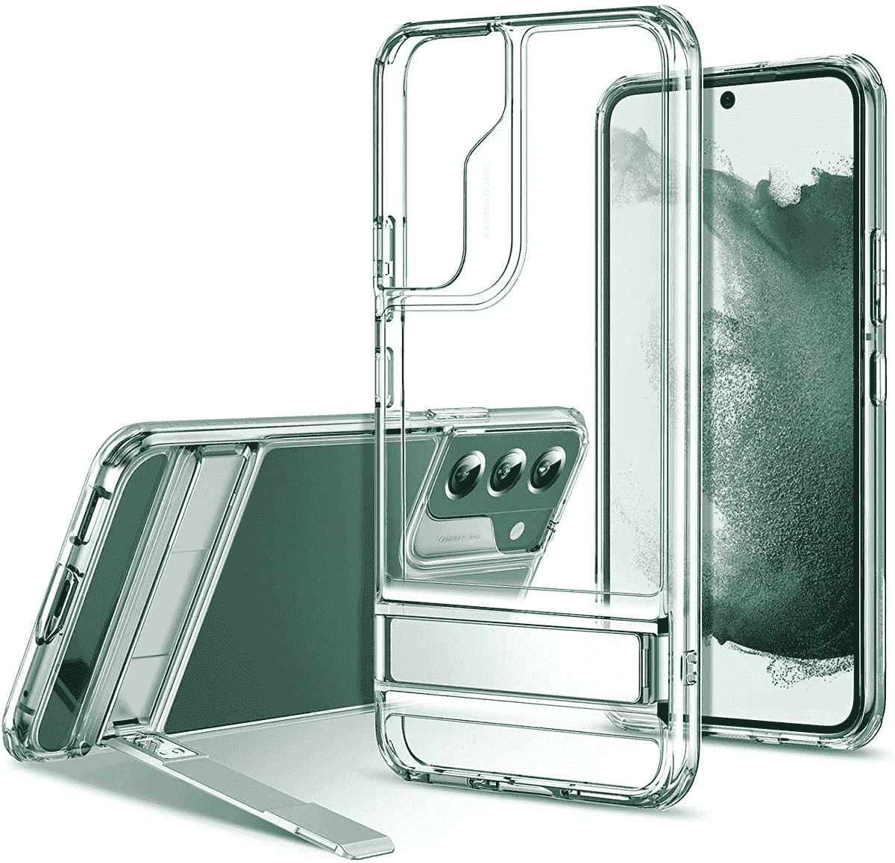
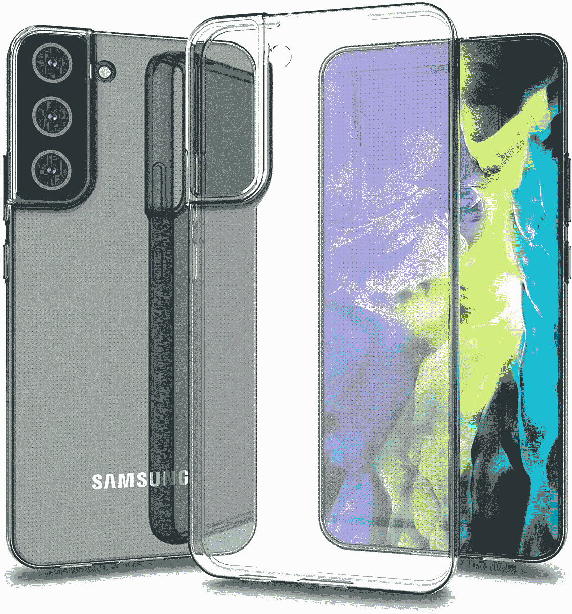

# 2023 年最佳三星 Galaxy S22 Plus 透明保护套

> 原文：<https://www.xda-developers.com/best-samsung-galaxy-s22-plus-clear-cases/>

# 2023 年最佳三星 Galaxy S22 Plus 透明保护套

三星 Galaxy S22 Plus 是一款华丽的智能手机。以下是最好的清晰案例，有助于保护它而不隐藏其原始设计。

三星 Galaxy S22 Plus 是目前 T2 最好的智能手机之一。它具有大显示屏，专业的后置摄像头系统和强大的芯片组。如果你打算[购买 Galaxy S22 Plus](http://www.xda-developers.com/best-samsung-galaxy-s22-deals/) ，你应该认真考虑投资一个[屏幕保护器](http://www.xda-developers.com/best-samsung-galaxy-s22-plus-screen-protectors/)和一个[外壳](http://www.xda-developers.com/best-samsung-galaxy-s22-plus-cases/)。这是因为这款设备几乎是一个玻璃三明治，因此任何跌落或事故都可能打碎它华丽的身体。智能手机外壳的伟大之处在于，它们不必超级健忘。例如，透明外壳提供了良好的抗震性能，同时保持了手机原有的颜色和设计。下面你可以找到一些你现在可以买到的最好的三星 Galaxy S22 Plus clear 外壳。

## 最佳 Galaxy S22 Plus 透明外壳

*   <picture></picture>

    Clear Case

    ##### 三星 Clear Standing Galaxy S22 Plus Case

    这一款清晰轻薄的 Case 在很大程度上为你提供了基本的保护。它包括一个支架，所以你可以支撑手机观看视频。它增加了一点额外的厚度，但它仍然应该很容易放在你的口袋里。

*   <picture></picture>

    Ringke Fusion-X Clear Case

    ##### Ringke Fusion-X Galaxy S22 Plus Case

    这款保险杠外壳部分加固，为 Clear Case 带来更多保护。它融合了厚重和简约。

*   <picture></picture>

    ESR 金属支架保护套

    ##### ESR 金属支架 Galaxy S22 Plus 保护套

    这款防刮保护套带有一个支架，最大可调节至 60°。它非常适合那些积极在手机上播放电影的人。

*   <picture></picture>

    sup Case UB Edge Pro

    ##### sup Case UB Edge Pro Galaxy S22 Plus Case

    sup Case 的 UB Edge Pro 系列带有一个清晰的背部，以及内置屏幕保护器。

*   <picture></picture>

    透明盖

    ##### 三星透明 Galaxy S22 Plus 保护套

    这只是你标准的三星制造的透明手机壳。它展示了你的手机的原始颜色。这里没什么太疯狂的。

*   <picture></picture>

    Naneno Slim Fit 表壳

    ##### Nareno Slim Fit Galaxy S22 Plus 表壳

    这款柔软、富有弹性的表壳薄至 1.2 毫米它足够苗条，可以提供一些阻力，但又不会太胖。

* * *

如果我必须为我的三星 Galaxy S22 Plus 选择一个透明外壳，我个人会选择三星透明外壳。它简约、轻薄、价格实惠。这使我能够保留手机的原始设计、外观和手感，而不需要牺牲它的保护。我不是彩色配饰的最大粉丝，所以我几乎总是满足于简单明了的案例。

手机壳的伟大之处在于，你可以轻松地从一个切换到另一个。它们通常是预算友好的，改变它们并不是一件很不方便的事情——至少对我来说是这样。因此，当你想展示手机的原始形态时，你可以从这个列表中找到一个明确的案例，并且你可以购买其他时尚的手机来补充你不同的服装、场合或心情。

 <picture></picture> 

Samsung Galaxy S22 Plus

##### 三星 Galaxy S22 Plus

三星 Galaxy S22 Plus 是 2022 年的中期旗舰产品，在更大的外壳中为那些需要做更多事情的人带来了顶级的性能、显示和相机功能。

*您打算为您的新三星 Galaxy S22 Plus 购买这些清晰的保护套中的哪一个？请在下面的评论区告诉我们。*