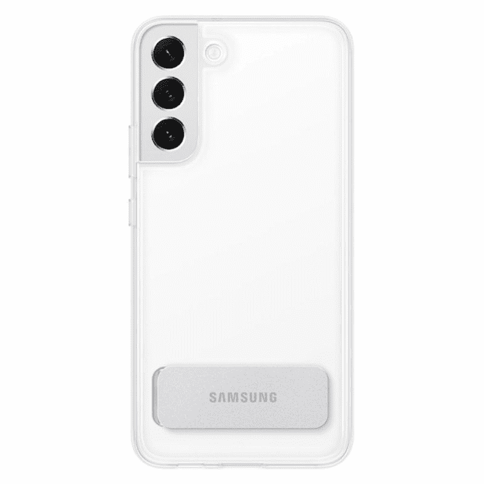
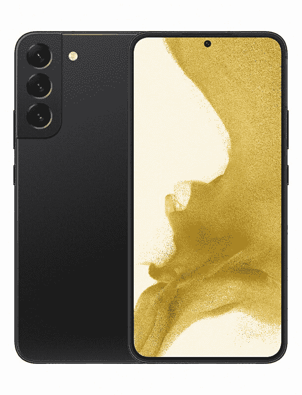

# 2023 年最佳三星 Galaxy S22 Plus 支架保护套

> 原文：<https://www.xda-developers.com/best-samsung-galaxy-s22-plus-kickstand-cases/>

# 2023 年最佳三星 Galaxy S22 Plus 支架保护套

将您的 Galaxy S22 Plus 支撑在平坦的表面上，并使用这些支架保护套免提使用。

三星 Galaxy S22 Plus 是最高端的智能手机之一，拥有漂亮的设计。它的前面板和后面板都使用了玻璃，这意味着它和目前市场上的任何其他旗舰产品一样脆弱。你已经为 Galaxy S22 Plus 支付了至少 1000 美元，所以我们认为多花一点钱购买一个最好的外壳不会让你倾家荡产。它不仅能保护你的手机免受意外跌落和碰撞，还能让你拿在手里时更加自信。市场上不乏 Galaxy S22 系列的案例，但我们将在本文中了解一些最好的 Galaxy S22 Plus kickstand 案例。

你可能已经知道，支架保护套非常适合那些喜欢在手机上使用大量媒体内容的人。三星 Galaxy S22 Plus 拥有出色的 6.6 英寸 FHD+动态 2X AMOLED 屏幕，您会更想在其上实现这一点。我们选择了一些目前市场上最好的支架案例，让你更容易挑选。来，看一看:

## 2022 年最值得购买的 Galaxy S22 Plus 支架保护套

 <picture></picture> 

Official clear case

##### 三星透明立式 Galaxy S22 外壳

三星官方的 clear standing case，顾名思义就是一个简单的透明保护套，用来炫耀你手机的颜色。由于 TPU 保险杠和聚碳酸酯背板，它还能很好地保护您的设备。这种特殊的情况下，还在后面有一个支架，带有一个自由停止铰链，让您调整和选择最适合您的视角。

 <picture></picture> 

Galaxy S22 Plus Protective Standing Cover

##### 三星保护性 Galaxy S22 Plus 保护套

这种特殊的情况下非常类似于明确的立场，除了这个有一个坚固的外壳在后面。它为手机提供了更多的保护，因为三星声称它已经按照军用标准进行了跌落测试。这款手机的后部也有一个支架，但是，你只能获得两个视角——45 度或 60 度——因为它没有自由停止铰链。

 <picture></picture> 

Supcase UB Pro

##### SUPCASE UB Pro Galaxy S22 Plus 外壳

Supcase 的 Unicorn Beetle Pro 是你可以为 Galaxy S22 Plus 购买的最坚固的外壳之一。这个特殊的箱子也是一个很好的支架选择，因为它后面有一个内置支架。Supcase UB Pro 最棒的一点是，它还配有内置屏幕保护器，为你的手机提供全方位的保护。

 <picture></picture> 

Spigen Tough Armor case

##### Spigen 坚韧装甲银河 S22 Plus 盒

Spigen 的坚韧装甲包是那些想要提供良好保护的重型包的人的热门选择。它内部带有保护泡沫，增加了一层额外的抗冲击能力。这种情况下，也正好有一个支架，当它不使用时，坐在后面板上齐平。它提供了 TPU 和聚碳酸酯的双重保护组合，它有点笨重，所以请记住这一点。

 <picture></picture> 

ESR Metal Clear Kickstand Case

##### ESR 金属支架 Galaxy S22 Plus 外壳

ESR 金属透明外壳是三星官方透明外壳的绝佳替代品。这个放在你的钱包里很方便，还配有支架。您可以使用它将手机设置为垂直或水平方向，因此它非常适合免提观看体验。这种特殊的外壳据说也是耐刮擦的，并且它也支持无线充电。

 <picture></picture> 

TUCCH Wallet case

##### TUCCH 皮革钱包 Galaxy S22 Plus 包

你可能已经知道，Folio 保护套可以 360 度全方位保护你的手机。TUCCH 钱包盒是新款 Galaxy S22 Plus 的一个选择。这种情况下还带有口袋来存储您的信用卡，这意味着你可以用它来代替你的钱包。TUCCH 钱包保护套还可以兼作支架保护套，让您可以在多个视角下设置手机，获得出色的免提体验。

好吧，这些是我们为你在 2022 年能买到的最好的 Galaxy S22 Plus 支架外壳挑选的。我们认为三星自己的立式保护套对那些想买支架保护套的人来说很棒。Supcase UB Pro 也是一个很好的外壳，它通过内置的屏幕保护器提供全方位的保护。我们还有一大堆其他选择，包括 TUCCH 钱包包和 ESR clear 包，所以一定要去看看。这是一个不断发展的列表，所以随着更多制造商发布 Galaxy S22 Plus 的外壳，我们将不断更新它。

 <picture></picture> 

Samsung Galaxy S22

##### 三星 Galaxy S22 Plus

Galaxy S22 Plus 是 2022 年上市的三星新款旗舰智能手机之一。它由高通骁龙 8 Gen 1 SoC 提供支持，在 Android 12 上运行，只有一个用户界面。

那么你打算买哪款 Galaxy S22 Plus kickstand 保护套呢？请在下面留言告诉我们。如果你不喜欢上面提到的任何支架案例，那么你可能想停下来看看我们收集的[最佳 Galaxy S22 Plus 案例](https://www.xda-developers.com/best-samsung-galaxy-s22-plus-cases/)，因为它有更广泛的选择。不管你最终买的是哪一款，别忘了给[买一个屏幕保护器](http://www.xda-developers.com/best-samsung-galaxy-s22-plus-screen-protectors/)来保护显示器的安全。此外，如果您还没有下 Galaxy S22 Plus 订单，那么我们的[最佳 Galaxy S22 交易](https://www.xda-developers.com/best-samsung-galaxy-s22-deals/)页面可能会为您提供一些折扣。