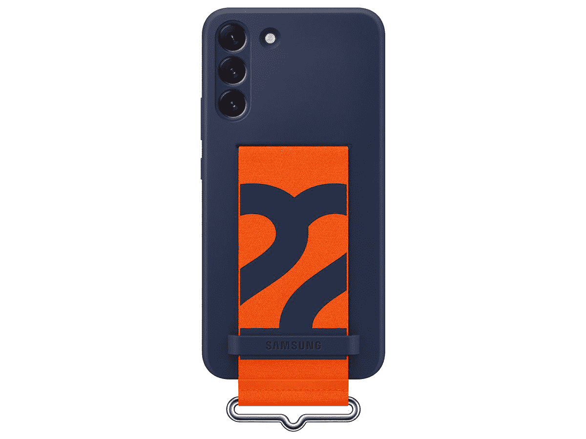
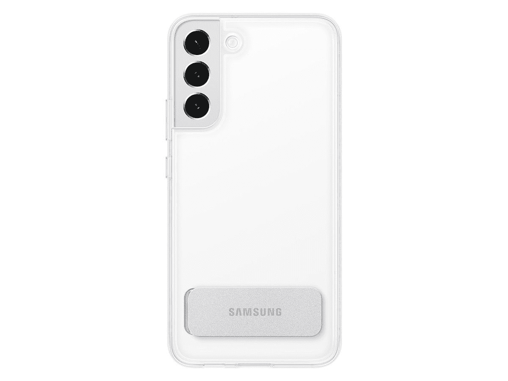
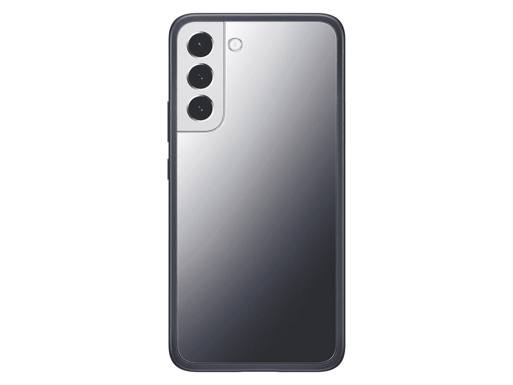
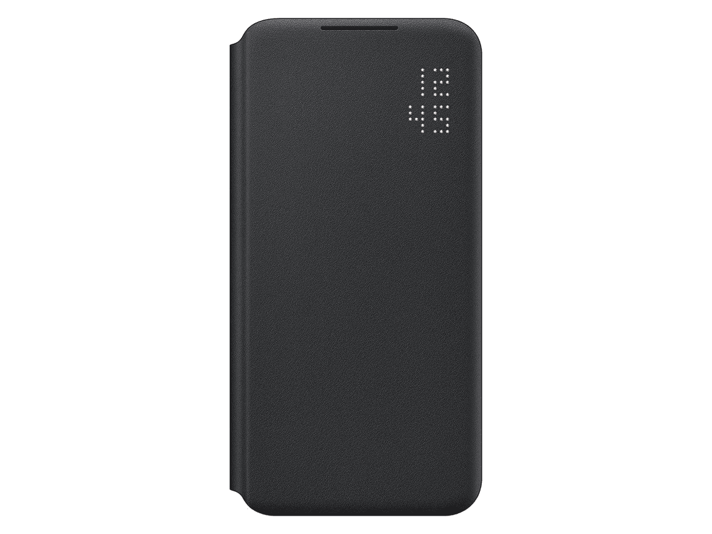
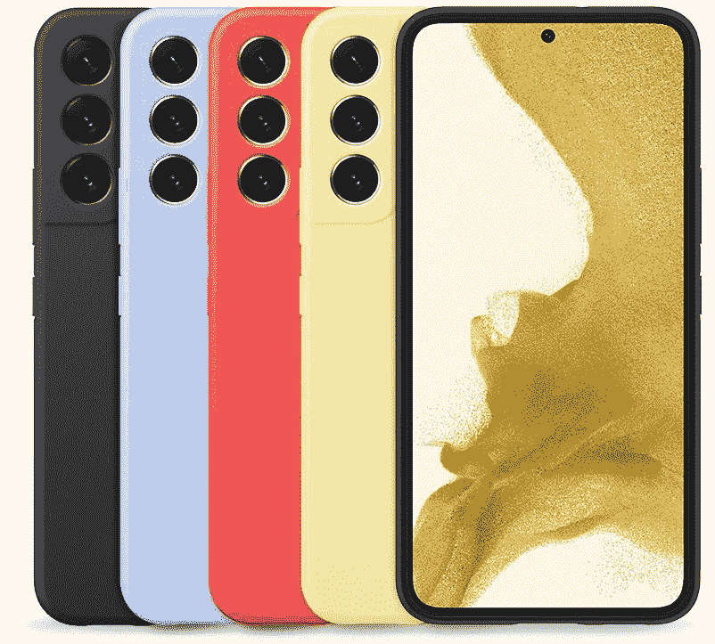
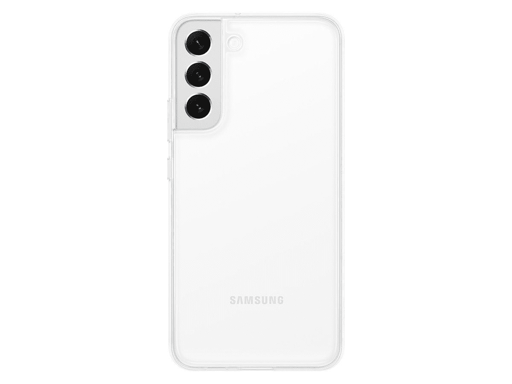
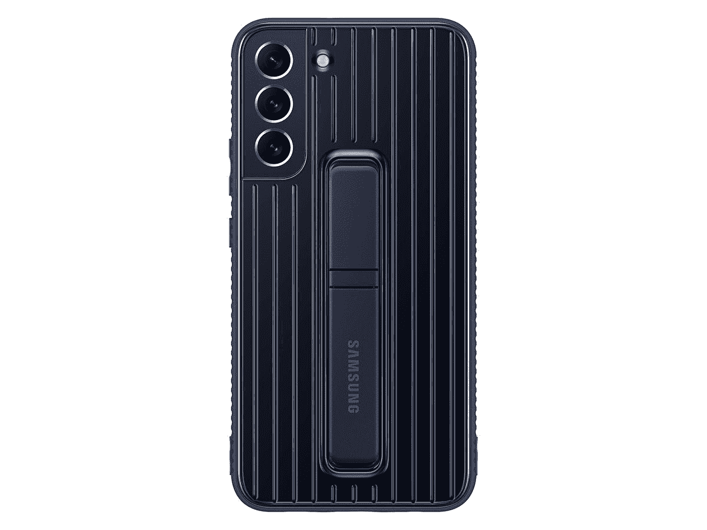
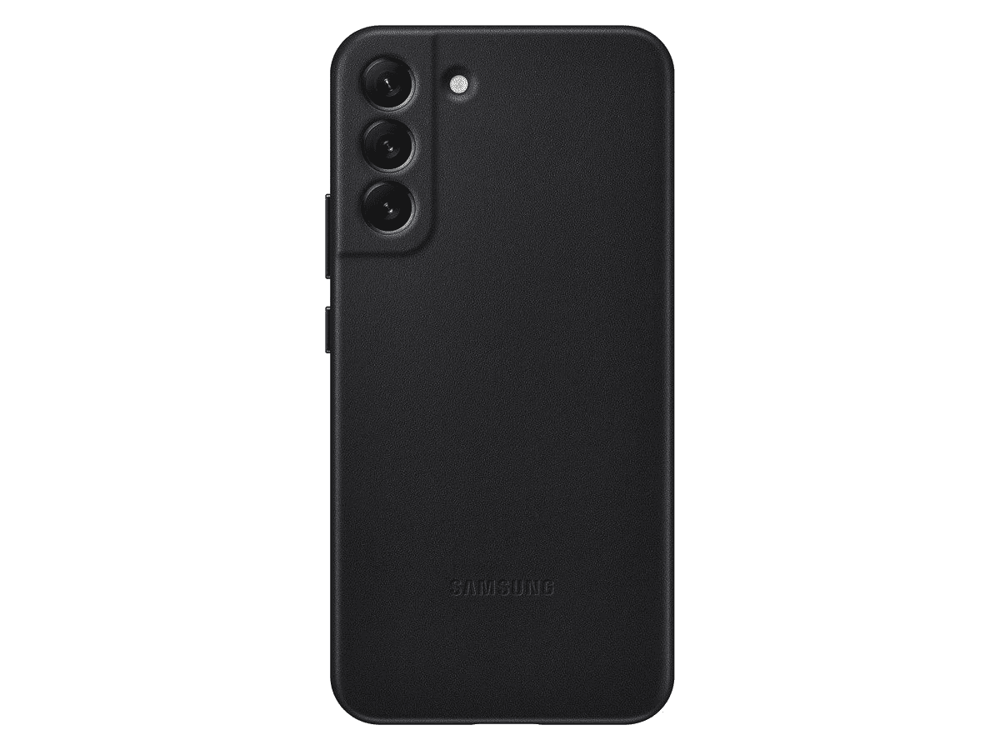
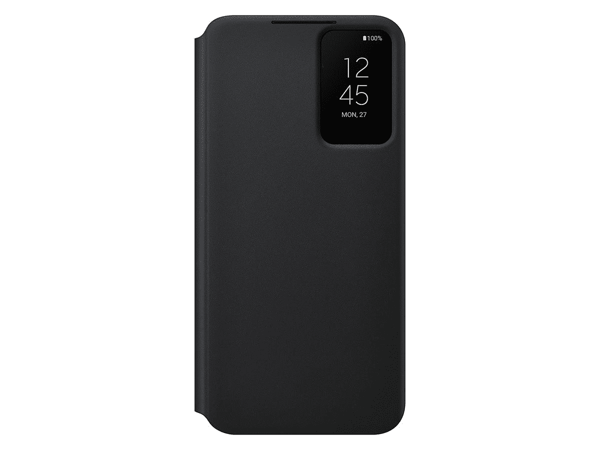

# 三星所有 Galaxy S22 Plus 官方保护套

> 原文：<https://www.xda-developers.com/best-samsung-galaxy-s22-plus-official-cases/>

# 三星所有 Galaxy S22 Plus 官方保护套

寻找所有三星官方制造的 Galaxy S22 外壳？为了便于比较，我们在这里列出了它们！

经过数月的传言、泄露和猜测，Galaxy S22 系列终于到来了。就像去年一样，有三种型号可供选择:入门级的 Galaxy S22，更大的 Galaxy S22 Plus，以及最终取代长期运行的 Galaxy S Note 阵容的配备触控笔的 Galaxy S22 Ultra。有很多令人兴奋的事情，如果你想确保你闪亮的新 Galaxy S22 Plus(可能是从我们最好的 [Galaxy S22 Plus 交易](https://www.xda-developers.com/best-samsung-galaxy-s22-deals/)中获得的)不会因为短暂的跌落而破碎，你来对地方了。如果你仍在决定是否应该购买，请查看我们的[Galaxy S22 Plus hand-On](https://www.xda-developers.com/samsung-galaxy-s22-hands-on/)，了解我们对这款设备的想法。

每部新的 Galaxy S 手机都有数百个(如果不是数千个)第三方保护套，但三星自己也生产一些保护套和保护套。拿起一个[最好的 Galaxy S22 Plus 屏幕保护器](https://www.xda-developers.com/best-samsung-galaxy-s22-plus-screen-protectors/)可能也是一个好主意，特别是如果你没有得到一个在手机前面关闭的外壳。我们在这里列出了三星 Galaxy S22 Plus 的所有官方案例。

 <picture></picture> 

Silicone Cover with Strap (Two Colors)

##### 三星硅胶表带 Galaxy S22 Plus 外壳

这是一个硅胶包，背面有一个带子，可以让你的手滑下，以提高你的抓握力(有点像插座)。有藏青色和白色可选。

 <picture></picture> 

Clear Standing Cover

##### 三星清晰站立式 Galaxy S22 Plus 外壳

这款保护套采用清晰的设计来展示手机的原始颜色，内置支架，便于媒体观看和视频通话。

 <picture></picture> 

Frame Cover (Three colors)

##### 三星框架 Galaxy S22 Plus 外壳

您可以在这款表壳的两个可互换背框之间进行选择(一个透明，一个镜面)，它有三种颜色:海军蓝、透明和白色。

 <picture></picture> 

LED View Cover (Two Colors)

##### 三星 LED 查看 Galaxy S22 Plus 外壳

这是一个盖子，里面有一张卡片的空间，正面显示一个小 LED 时钟。有黑色和浅灰色可选。

 <picture></picture> 

Silicone Cover (Five Colors)

##### 三星硅胶 Galaxy S22 Plus 外壳

这款标准软触硅胶保护套有五种款式可供选择:黑色、森林绿、发光红、北极蓝和黄油黄。

 <picture></picture> 

Clear Cover

##### 三星 Clear Galaxy S22 Plus 外壳

这只是你标准的透明手机壳，炫耀你手机的本来颜色。这里没什么太疯狂的。

 <picture></picture> 

Protective Standing Cover (Two Colors)

##### 三星立式 Galaxy S22 Plus 外壳

这种情况下有一个更耐用的设计和一个可调支架。万一摔倒，支架会突然断开以避免断裂。

 <picture></picture> 

Leather Cover (Three Colors)

##### 三星皮革 Galaxy S22 Plus 外壳

这款表壳由真皮制成，有三种颜色出售:黑色、浅灰色和森林绿色。这里没有什么太疯狂的。

 <picture></picture> 

S-View Flip Cover (Three Colors)

##### 三星 S View 翻盖 Galaxy S22 Plus 外壳

这种情况类似于 LED 盖，但有一个更大的前切口，用于永远在线的时钟、呼叫通知和其他功能。你可以买到黑色、白色和酒红色的。

几乎所有这些保护套都是对三星去年为 Galaxy S21 Plus 制作的保护套的小幅修改，如硅胶保护套、LED 视图保护套等。S-View 翻盖现在在前显示屏的右上角有一个小的方形切口，而去年的 Galaxy S21 S-View 翻盖有一个长得多的切口，一直延伸到显示屏的底部。与 Galaxy S21 的相同外壳相比，硅胶外壳也有不同的颜色。

今年唯一新增的是带表带的硅胶套，有藏青色(带橙色表带)和白色(带绿色表带)可选。这种设计以前只在 Galaxy Z Flip 3 的[外壳中可用，这有助于抓住较小的手机，但现在它也可用于 Galaxy S22 系列。](https://shop-links.co/1765689847407532713?u1=d28da00c-33ff-4708-b037-326281da82b6)

 <picture></picture> 

Samsung Galaxy S22 Plus

##### 三星 Galaxy S22 Plus

三星 Galaxy S22 Plus 是 2022 年的中期旗舰产品，在更大的外壳中为那些需要做更多事情的人带来了顶级的性能、显示和相机功能。