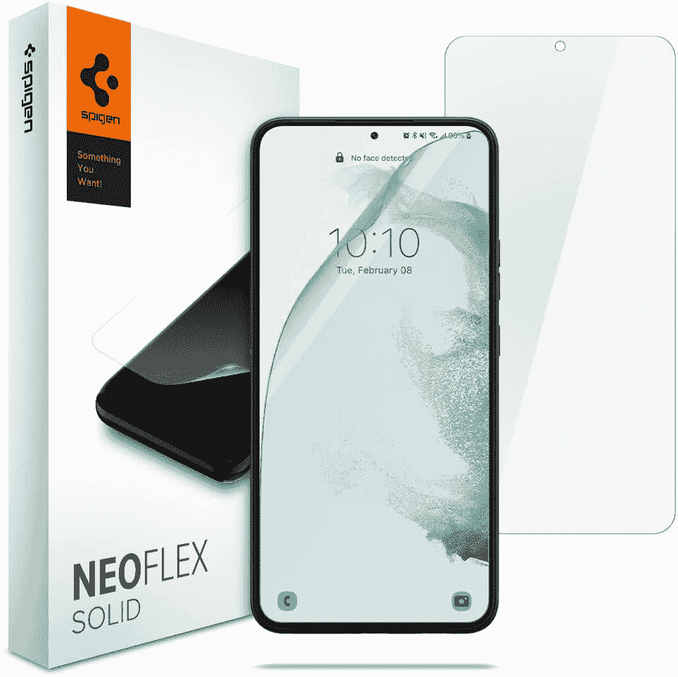
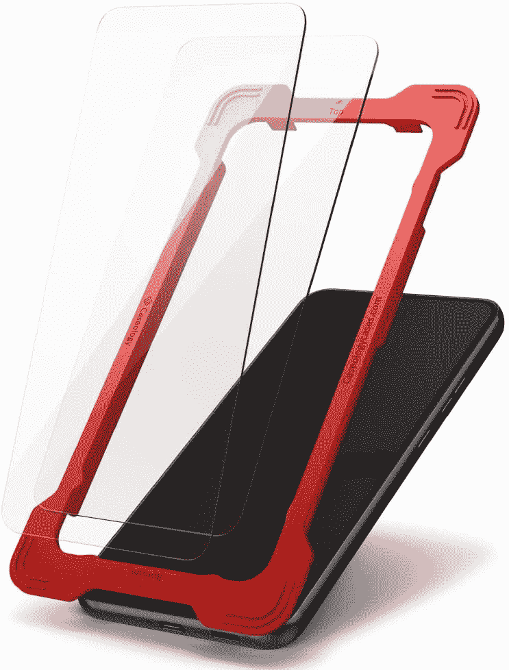
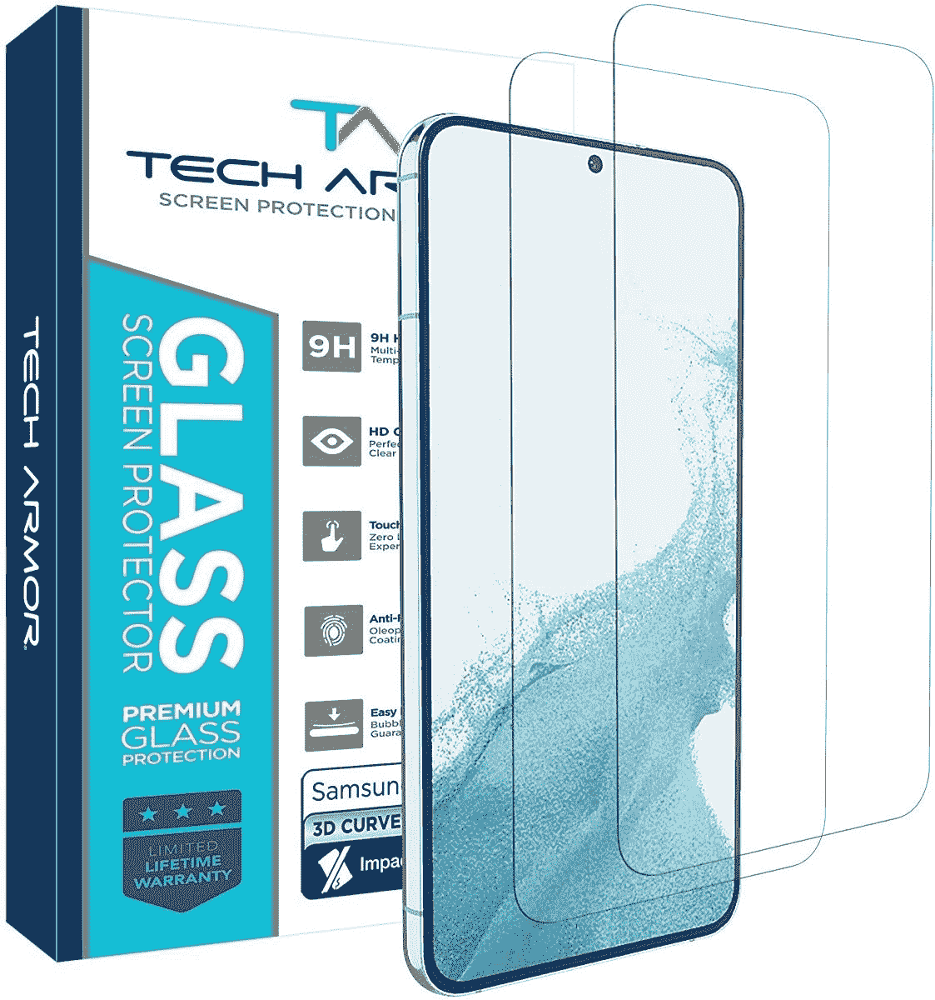
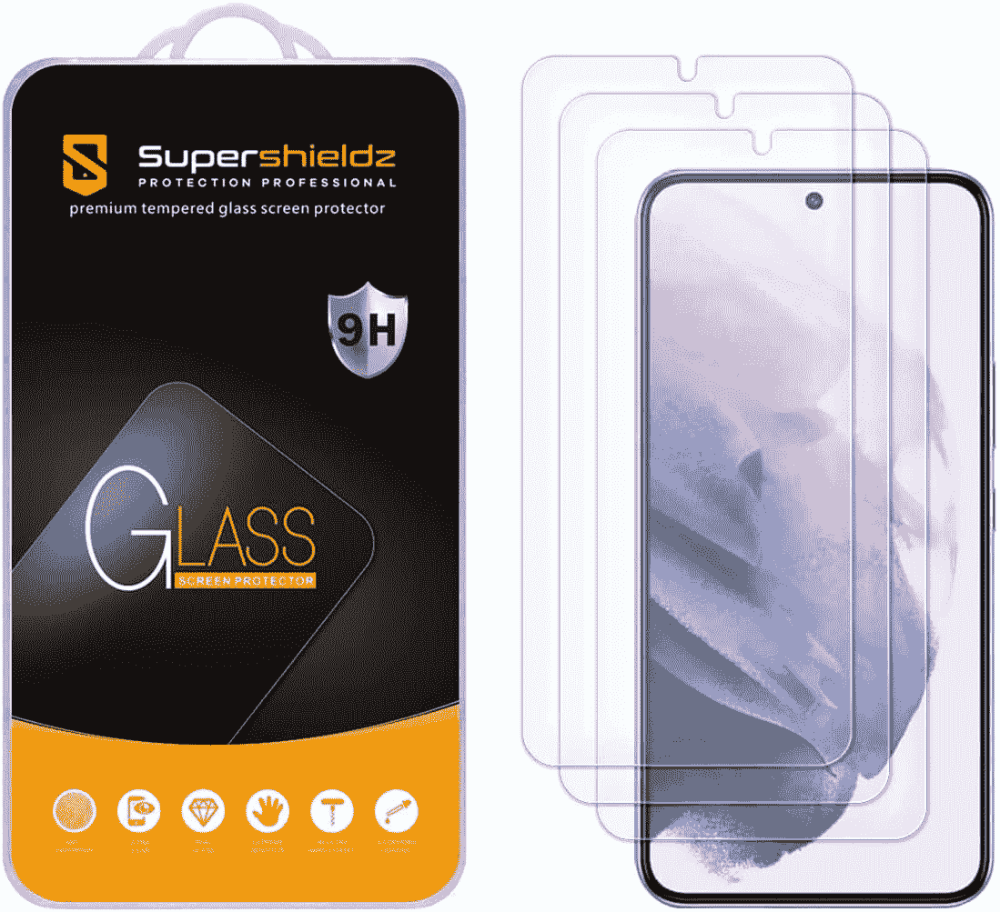
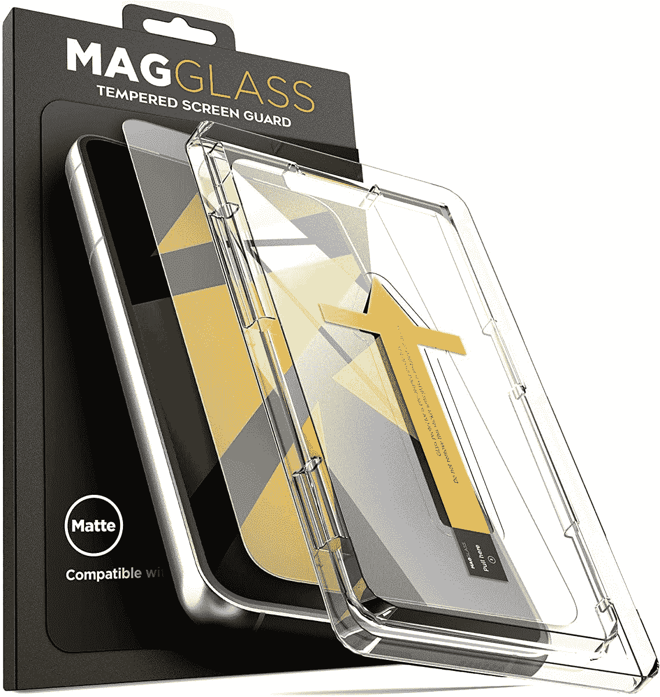
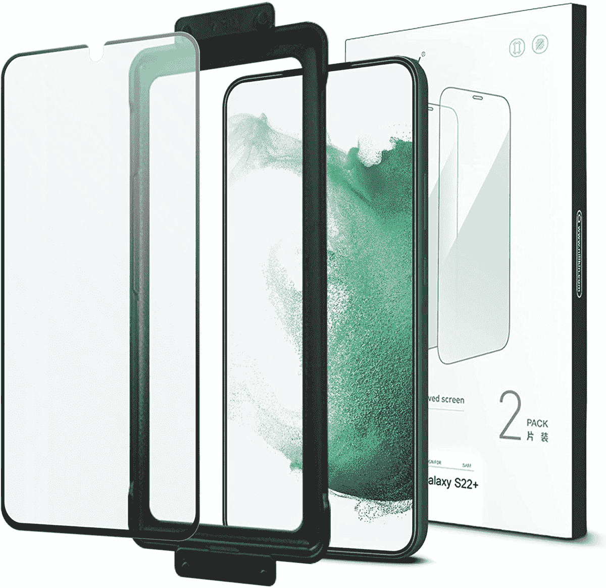

# 2023 年最佳三星 Galaxy S22 Plus 屏幕保护器

> 原文：<https://www.xda-developers.com/best-samsung-galaxy-s22-plus-screen-protectors/>

# 2023 年最佳三星 Galaxy S22 Plus 屏幕保护器

我们有很多选择，从价格实惠的 TPU 屏幕保护器到优质的哑光钢化玻璃。

在黑色星期五或网络星期一促销期间，为自己买了一部闪亮的新 Galaxy S22 Plus？很棒的选择！现在是时候为您订购一款屏幕保护器，让其出色的显示屏不会出现微划痕和丁丁声了。亚马逊有很多 Galaxy S22 Plus 的屏幕保护器，但如果你不想麻烦地找到一个符合你需求的，我们可以为你提供。以下 Galaxy S22 Plus 屏幕保护器是您现在可以买到的最佳产品之一，它们涵盖了各种价位和使用案例。

## 最佳 Galaxy S22 Plus 屏幕保护器

 <picture></picture> 

Spigen NeoFlex screen protector

##### Spigen NeoFlex Galaxy S22 Plus 屏幕保护器

Spigen NeoFlex 是 Galaxy S22 Plus 的优质 TPU 屏幕保护器，附带一个简单、无气泡的应用解决方案。

 <picture></picture> 

Caseology Tempered Glass

##### Caseology 钢化玻璃 Galaxy S22 Plus 屏幕保护器

Caseology 钢化玻璃屏幕保护器采用疏油涂层和耐用的玻璃表面，提供光滑的手感。

 <picture></picture> 

Tech Armor Ballistic Glass

##### 科技装甲弹道玻璃银河 S22 加屏幕保护

Galaxy S22 Plus 的 Tech Armor 弹道玻璃屏幕保护器是一个负担得起的选项，它提供了大量的保护，而无需花费大量金钱。

 <picture></picture> 

Supershieldz Tempered Glass

##### SuperShieldz 钢化玻璃 Galaxy S22 Plus 屏幕保护器

Supershieldz 钢化玻璃屏幕保护器是最超值的选择，因为它配有三个屏幕保护器，价格不到 10 美元。

 <picture></picture> 

Magglass Tempered Glass

##### Magglass 钢化玻璃 Galaxy S22 屏幕保护器

Galaxy S22 Plus 的 Magglass 钢化玻璃屏幕保护器配有一个无障碍涂抹器，可以帮助您轻松涂抹屏幕保护器。

 <picture></picture> 

Nillkin Liquid Glass

##### Nillkin 液态玻璃 Galaxy S22 屏幕保护器

Nillkin 液态玻璃是另一个绝佳的选择。它配有两个弯曲边缘的钢化玻璃屏幕保护器和一个易于应用的附件套件。

这就完成了我们对最佳 Galaxy S22 Plus 屏幕保护器的选择。如前所述，该列表包括不同价位的选项，我们相信您会找到符合您预算的产品。无论您选择哪个选项，我们都向您保证，这些 Galaxy S22 Plus 屏幕保护器将在未来几个月内保持您设备的屏幕焕然一新。

如果你还是不确定，我推荐你买 Magglass 钢化玻璃屏幕保护套。它提供了一个哑光，防眩光完成。但是如果你不愿意花 17 美元买一个屏幕保护器，你可以选择 Supershieldz 屏幕保护器。虽然它可能感觉不如 Magglass 的光滑，但肯定足以在日常使用中保护你的设备屏幕。

一旦你订购完屏幕保护器，请前往我们的[best Galaxy S22 Plus cases](https://www.xda-developers.com/best-samsung-galaxy-s22-plus-cases/)round up 查看一些好的案例推荐。我们有很多选择，从提供最大保护的坚固外壳到突显 Galaxy S22 Plus 的[颜色的透明外壳。](https://www.xda-developers.com/samsung-galaxy-s22-colors/)