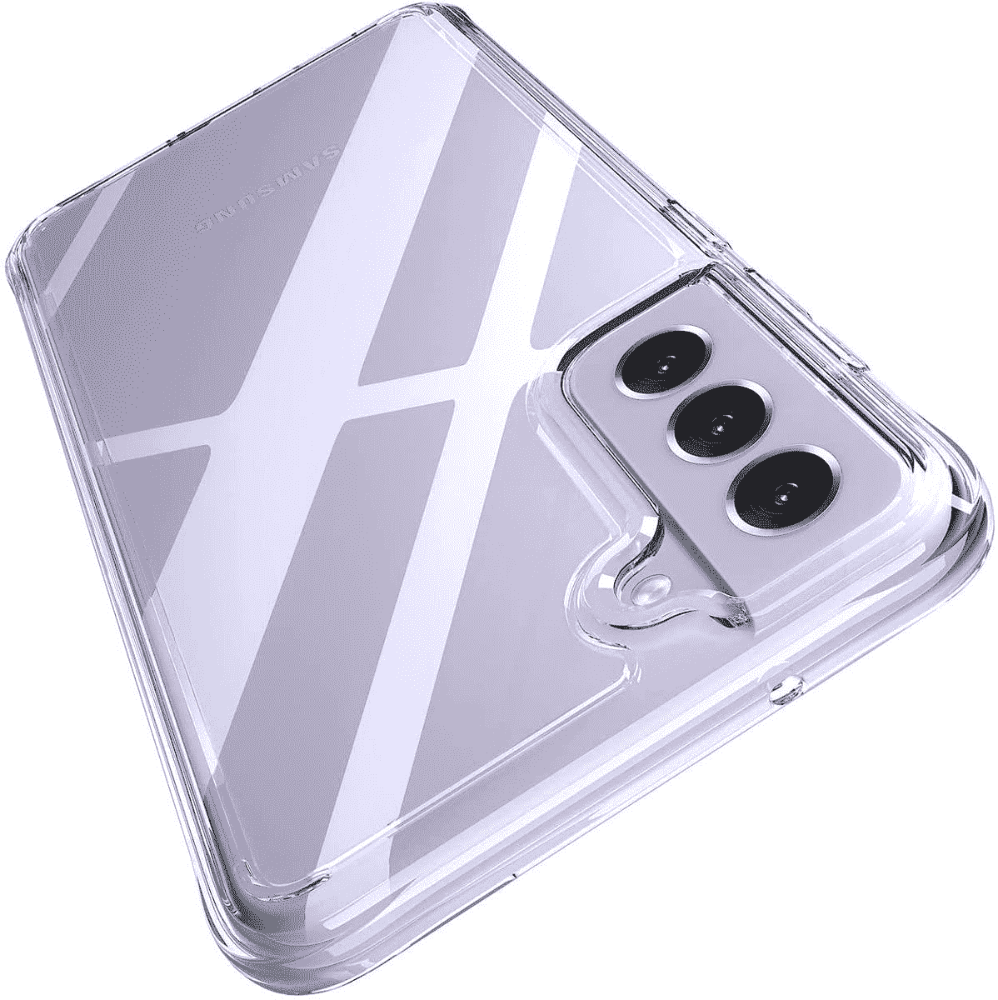
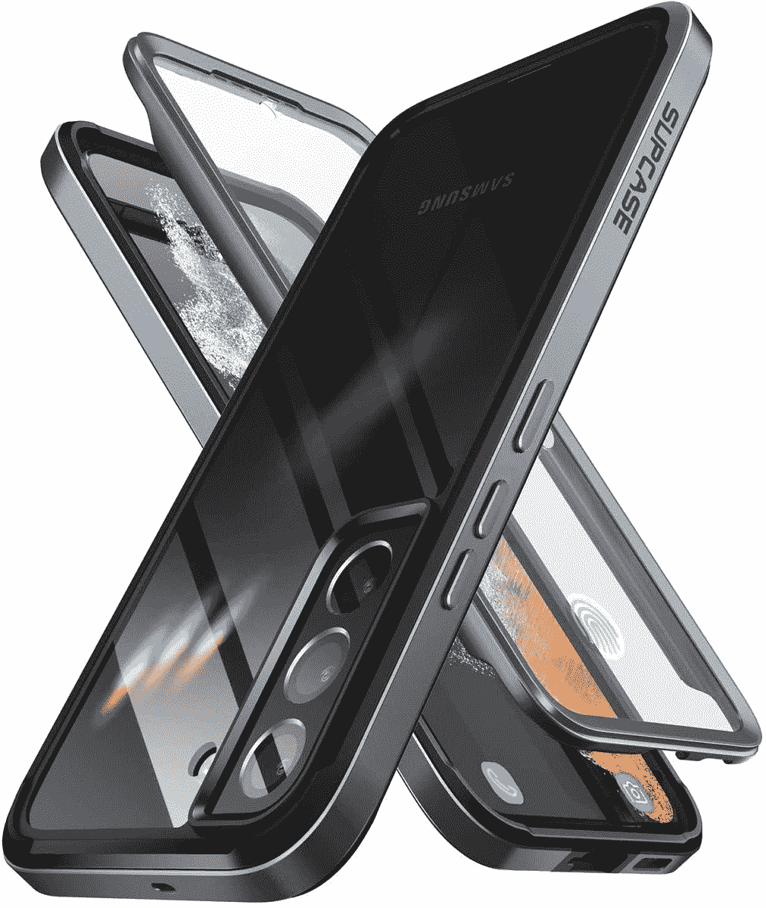
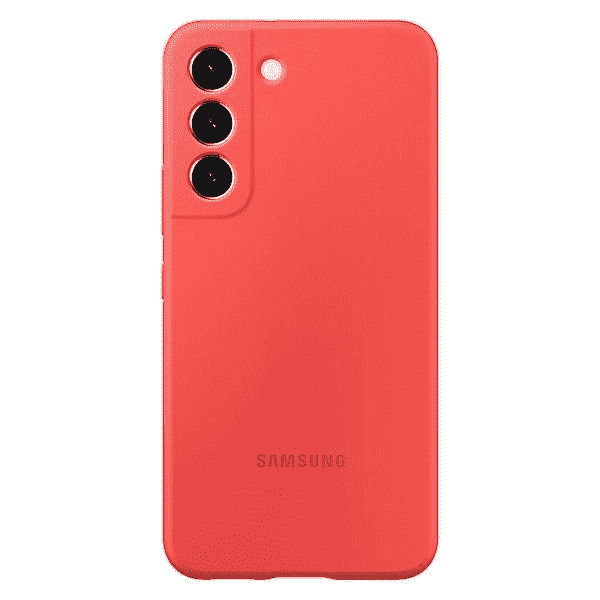
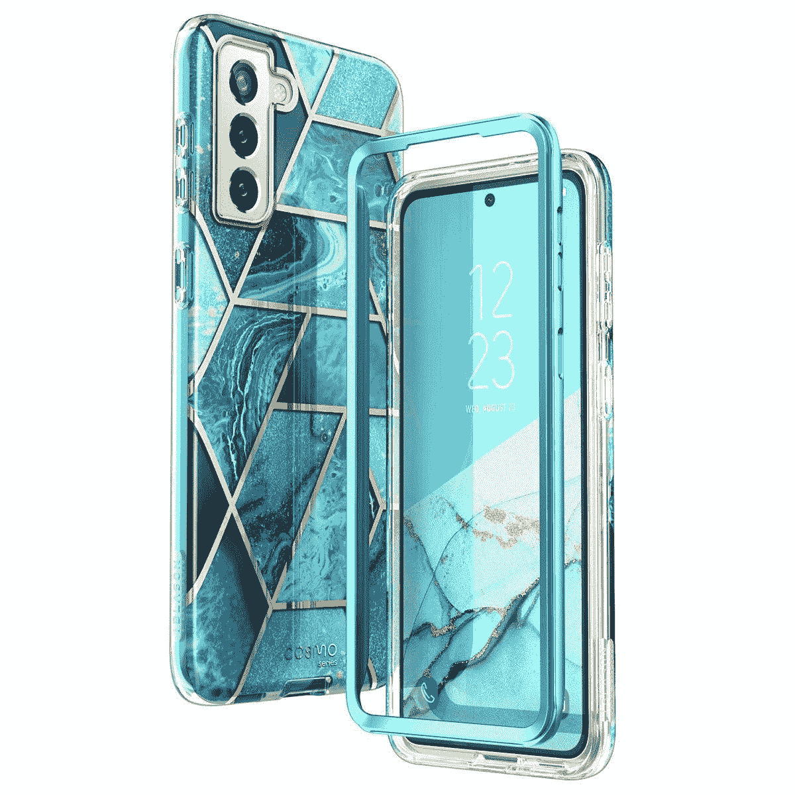
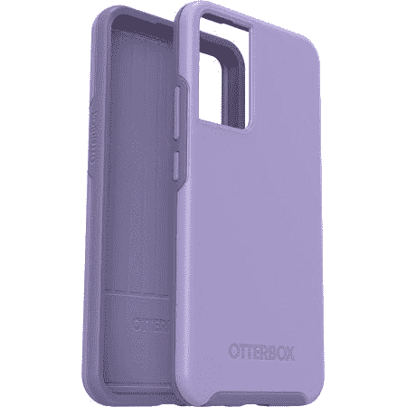
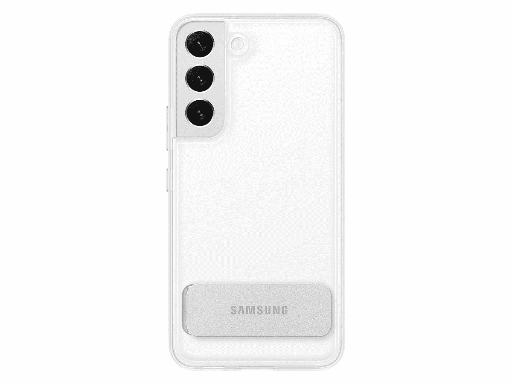
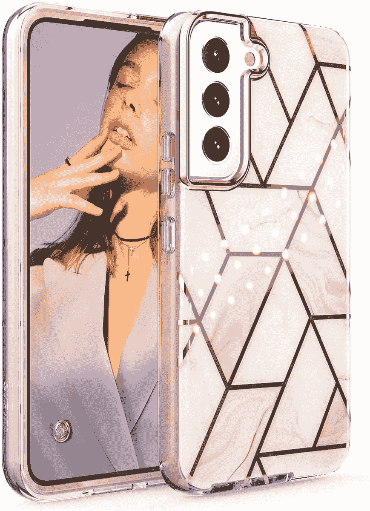
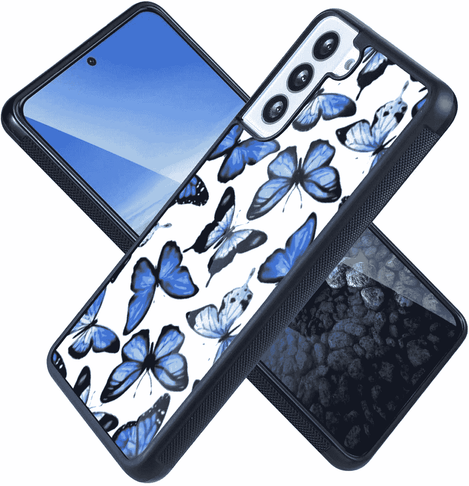
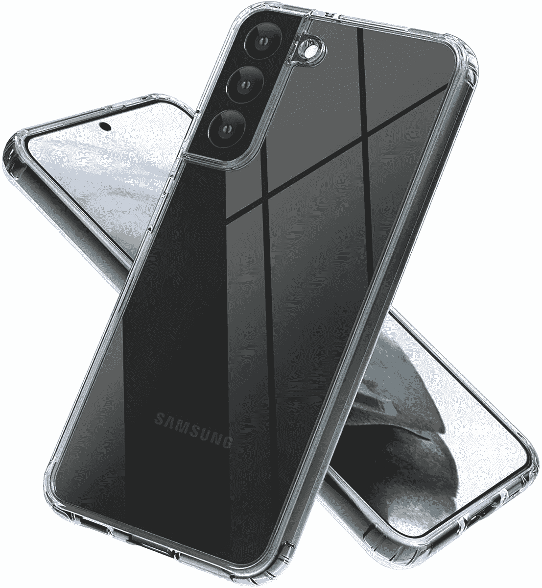

# 2023 年最佳三星 Galaxy S22 Plus 轻薄外壳

> 原文：<https://www.xda-developers.com/best-samsung-galaxy-s22-plus-thin-cases/>

# 2023 年最佳三星 Galaxy S22 Plus 轻薄外壳

想保护手机而不使其成为砖头？这些是 Galaxy S22 Plus 的最佳轻薄外壳，因此它仍然很紧凑。

三星的 Galaxy S22 系列由三款出色的手机组成，其中最引人注目的是 [Galaxy S22 和](https://www.xda-developers.com/samsung-galaxy-s22-plus-review/)。这款手机起价 999 美元，具有一些非常高的性能规格，是一款很棒的手机，但也很贵。这种投资是值得保护的，但我们许多人都不想要一个笨重的外壳，因为它会让手机放在口袋里并带着它到处走变得很尴尬。如果这是对你的描述，我们已经为三星 Galaxy S22 Plus 收集了最好的薄外壳。

如果你正在寻找酷的额外功能，额外的加固保护，或其他东西，你可能不会发现这些薄外壳，但我们确实有一个关于三星 Galaxy S22 Plus 的[最佳外壳的一般列表。这个列表集中在保护你的同时不会让你单手使用手机变得困难的情况下。他们也不会让你觉得把手机收起来是在往口袋里塞砖头。](https://www.xda-developers.com/best-samsung-galaxy-s22-plus-cases/)

 <picture></picture> 

Poetic Lumos Case

##### 诗意的 Lumos Galaxy A22 表壳

对于那些希望自己的手机设计在外壳中熠熠生辉的人来说，像这样一款清晰的外壳是最佳选择。它有你需要的所有保护和按钮和端口的切口。

 <picture></picture> 

Supcase UB Edge Pro

##### SUPCASE UB Edge Pro Galaxy S22 Plus 外壳

尽管薄，这种情况下提供了一个强大的保险杠，以保护您的手机从下降。此外，它还包括一个封面。

 <picture></picture> 

Samsung Silicone Cover

##### 三星硅胶 Galaxy S22 Plus 外壳

Samsug 的官方硅胶外壳外形轻薄，有五种颜色可供选择，包括红色、黑色、绿色、蓝色和黄色，因此您可以改变手机的外观。

 <picture></picture> 

i-Blason Cosmo Series Case

##### i-Blason Cosmo Galaxy S22 Plus 表壳

这种情况下提供了前部和后部的保护，它在时尚的设计，如果你想要的东西突出。

 <picture></picture> 

Otterbox Symmetry Series Case

##### OtterBox 对称星系 S22 表壳

这款轻薄的外壳由橡胶和塑料制成，易于安装，并提供坚固的保护。它有抗菌涂层，有三种颜色可供选择。

 <picture></picture> 

Clear Case

##### 三星清晰站立式 Galaxy S22 Plus 外壳

这在很大程度上是一个清晰而薄的案例，它给了你基本的保护。它包括一个支架，所以你可以支撑手机观看视频。它增加了一点额外的厚度，但它仍然应该很容易放在你的口袋里。

 <picture></picture> 

Dakorie Galaxy S22 Plus Case

##### Dakorie Galaxy S22 Plus 表壳

这款 Dakorie 保护套背面采用了美丽的大理石般的粉色设计，为您的 Galaxy S22 Plus 提供全方位保护。它特别适合粉红色的手机，但你可以尝试其他组合。

 <picture></picture> 

Wlxee Case for Galaxy S22+

##### Wixee Galaxy S22 Plus 外壳

如果你在光谱的另一边，你想隐藏手机的设计，这款保护套背面有几个图案，可以改变你的 Galaxy S22 Plus 的外观。

 <picture></picture> 

LeChivée Samsug Galaxy S22 Plus Case

##### LeChiv Galaxy S22 Plus 表壳

这款透明外壳采用 TPU 保险杠和硬塑料后盖，让您的手机设计熠熠生辉。它在拐角处也有更厚的保险杠，以提供更好的跌落保护。

这些都是三星 Galaxy S22 Plus 的最佳轻薄外壳。虽然他们很瘦，但你仍然可以在外表上有所变化。就我个人而言，我会选择三星 Clear Standing Cover，因为我希望我的手机设计是可见的，支架对我来说非常有用。不过，如果你不是 Galaxy S22 Plus 默认颜色的忠实粉丝，其中一些案例会给它带来新的外观和感觉。但是如果你想要更多的保护，你可能也想看看 Galaxy S22 Plus 的[最佳屏幕保护器，因为即使有保护套，你的屏幕也可能处于危险之中。](https://www.xda-developers.com/best-samsung-galaxy-s22-plus-screen-protectors/)

如果你想买这款手机，你可以从下面的盒子里买，或者尝试在 Galaxy S22 Plus 上寻找[最优惠的交易。](https://www.xda-developers.com/best-samsung-galaxy-s22-deals/)

 <picture></picture> 

Samsung Galaxy S22 Plus

##### 三星 Galaxy S22 Plus

三星 Galaxy S22 Plus 由骁龙 8 Gen 1 和其他高端规格驱动，此外它还有 6.6 英寸全高清+ 120Hz 显示屏。它有四种不同的颜色，但你可以使用一个案例来定制它