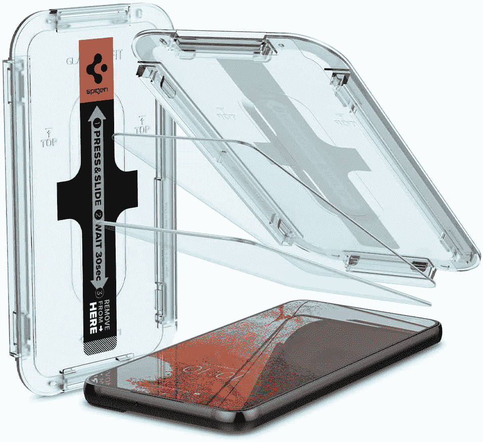
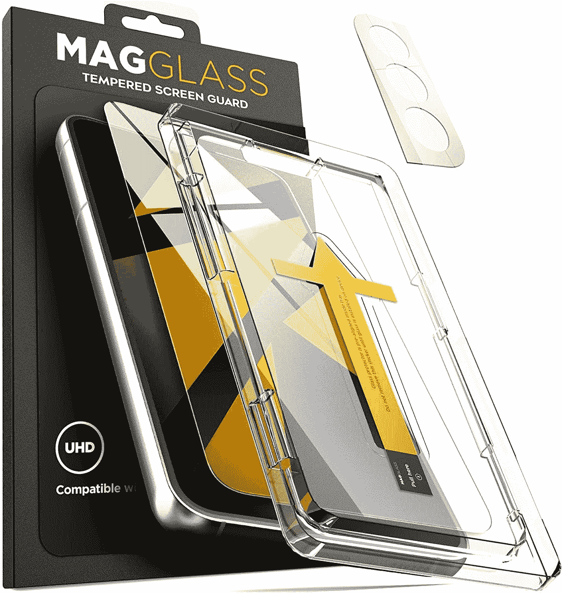
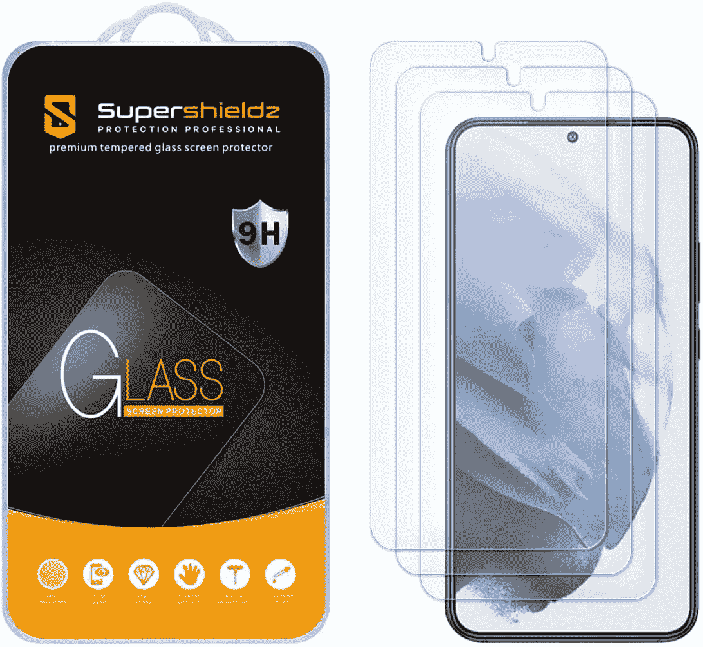
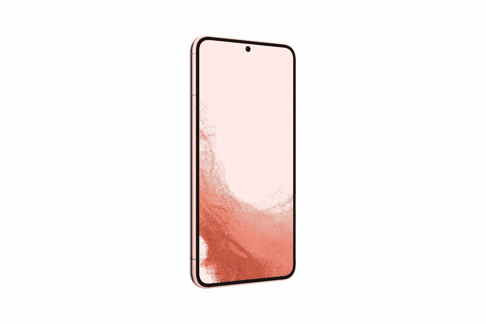

# 2023 年最佳三星 Galaxy S22 屏幕保护器

> 原文：<https://www.xda-developers.com/best-samsung-galaxy-s22-screen-protectors/>

# 2023 年最佳三星 Galaxy S22 屏幕保护器

以下是目前最好的三星 Galaxy S22 屏幕保护器。立即订购一台，保护您新手机的显示屏。

三星最近为其 2022 年的旗舰产品提供了一些惊人的折扣。如果你设法在 Galaxy S22 上获得了一笔好交易，你应该投资一个屏幕保护器来保护它华丽的显示屏免受刮擦。由于市场上充满了各种各样的选择，我们在这篇文章中缩小了最好的 [Galaxy S22](https://www.xda-developers.com/samsung-galaxy-s22-review/) 屏幕保护器，让事情对你来说更容易一些。

根据您的喜好，您可以从下面的链接中为您的 Galaxy S22 选择钢化玻璃、光泽、哑光或 TPU 屏幕保护器。无论你选择哪一个，我们保证你不会后悔购买。

## 最佳 Galaxy S22 屏幕保护器

*   <picture></picture>

    Spigen 钢化玻璃

    ##### Spigen 钢化玻璃 Galaxy S22 屏幕保护器

    Spigen 为 Galaxy S22 提供的钢化玻璃屏幕保护器具有光滑的表面和疏油涂层，具有高级感。它配有自动校准套件，便于安装。

*   <picture></picture>

    Magglass 屏幕保护器

    ##### mag Glass 钢化玻璃 Galaxy S22 屏幕保护器

    如果你更喜欢手机显示屏的哑光表面，请为你的 Galaxy S22 购买 mag Glass 钢化玻璃屏幕保护器。它还带有一个对齐工具，使申请更容易。

*   <picture></picture>

    super shieldz 钢化玻璃

    ##### super shieldz 钢化玻璃 Galaxy S22 屏幕保护器

    不想花 10 多美元买一个屏幕保护器？只需 9 美元就能买到三包 SuperShieldz 钢化玻璃屏幕保护套。

*   ##### super shieldz PET Galaxy S22 屏幕保护器(亮面)

    在使用钢化玻璃屏幕保护器时，您是否面临指纹扫描仪的问题？获得 SuperShieldz 宠物屏幕保护器，改善您的体验，同时节省一些钱。

*   ##### super shieldz PET Galaxy S22 屏幕保护器(哑光)

    您是否更喜欢显示器的哑光表面，而不想花 20 多美元购买 Magglass 钢化玻璃屏幕保护器？获得 SuperShieldz PET 屏幕保护罩，并进行哑光处理。六瓶装的售价仅为 7 美元，这对于精打细算的买家来说是个不错的选择。

    T17
*   ##### Anku Privacy Guard Galaxy S22 屏幕保护器

    Anku Privacy Guard 屏幕保护器不仅可以保护 Galaxy S22 的显示屏免受刮擦，还可以保护您免受窥探。它具有独特的涂层，当从某个角度观看时，屏幕会变暗，这使它成为注重隐私的用户的绝佳选择。

三星 Galaxy S22 是 2022 年最好的智能手机之一，确保你得到市场上最好的屏幕保护器之一，以确保显示器的安全至关重要。如果你想要一个可以经常更换的廉价薄膜型保护器，请为 Galaxy S22 购买 Supershieldz PET 屏幕保护器。六个装的 Supershieldz 宠物屏幕保护器只需 7 美元，对于那些经常被显示器划伤的人来说，这是一个很好的选择。由于我不擅长使用屏幕保护器，我个人会选择 Spigen 钢化玻璃屏幕保护器。这是因为它附带了一个方便的工具，使安装过程更加容易。

你会选择哪一个选项，为什么？请务必在下面的评论区让我们知道。此外，如果你想为你的全新设备增加一层保护，请查看我们的[最佳 Galaxy S22 外壳综述](https://www.xda-developers.com/best-samsung-galaxy-s22-cases/)。我们有相当多的选择，从提供最大保护的坚固外壳到突显 Galaxy S22 颜色的透明外壳。

 <picture></picture> 

Samsung Galaxy S22

虽然新的 Galaxy S22 采用了 6.1 英寸的 FHD+ AMOLED 显示屏，配有康宁的大猩猩玻璃 Victus+，但为了省心，你仍然应该投资一个屏幕保护器。