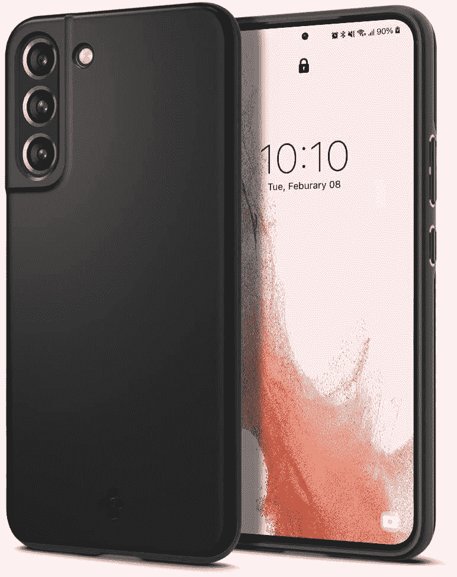
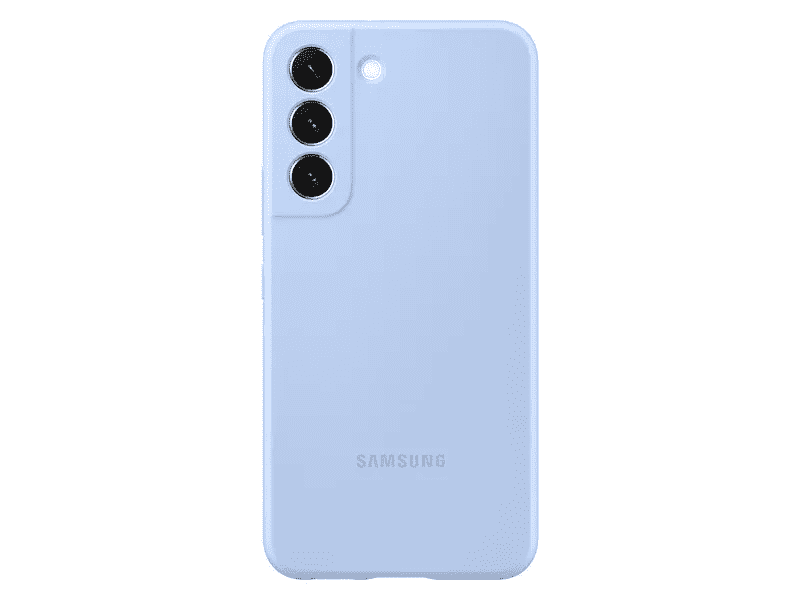
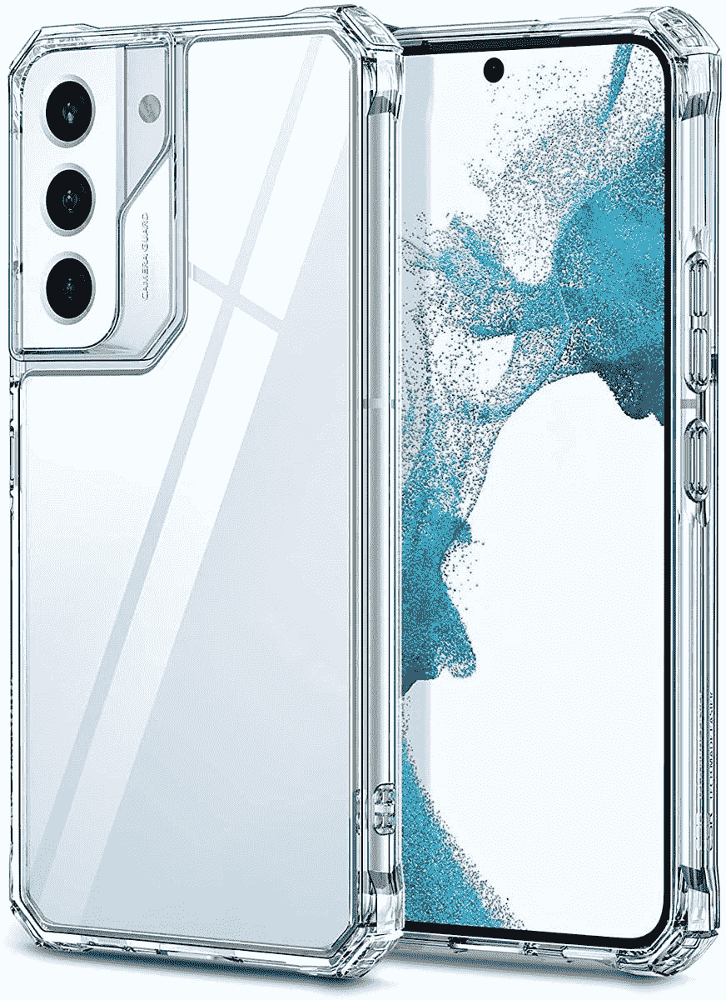
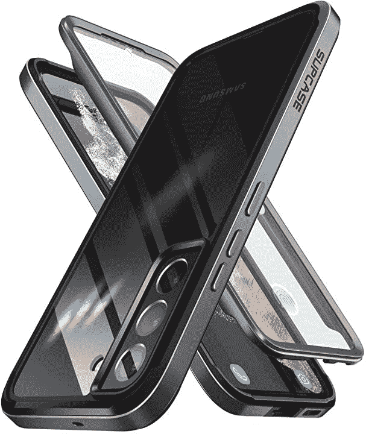
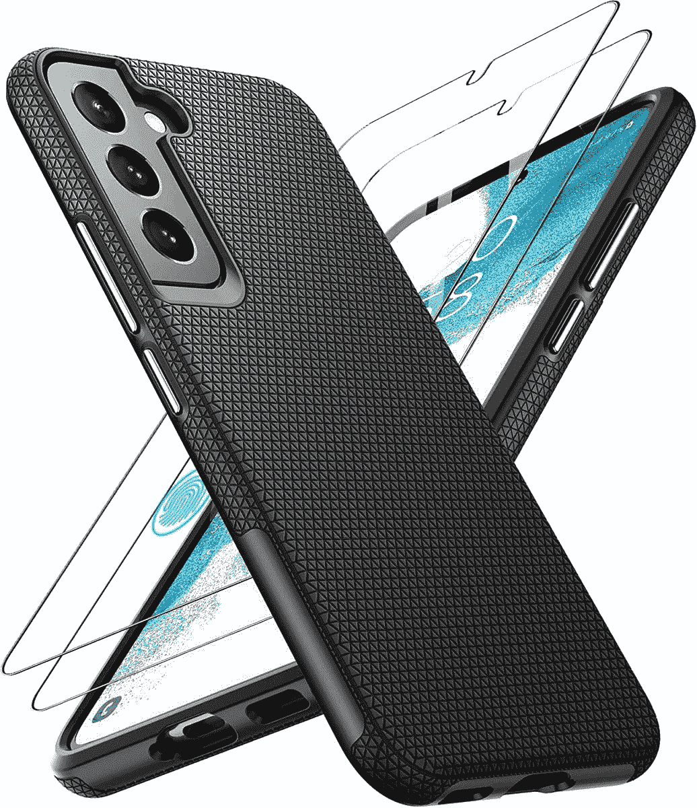

# 2023 年最佳三星 Galaxy S22 超薄保护套

> 原文：<https://www.xda-developers.com/best-samsung-galaxy-s22-thin-cases/>

# 2023 年最佳三星 Galaxy S22 超薄保护套

这些是最适合您的 Galaxy S22 的轻薄外壳。我们已经收集了时尚和丰富多彩的最佳选择！

对于那些喜欢更小、更便于携带的手机的人来说， [Galaxy S22](https://www.xda-developers.com/samsung-galaxy-s22-review/) 是三星 2022 年旗舰产品阵容中的最佳选择。如果你想挑选一个，一定要看看[最好的 Galaxy S22 系列交易](https://www.xda-developers.com/best-samsung-galaxy-s22-deals/)。Galaxy S22 采用 6.1 英寸 AMOLED 显示屏、exy nos 2200/骁龙 8 Gen 1 芯片组和功能强大的相机硬件，在一个小包装中实现了强大的功能。常规型号比去年更时尚，厚度仅为 7.6 毫米，重量为 167 克。你可能不想因为穿上又厚又大的外套而破坏了这种时尚感。幸运的是，有很多轻薄的外壳可以让你的 Galaxy S22 保持苗条和性感，同时也可以保护它免受刮擦和碰撞。

下面我们收集了 Galaxy S22 的最佳轻薄外壳。从简单明了的箱子到色彩鲜艳的箱子，我们的清单为您提供了多种选择。

*   <picture></picture>

    Spigen Thin Fit

    ##### Spigen Thin Fit Galaxy S22 表壳

    Spigen 的 Thin Fit 表壳采用了极简设计，并带有高级哑光表面。它的混合 PC 和 TPU 结构提供了良好的保护，防止刮擦和碰撞。

*   <picture></picture>

    官方硅胶保护套

    ##### 三星 Silcone Galaxy S22 保护套

    三星官方硅胶保护套触感柔软，保护你的手机免受刮擦和碰撞，而不会增加额外的体积。

*   <picture></picture>

    ESR 空中装甲

    ##### ESR 空中装甲银河 s22 案例

    一个基本明确的案例那就是轻薄。具有耐黄变硬背和军用级跌落保护。

*   <picture></picture>

    sup case UB Edge Pro

    ##### sup case UB Edge Pro Galaxy S22 case

    这款透明外壳防变色后盖和内置屏幕保护器可以保持显示屏无划痕。

*   <picture></picture>

    官方透明保护套

    ##### 三星透明 Galaxy S22 保护套

    这种透明保护套在设备背面呈现闪亮的新颜色的同时提供了良好的保护。它还配有一个支架，连接到外壳的背面，用于免提内容消费。

*   ##### Torras Slim Fit Galaxy S22 外壳

    这款来自 Torras 的超薄外壳将像手套一样适合您的 Galaxy S22。外壳由聚碳酸酯材料制成，并有多层涂层，可以防止指纹和划痕。不过它只有一种颜色。

*   <picture></picture>

    坦丹

    ##### 坦丹防震 Galaxy S22 外壳

    坦丹轻薄的保护壳保护你的 Galaxy S22 免受所有关键区域的伤害，又不会增加太多体积。它也有凸起的边缘来保护相机模块和一个灵活的橡胶缓冲器。

    T34

正如你所看到的，Galaxy S22 有很多很棒的薄外壳。所有这些都将保护您的 Galaxy S22 免受划痕、灰尘和污迹的影响。然而，如果你是一个经常摔手机的人，我们建议你选择坚固的外壳。如果你想让事情变得简单，三星官方的硅胶保护套是不会错的。它有多种颜色，提供了大量的保护。TORRAS Slim Fit 和 Spigen Thin Fit 是我们最喜欢的选择。两者都是超薄的，触感柔软，可以保护你闪亮的新 Galaxy S22 免受划痕和指纹的伤害。

 <picture></picture> 

Samsung Galaxy S22

三星 Galaxy S22 是 2022 年的入门级旗舰产品，以适合许多口袋和预算的形式带来了顶级的性能和相机功能。

如果你正在寻找更多的建议，请查看 Galaxy S22 的[最佳案例。我们还评选出了 Galaxy S22](https://www.xda-developers.com/best-samsung-galaxy-s22-cases/) 的[最佳屏幕保护器。](https://www.xda-developers.com/best-samsung-galaxy-s22-screen-protectors/)