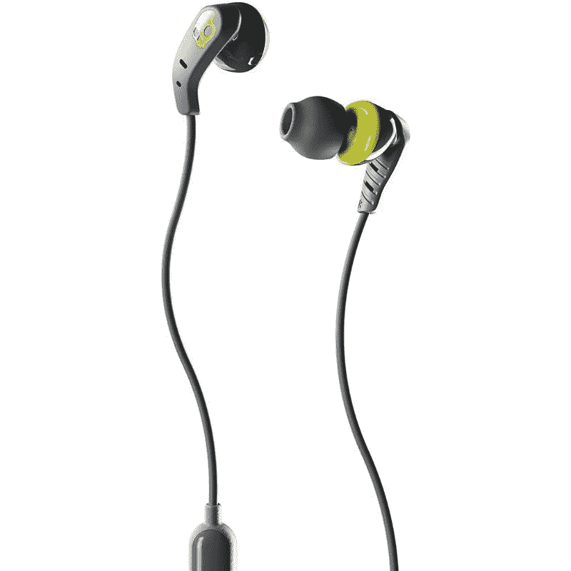
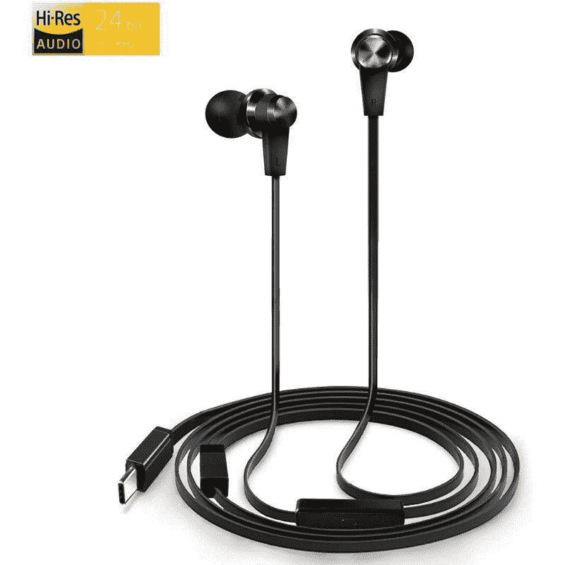
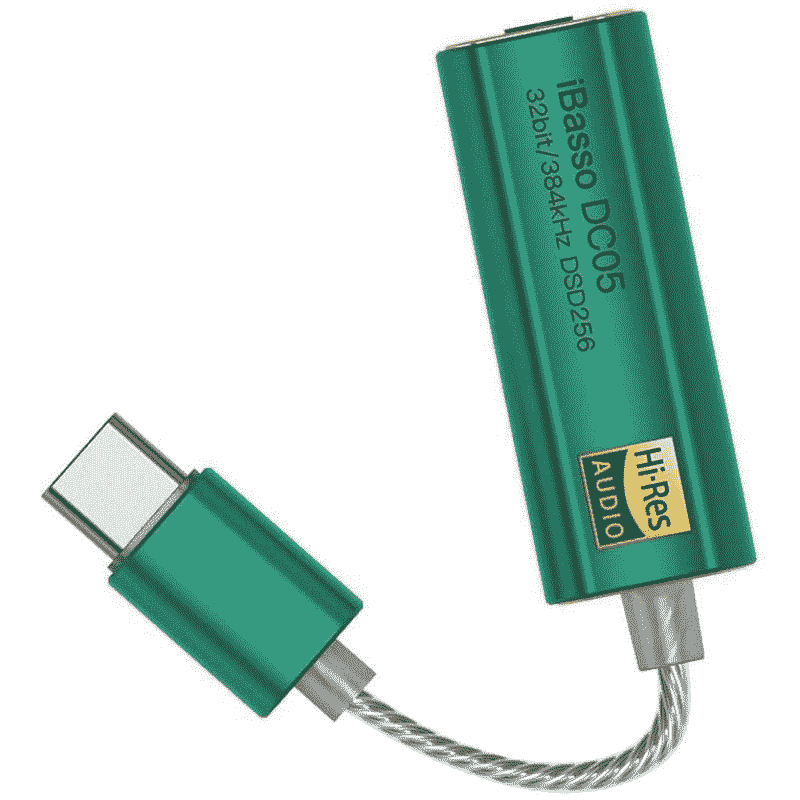
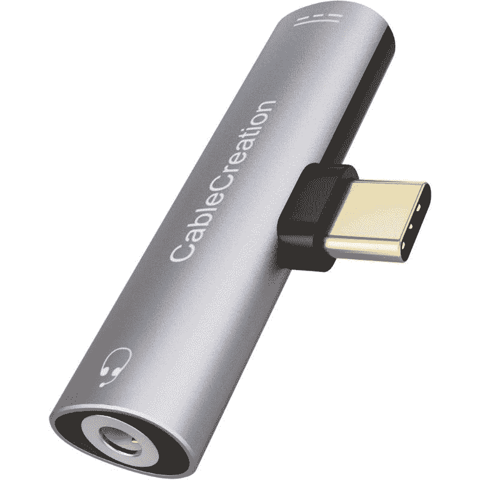
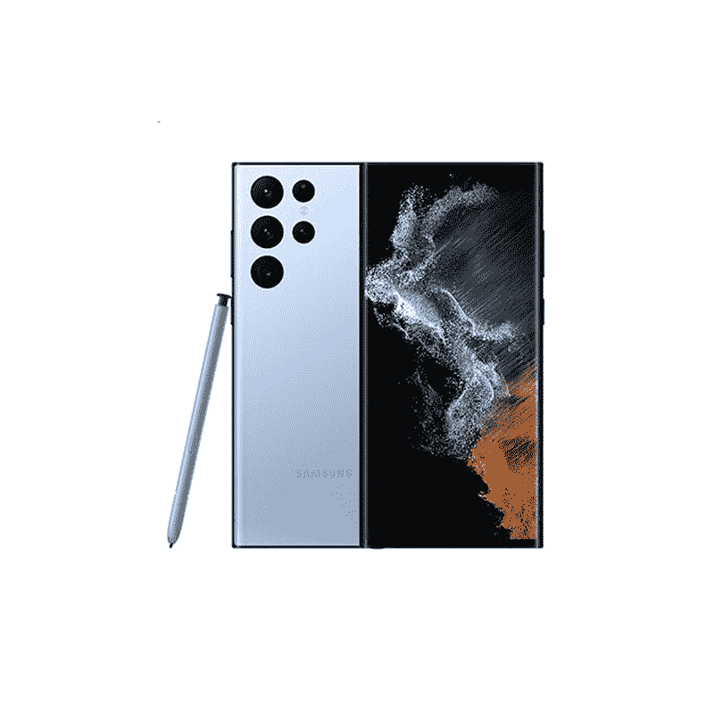

# 三星 Galaxy S22 系列最佳 USB Type-C 耳机

> 原文：<https://www.xda-developers.com/best-samsung-galaxy-s22-type-c-earphones/>

三星 Galaxy S22 家族配备了大量旗舰规格和功能，但遗憾的是，该系列中没有一款手机有耳机插孔。该公司已经将耳机插孔从其高端旗舰手机的规格表中删除，包括 [Galaxy S22](https://www.xda-developers.com/samsung-galaxy-s22-review/) 、 [Galaxy S22 Plus](https://www.xda-developers.com/samsung-galaxy-s22-plus-review/) 和 [Galaxy S22 Ultra](https://www.xda-developers.com/samsung-galaxy-s22-ultra-review/) 。三星和其他厂商一样，都在试图切断所有的软线，让人们转向无线配件。蓝牙耳机很棒，但它们通常更贵，并且会迫使你处理充电、延迟等问题。因此，如果你宁愿不做这些警告，那么你只能用 USB Type-C 耳机。以下是我们为您的 Galaxy S22 系列挑选的最佳有线耳机:

## 最佳 Galaxy S22 有线耳机

*   ##### 三星 Type-C 耳机

    三星曾经将这些 AKG 调谐耳机捆绑到其手机和平板电脑上，我们已经知道这些耳机能够传递良好的音频。你没有任何像 ANC 这样的花哨功能，但它们听起来确实比你在这个价格范围内的市场上找到的大多数选项都要好。

    T13
*   <picture></picture>

    Skullcandy 套装入耳式耳塞

    ##### Skullcandy 套装入耳式耳塞

    Skullcandy 是一个在业内相当流行的名字，拥有一堆并不算昂贵的产品。Skullcandy 套装入耳式耳塞非常适合那些想要一副可靠的 IPX4 防水耳机供日常使用的人。

*   <picture></picture>

    Belkin sound form USB-C 耳机

    ##### Belkin sound form USB-C 耳机

    Belkin sound form USB-C 耳机性能可靠，配有扁平轻便的线缆，不会在您的口袋或包中缠绕。这些耳机还防汗防溅，因此您也可以在锻炼过程中使用它们。

*   <picture></picture>

    TRILINK USB-C 耳机

    ##### TRILINK USB-C 耳机

    TRILINK USB-C 耳机是此列表中带有高分辨率音频认证的耳机。您可以依靠这对扬声器提供出色的音频质量和良好的无源噪声隔离。这也有助于他们使用扁平电缆，以避免缠结。

*   <picture></picture>

    joymosa USB-C 耳机

    ##### joymosa USB-C 耳机

    如果你是一个生活方式积极的人，joymosa USB-C 耳机值得考虑。这些耳塞包裹在你的耳朵周围，舒适贴合，允许你在锻炼时佩戴它们。与市场上的其他运动耳塞相比，它们也相对便宜。

*   <picture></picture>

    Adprotech USB-C 耳塞

    ##### 并非所有耳塞都具有相同的贴合度和光洁度。重要的是找到一个适合你并且穿着舒适的。Adprotech USB-C 耳机配有不同尺寸的耳尖，甚至还有翼尖，以确保它们留在您的耳朵里。据说这些耳机的整体音质也相当不错。

## USB-C 耳机适配器

值得一提的是，USB-C 耳机从未真正取代 3.5 毫米耳机。这一类的选择非常有限，所以你可能很难做出正确的选择。也就是说，如果你想在市场上购买一副 USB-C 有线耳机，上面提到的有线耳机是我们认为值得考虑的。如果你不想花钱买上面提到的任何一款 USB-C 耳机，那么你可以这么做:

正如我们前面提到的，USB-C 耳机很好，但它们无法与 Galaxy S22 系列的一些高质量 3.5 毫米耳机相媲美。如果你想买一副 3.5 毫米的耳机，或者只是想继续使用现有的耳机，我们建议你选择 USB-C 转 3.5 毫米的适配器。这些在市场上很容易买到，而且它们的价格还不到一副新耳机的价格。我们在下面留下了购买三星适配器的链接，一定要看看。如果您碰巧有高保真级耳机或带有 3.5 毫米引脚的耳机，那么您可以使用下面的链接获得 iBasso DC05 便携式 USB 加密狗 DAC。

*   <picture></picture>

    三星 USB-C 耳机插孔适配器

    ##### 三星 USB-C 耳机适配器

    三星的 USB-C 转 3.5 毫米适配器可用于连接您现有的一对耳机和使用 3.5 毫米插头的耳机。

*   <picture></picture>

    IBasso DC03 USB-C DAC

    ##### IBasso DC03 USB-C DAC

    IBasso DC03 是音频发烧友推荐的热门 DAC，是您设备上无损音频的完美网关。

*   <picture></picture>

    cable creation USB-C-3.5 毫米分线器

    ##### cable creation USB-C-3.5 毫米分线器

    这款简单的配件可用于将您的 3.5 毫米耳机和 USB-C 充电线同时连接到您的 Galaxy S22。

好了，这就给我们带来了 Galaxy S22 系列的最佳 USB Type-C 有线耳机系列的结束。如果我们要挑选一个，那么我们会选择由 AKG 调谐的高度可靠的三星 USB-C 耳机。Skullcandy 的入耳式耳塞也非常适合那些想要 IPX4 等级的人。或者，你也可以考虑查看我们为三星 Galaxy S22 系列收集的[最佳无线耳塞，以避免处理电线的麻烦。](https://www.xda-developers.com/best-samsung-galaxy-s22-tws-earphones/)

*   三星 Galaxy S22 是 2022 年的入门级旗舰产品，以适合许多口袋和预算的形式带来了顶级的性能和相机功能。

*   ##### 三星 Galaxy S22 Plus

    三星 Galaxy S22 Plus 可能不具备 Ultra 机型的所有功能，但它仍然是一款非常强大的旗舰产品，拥有出色的摄像头、屏幕和性能。

    T17
*   <picture></picture>

    三星 Galaxy S22 Ultra

    三星 Galaxy S22 Ultra 是 2022 年市场上最完整的 Android 智能手机之一，提供了最好的屏幕、最通用的相机系统、Android 中最好的 SoC 以及一支触控笔。