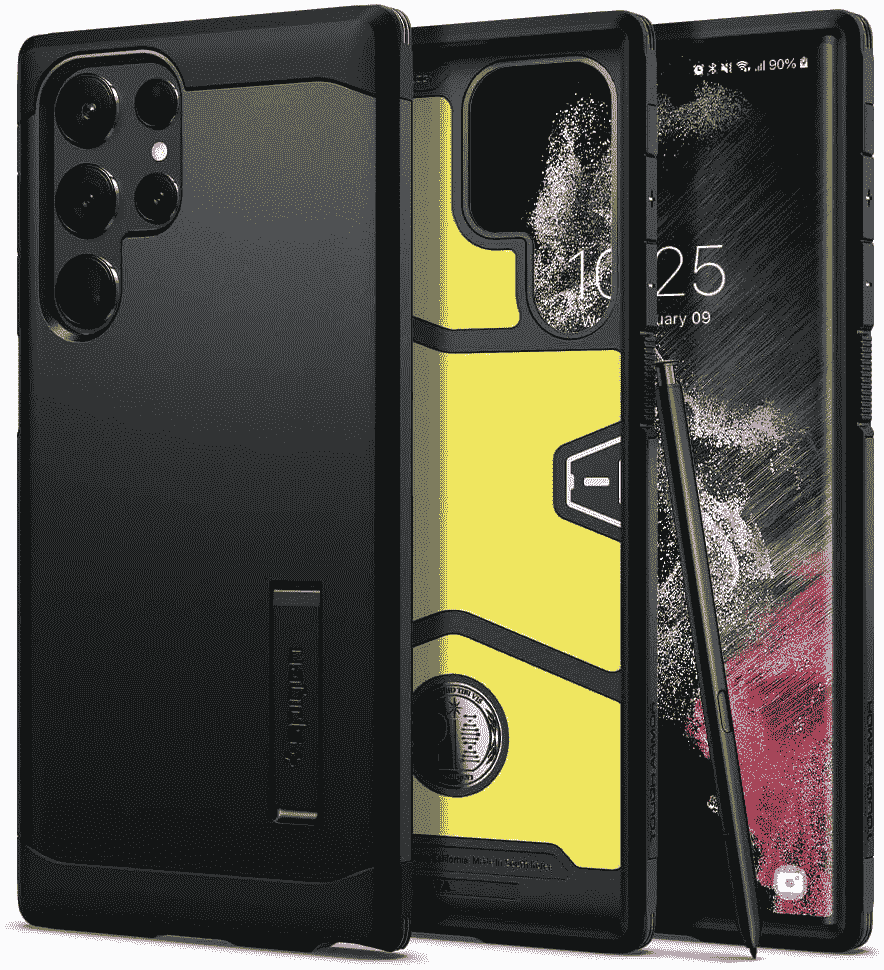
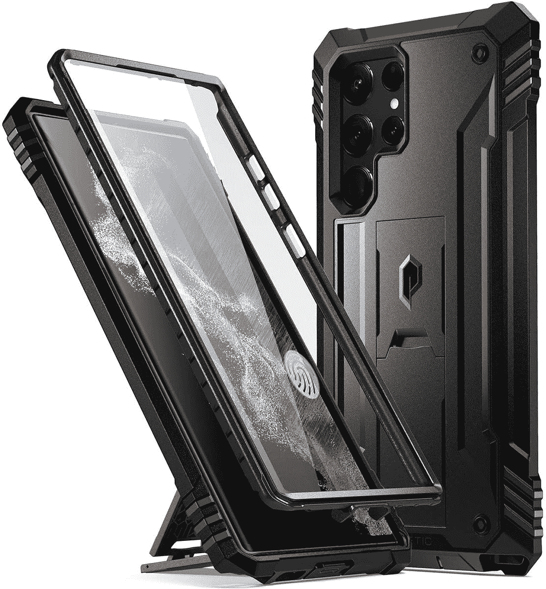
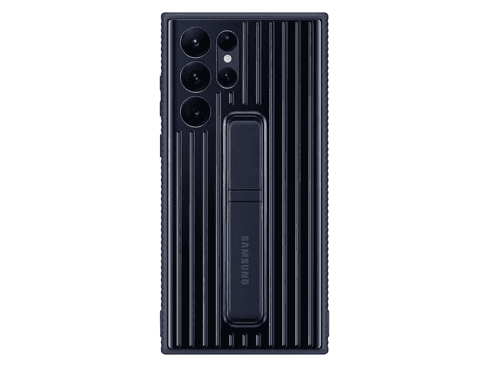

# 2023 年最佳三星 Galaxy S22 超支架保护套

> 原文：<https://www.xda-developers.com/best-samsung-galaxy-s22-ultra-kickstand-cases/>

# 2023 年最佳三星 Galaxy S22 超支架保护套

想为您的三星 Galaxy S22 Ultra 购买支架保护套吗？我们已经收集了可供你选择的最佳方案。

Galaxy S22 Ultra 是三星 2022 年旗舰产品阵容中最强大的设备。Galaxy S22 Ultra 结合了 Galaxy Note DNA、强大的相机硬件和 S-Pen，是超级用户的终极 Android 旗舰产品。它提供了令人难以置信的显示屏，旗舰 exy nos 2200/骁龙 8 Gen 1 芯片组，高达 12GB 的 RAM，108MP 主摄像头，以及支持 45W 快速充电的 5,000mAh 大电池。但是这个惊人的硬件也有代价:增加了重量。Galaxy S22 Ultra 是其中最重的，重 227 克，厚 8.9 毫米。这不是一部你想长时间拿着的手机。但这可以很容易地用支架案例来解决。使用支架保护套，您可以在不同方向支撑设备，这样您就可以在保持双手空闲的同时观看视频或拨打变焦电话。但是你应该选择哪一个呢？为了节省您的时间和精力，我们收集了 Galaxy S22 Ultra 的最佳支架案例。

*   <picture></picture>

    三星官方支架保护套

    ##### 三星支架保护套 Galaxy S22 Ultra 保护套

    三星官方支架保护套让你轻松将 Galaxy S22 Ultra 支撑在横向位置。外壳经过跌落测试，符合军用标准，背面有两个可拆卸的支架。

*   <picture></picture>

    Spigen Tough Armor

    ##### Spigen Tough Armor Galaxy S22 Ultra case

    外观简洁却不失坚固，这款 Spigen Tough Armor case 提供了两全其美:便利和保护。它拥有减震气垫设计和内置支架。有黑色和青铜色可选。

*   <picture></picture>

    诗意的革命

    ##### 诗意的革命 Galaxy S22 Ultra Case

    一款坚固耐用的保护你的 Galaxy S22 Ultra 从各个角度它在摄像头和显示屏周围有凸起的嘴唇以增加保护，并有内置的支架以横向或横向支撑手机。

*   <picture></picture>

    三星保护型立式保护套

    ##### 三星保护型 Galaxy S22 Ultra 保护套

    这是一款坚固耐用的保护套，提供了一种质感硬皮。如果你经常摔手机，可以考虑买这个。它还有一个附加在表壳背面的支架，这是一个额外的好处。

*   ##### sup Case UB Pro Galaxy S22 Ultra Case

    sup Case 的这款坚固耐用的外壳提供了一流的防摔和防刮擦保护。它还有一个支架和一个可拆卸的旋转皮带夹。

*   ##### ESR Clear Galaxy S22 Ultra case

    寻找带支架的 clear case？ESR 的这个案例可能正是你所需要的。它配有坚硬的聚碳酸酯背面，可防止发黄和刮擦，让您可以尽情展示您的 Galaxy S22 Ultra。同时，内置的金属支架可以让您在进行视频通话时腾出双手。

    T17

你有它；Galaxy S22 Ultra 的最佳支架案例。支架保护套能让你两全其美:保护和多功能。如果预算不是问题，三星的官方支架外壳是很好的选择，并提供最佳的兼容性。为了最好的保护，我们推荐 SUPCASE 和诗意革命。我们也有一些坚实的竞争者在斯皮根坚韧装甲和血沉。

随着新案例的出现，我们将不断更新此列表，请务必回来查看。如果你正在寻找更多的建议，我们的[最佳 Galaxy S22 Ultra 外壳](https://www.xda-developers.com/best-samsung-galaxy-s22-ultra-cases/)综述有更多的选择，包括坚固外壳、透明外壳、轻薄外壳等等。我们还收集了 Galaxy S22 Ultra 的最佳屏幕保护器。