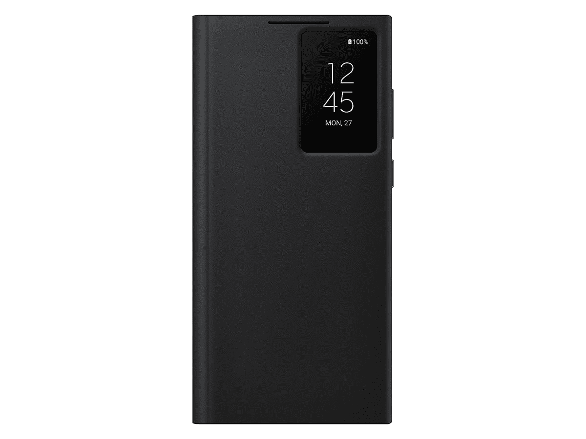
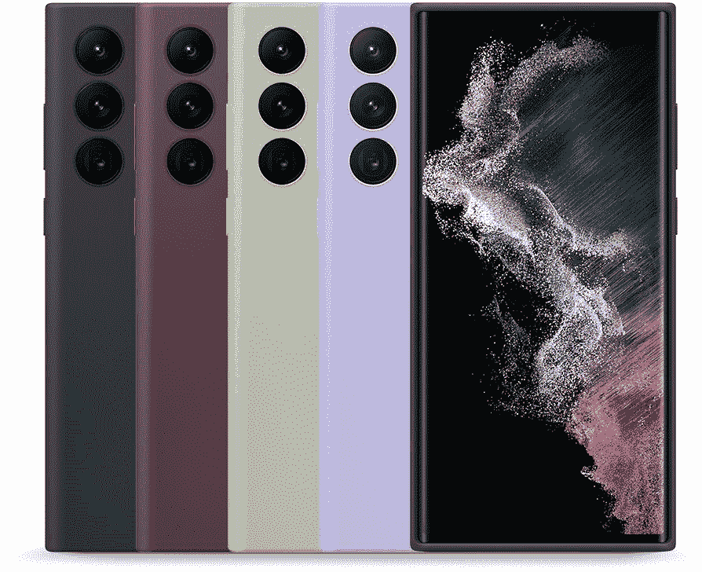
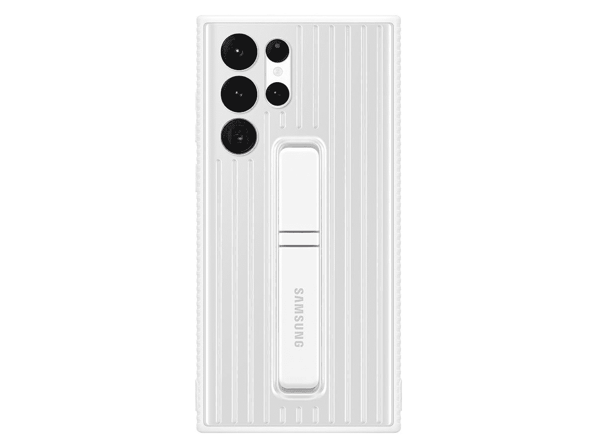
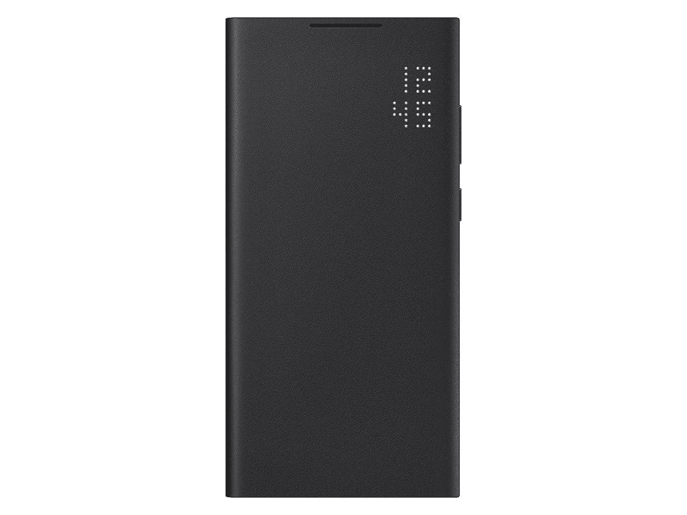
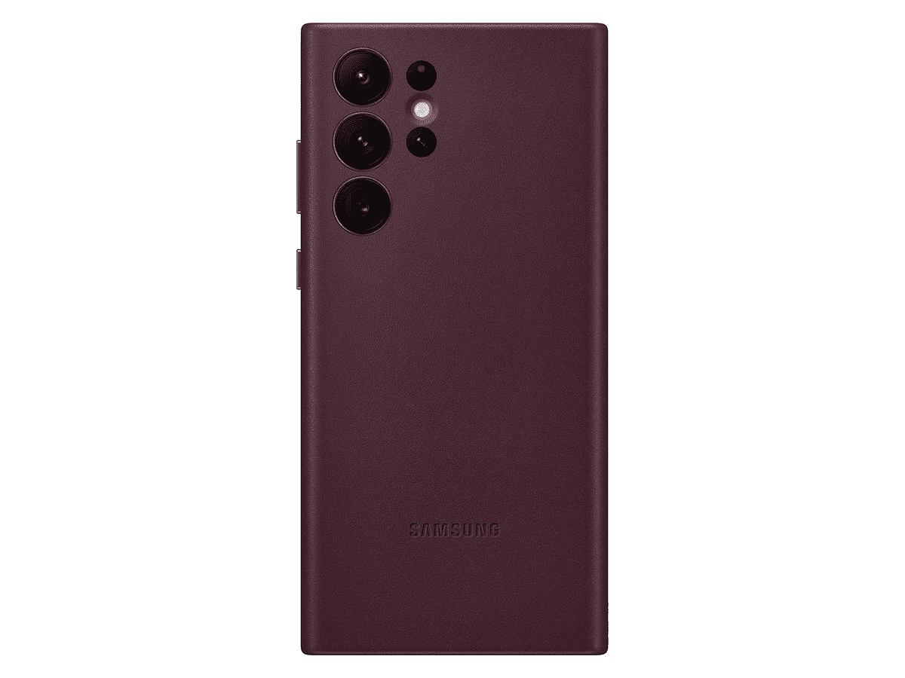
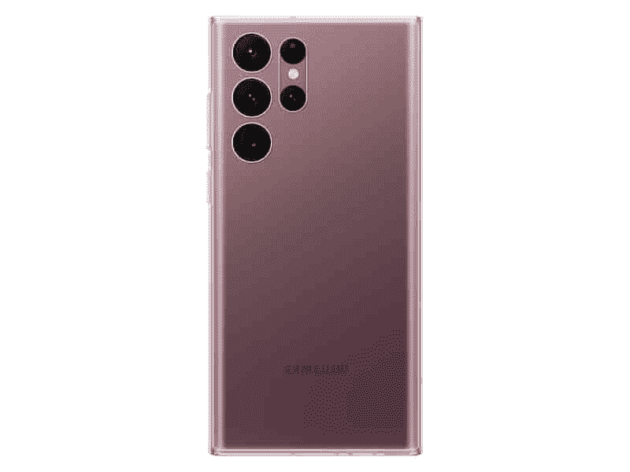

# 所有三星 Galaxy S22 Ultra 官方保护套

> 原文：<https://www.xda-developers.com/best-samsung-galaxy-s22-ultra-official-cases/>

经过几个月的泄露和传言，Galaxy S22 系列终于上市了。就像去年一样，有三款机型可供选择——最小的 Galaxy S22、较大的 Galaxy S22 Plus 和配备触控笔的大 Galaxy S22 Ultra。Ultra 可能是其中最有趣的一款，因为它将取代运行已久的 Galaxy Note 系列。我们对 Galaxy S22 Ultra 进行了[实践，因此您可以查看它，了解我们对该设备的想法以及它如何将 Note 传统发扬光大。](https://www.xda-developers.com/samsung-galaxy-s22-ultra-hands-on/)

如果你已经买到了 Ultra，也许是从我们对[最佳 Galaxy S22 交易](https://www.xda-developers.com/best-samsung-galaxy-s22-deals/)的综述中，你可能也会对防止你新买的昂贵手机在简单跌落后破裂感兴趣。挑选一个[最好的 Galaxy S22 Ultra 屏幕保护器](https://www.xda-developers.com/best-samsung-galaxy-s22-ultra-screen-protectors/)可能是一个好主意，在本期综述中，我们将看看三星自己生产的手机的所有外壳。

三星总是为其所有旗舰手机发布少量外壳和盖子，Galaxy S22 Ultra 在这方面也不例外。尽管可能会有来自其他公司的数百种(如果不是数千种)替代方案，但检查一下三星自己提供了什么是个好主意。您可以在下面找到所有可用的选项。

 <picture></picture> 

S-View Flip Cover (Three Colors)

##### 三星 S View 翻盖 Galaxy S22 Ultra 外壳

这款保护套的前部有一个窗口，可用于永不停机的时钟或其他功能。它有黑色、白色和酒红色出售。

 <picture></picture> 

Silicone Cover with Strap (Two Colors)

##### 三星硅胶表带 Galaxy S22 Ultra 表壳

这款触感柔软的硅胶保护套背面有一条带子，你可以将手滑入其中，以便更好地抓握(有点像插座)。

 <picture></picture> 

Silicone Cover (Four Colors)

##### 三星硅胶 Galaxy S22 Ultra 外壳

这款简单柔软的硅胶保护套有四种颜色可供选择:清新的淡紫色、黑色、酒红色和橄榄绿。如果你想改变颜色，同时让手机不那么滑，硅胶外壳是一个很好的选择。

 <picture></picture> 

Protective Standing Cover (Two Colors)

##### 三星立式 Galaxy S22 Ultra Cover

这可能是这个列表中最耐用的外壳，坚固的设计和可调节的支架。有白色和藏青色可选。

 <picture></picture> 

LED View Cover (Two Colors)

##### 三星 LED View Galaxy S22 Ultra 外壳

这有点像 S-View 的情况，但只有一个 LED 时钟(没有明显的切口)在前面，而不是一个交互式显示器。封面有黑色和浅灰色可选。

 <picture></picture> 

Leather Cover (Three Colors)

##### 三星皮革 Galaxy S22 Ultra 外壳

这是你典型的真皮包，如果你想要一个不太抢手的质地，这可能是硅胶包的一个很好的替代品。它有三种颜色出售:酒红色、黑色和浅灰色。

 <picture></picture> 

Clear Cover

##### 三星清晰 Galaxy S22 Ultra 外壳

如果你只是想为你的 Galaxy S22 Ultra 设计一个清晰的外壳，展示手机本身的颜色，这就是你要找的。

 <picture></picture> 

Clear Standing Cover

##### 三星清晰站立式 Galaxy S22 Ultra 外壳

这就像 S22 Ultra 的另一个透明外壳一样，但这个外壳有一个可调节的支架。方便。

如果你最近几年购买了三星的保护套，这里可能没有什么会令人惊讶——大多数保护套都是三星去年为 Galaxy S21 系列提供的保护套的小修改。S-View 翻盖现在在前显示屏的右上角有一个小的方形切口，而去年的 Galaxy S21 S-View Ultra 翻盖有一个长得多的切口，可以延伸到显示屏的底部。与 Galaxy S21 的相同外壳相比，硅胶外壳也有不同的颜色。

唯一全新的是硅胶表带，有藏青色(橙色表带)和白色(绿色表带)可选。这种设计以前只在 Galaxy Z Flip 3 的[外壳中可用，这有助于抓住较小的手机，但现在它也可用于 Galaxy S22 系列。](https://shop-links.co/1765689847407532713?u1=d28da00c-33ff-4708-b037-326281da82b6)

 <picture></picture> 

Samsung Galaxy S22 Ultra

三星 Galaxy S22 Ultra 是 2022 年的顶级旗舰产品，带来了顶级的性能、显示和相机功能以及 S Pen 功能，为高级用户提供了超级体验。

三星确实取消了去年用于 Galaxy S21 Ultra 的 S Pen 硅胶外壳，但现在 Ultra 已经有了 S Pen 的内置插槽，不再需要那个外壳了。那个箱子也相当大，所以我不认为有太多人会错过它。