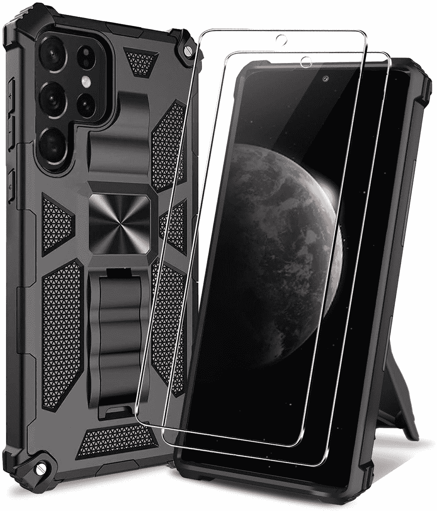
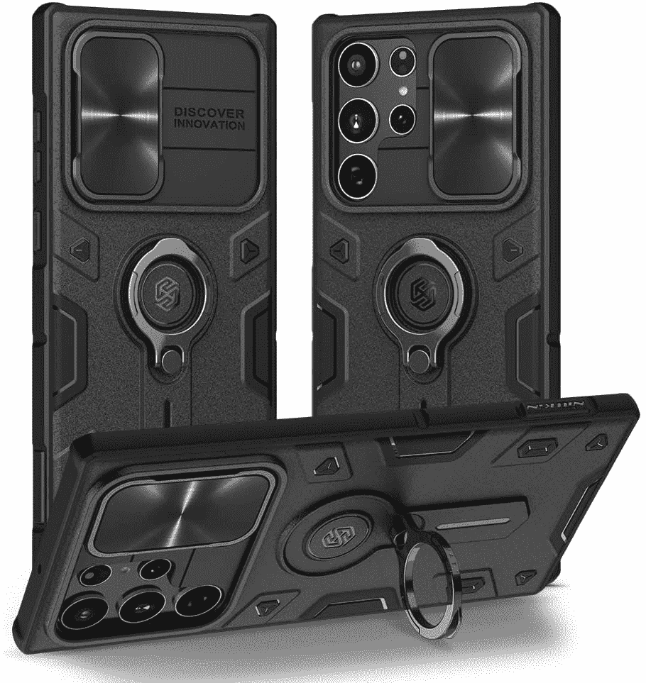
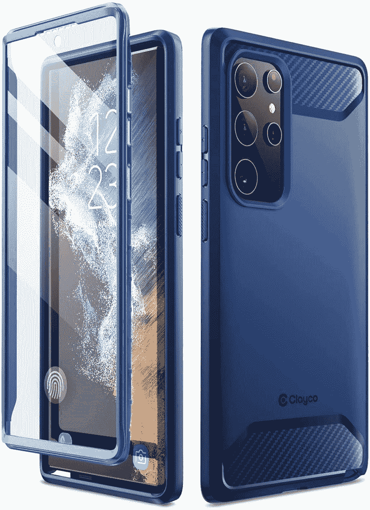
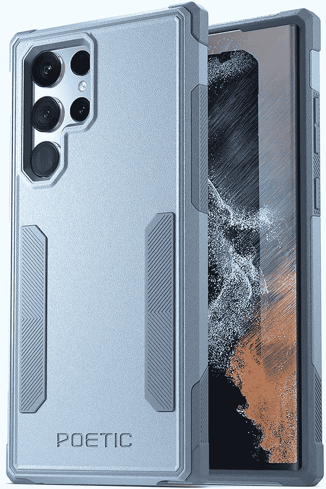
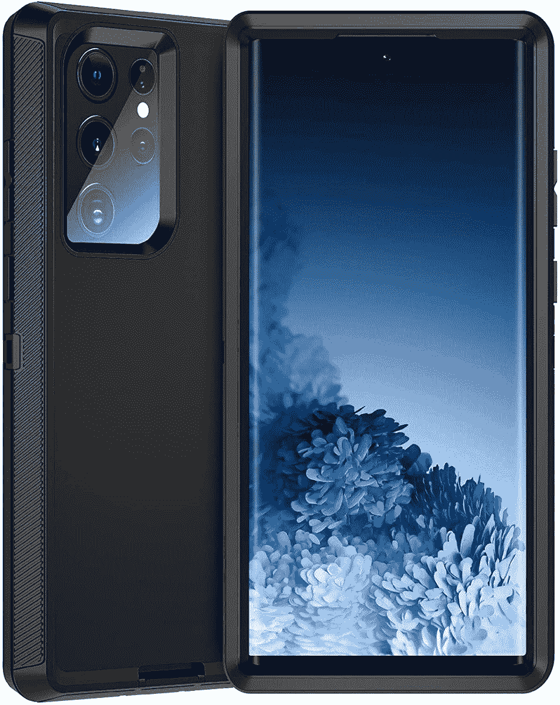
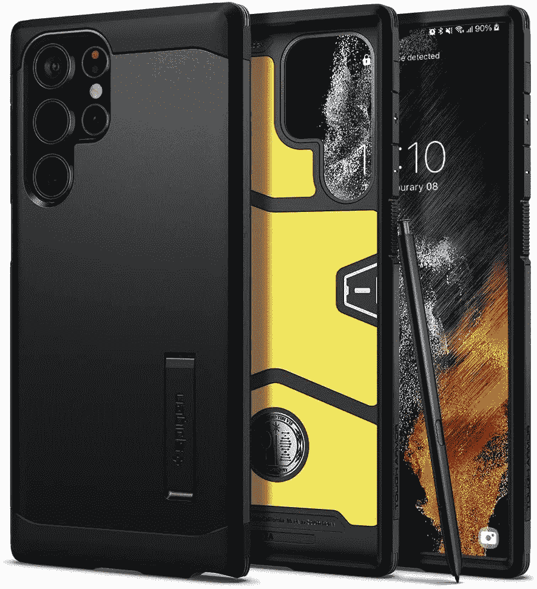
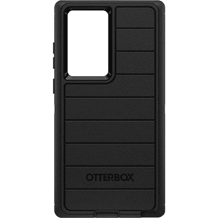

# 2023 年最佳三星 Galaxy S22 超坚固外壳

> 原文：<https://www.xda-developers.com/best-samsung-galaxy-s22-ultra-rugged-cases/>

# 2023 年最佳三星 Galaxy S22 超坚固外壳

三星 Galaxy S22 Ultra 是一款昂贵的手机，但您可以使用这些用于三星顶级手机的坚固外壳来保护您的投资。

2022 年，三星带回了 Galaxy Note 设计，现在在 [Galaxy S22 Ultra](https://www.xda-developers.com/samsung-galaxy-s22-ultra-review/) 中。今年的顶级 Galaxy S 智能手机拥有顶级的规格，并配有内置的 S Pen。不过，所有这些都是有成本的，起价为 1199.99 美元，所以这是相当大的投资。你会想要保护这么贵的东西，为了给你最大可能的保护，我们为 Galaxy S22 Ultra 收集了最好的坚固外壳。

坚固的外壳又厚又大，但它们是确保您的手机经受住各种跌落和碰撞的最佳方式之一。其中一些甚至可能包括额外的功能，如支架。他们并不总是看起来很好，所以如果你不认为你需要这样的核心保护，你可能想看看 Galaxy S22 Ultra 的[最佳案例。不过，对于那些确实需要额外防护的人来说，这是给你的清单。](https://www.xda-developers.com/best-samsung-galaxy-s22-ultra-cases/)

 <picture></picture> 

Qissy Case for Galaxy S22 Ultra

##### Galaxy S22 Ultra 的 Qissy 外壳

这个坚固的外壳可以防止您的 Galaxy S22 Ultra 外壳发生任何跌落或碰撞，此外它还包括一个内置支架。它甚至有四种颜色，包装中还包括一个屏幕保护器。

 <picture></picture> 

Supcase UB Pro Case

##### SUPCASE UB Pro Galaxy S22 Ultra Case

Supcase UB Pro 外壳在正面和背面为您提供坚固的保护，确保您的手机可以经受任何考验。它还有一个支架，可以在纵向和横向模式下使用。

 <picture></picture> 

Nillkin CamShield Armor Case

##### Nillkin CamShield Galaxy S22 Ultra 表壳

如果你想要更多的保护，这个 Killkin 包包括一个滑盖，用于你的相机设置，所以你不必担心划伤镜头。还有一个内置支架，它有黑色和蓝色两种颜色供您选择。

 <picture></picture> 

Clayco Xenon Case

##### Clayco 氙气 Galaxy S22 Ultra 表壳

这种坚固的外壳保护您的手机，正面和背面，不会太厚，而且它有两种颜色。

 <picture></picture> 

Poetic Neon Series

##### 诗意霓虹银河 S22 超霓虹

许多坚固的外壳都是黑色的，但这款外壳提供了您想要的所有保护，并且有五种颜色可供选择。它还能保护屏幕。

 <picture></picture> 

Hensinple Heavy Duty Case

##### Hensiple Defender Galaxy S22 Ultra 表壳

严格的保护不一定要有过度设计的外壳。这种外壳看起来干净时尚，但为 Galaxy S22 Ultra 提供了核心保护。还有紫色版本。

 <picture></picture> 

Spigen Tough Armor

##### Spigen 坚韧装甲银河 S22 超盒

这款保护套为您的 Galaxy S22 Ultra 提供了坚固的保护，但它还包括一个支架，可以更容易地支撑您的手机轻松观看视频。

 <picture></picture> 

Otterbox Defender Series

##### OtterBox Defender Galaxy S22 Ultra 表壳

除了是保护您的 Galaxy S22 Ultra 的坚固外壳之外，这款外壳还具有抗菌涂层，可以防止细菌在外壳上生长，因此您也可以保持安全。

 <picture></picture> 

iBlason Ares Series

##### i-Blason 战神银河 S22 超盒

这种情况下提供了坚固的保护，但它让你的手机设计闪耀。它也有三种颜色可供选择。

这些都是你可以为三星 Galaxy S22 Ultra 购买的最好的坚固外壳。如果我为自己选择其中一个，我可能会选择 Spigen Tough Armor，因为它有内置支架和相对干净的设计。不过，我也喜欢不同颜色选项的诗意霓虹系列。虽然这些给了你最大的保护，但你可能仍然需要更多的保护。如果你的屏幕经常暴露在更多的危险中，你可能想要检查一下 Galaxy S22 Ultra 的[最佳屏幕保护器，以确保它保持完好。](https://www.xda-developers.com/best-samsung-galaxy-s22-ultra-screen-protectors/)

S22 Ultra 可能是三星在过去几年中制造的最好的 Ultra 智能手机，注入 Note 设计使其比以前的产品更加独特。如果你下定决心要买一台，你可以使用下面的链接或尝试在 Galaxy S22 Ultra 上找到[最好的交易。](https://www.xda-developers.com/best-samsung-galaxy-s22-deals/)

 <picture></picture> 

Samsung Galaxy S22  Ultra

三星 Galaxy S22 Ultra 是 Galaxy Note 系列的转世，采用相同的设计语言，内置 S Pen。它还拥有高端规格、出色的显示屏和出色的相机。