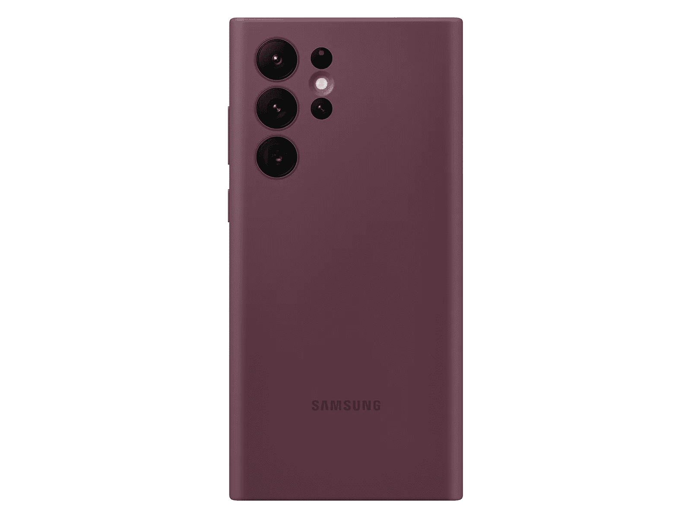
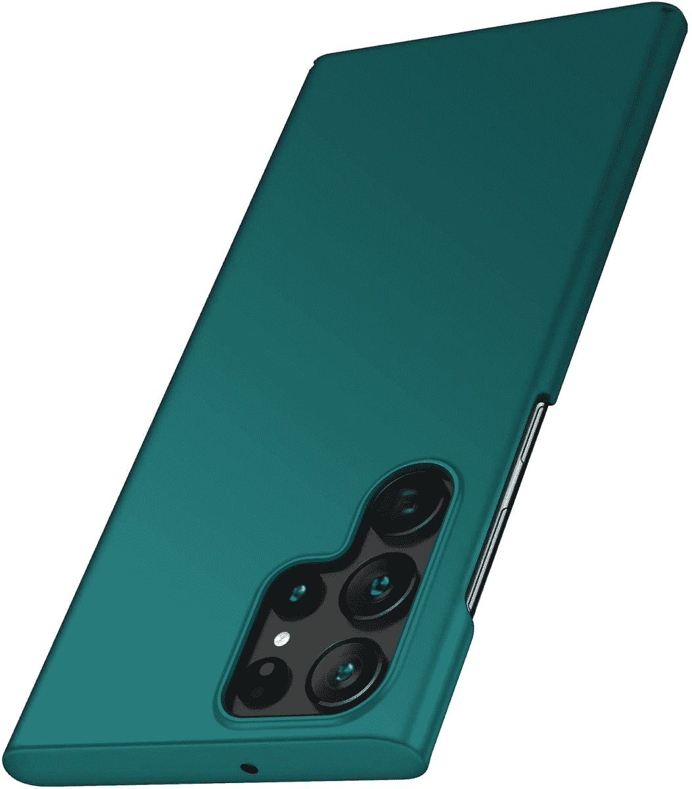
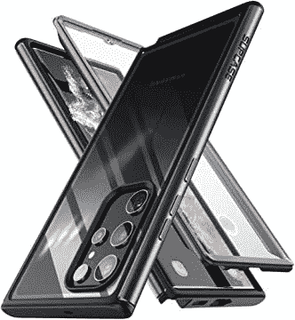
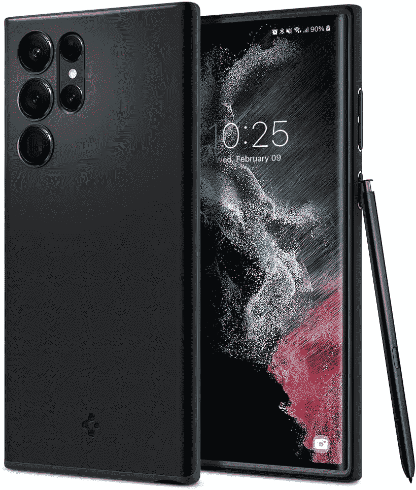
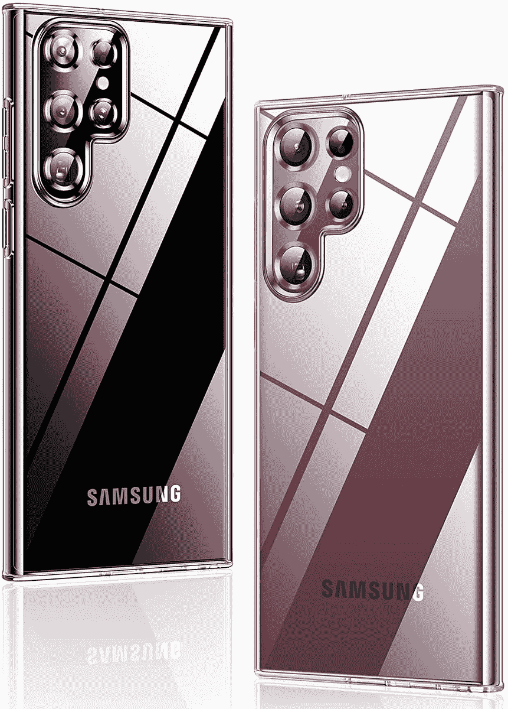
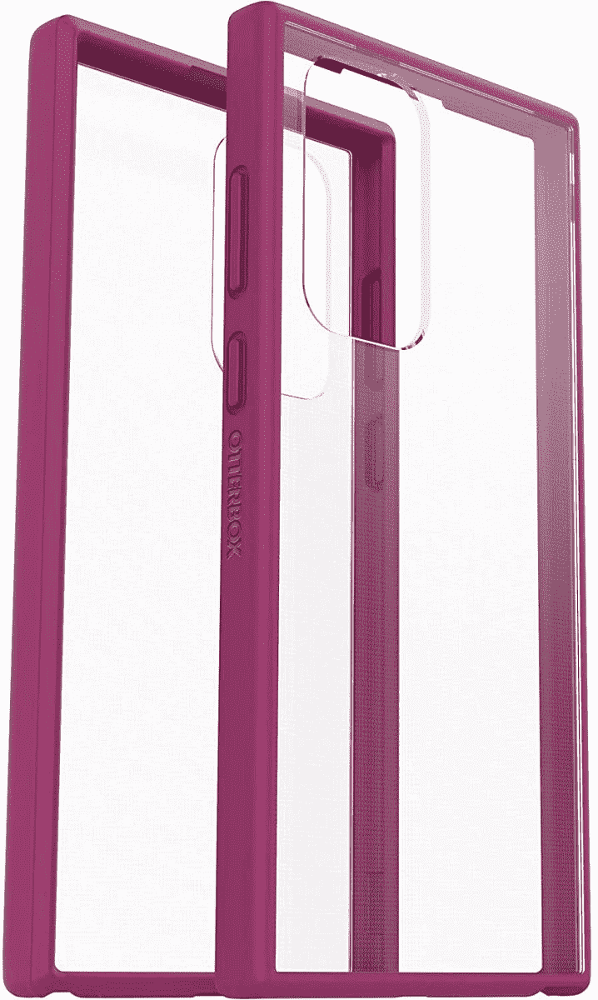
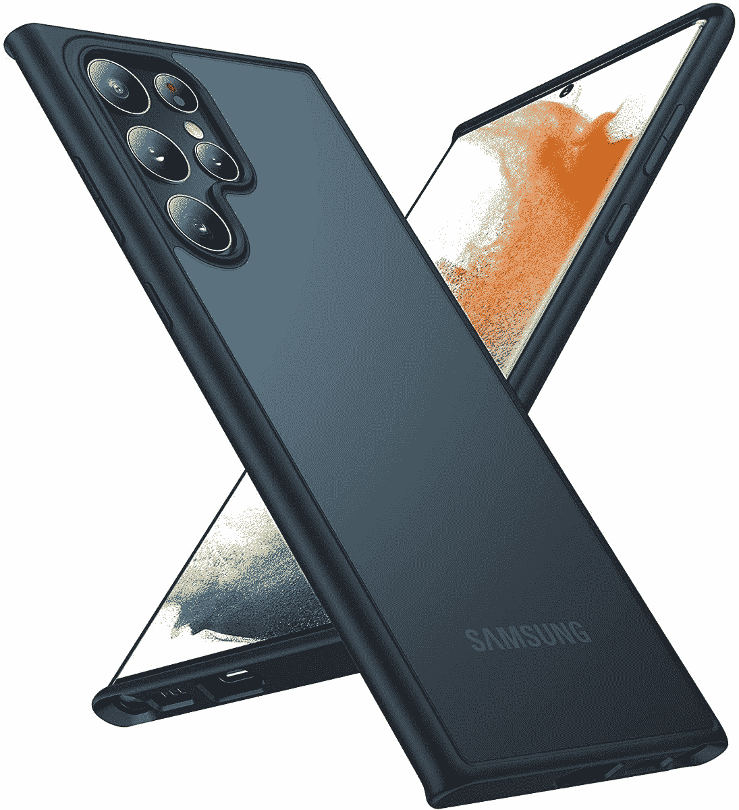
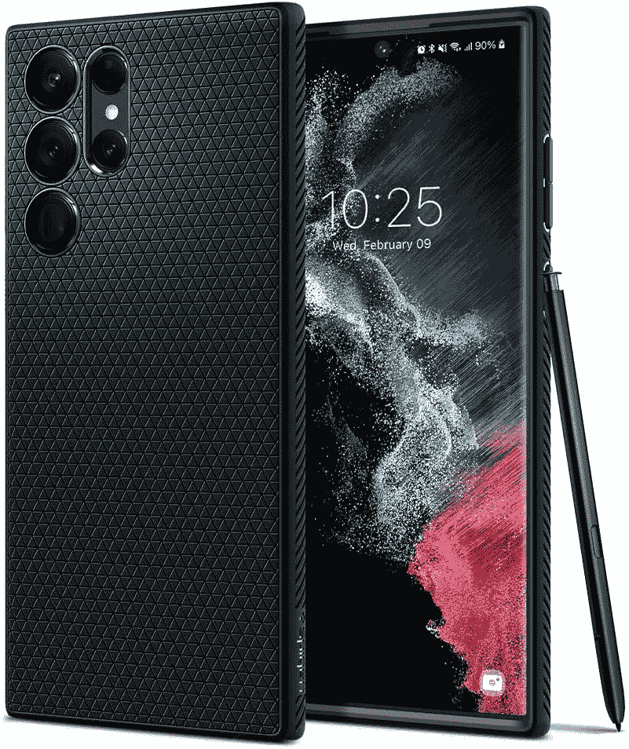
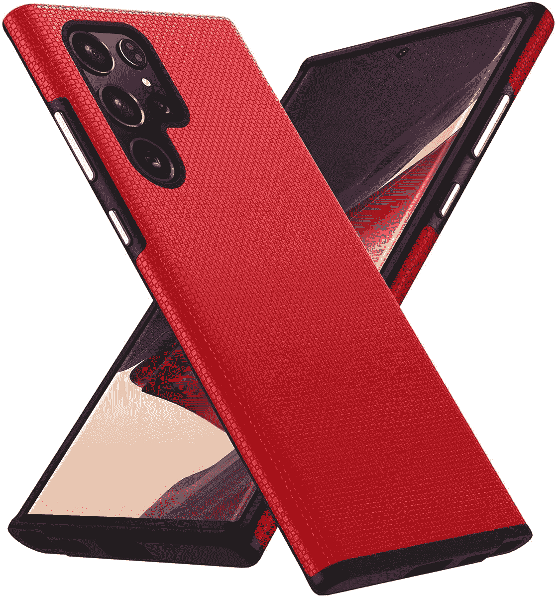

# 2023 年最佳三星 Galaxy S22 超薄保护套

> 原文：<https://www.xda-developers.com/best-samsung-galaxy-s22-ultra-thin-cases/>

# 2023 年最佳三星 Galaxy S22 超薄保护套

想保护你的手机，而不使它的大小增加一倍？以下是三星 Galaxy S22 Ultra 的一些最佳轻薄外壳。

三星最近推出了 Galaxy S22 系列，包括 Galaxy S22 Ultra，它现在类似于人们喜爱的 Galaxy Note 系列。如果你看过我们对三星 Galaxy S22 Ultra 的评论，你会知道这是一款非常受欢迎的手机，这款手机应该得到尽可能长时间的保护。但保护增加了一些体积，这已经是一个大手机了。如果你想让你的手机既安全又便于携带，我们为三星 Galaxy S22 Ultra 收集了一些最好的薄保护套。

这些外壳应该都可以很好地保护你的手机免受日常生活中的碰撞和磨损，但它们不会使手机难以使用。有些颜色更鲜艳，有些是透明的，有些甚至在不太笨重的情况下提供了一点耐用性。这是我们的发现。

 <picture></picture> 

Samsung Silicone Case

##### 三星硅胶 Galaxy S22 Ultra 外壳

三星为 Galaxy S22 Ultra 制作自己的外壳，如果你想要超薄保护，这是一个很好的选择。它有几种颜色，设计包裹着每个相机模块，因此您可以获得更独特的外观。

 <picture></picture> 

Anccer Ultra-Thin Case

##### Anccer 超薄超薄 Galaxy S22 超便携外壳

这款轻薄的 Anccer 保护套为 Galaxy S22 Ultra 提供了基本保护，并且有三种颜色可供选择。音量摇杆和电源按钮周围有一个切口，所以它们仍然感觉像它们应该的那样。

 <picture></picture> 

SUPCASE UB Edge Pro

##### sup case UB Edge Pro Galaxy S22 Ultra case

坚固的保护和轻薄通常不会齐头并进，但 SUPCASE UB Edge Pro 可以做到这一点。它有很大的保险杠，但是它仍然是一个薄的箱子。

 <picture></picture> 

Spigen Thin Fit Case

##### Spigen 超薄型 Galaxy S22 Ultra 外壳

想要一个看起来光滑干净的薄外壳？Spigen Thin Fit 保护套采用纯黑色包裹整个手机，因此如果你后悔自己的选择，可以完全隐藏它的原始颜色。

 <picture></picture> 

Humixx Crystal Clear Case

##### Humixx 水晶般透明的 Galaxy S22 Ultra 表壳

要让您的手机设计大放异彩，一个清晰的外壳是必由之路。这款 Humixx 保护套就是这么做的，它以透明的设计提供了基本的保护，但如果你愿意，你也可以使用银色的保险杠。

 <picture></picture> 

OTTERBOX Prefix Series

##### Otterbox 前缀 Galaxy S22 Ultra 表壳

OTTERBOX 通常会制造一些体积较大的外壳，但这款 Prefix 系列机型采用了超薄设计，为 Galaxy S22 Ultra 提供了坚实的保护。它可以获得完全清晰的外观或彩色保险杠。

 <picture></picture> 

Torras Shockproof Case

##### 托拉斯防震银河 S22 超盒

这款轻薄的 TORRAS 表壳经过 MIL-STD-810H 耐用性认证，采用酷炫的双色设计，配有黑色保险杠和半透明包装面板。

 <picture></picture> 

Spigen Liquid Air Armor

##### Spigen 液态空气装甲银河 S22 超盒

如果你喜欢坚固外壳的经典外观，但不喜欢增加的体积，Spigen Liquid Air Armor 外壳正好可以满足你的需求。它有很大的保险杠和很薄的外形。

 <picture></picture> 

NALLOT Shockproof Case

##### 纳尔洛特防震银河 S22 超盒

这款 NALLOT 保护套具有独特的纹理背面，有四种颜色可供选择，搭配黑色保险杠，打造酷炫的双色调外观。

这些就是我们认为的三星 Galaxy S22 Ultra 的最佳轻薄外壳。这些保护套为您提供不同的保护级别和不同的外观，但它们都能让您的手机保持应有的可用性，而不会碍事。如果你想探索其他选择，我们有一个综合的[最佳 Galaxy S22 Ultra 外壳](https://www.xda-developers.com/best-samsung-galaxy-s22-ultra-cases/)供你选择。如果你需要更多保护，我们还为 Galaxy S22 Ultra 提供了一系列[屏幕保护器。](https://www.xda-developers.com/best-samsung-galaxy-s22-ultra-screen-protectors/)

如果你还没有，可以购买下面的三星 Galaxy S22 Ultra。如果你想试着节省一些钱或者看看较小的 Galaxy S22 型号，你也可以查看 Galaxy S22 系列的[最佳交易。](https://www.xda-developers.com/best-samsung-galaxy-s22-deals/)

 <picture></picture> 

Samsung Galaxy S22  Ultra

Samung Galaxy S22 Ultra 继承了 Galaxy Note 系列的 DNA，并包含一些重要的规格，使其成为今年最好的手机之一。