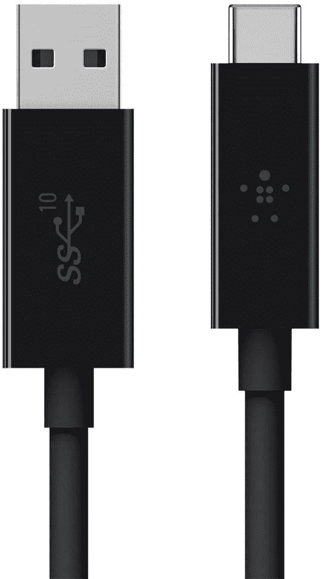
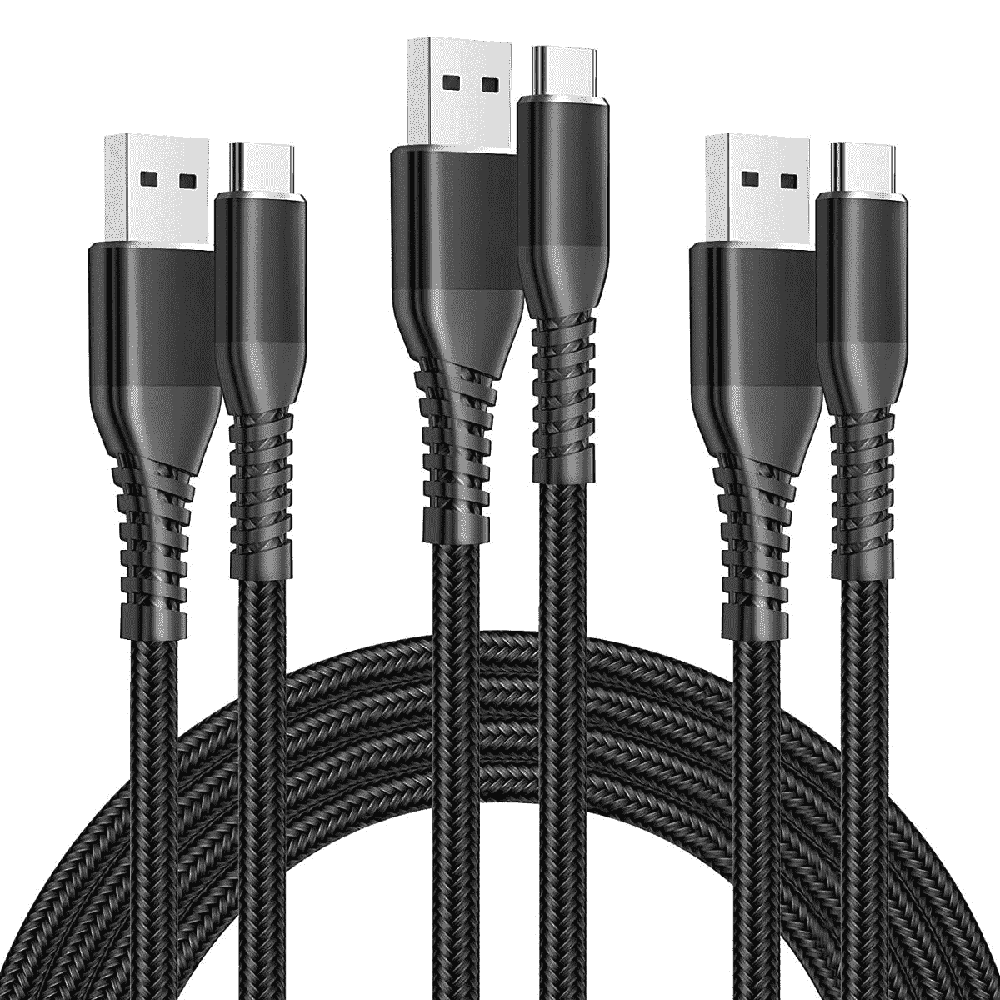
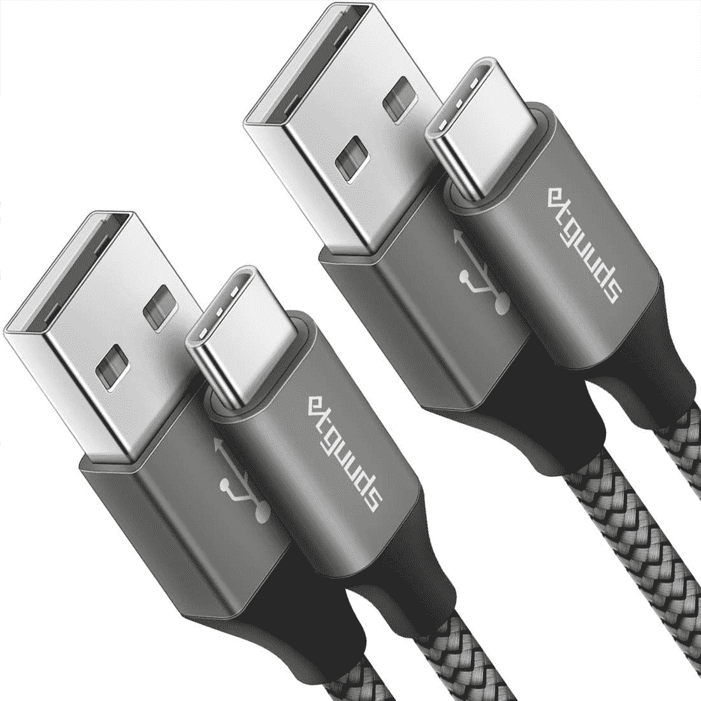
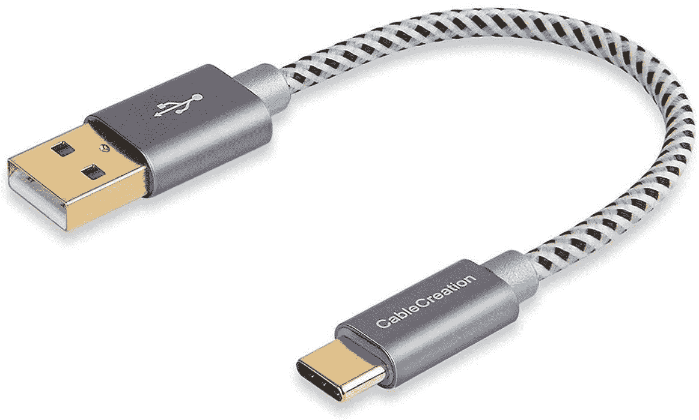
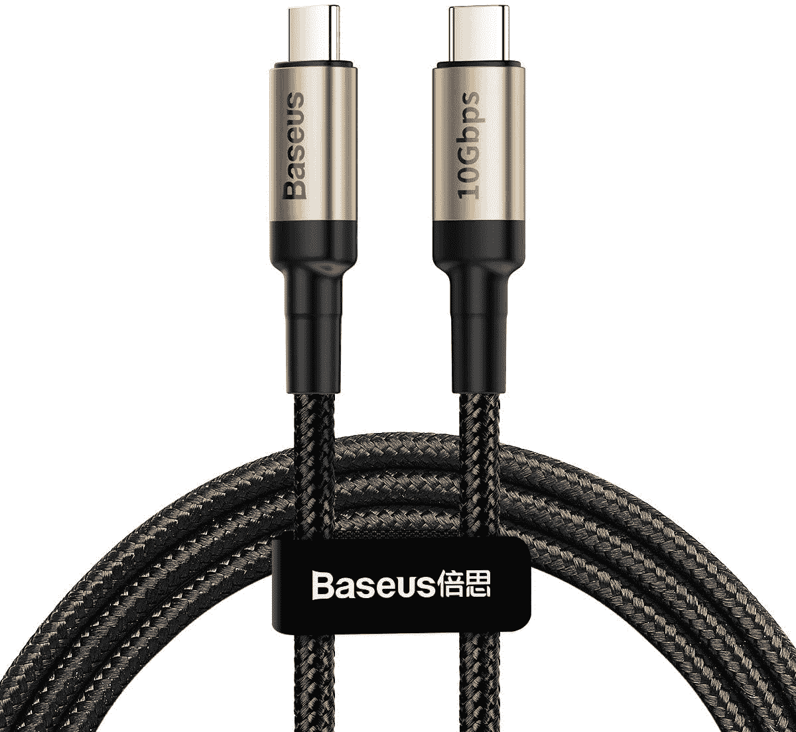
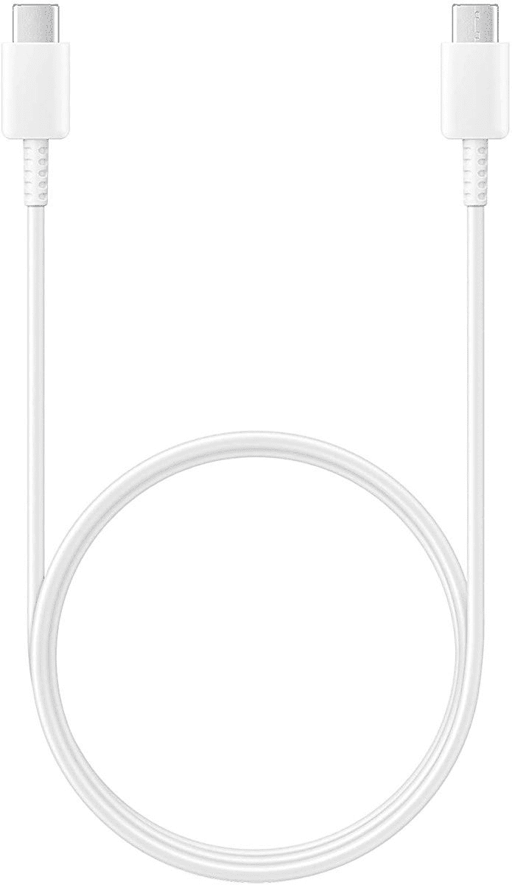
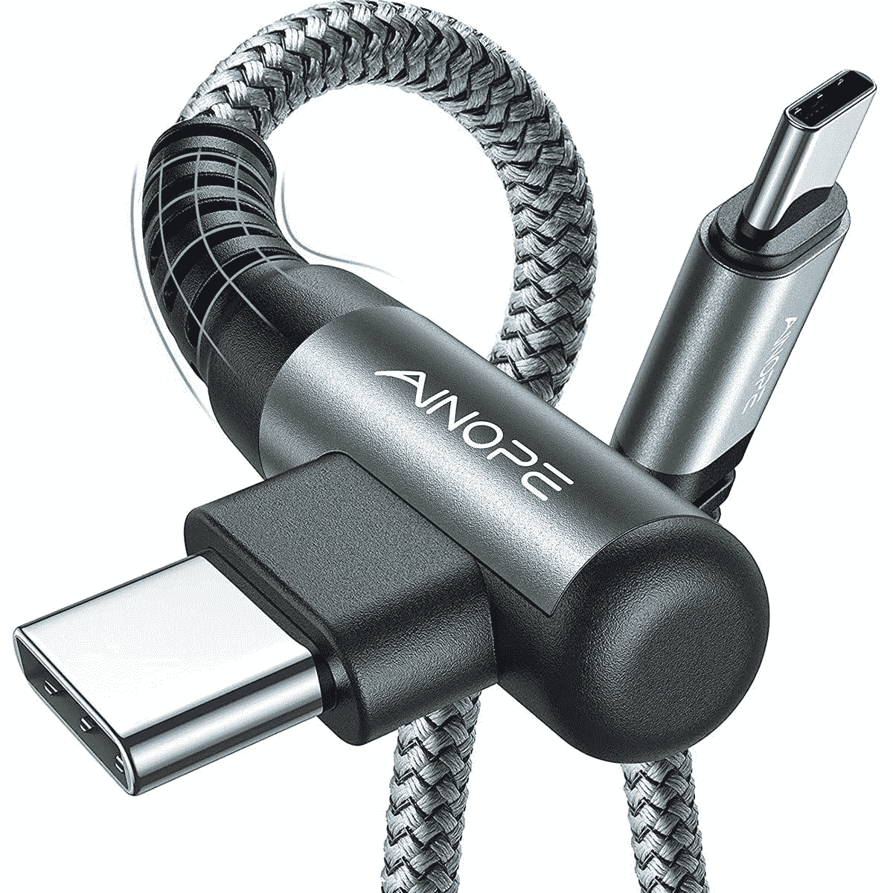

# 2023 年三星 Galaxy S22 系列最佳 USB 连接线

> 原文：<https://www.xda-developers.com/best-samsung-galaxy-s22-usb-cables/>

早在 2022 年初，三星就发布了一系列旗舰手机——Galaxy S22 T1、T2 Galaxy S22 Plus T3 和 T4 Galaxy S22 Ultra T5。它们有不同的尺寸，适合不同的观众。无论你的预算或期望是什么，都可能有一款 Galaxy S22 手机能够满足这些需求。如果你计划[购买这些手机中的一款](https://www.xda-developers.com/best-samsung-galaxy-s22-deals/)，查看一些[为 Galaxy S22 系列](https://www.xda-developers.com/best-samsung-galaxy-s22-chargers/)推荐的充电器是一个明智的想法，因为没有一款手机在包装盒中附带充电砖。它们配有 USB 电缆，但那是 USB-C 到 USB-C 的电缆。然而，很有可能你需要一根不同的电缆，或者你需要多根电缆。如果你需要为你的设备挑选一条新的电缆，我们已经为 Galaxy S22 系列编辑了一份最佳 USB 电缆列表。

## 最佳 Galaxy S22 系列 USB 电缆

买 USB 线有两种主流选择:USB-A 转 USB-C 和 USB-C 转 USB-C。

### USB-A 至 USB-C 电缆

说到充电和数据传输的速度，USB-A 比 USB-C 更慢，也更受限制。然而，一些人仍然使用带有 USB-A 端口的旧 PC，旧充电器，或新的多端口充电器-所以 USB-A 到 USB-C 线来了。不过，在大多数情况下，新设备倾向于使用 USB-C 而不是 USB-A，所以我们建议首先弄清楚您的用例。

*   <picture></picture>

    Belkin USB-A 转 USB-C 线

    ##### Belkin USB-A 转 USB-C 线

    Belkin 的这款 3 英尺 USB 线提供高达 10Gbps 的数据传输速度。然而，它的充电能力仅限于 15W 左右。

*   <picture></picture>

    三星 USB-A 转 USB-C 线

    ##### 三星 USB-A 转 USB-C 线

    这款 1 米线是公司官方出的一款。如果你不想求助于第三方电缆，那么这款三星产品是你应该去的。

*   <picture></picture>

    日比客高级尼龙 USB-C 转 USB-A 线

    ##### 日比客高级尼龙 USB-C 转 USB-A 线

    日比客的这个包装包括三根 USB-A 转 USB-C 线。它们每个长 3 英尺，支持高达 480Mb/s 的数据传输。由于它们的编织设计，它们可能会持续很长时间。

*   <picture></picture>

    etguuds USB-A 转 USB-C 编织电缆

    ##### etguuds USB-A 转 USB-C 编织电缆

    本包装附带两条 15 英尺长的 USB-A 转 USB-C 编织电缆。它非常适合那些拿着连接设备在房间里走来走去的人。它们有四种颜色可供选择。

*   <picture></picture>

    Cable creation 短 USB-A 转 USB-C 编织电缆

    ##### Cable creation 短 USB-A 转 USB-C 编织电缆

    这种电缆只有 6 英寸长。它非常适合不需要额外长度的极简主义者。就像同类产品一样，支持最高 480Mb/s 的数据传输，你可以买三种不同的颜色。

### USB-C 到 USB-C 电缆

USB-C 到 USB-C 电缆可以支持更高的充电和数据传输速度。如果你不需要将 Galaxy S22 插入 USB-A 端口，你最应该购买这些 USB-C 到 USB-C 电缆中的一种。在这一点上，USB-A 不像以前那样普遍。

*   <picture></picture>

    Baseus USB-C 转 USB-C 3.1 Gen 2 线

    ##### Baseus USB-C 转 USB-C 线

    此款编织线非常适合快速充电，支持 100W。它的数据传输速度被限制在 480Mbps。

*   <picture></picture>

    ugre suc w USB C 转 USB C 线

    ##### ugre suc w USB C 转 USB C 线

    这款优质线价格实惠，支持 100W 快充和 480Mbps 数据传输速度。

*   <picture></picture>

    三星 Galaxy USB-C 转 USB-C 线

    ##### 三星 Galaxy USB-C 转 USB-C 线

    这是三星官方的 USB-C 转 USB-C 线。它有 1 米长，不是编织的，在美国有一年的保修期。

*   <picture></picture>

    Anker 尼龙 USB-C 转 USB-C 编织电缆

    ##### Anker 尼龙 USB-C 转 USB-C 编织电缆

    本包装包含两根 6 英尺编织电缆。它们支持高达 60W 的快速充电，有三种颜色可供选择。

*   <picture></picture>

    开口 USB-C 转 USB-C 直角电缆

    ##### 开口 USB-C 直角电缆

    这种编织电缆的一端有一个直角。这使得在连接时横向握持手机更加舒适。

* * *

我们推荐的一些品牌包括 Anker 和 Baseus。当然，从三星自己那里挑选官方电缆也不会错。然而，除了可靠性之外，选择三星品牌的电缆没有任何实际的好处，所以一定要探索各种选择。

*   <picture></picture>

    三星 Galaxy S22 Plus

    ##### 三星 Galaxy S22 Plus

    三星 Galaxy S22 Plus 是 2022 年的中期旗舰产品，在更大的外壳中带来了顶级的性能、显示和相机功能，适合需要做更多事情的人。

*   <picture></picture>

    三星 Galaxy S22 Ultra

    三星 Galaxy S22 Ultra 是 2022 年的顶级旗舰产品，带来了顶级的性能、显示和相机功能以及 S Pen 功能，为超级用户提供了超棒的体验。

*您会为 Galaxy S22 手机购买哪种 USB 连接线，为什么？请在下面的评论区告诉我们。*