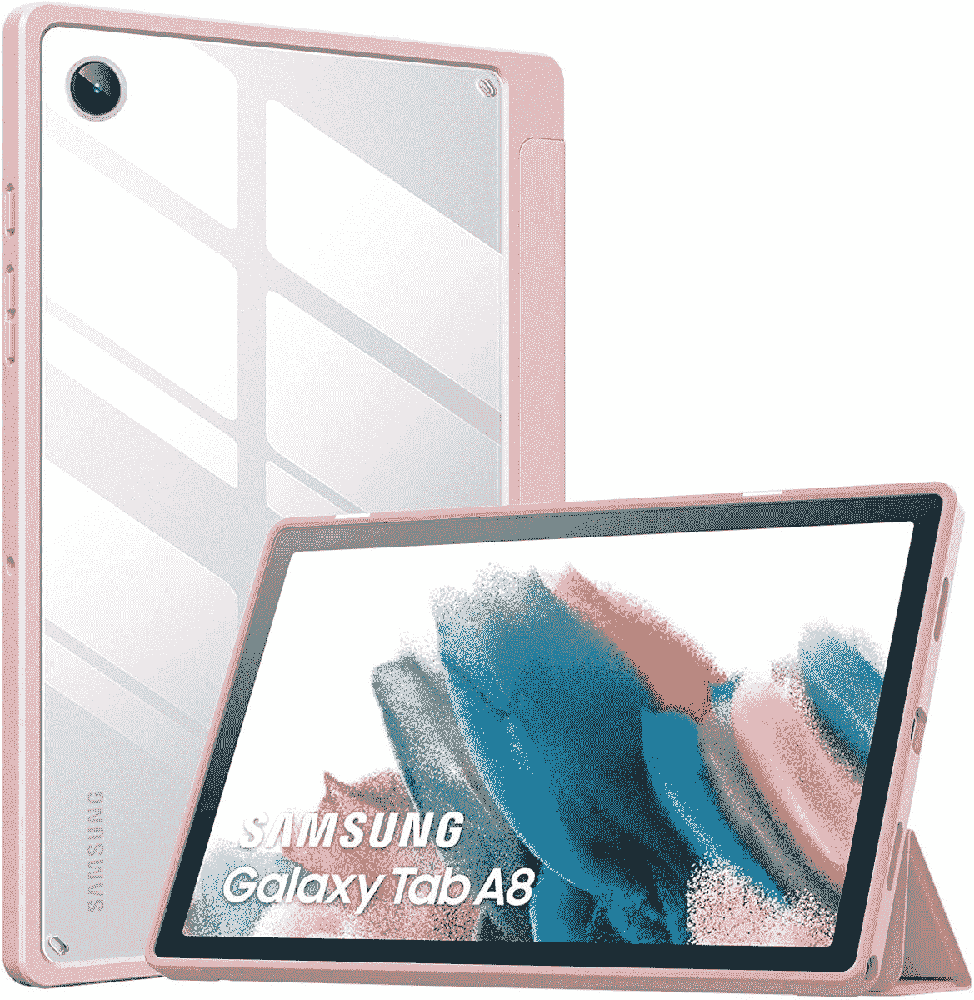
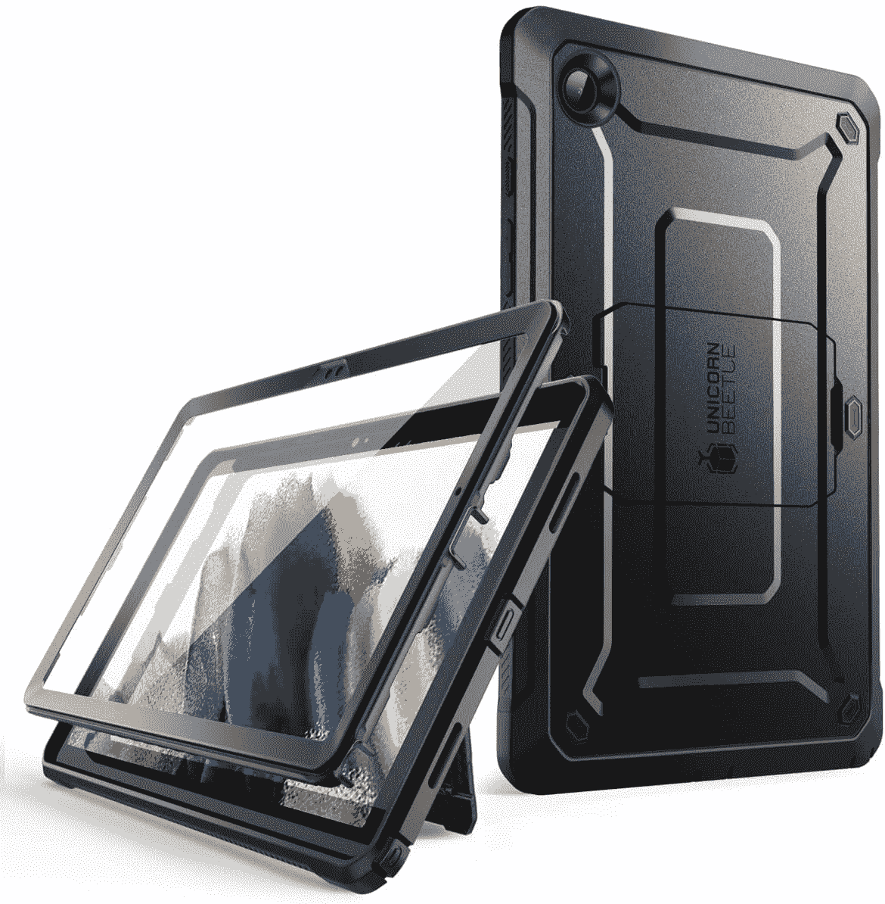
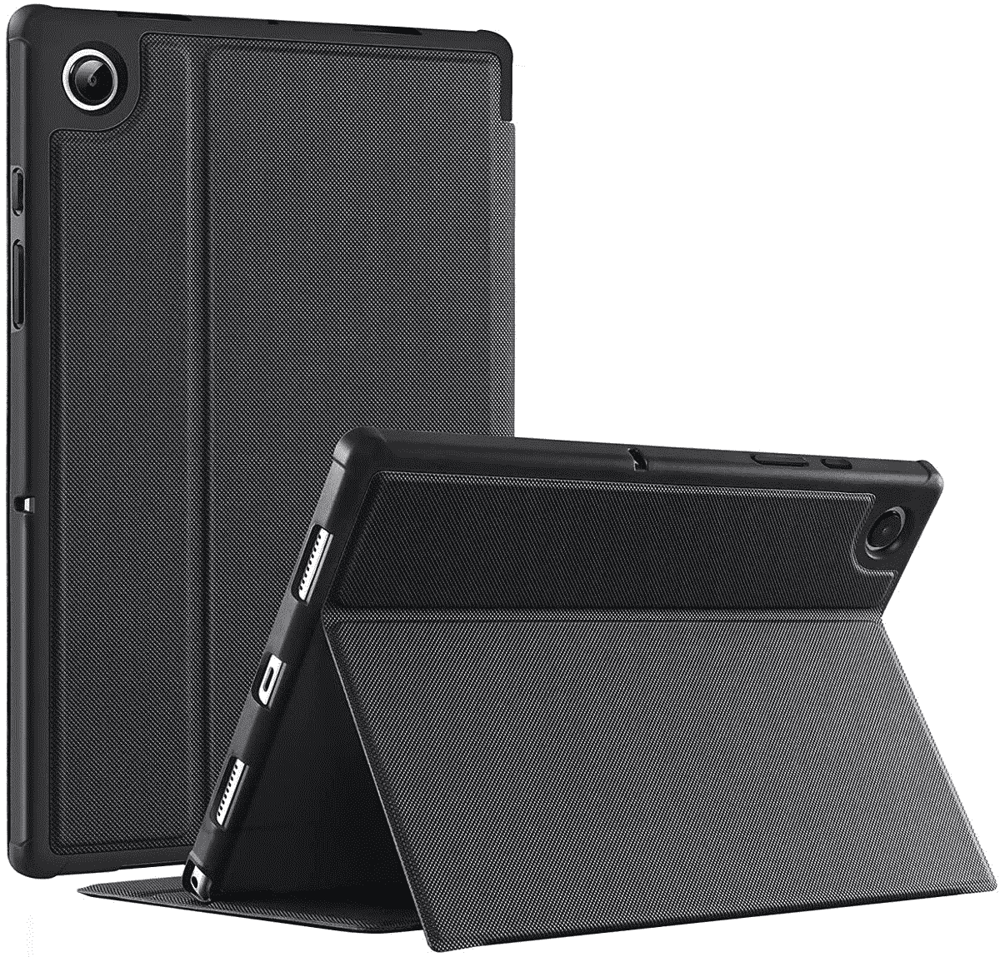
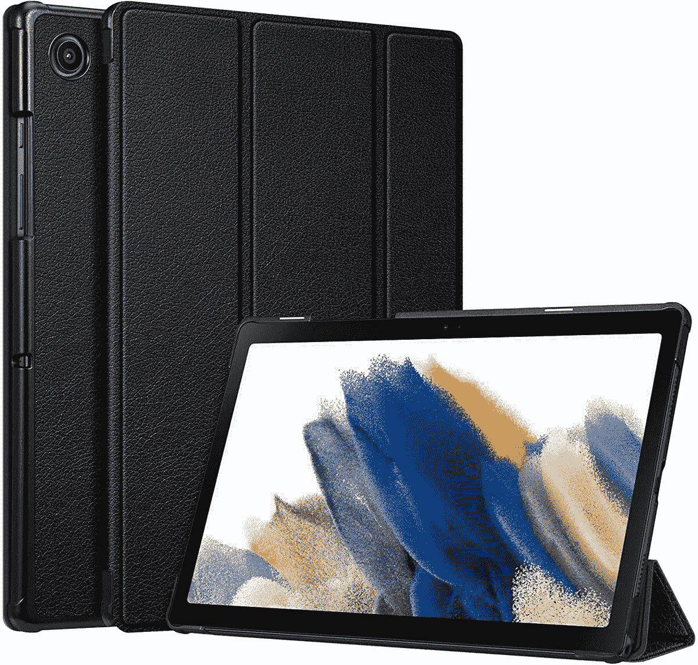
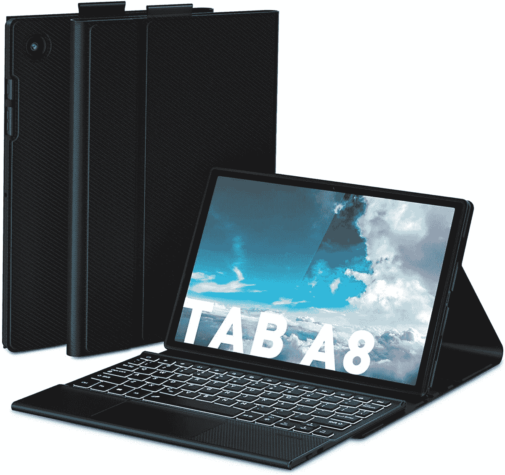
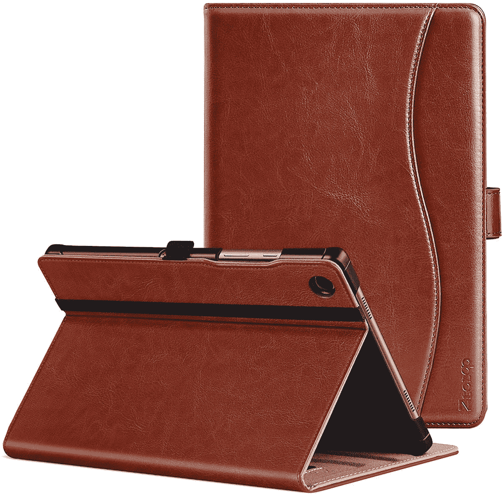

# 2023 年最佳三星 Galaxy Tab A8 保护套

> 原文：<https://www.xda-developers.com/best-samsung-galaxy-tab-a8-cases/>

# 2023 年最佳三星 Galaxy Tab A8 保护套

给自己买了三星的新平板？这里有一些最好的 Galaxy Tab A8 保护套，你可以买下来保护你的新手机！

说到平板电脑，[苹果 iPad](https://www.xda-developers.com/best-ipad/) 是无可争议的王者。然而，如果你想买一台[安卓平板](https://www.xda-developers.com/best-android-tablets/)，你可能会考虑三星的。毕竟，他们是少数几个仍然生产优秀安卓平板电脑的品牌之一。虽然 S 系列迎合了旗舰市场，但 A 系列和 [Galaxy Tab A8](https://www.xda-developers.com/galaxy-tab-a8-2021/) 一样，专注于平价市场。如果你已经为自己买了一个或者正打算买一个，保护它免受划痕和凹痕也很重要，不管它值多少钱。

最好的方法是使用一个好的案例。外壳不仅有助于保护您的设备，还可以扩展或添加一些功能，从而改善整体用户体验。例如，一些 Galaxy Tab A8 保护套可能会配有一个支架，当平板电脑放在桌子上时，可以将它保持在一个角度。这里有一些你可以为你的平板电脑购买的最好的 Galaxy Tab A8 保护套。

*   ##### 三星 Galaxy Tab A8 书皮

    编辑推荐

    这款三星 Galaxy Tab A8 书皮非常适合那些想要将平板电脑立在平面上进行媒体消费的人。它采用了磁性设计，配有 S 笔筒，有两种颜色可供选择。

    T17
*   <picture></picture>

    可比 Clear case

    ##### 可比 Clear Galaxy Tab A8 case

    Best Value

    如果你想在展示平板电脑背面的同时还增加一点像样的保护，你应该从可比那里得到这个选项。这也是我们清单上最便宜的选择之一。

*   <picture></picture>

    sup case 独角甲虫 Pro

    ##### sup case UB Pro Galaxy Tab A8 case

    sup case 做了一些坚固的保护，如果你想得到最大的保护，这就是一款。它配有一个屏幕保护器，并内置一个支架。

*   <picture></picture>

    科巴克 PU 皮套

    ##### 科巴克皮革 Galaxy Tab A8 套

    这是一款用 PU 皮制成的对开套，看起来高档，但价格比真皮要低。观看内容时，您也可以将其用作支架。

*   <picture></picture>

    Fintie 超薄对开本保护套

    ##### Fintie 超薄对开本 Galaxy Tab A8 保护套

    如果你想要一个保护充分的对开本保护套，但又不想要一个通用的款式，不妨试试这个 Fintie 选项。它有一个硬背，增加了韧性，并有 10 种颜色可供选择。

*   <picture></picture>

    带触控板的键盘外壳

    ##### Doohoeek 键盘 Galaxy Tab A8 外壳

    如果你想扩展平板电脑的功能，像笔记本电脑一样使用它，这就是你应该得到的外壳。可拆卸的键盘套有一个触控板，甚至还有一些背光，便于在旅途中使用。

*   ##### 德托斯旋转 Galaxy Tab A8 外壳

    这份清单上的大多数外壳都可以让你支撑平板电脑观看视频，但这款 folio 外壳更进一步，让你可以将平板电脑旋转到纵向。现在，您可以更舒适地阅读书籍或浏览网页。

*   <picture></picture>

    双层防震保护套

    ##### leChivee 双层防震 Galaxy Tab A8 保护套

    除了保护性极强之外，这款保护套还内置了支架，甚至还有一个手带，可以帮助你在使用平板电脑时握住它。

*   <picture></picture>

    高级皮套

    ##### ZtotopCases 皮套 Galaxy Tab A8 皮套

    这是一款适合想要高级、专业外观的皮套。它还具有自动唤醒和睡眠功能，以及支架。

这些是你能为三星 Galaxy Tab A8 买到的一些最好的保护套。如前所述，除了保护您的设备之外，大多数情况下还有其他好处。大多数外壳可以像支架一样用于观看视频，但其他外壳有内置的手带来帮助你抓住和握住平板电脑，或者有一个透明的背部来展示设备的设计。三星的官方选项不会错，因为你知道它可以与 Galaxy Tab A8 配合使用，但如果你需要额外的保护，SUPCASE 的选项也很棒。

 <picture></picture> 

Samsung Galaxy Tab A8

##### 三星 Galaxy Tab A8

Galaxy Tab A8 是三星的一款入门级、面向预算的平板电脑，可以成为一款不错的媒体消费设备。