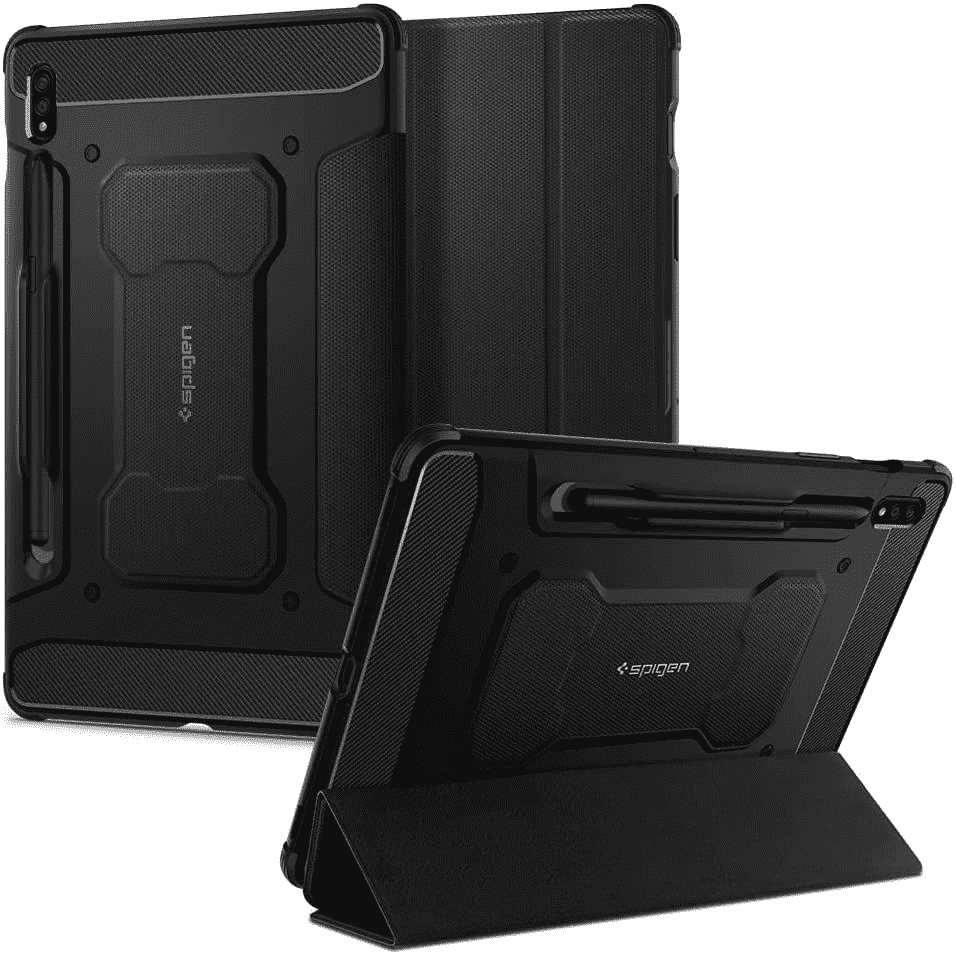
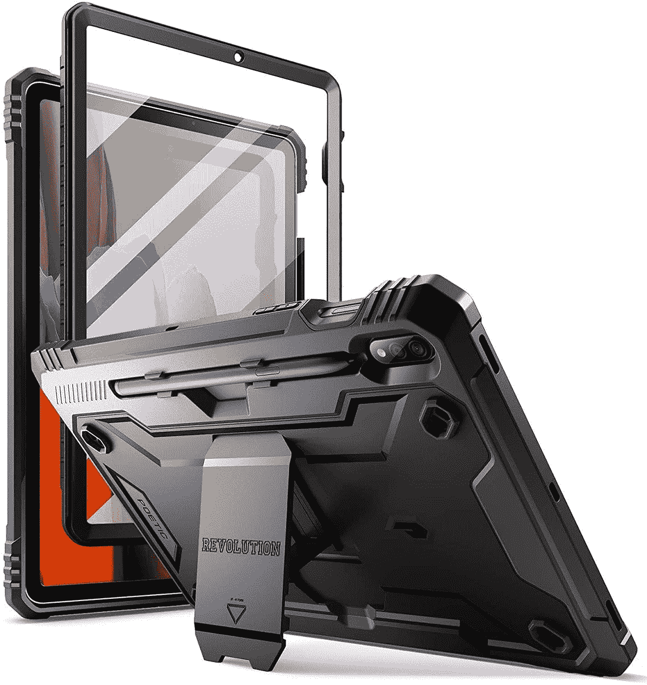
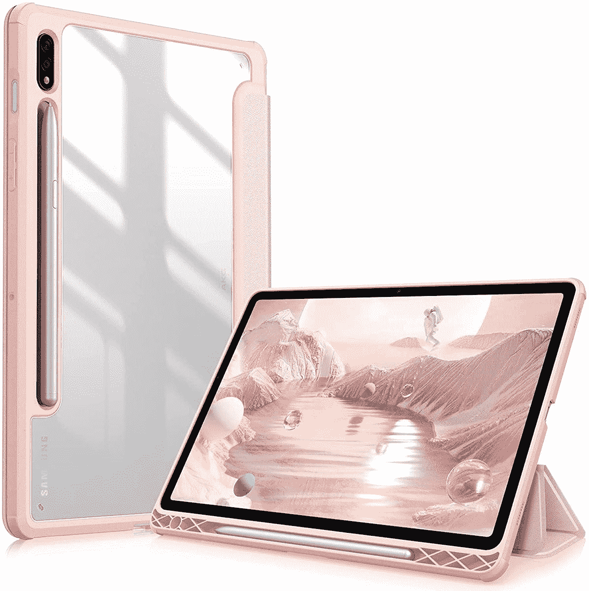
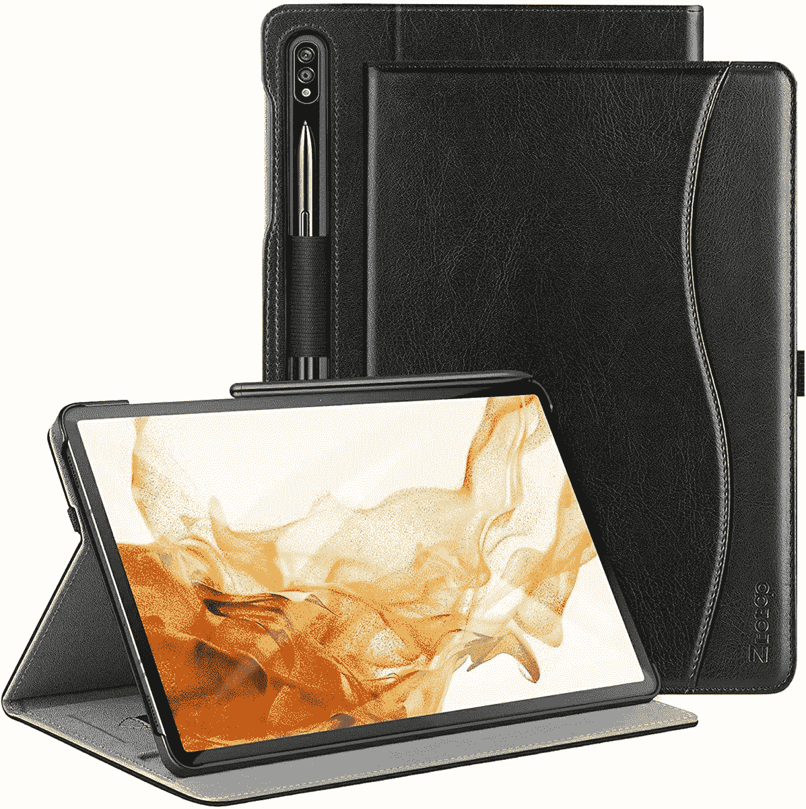
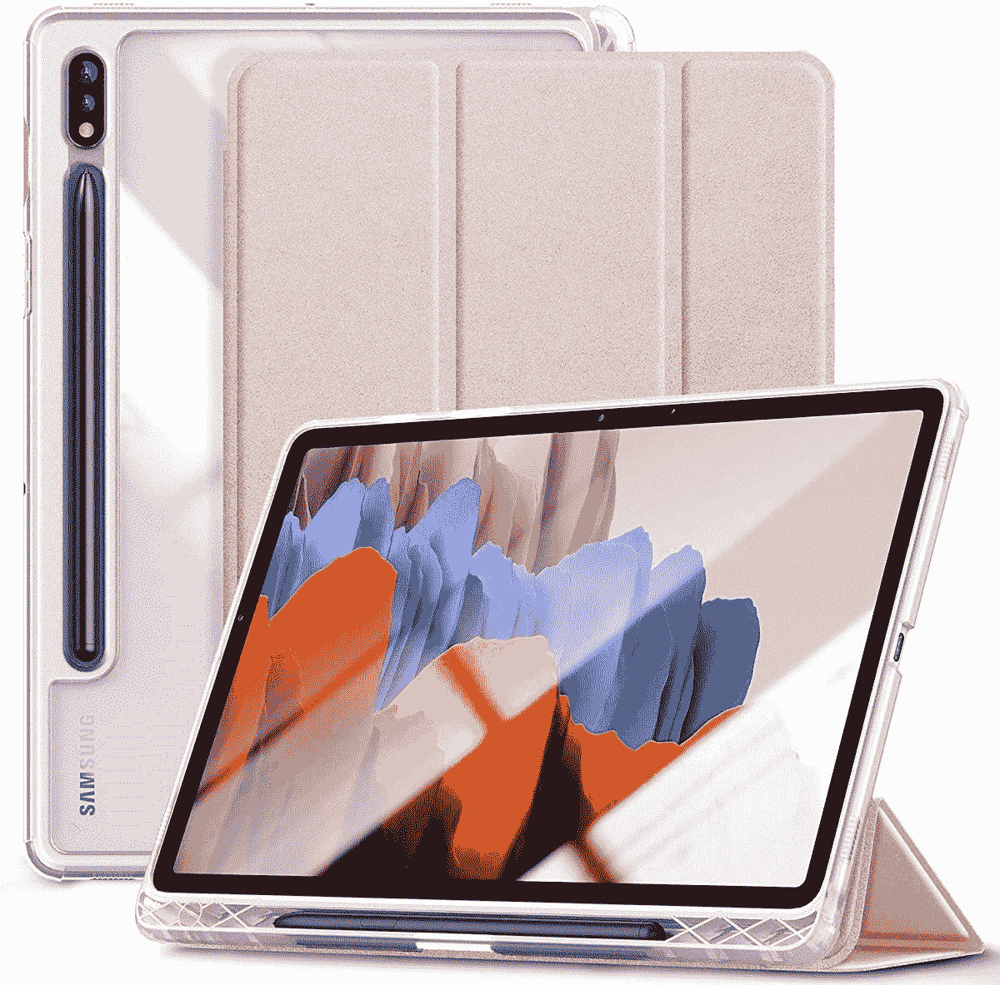

# 2023 年最佳三星 Galaxy Tab S8 支架盒

> 原文：<https://www.xda-developers.com/best-samsung-galaxy-tab-s8-kickstand-cases/>

# 2023 年最佳三星 Galaxy Tab S8 支架盒

三星 Galaxy Tab S8 是 2022 年最好的平板电脑之一。以下是你可以为新设备购买的支架盒列表。

三星终于发布了其最新系列的旗舰平板电脑——Galaxy Tab S8、Galaxy Tab S8 Plus、 [Galaxy Tab S8 Ultra](https://www.xda-developers.com/samsung-galaxy-tab-s8-ultra-review/) 。就连三款中最实惠的[也物有所值。虽然它的屏幕只有 11 英寸宽，但它仍然是一款可以在旅途中使用的功能性设备。说到在旅途中使用 Galaxy Tab S8，一个非常明智的想法是](https://www.xda-developers.com/best-samsung-galaxy-tab-s8-deals/)[用外壳](https://www.xda-developers.com/best-samsung-galaxy-tab-s8-cases)保护它。它在室外比在室内更容易发生事故，甚至一滴小水滴都可能打碎它闪亮的新屏幕。

另一个明智的想法是买一个有支架的箱子。这样，无论你是在外面还是在家里，你都可以把它竖立在一个笔直的表面上，更容易地涂鸦、做笔记和参加在线会议。在 2022 年，不得不用一只手拿着 Galaxy Tab S8，同时用另一只手控制它，这绝不是操作平板电脑的方式。别忘了在它生动的液晶显示屏上贴上一个[屏幕保护器](https://www.xda-developers.com/best-samsung-galaxy-tab-s8-screen-protectors/)——一个小小的刮痕就能让它看起来破旧不堪。

 <picture></picture> 

Spigen Rugged Armor Pro

##### 斯皮根坚固装甲专业银河标签 S8 盒

Spigen 的这款保护套提供了支架和加固保护。还支持 S Pen，不用单独携带。

 <picture></picture> 

Supcase Unicorn Beetle Pro

##### SUPCASE UB Pro Galaxy Tab S8 外壳

这款保护套内置屏幕保护装置，可提供 360 度全方位保护。它还有一个 S 笔筒，所以你不用担心。

 <picture></picture> 

Poetic Revolution Series Case

##### 诗意革命 Galaxy S22 Plus 表壳

这款坚固耐用的外壳有黑色、蓝色和粉色可选。它还有一个内置的屏幕保护器，非常适合恶劣的环境。

 <picture></picture> 

Fintie Hybrid Slim Case

##### Fintie 混合超薄 Galaxy Tab S8 盒

这款 smart 360 保护套有清晰的背面和正面，有五种不同的图案可供选择。它支持显示器自动唤醒/睡眠，并有一个 S 笔筒。

 <picture></picture> 

ZtotopCase Leather Cover

##### Ztotop 皮革对开银河标签 S8 盒

这款正式的表壳由皮革制成，有三种颜色可供选择。它有一个 S 笔筒，支持显示器自动唤醒/睡眠，并有多种视角。

 <picture></picture> 

Hoidokly Hard Clear Cover

##### Hoidokly 硬清晰银河标签 S8 加封面

这款保护套背面透明，正面彩色，可为您的平板电脑提供 360°保护。它还支持 smart display 自动唤醒/睡眠和支架模式。

* * *

如果我必须亲自为我的全新三星 Galaxy Tab S8 选择一个支架保护套，我肯定会选择 Spigen Rugged Armor Pro。它坚固、实用，物有所值。然而，并不是每个人都认同我的品味。这就是为什么我们为你列出了一些最好的案例。选项是不可数的，可能性是无穷的。

购买保护套并不仅仅是为了保护你的设备免受潜在的损害。在这种情况下，由于有了支架，购买一个也增加了更多的功能。更不用说能够根据你的心情、服装和其他因素(如月亮的相位)来个性化你的现代平板电脑。

 <picture></picture> 

Samsung Galaxy Tab S8

##### 三星 Galaxy Tab S8

三星 Galaxy Tab S8 是该公司最新旗舰产品系列的入门级平板电脑，采用 11 英寸屏幕。

*您会为您的三星 Galaxy Tab S8 购买哪些支架保护套？请在下面的评论区告诉我们。*