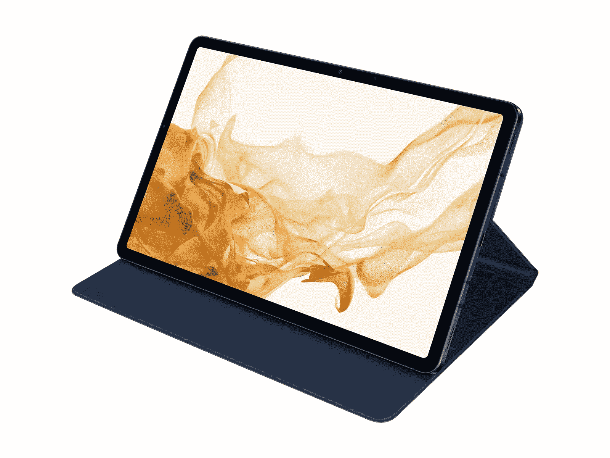
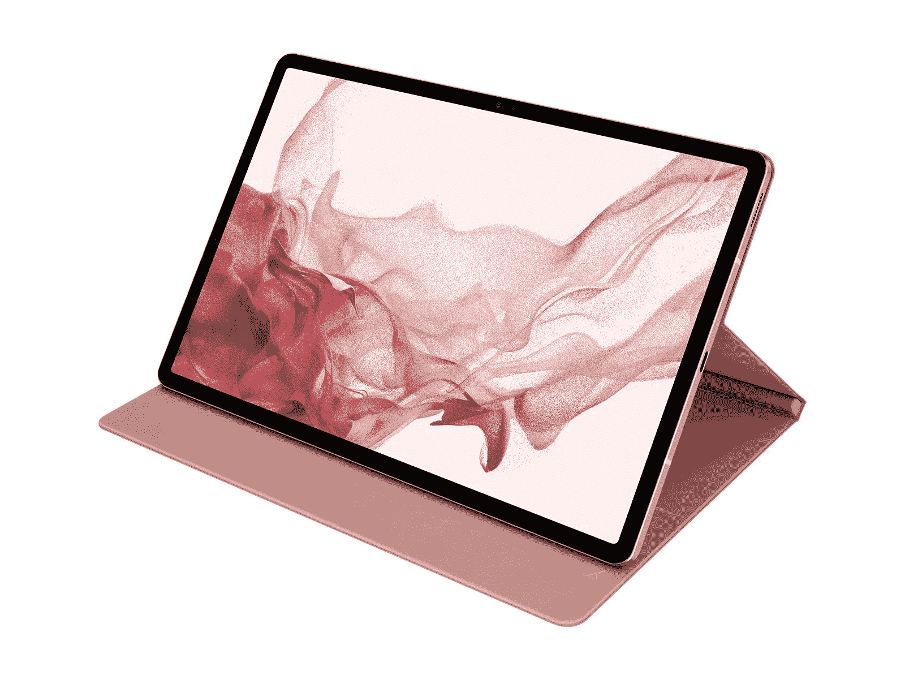
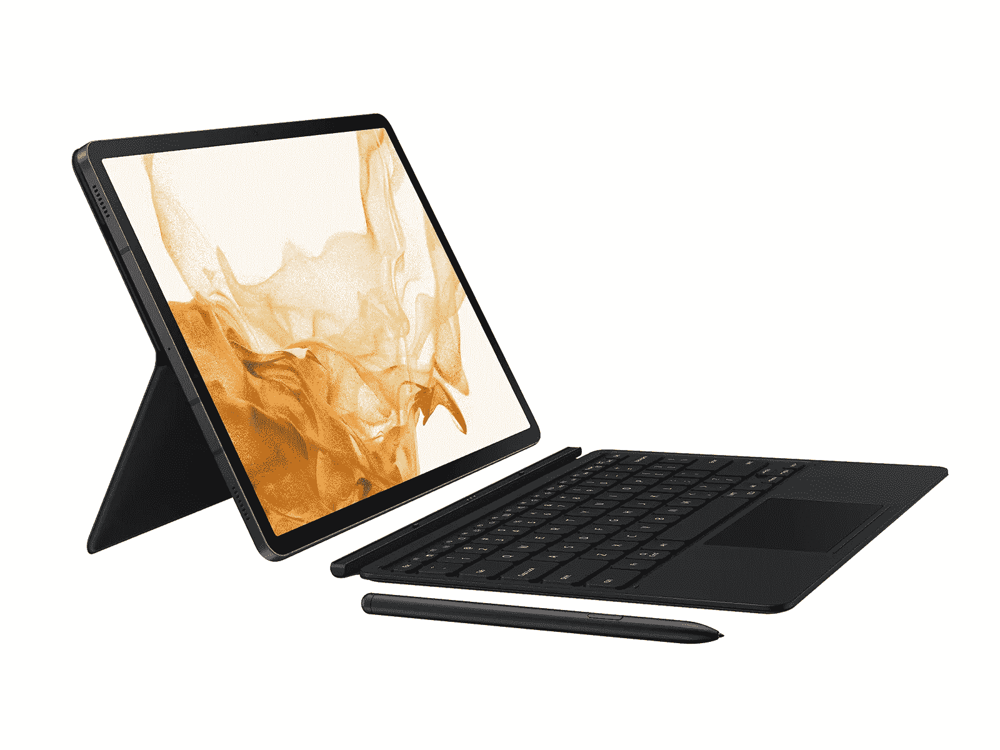
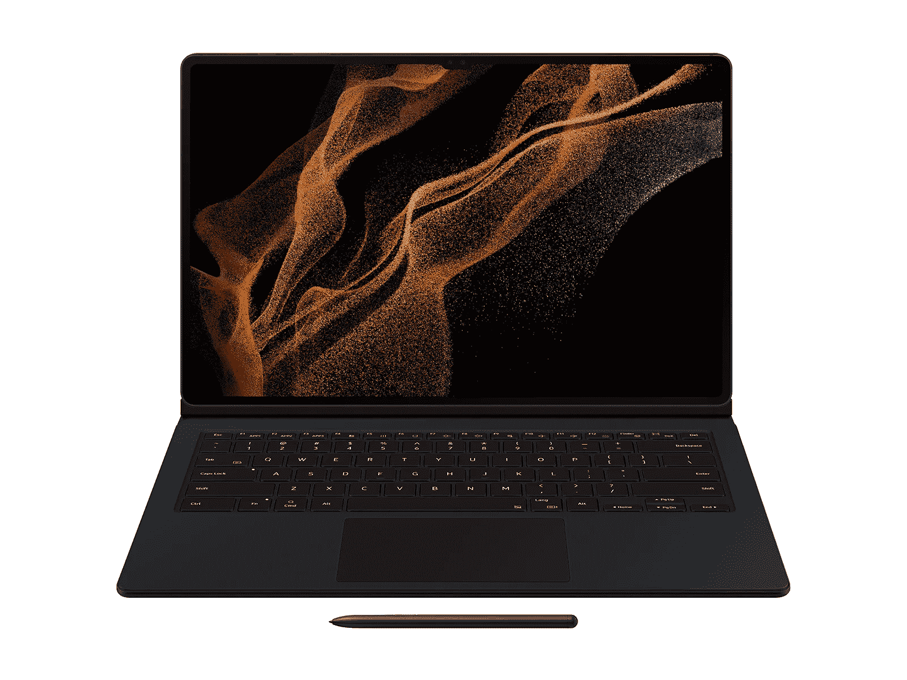
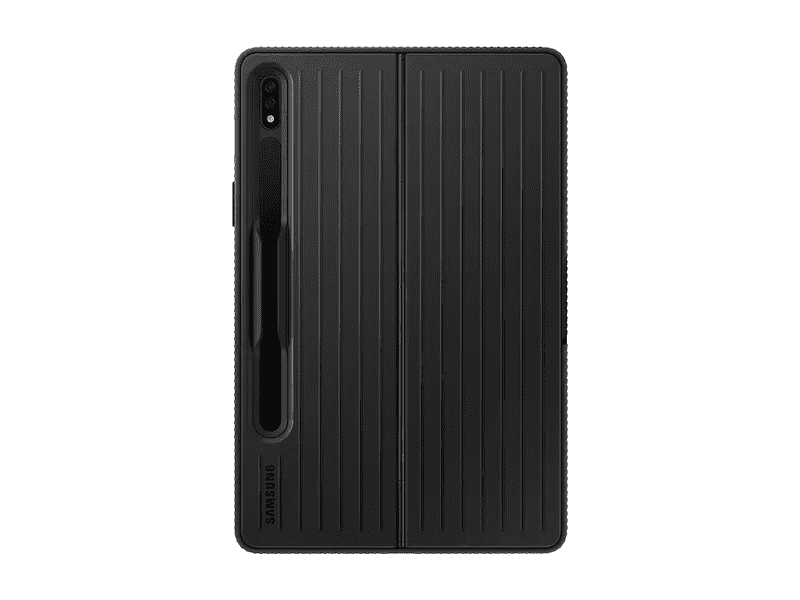
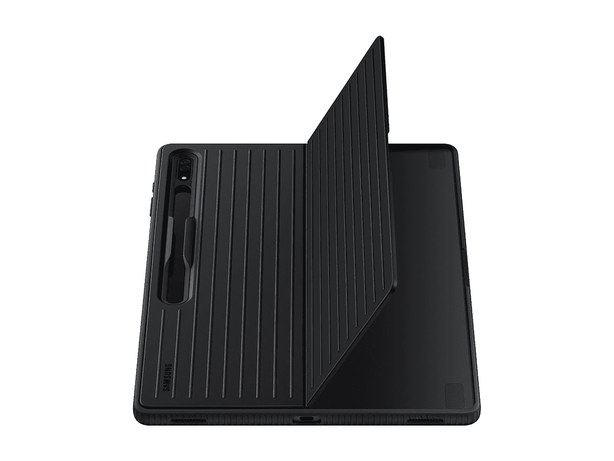
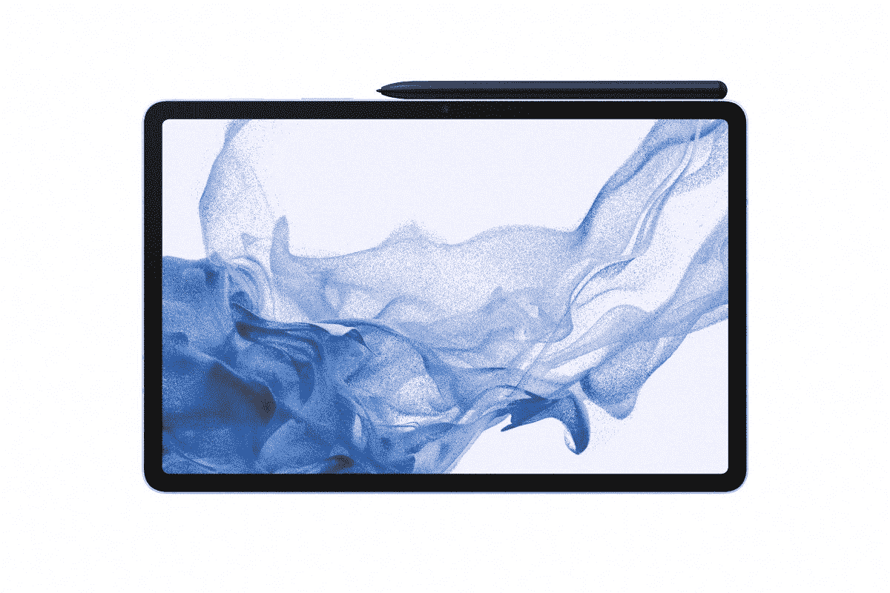

# 2023 年三星 Galaxy Tab S8 系列所有官方保护套

> 原文：<https://www.xda-developers.com/best-samsung-galaxy-tab-s8-official-cases/>

三星的 [Galaxy Tab S8 系列](https://www.xda-developers.com/samsung-galaxy-tab-s8-series-launch/)为 Android 平板电脑设立了标杆，有三种不同价位的平板电脑可供选择。Galaxy Tab S8 已经是一款令人印象深刻的设备，具有强大的性能和出色的屏幕，但你可以通过 Tab S8 Plus 或 Tab S8 Ultra 获得更好的体验。即使你选择了基本款，你也至少要花 699.99 美元，而顶级款的起价是 1099.99 美元。这是你想要保护的投资，三星有几个官方案例可以做到这一点。

诚然，如果你在寻找正式的保护套，你没有太多的选择，但是你可以在基本保护和增加键盘功能之间进行选择。如果三星的官方保护套对你来说还不够，你可以在我们的[最佳 Galaxy Tab S8 保护套](https://www.xda-developers.com/best-samsung-galaxy-tab-s8-cases/)综述中看看其他品牌的保护套。现在，让我们进入三星的官方案例。

## Galaxy Tab S8 系列的三星图书封面

如果你只想保护你的 Galaxy Tab S8 平板电脑，你最好的选择是三星的经典书籍封面。对于 Galaxy Tab S8 和 S8 Plus，这些实际上与我们为 Galaxy Tab S7 和 S7 Plus 获得的外壳相同，因为这两款设备的尺寸相同。盖子通过磁性附着在平板电脑的背面，当您合上平板电脑时，可以从背面和正面保护平板电脑。它还可以兼作支架，因此您可以支撑平板电脑，观看视频或电影。你可以从两个角度选择支架。

对于标准的 Galaxy Tab S8，外壳有黑色、粉色、浅灰色或深蓝色可供选择。对于 Galaxy Tab S8 Plus，您可以获得所有相同的选项，如果您喜欢，还可以获得浅绿色版本。然而，Galaxy Tab S8 Ultra 的版本只有黑色。您可以在下面购买适合您平板电脑的型号。

 <picture></picture> 

Galaxy Tab S8 Book Cover

##### 三星 Galaxy Tab S8 图书封面

标准 Galaxy Tab S8 的书皮有四种颜色可供选择，提供全方位保护。

 <picture></picture> 

Galaxy Tab S8 Plus Book Cover

##### 三星 Galaxy Tab S8 Plus 图书封面

Tab S8 Plus 的书皮为您提供了五种颜色选择，并提供相同级别的保护。

 <picture></picture> 

Galaxy Tab S8 Ultra Book Cover

##### 三星 Galaxy Tab S8 Ultra 图书封面

Tab S8 Ultra 的书皮只有黑色，但提供了同样的保护。

## Galaxy Tab S8 系列的书皮键盘

为了让你的平板电脑更像一台笔记本电脑，你可能需要为你的 Galaxy Tab S8 型号配备书皮键盘。就像书籍封面本身一样，这款机型通过磁力附着在平板电脑的背面进行保护，但封面实际上是一个独立的部分，它使用平板电脑框架侧面的销钉进行连接。

因为它们是两个独立的部分，所以您可以获得更大的灵活性。支架独立于键盘移动，因此您可以将平板电脑放在您喜欢的任何位置。后盖也有一个插槽来覆盖 S Pen，这样它就可以固定在平板电脑的背面，当你需要笔的时候，你可以很容易地打开它。

键盘本身非常有用，你可以打字，也可以通过触摸板浏览界面。键盘上有一个 DeX 按钮，可以通过 windows 和适当的桌面将您的平板电脑变成更像 PC 的体验。您不需要连接外部显示器，它只是在平板电脑上直接实现这种体验，因此您可以在需要时轻松地在更像平板电脑的用户界面和 PC 体验之间切换。此外，当连接到平板电脑时，你可以使用键盘控制其他三星设备，如 [Galaxy S22](https://www.xda-developers.com/samsung-galaxy-s22-series-launch/) 。

这个的缺点是它只有黑色，所以你没有任何选择。Galaxy Tab S8 Ultra 也将有一个模型，但就像标准的书籍封面一样，它还没有上市。

 <picture></picture> 

Galaxy Tab S8 Book Cover Keyboard

##### 三星 Galaxy Tab S8 书皮键盘

Galaxy Tab S8 的书籍封面键盘提供了全方位的保护，加上键盘和触摸板，可以像笔记本电脑一样使用。它还包括一个支架。

 <picture></picture> 

Samsung Galaxy Tab S8+

##### 三星 Galaxy Tab S8 Plus 书皮键盘

Galaxy Tab S8 Plus 的书皮键盘增加了保护和功能，它的触摸板比标准型号更大。

 <picture></picture> 

Galaxy Tab S8 Ultra Book Cover Keyboard

##### 三星 Galaxy Tab S8 Ultra Book Cover 键盘

这款键盘的大小与 Galaxy Tab S8 Ultra 相当，它有一个更大的触摸板，而且它有背光，所以你可以在黑暗中使用它。

## 保护性站立盖

如果你不想要一个覆盖屏幕的保护套，你也可以买一个保护套，这是三星官方为 Galaxy Tab S8 提供的最后一个保护套。这是一个看起来有些粗糙的外壳，但它仍然可以兼作支架，将平板电脑支撑在桌子上。您可以根据自己的喜好在 30 到 75 度之间任意调节支架。这样，您就可以更舒适地观看视频和电影，而且在使用平板电脑之前，您也不必经常取下外壳。

它只有黑色，除了尺寸之外，所有型号的设计都差不多。您可以使用下面的链接为您的平板电脑购买合适的产品。

 <picture></picture> 

Galaxy Tab S8 Protective Standing Cover

##### 三星 Galaxy Tab S8 保护立盖

这种基本保护套可以保护您的 Galaxy Tab S8 免受跌落和碰撞，但它会让屏幕始终可见。它还有一个支架。

 <picture></picture> 

Galaxy Tab S8 Plus Protective Standing Cover

##### 三星 Galaxy Tab S8 Plus 保护套

这款基本保护套可保护您的 Galaxy Tab S8 Plus 免于跌落，同时保持屏幕始终可见。它还有一个支架。

 <picture></picture> 

Galaxy Tab S8 Ultra Protective Standing Cover

##### 三星 Galaxy Tab S8 超级保护立盖

这种基本外壳可以保护您的 Galaxy Tab S8 Ultra 免受各种撞击，但它会让屏幕始终可见。它还有一个支架。

这些都是你可以为 Galaxy Tab S8 购买的三星官方保护套。如果你想要额外的保护，你可能还想看看 Galaxy Tab S8 的最佳屏幕保护器，这样你就不必担心裂缝和划痕了。

如果你不确定是否应该购买三星的最新平板电脑，请务必查看我们对 Galaxy Tab S8 的第一印象。如果你下定决心，你可以在下面购买，或者在 Galaxy Tab S8 上查看[的最佳交易，看看你是否能找到更好的价格。](https://www.xda-developers.com/best-samsung-galaxy-tab-s8-deals/)

 <picture></picture> 

Samsung Galaxy Tab S8

##### 三星 Galaxy Tab S8

三星 Galaxy Tab S8 有一个清晰的 11 英寸液晶面板，刷新率为 120 赫兹，由骁龙 8 Gen 1 和其他高端规格驱动。

 <picture></picture> 

Samsung Galaxy Tab S8 Plus

##### 三星 Galaxy Tab S8 Plus

三星 Galaxy Tab S8 Plus 采用全金属设计，由骁龙 8 Gen 1 驱动，配备 12.4 英寸 Super AMOLED 显示屏，刷新率为 120Hz。

 <picture></picture> 

Samsung Galaxy Tab S8 Ultra

三星 Galaxy Tab S8 Ultra 是有史以来最大的 Android 平板电脑之一，配备 14.6 英寸显示屏，双前置摄像头，高端规格，加上 S Pen 支持。