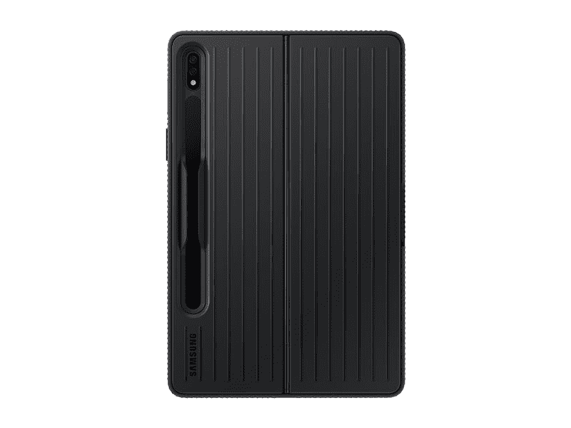
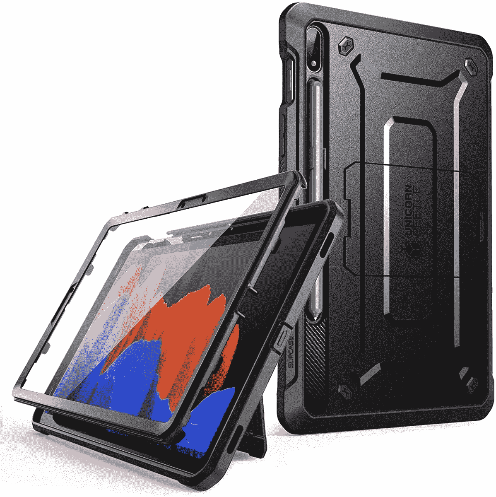
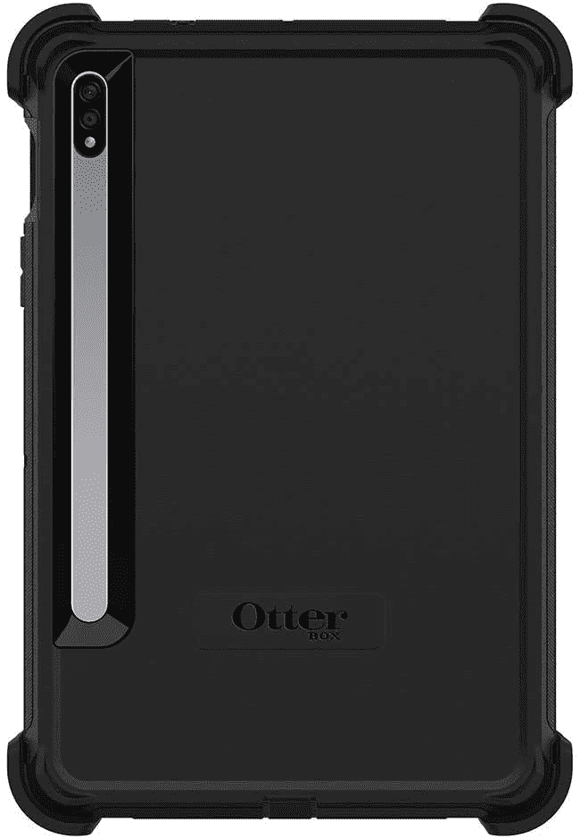
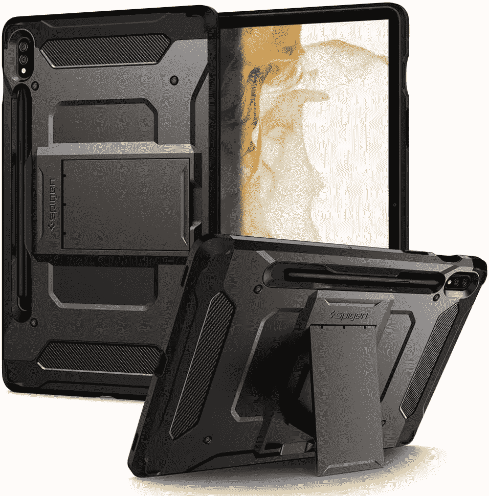
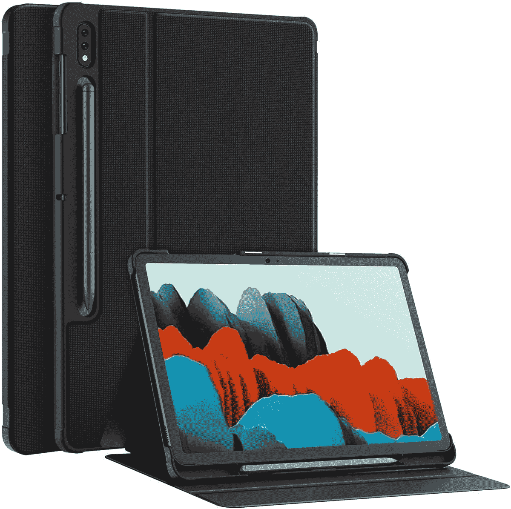
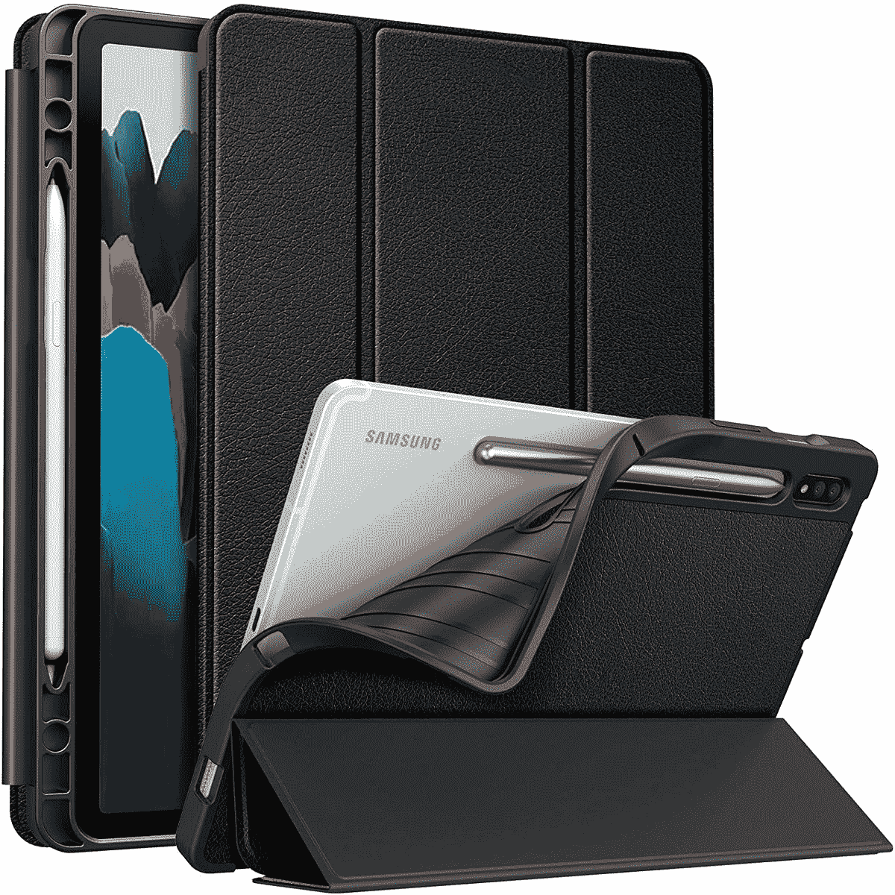
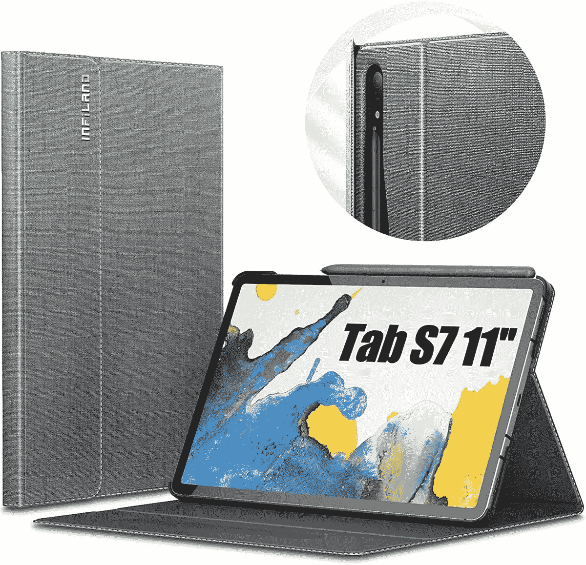

# 2023 年最佳三星 Galaxy Tab S8 Plus 保护套

> 原文：<https://www.xda-developers.com/best-samsung-galaxy-tab-s8-plus-cases/>

除了 [Galaxy S22](https://www.xda-developers.com/samsung-galaxy-s22-hands-on/) 系列智能手机，三星还宣布了由 [Galaxy Tab S8 和作为中间版本的](https://www.xda-developers.com/samsung-galaxy-tab-s8-hands-on/)组成的最新旗舰平板电脑阵容。旗舰 S 系列平板电脑一直代表着从性能到显示的优质体验。Galaxy Tab S8 系列也不例外。如果你打算购买这三款设备中的任何一款，请查看[最佳 Galaxy Tab S8 交易](https://www.xda-developers.com/best-samsung-galaxy-tab-s8-deals/)。如果你选择了 plus 版本，这里有一些 Galaxy Tab S8 的最佳保护套。

保护套不仅可以保护您的平板电脑免受划痕和凹痕等外部损坏，还可以改变设备的外观和手感。当与[屏幕保护器](https://www.xda-developers.com/best-samsung-galaxy-tab-s8-plus-screen-protectors/)搭配使用时，保护套还可以在你摔下平板电脑时保护你的显示器不被摔碎，从而为你节省大量的维修费用。由于平板电脑是一种大型设备，因此在使用它时，外壳可以增加握感和信心。这里有几个案例选项，您可以跨不同类别查看。你可以根据自己的风格或材料选择最适合自己的箱子。

**浏览本文:**

## 官方案例

这些是三星官方为 Galaxy Tab S8 Plus 制作的外壳。由于它们是第一方的案例，你可以期待最好的拟合与精确的切口和按钮的位置。三星的官方保护套通常是保护性的，是通过添加键盘来扩展平板电脑功能的一种很好的方式。与第三方产品相比，它们稍贵一些，但质量或多或少证明了价格的合理性。

 <picture></picture> 

Standing Protective Case

##### 三星保护站立银河标签 S8 Plus 案件

这是一个三星的坚固外壳，内置支架。它还有一个很好的设计，增加了背部的抓地力。

 <picture></picture> 

Book Cover

##### 三星 Galaxy Tab S8 Plus 图书封面

如果你想要一个具有智能功能的优质 folio case，这是直接来自三星的一个很好的选择。

 <picture></picture> 

Book Cover Keyboard Slim

##### 三星 Galaxy Tab S8 Plus 书皮键盘

如果你想提高你的选项卡上的生产力，这是最好的情况。它增加了一个键盘，保护了平板电脑。

## 清晰的案例

Clear cases 适合那些想要炫耀其平板电脑闪亮的新背面，同时又想增加一点保护的人。Galaxy Tab S8 Plus 有多种颜色可供选择，如果你想让人们知道你选择了哪一种，就买一个透明的盒子吧！

 <picture></picture> 

Fintie Clear Folio

##### Fintie 透明对开银河标签 S8 Plus 盒

这不仅是一个明确的情况下，而且有一个对开封面内置。背面有一个支架，也非常有用。

 <picture></picture> 

Ringke Fusion Case

##### Ringke 融合银河标签 S8 Plus 盒

如果你想要一个简单又不会增加太多体积的透明盒子，就选这个吧。它也有一个 S 笔的插槽。

 <picture></picture> 

Zeking Design

##### 泽京明确银河标签 S8 加案例

这是一个来自 TPU 的明显的例子。它是有弹性的，这意味着它很快就会变黄，所以要小心。

## 坚固的箱子

你是否因经常摔手机而出名？您是否担心最终会摔碎显示器或弄凹平板电脑的边角？如果是的话，你需要一个坚固的箱子。坚固的外壳又厚又软，这就是它们为您的平板电脑提供大量保护的原因。它们可能会变得有点笨重，这取决于你买的是哪种，但这是你为了更好地安心而做出的权衡。

 <picture></picture> 

Supcase Unicorn Beetle Pro

##### SUPCASE UB Pro Galaxy Tab S8 Plus 外壳

Supcase 的 Unicorn Beetle Pro 凭借其坚固的背部和内置的屏幕保护器提供了最高的保护。你还可以在箱子背面找到一个支架。

 <picture></picture> 

Otterbox Defender

##### OtterBox 后卫银河标签 S8 Plus 盒

Otterbox 以制造一些最好的保护壳而闻名。它的边缘有厚厚的保险杠，可以防止跌落。

 <picture></picture> 

Spigen Tough Armor Pro

##### 斯皮根强硬装甲专业银河标签 S8 加盒

这是另一个坚固的保护壳。它具有侵略性的外观，背面还有一个支架。

## 对开案件

对开保护套是一种前面有翻盖的保护套，可以在平板电脑不使用时盖住显示屏。这里有一些 Galaxy Tab S8 的对开保护套。

 <picture></picture> 

Soke Folio Case

##### Soke Folio Galaxy Tab S8 Plus 盒

这是一个漂亮又实惠的对开包，由于它可以折叠成一个支架，所以既纤薄又实用。

 <picture></picture> 

Fintie Folio Case

##### Fintie Folio Galaxy Tab S8 Plus 盒

这款对开包有一个 TPU 背面，正面有一个漂亮的皮革般的纹理。它看起来很高档，而且价格实惠。

 <picture></picture> 

Infiland Folio Case

##### 英飞凌对开银河标签 S8 Plus 盒

这种对开包是由织物制成的，看起来很高档。它也比一般的对开本保护性更强。

这些是三星 Galaxy Tab S8 Plus 在各个类别和价位的一些最佳案例。根据您是喜欢轻薄外壳、坚固外壳还是带键盘的外壳来提高工作效率，挑选最适合您的一款！

 <picture></picture> 

Samsung Galaxy Tab S8 Plus

##### 三星 Galaxy Tab S8 Plus

Galaxy Tab S8 Plus 是三星最新的旗舰平板电脑，配有旗舰处理器和大显示屏。

你最喜欢哪一款三星 Galaxy Tab S8 Plus 保护套，你会得到哪一款？请在下面的评论中告诉我们！