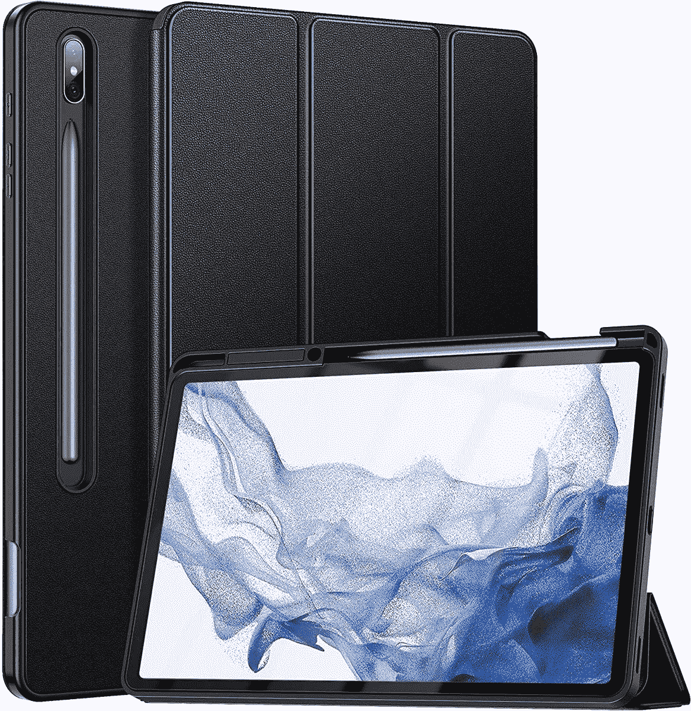
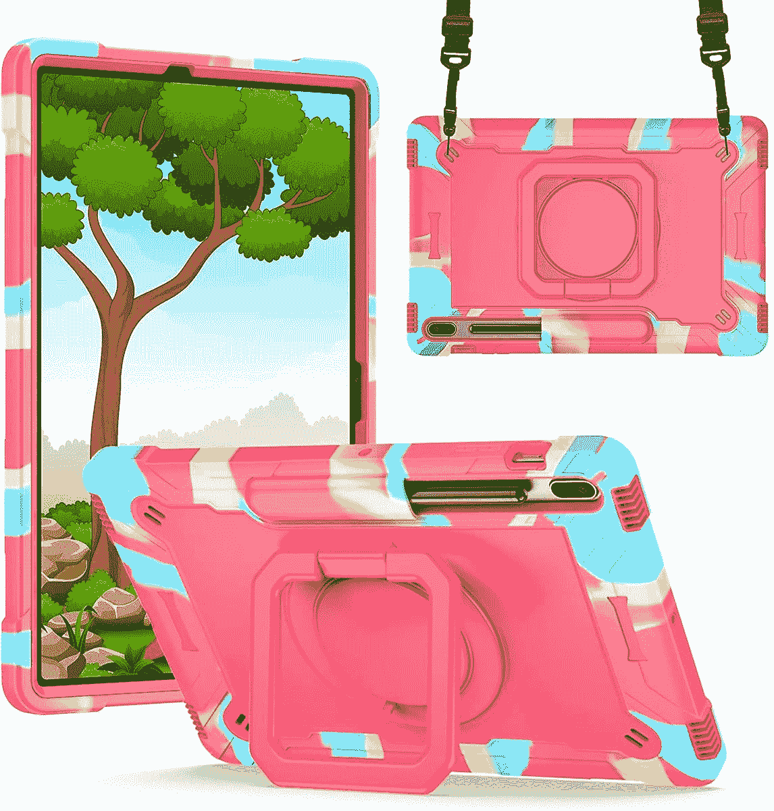

# 2023 年最佳三星 Galaxy Tab S8 Plus 支架保护套

> 原文：<https://www.xda-developers.com/best-samsung-galaxy-tab-s8-plus-kickstand-cases/>

# 2023 年最佳三星 Galaxy Tab S8 Plus 支架保护套

三星终于发布了 Galaxy Tab S8 Plus。以下是为这款平板电脑购买的最佳支架保护套列表。

三星终于发布了最新的旗舰平板电脑阵容——Galaxy Tab S8、Galaxy Tab S8 Plus 和 [Galaxy Tab S8 Ultra](https://www.xda-developers.com/samsung-galaxy-tab-s8-ultra-review/) 。如果你已经决定[买 Galaxy Tab S8 Plus](https://www.xda-developers.com/best-samsung-galaxy-tab-s8-deals/) ，你完全应该[买一个屏幕保护器](https://www.xda-developers.com/best-samsung-galaxy-tab-s8-plus-screen-protectors/)和一个[外壳](https://www.xda-developers.com/best-samsung-galaxy-tab-s8-plus-cases)。平板电脑是大型精密设备，因此残酷的事故总是会发生。好消息是，如果你妥善保护平板电脑，可以避免一些损害。有些包不仅提供保护和时尚，还增加了额外的功能。例如，一个支架可以让你将平板电脑竖立在一个表面上，舒适地打字、涂鸦或观看你最喜欢的电视剧。为此，我们为您准备了一份适合您的三星 Galaxy Tab S8 Plus 的最佳支架案例列表。这些将为您的旗舰平板电脑提供保护和附加功能。

 <picture></picture> 

Ztotop Slim Smart Cover

##### Ztotop 超薄智能 Galaxy Tab S8 Plus 外壳

这款经济实惠的智能保护套有两种颜色，配有 S 笔筒，支持两种视角。它也有一种正式的氛围。

 <picture></picture> 

URBAN ARMOR GEAR Case

##### UAG 大都会银河标签 S8 加案例

这种情况有点昂贵，但它提供了一个坚固的建设。它有两种颜色，并提供一个支架和一个 S 笔筒。

 <picture></picture> 

SUPCASE UB Pro Series

##### SUPCASE UB Pro Galaxy Tab S8 Plus 外壳

这款保护套配有一个内置屏幕保护装置、一个 S 笔筒和一个风景观赏支架。

 <picture></picture> 

ProCase Rugged Cover

##### ProCase 加固型 Galaxy Tab S8 Plus 外壳

这个结实的箱子配有肩带，便于携带。它还有一个旋转支架，以实现多功能性。它非常适合那些在恶劣环境中使用平板电脑的人。

 <picture></picture> 

Dteck Shockproof Case

##### Dteck 儿童 Galaxy Tab S8 Plus 盒

这个防震套是针对儿童的。它有 19 种不同的颜色供您的孩子选择，并配有一条肩带，方便移动。

 <picture></picture> 

Spigen Rugged Armor Pro

##### Spigen 坚固装甲 Pro 银河标签 S8 Plus 盒

这款支架保护套提供 360°保护，结构坚固。得益于它的 S 笔筒，您在旅途中也不一定会丢失手写笔。

* * *

如果我必须为我的三星 Galaxy Tab S8 Plus 选择其中一个支架，我个人会选择 [Spigen Rugged Armor Pro](https://www.amazon.com/Spigen-Rugged-Designed-Galaxy-Holder/dp/B08CY9WDH6/?tag=xda-1pb8j90-20&ascsubtag=UUxdaUeUpU7464&asc_refurl=https%3A%2F%2Fwww.xda-developers.com%2Fbest-samsung-galaxy-tab-s8-plus-kickstand-cases%2F&asc_campaign=Short-Term) 。不算太笨重，但也很结实。它为我的平板电脑提供了我需要的保护，而且不会让你的钱包瘪掉。对于那些依靠设备工作并需要每天精确定位几个小时的人来说，这是完美的选择。

手机套的最大优点是价格实惠且易于更换。你可以想买多少就买多少，也可以根据你的服装、不同的场合和需要来使用各种各样的。它们使您的 Galaxy Tab S8 Plus 更加时尚，同时保护它，使它在日常使用中更加实用。

 <picture></picture> 

Samsung Galaxy Tab S8 Plus

##### 三星 Galaxy Tab S8 Plus

三星 Galaxy Tab S8 Plus 是该公司今年旗舰平板电脑系列中的中端设备。它配有一支 S Pen 和可选的 5G 移动数据支持。

*您打算为您的新三星 Galaxy Tab S8 Plus 购买哪些支架套？请在下面的评论区告诉我们。*