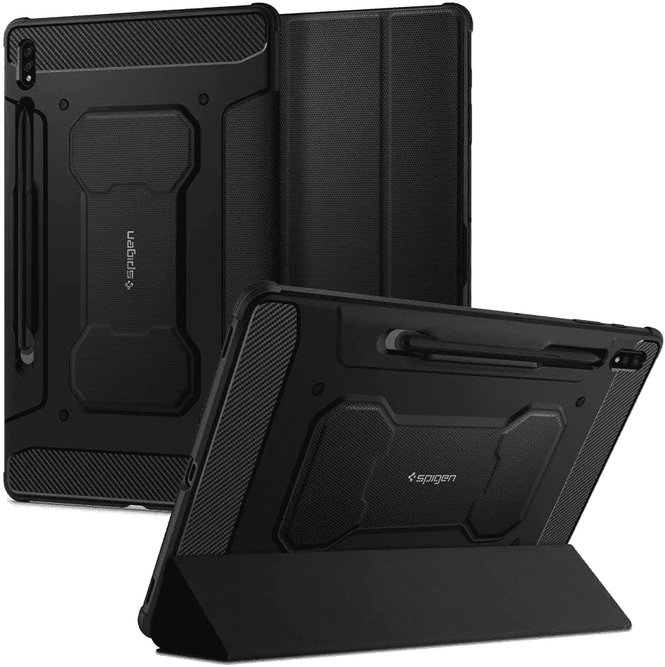
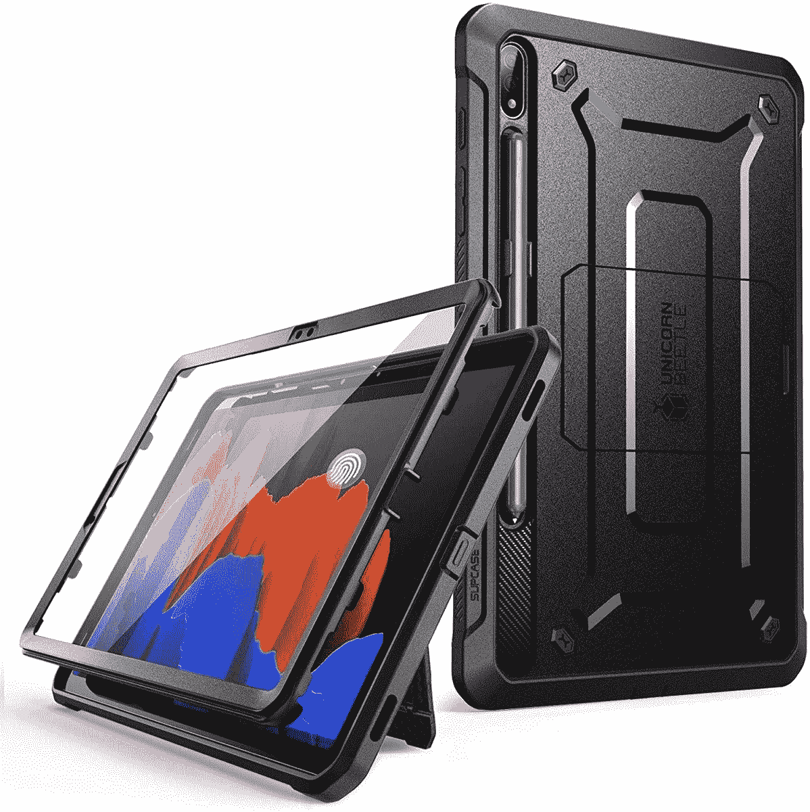
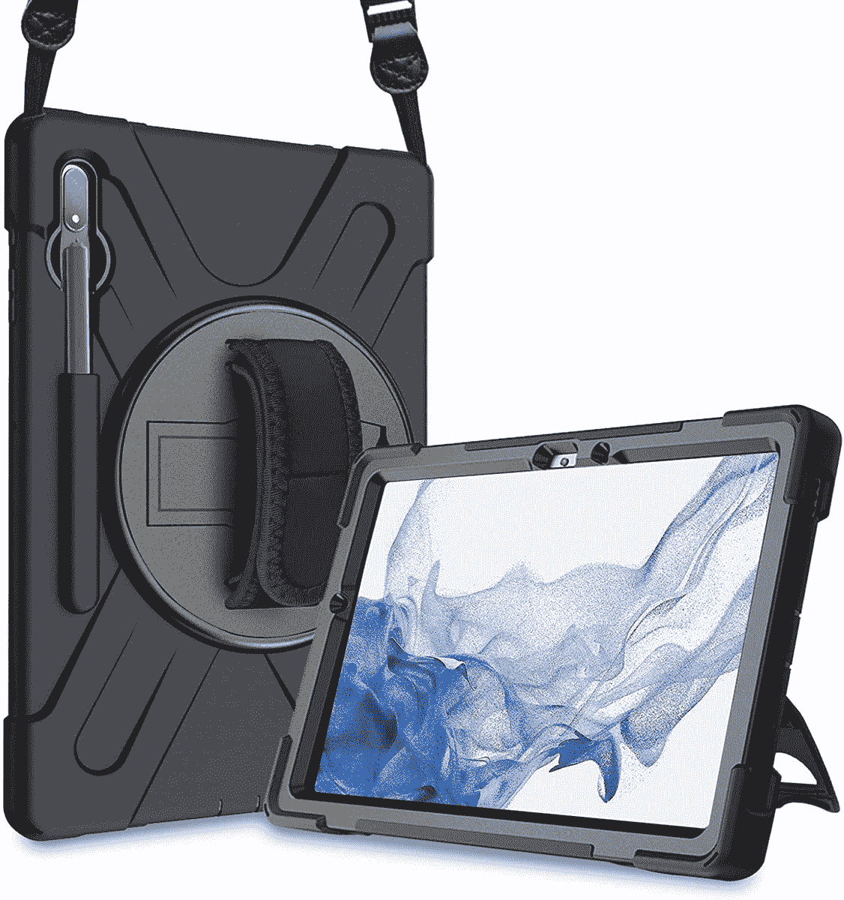
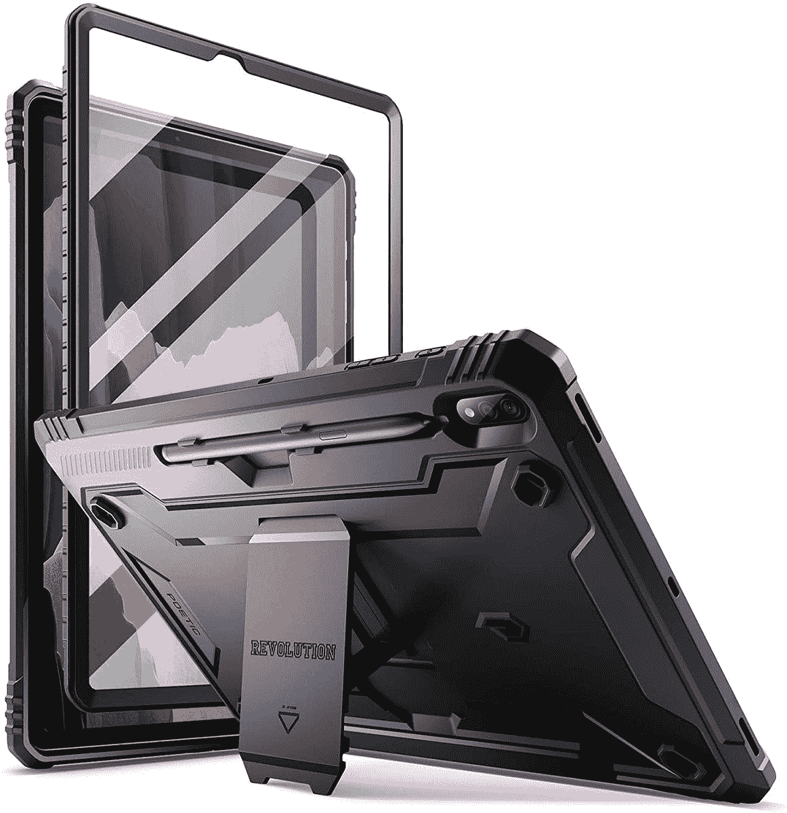
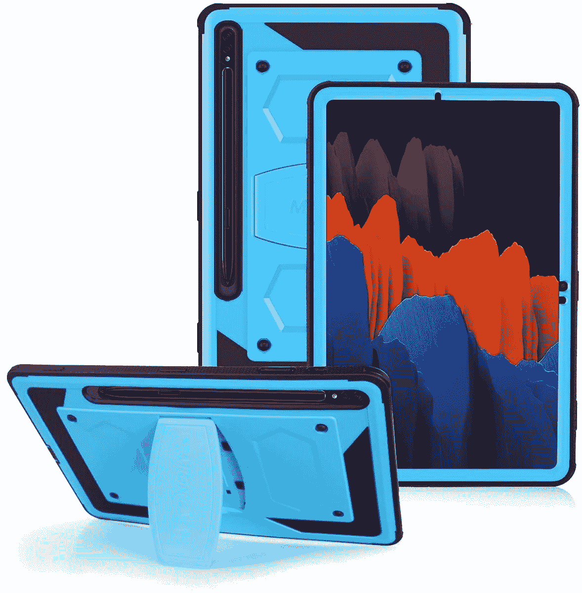
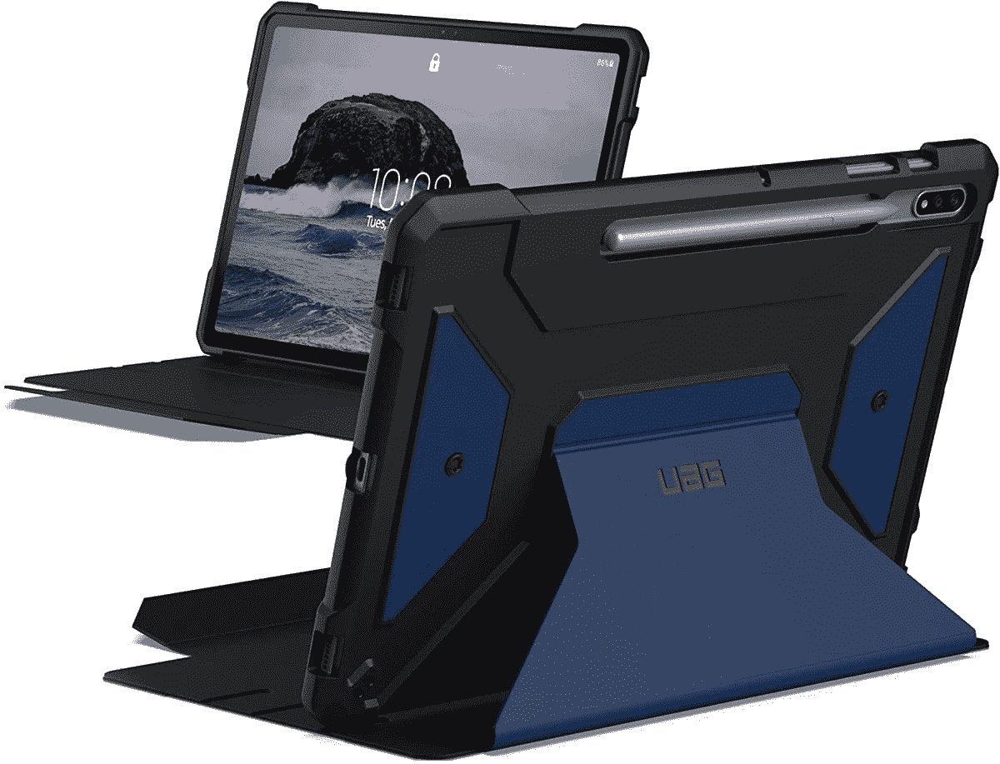

# 2023 年最佳三星 Galaxy Tab S8 Plus 加固外壳

> 原文：<https://www.xda-developers.com/best-samsung-galaxy-tab-s8-plus-rugged-cases/>

# 2023 年最佳三星 Galaxy Tab S8 Plus 加固外壳

Galaxy Tab S8 Plus 是三星最新阵容中第二好的平板电脑。这里列出了最适合它的坚固外壳。

三星终于公布了其最新的旗舰平板电脑阵容 Galaxy Tab S8 系列。这个阵容包括 Galaxy Tab S8、Galaxy Tab S8 Plus 和 [Galaxy Tab S8 Ultra](https://www.xda-developers.com/samsung-galaxy-tab-s8-ultra-review/) 。根据他们的预算和需求，这三种方法都针对不同类型的人。如果你喜欢 Galaxy Tab S8 Plus，用[屏幕保护器](https://www.xda-developers.com/best-samsung-galaxy-tab-s8-plus-screen-protectors/)保护它闪亮的新显示屏是个好主意。如果你还在考虑购买，要知道这些是你现在能买到的最好的安卓平板电脑。用坚固的外壳覆盖您的全新 Galaxy Tab S8 Plus，可以在跌落或刮擦时转移一些潜在的损坏。如果你更喜欢更苗条、更简约的款式，我们也收集了一份清单，上面列出了[最好的款式](https://www.xda-developers.com/best-samsung-galaxy-tab-s8-plus-cases/)。

 <picture></picture> 

Spigen Rugged Armor Pro

##### Spigen 坚固装甲 Pro 银河标签 S8 Plus 盒

这款坚固的外壳提供 360°保护和支架模式，可观看风景内容。得益于它的 S 笔筒，您在旅途中也不一定会丢失手写笔。

 <picture></picture> 

SUPCASE UB Pro Series

##### SUPCASE UB Pro Galaxy Tab S8 Plus 外壳

这款保护套配有一个内置屏幕保护装置、一个 S 笔筒和一个风景观赏支架。

 <picture></picture> 

ProCase Rugged Cover

##### ProCase 加固型 Galaxy Tab S8 Plus 外壳

这款防震包配有肩带，便于随身携带。它还有一个旋转支架，以实现多功能性。它非常适合那些在恶劣环境中使用平板电脑的人。

 <picture></picture> 

Poetic Revolution Case

##### 诗意的革命银河标签 S8 加案例

这种情况下有一个 S 笔筒，内置屏幕保护，和支架。它有三种不同的颜色可供选择。

 <picture></picture> 

FIEWESEY Hybrid Case

##### FIEWEST 混合 Galaxy Tab S8 Plus 外壳

这种坚固的外壳有四种鲜艳的颜色可供选择，包括蓝色和粉色。它提供了一个支架和一个 S 笔筒。

 <picture></picture> 

URBAN ARMOR GEAR Case

##### UAG 大都会银河标签 S8 加案例

这种情况下相对昂贵，但提供了一个坚实，坚固的建设。它有两种颜色，并提供一个支架和一个 S 笔筒。

* * *

我个人最喜欢的是 [Spigen Rugged Armor Pro](https://www.amazon.com/Spigen-Rugged-Designed-Galaxy-Holder/dp/B08CY9WDH6/?tag=xda-5p4dt3f-20&ascsubtag=UUxdaUeUpU7463&asc_refurl=https%3A%2F%2Fwww.xda-developers.com%2Fbest-samsung-galaxy-tab-s8-plus-rugged-cases%2F&asc_campaign=Short-Term) 。它负担得起，提供体面的保护，而且不太重。当我带着 Galaxy Tab S8 Plus 外出时，我会买它。万一我不小心把平板电脑掉在沥青上，它会吸收一些震动，避免潜在的损害。

保护套不仅能提供保护，还能让你切换全新三星 Galaxy Tab S8 Plus 的氛围。考虑到有无穷无尽的颜色，图案，类型和质量可供选择，你可以买几个来配合你不同的心情和场合。它会让你的高端设备不那么平凡，除了保护它免受严重的划痕和深深的裂缝。箱子的好处在于它们通常也很实惠。因此，只需很少的费用，你就可以避开潜在的高额费用。

 <picture></picture> 

Samsung Galaxy Tab S8 Plus

##### 三星 Galaxy Tab S8 Plus

三星 Galaxy Tab S8 Plus 是该公司最新旗舰产品系列的中端平板电脑，配备 12.4 英寸屏幕。

*您会为您的三星 Galaxy Tab S8 Plus 购买哪种加固型外壳？请在下面的评论区告诉我们。*