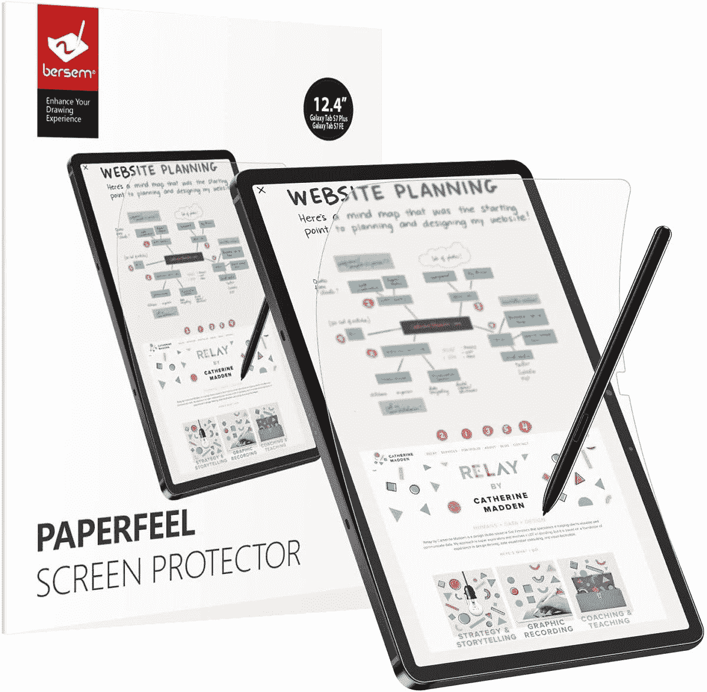
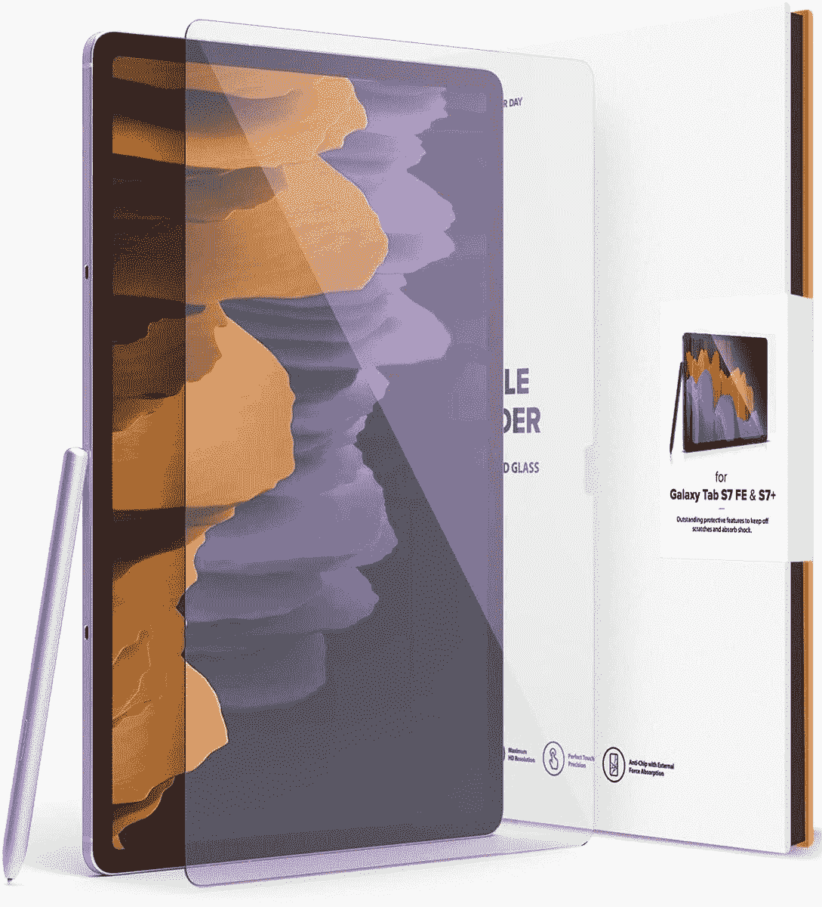
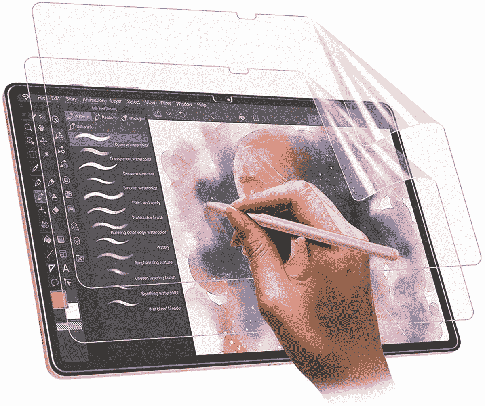
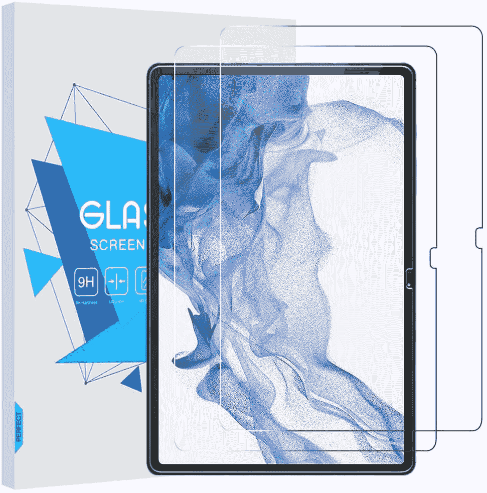
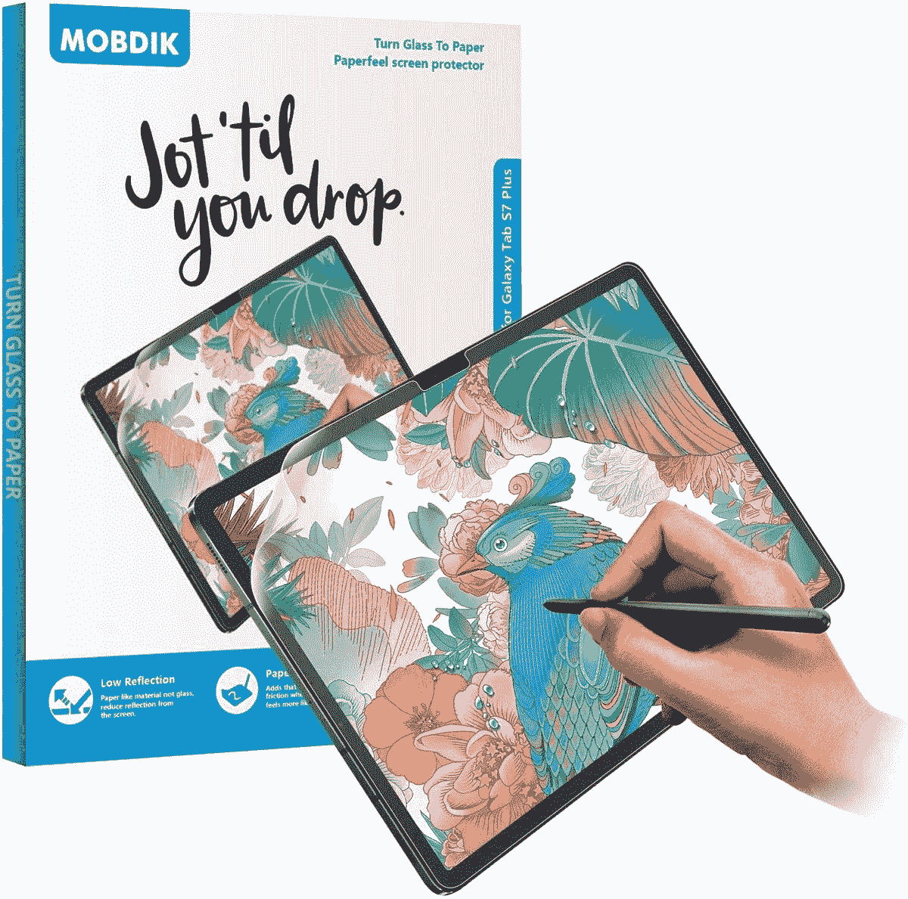
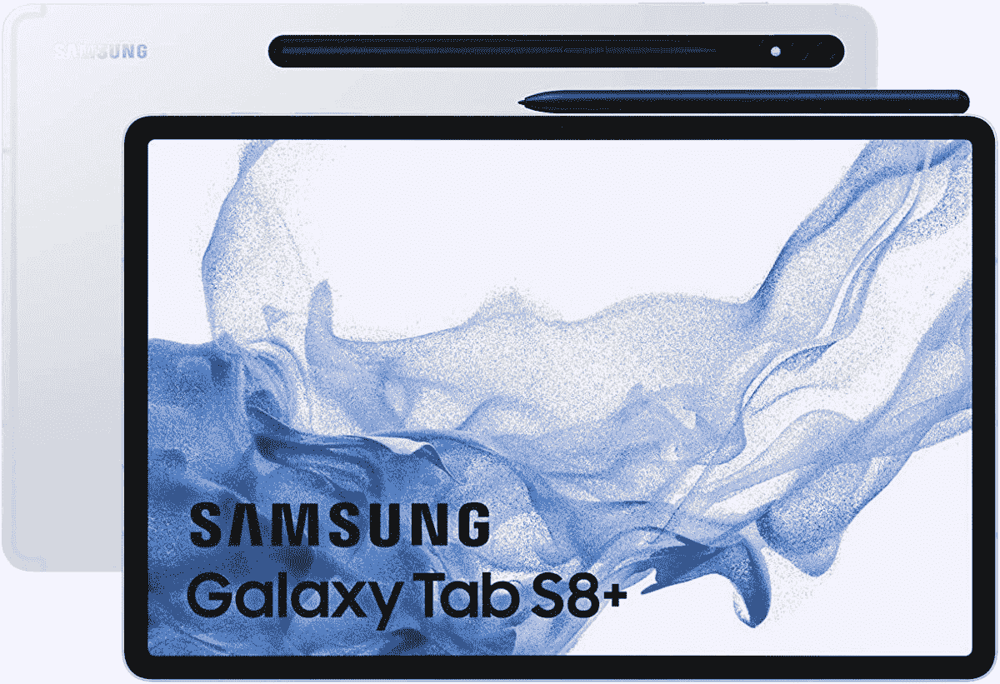

# 2023 年最佳 Galaxy Tab S8 Plus 屏幕保护器

> 原文：<https://www.xda-developers.com/best-samsung-galaxy-tab-s8-plus-screen-protectors/>

# 2023 年最佳 Galaxy Tab S8 Plus 屏幕保护器

三星 Galaxy Tab S8 Plus 是该公司最新产品系列中的中端平板电脑。这里是最好的屏幕保护装置。

三星终于发布了[三星 Galaxy Tab S8 Plus](https://www.xda-developers.com/samsung-galaxy-tab-s8-plus-ultra-hands-on/) 。它与其他产品一起被披露——Galaxy Tab S8 和 Galaxy Tab S8 Ultra。如果你已经决定[购买 Galaxy Tab S8 Plus](https://www.xda-developers.com/best-samsung-galaxy-tab-s8-deals/) ，那么[用外壳](https://www.xda-developers.com/best-samsung-galaxy-tab-s8-plus-cases/)保护它是一个明智的想法。有各种各样的类型，颜色和风格去。这让你可以根据你的服装、场合，甚至心情来换箱子。另一个好主意是为它买一个屏幕保护。它有一个 12.4 英寸的显示屏，过一会儿刮痕很可能会出现。这只是一个大显示屏，所以即使你小心翼翼，它也很有可能在你不注意的情况下被划伤。为了让这个过程稍微简单一些，我们为 Galaxy Tab S8 Plus 准备了一份最佳屏幕保护器的列表。

 <picture></picture> 

Spigen Tempered Glass Screen Protector

##### Spigen 钢化玻璃 Galaxy Tab S8 Plus 屏幕保护器

Spigen 以其耐用的设备配件而闻名。这款钢化玻璃屏幕保护器外壳友好，具有疏油性，易于安装。

 <picture></picture> 

BERSEM Paperfeel Screen Protector

##### Bersem Paperfeel Galaxy Tab S8 Plus 屏幕保护器

BERSEM 的这个屏幕保护器感觉像纸一样。它非常适合那些在平板电脑上写字或涂鸦的人。

 <picture></picture> 

Ringke Invisible Defender Glass

##### Ringke 隐形后卫银河标签 S8 加屏幕保护

Ringke 的这款价格实惠的钢化玻璃屏幕保护器采用优质材料制成，便于携带，并且耐刮擦。

 <picture></picture> 

TiMOVO 2 Pack Screen Protector

##### TiMOVO 哑光 Galaxy Tab S8 Plus 屏幕保护器

这个包装带有两个哑光屏幕保护器，它们有纸的感觉。它们经久耐用，易于安装，而且耐磨。

 <picture></picture> 

TiMOVO Tempered Glass Screen Protector

##### TiMOVO 钢化玻璃 Galaxy Tab S8 Plus 屏幕保护器

TiMOVO 的这款包装包括两个硬质钢化玻璃屏幕保护器，适合那些经常被尖锐物品划伤显示器的人。

 <picture></picture> 

MOBDIK Paperfeel Screen Protector

##### MOBDICK Paperfeel Galaxy Tab S8 Plus 屏幕保护器

MOBDIK 的这款套装配有两个超薄 paperfeel 屏幕保护套，适合重度 S Pen 用户。

* * *

如果我必须选择这些屏幕保护器中的一个供我个人使用，我完全会选择 [Spigen 钢化玻璃屏幕保护器](https://www.amazon.com/Spigen-Tempered-Protector-Designed-Case-Friendly/dp/B08H5VHBF3?tag=xda-1em3nm2-20&ascsubtag=UUxdaUeUpU169&asc_refurl=https%3A%2F%2Fwww.xda-developers.com%2Fbest-samsung-galaxy-tab-s8-plus-screen-protectors%2F&asc_campaign=Short-Term)。实惠，不太明显(所以保留了 Galaxy Tab S8 Plus 的原貌)，有效。它可以保护平板电脑的屏幕免受轻微擦伤，但不会太明显。Spigen 的名字也有很多善意，所以你可以信任他们的产品。

我个人认为，每部手机或平板电脑都应该配有保护套和屏幕保护器。不要等到你的设备被刮伤或破裂才购买保护。安全永远比抱歉好，无论是保护套还是屏幕保护套都不贵。这些配件只是为了确保你的设备在跌落时不会受损。永远记住，如今修理费可能相对昂贵。既然你可以做好预防措施，为什么还要经历这些呢？

 <picture></picture> 

Samsung Galaxy Tab S8 Plus

##### 三星 Galaxy Tab S8 Plus

三星 Galaxy Tab S8 Plus 是该公司今年旗舰平板电脑系列中的中端设备。它配有一支 S Pen 和可选的 5G 移动数据支持。

*您会为您的三星 Galaxy Tab S8 Plus 购买哪些屏幕保护器，为什么？请在下面的评论区告诉我们。*